# Diagram View in WPF Diagram (classic)

The Diagram View is responsible for bringing the objects and data which are added into the view through the model. In other words, it deals with the visual representation of data. Zooming and panning are done with respect to the view. 

<table>
<tr>
<th>
Property</th><th>
Description </th><th>
Type of the property</th><th>
Value it accepts</th><th>
Any other dependencies/ sub properties associated</th></tr>
<tr>
<td>
IsZoomEnabled</td><td>
Gets or sets a value indicating whether zoom is enabled or not.Default value is True.</td><td>
Dependency property</td><td>
Boolean(True/False)</td><td>
No</td></tr>
<tr>
<td>
IsPanEnabled</td><td>
Gets or sets a value indicating whether pan is enabled or not.Default value is False.</td><td>
Dependency property</td><td>
Boolean(True/False)</td><td>
No</td></tr>
<tr>
<td>
ZoomFactor</td><td>
Gets or sets a factor for the zoom.Default value is 0.2.</td><td>
Dependency property</td><td>
Double</td><td>
No</td></tr>
<tr>
<td>
Bounds</td><td>
Gets or sets the bounds value which specifies the position of the root node in case of tree layout.</td><td>
CLR property</td><td>
Thickness</td><td>
No</td></tr>
<tr>
<td>
IsPageEditable</td><td>
Gets or sets a value indicating whether page is enabled or not.Default value is True.</td><td>
Dependency property</td><td>
Boolean(True/False)</td><td>
No</td></tr>
<tr>
<td>
ShowVerticalRulers</td><td>
Gets or sets a value indicating whether vertical rulers are displayed or not.Default value is True.</td><td>
Dependency property</td><td>
Boolean(True/False)</td><td>
No</td></tr>
<tr>
<td>
ShowHorizontalRulers</td><td>
Gets or sets a value indicating whether horizontal rulers are displayed or not.Default value is True.</td><td>
Dependency property</td><td>
Boolean(True/False)</td><td>
No</td></tr>
<tr>
<td>
ShowVerticalGridLine</td><td>
Gets or sets a value indicating whether vertical grid lines are displayed or not.Default value is True.</td><td>
Dependency property</td><td>
Boolean(True/False)</td><td>
No</td></tr>
<tr>
<td>
ShowHorizontalGridLine</td><td>
Gets or sets a value indicating whether horizontal grid lines are displayed or not.Default value is True.</td><td>
Dependency property</td><td>
Boolean(True/False)</td><td>
No</td></tr>
<tr>
<td>
PortVisibility</td><td>
Gets or sets a value indicating whether all ports of all the nodes on the page are visible or not.If  individual node’s PortVisibility is set, then the node’s PortVisibility property will take precedence.Default value isVisibility.Visible</td><td>
Dependency property</td><td>
Visibility.VisibleVisibility.CollapsedVisibility.Hidden</td><td>
No</td></tr>
<tr>
<td>
Page</td><td>
Gets or sets the DiagramPage.</td><td>
Dependency property</td><td>
Panel</td><td>
No</td></tr>
<tr>
<td>
NodeContextMenu</td><td>
Gets or sets context menu for the node.</td><td>
Dependency property</td><td>
ContextMenu</td><td>
No</td></tr>
<tr>
<td>
LineConnectorContextMenu</td><td>
Gets or sets context menu for line connector.</td><td>
Dependency property</td><td>
ContextMenu</td><td>
No</td></tr>
<tr>
<td>
UndoRedoEnabled</td><td>
Gets or sets a value indicating whether undo redo is enabled or not.</td><td>
Dependency property</td><td>
Boolean(True/False)</td><td>
No</td></tr>
<tr>
<td>
IsCutEnabled</td><td>
Gets or sets a value indicating whether cut command is enabled. Default value is True.</td><td>
Dependency property</td><td>
Boolean(True/False)</td><td>
No</td></tr>
<tr>
<td>
IsCopyEnabled</td><td>
Gets or sets a value copy command is enabled.Default value is True.</td><td>
Dependency property</td><td>
Boolean(True/False)</td><td>
No</td></tr>
<tr>
<td>
IsPasteEnabled</td><td>
Gets or sets a value indicating whether paste command is enabled. Default value is True.</td><td>
Dependency property</td><td>
Boolean(True/False)</td><td>
No</td></tr>
<tr>
<td>
IsPageSaved</td><td>
Gets or sets a value indicating whether a page is saved.</td><td>
Dependency property</td><td>
Boolean (true/false)</td><td>
No</td></tr>
<tr>
<td>
IsConnectorDragCancel</td><td>
Gets or sets whether the value indicating that connector drag can be canceled.</td><td>
CLR property</td><td>
Boolean (true/false)</td><td>
No</td></tr>
<tr>
<td>
IsNodeDragCancel</td><td>
Gets or sets a value indicating that node drag can be canceled.</td><td>
CLR property</td><td>
Boolean (true/false)</td><td>
No</td></tr>
<tr>
<td>
HorizontalScrollbarVisibility</td><td>
Specifies the visibility for the vertical scroll bar. The default value is Auto.</td><td>
Dependency property</td><td>
ScrollBarVisibility.AutoScrollBarVisibility.DisabledScrollBarVisibility.HiddenScrollBarVisibility.Visible</td><td>
No</td></tr>
<tr>
<td>
VerticalScrollbarVisibility</td><td>
Specifies the visibility for vertical scroll bar. The default value is Auto.</td><td>
Dependency property</td><td>
ScrollBarVisibility.AutoScrollBarVisibility.DisabledScrollBarVisibility.HiddenScrollBarVisibility.Visible</td><td>
No</td></tr>
<tr>
<td>
SelectionList</td><td>
Gets the Selection List for the items.</td><td>
CLR property</td><td>
NodeCollection</td><td>
No</td></tr>
</table>



<Window x:Class="WpfApplication1.Window1" xmlns="http://schemas.microsoft.com/winfx/2006/xaml/presentation"

xmlns:x="http://schemas.microsoft.com/winfx/2006/xaml" Title="EssentialDiagramWPF" Height="400" Width="600"

xmlns:sfdiagram="clr-namespace:Syncfusion.Windows.Diagram;assembly=Syncfusion.Diagram.WPF" xmlns:local="clr-namespace:WpfApplication1">

    <Grid Name="diagramgrid">

        <sfdiagram:DiagramControl IsSymbolPaletteEnabled="True">

            <sfdiagram:DiagramControl.View>

                <sfdiagram:DiagramView ></sfdiagram:DiagramView>

            </sfdiagram:DiagramControl.View>

        </sfdiagram:DiagramControl>

    </Grid>

</Window>





DiagramControl dc = new DiagramControl();

dc.IsSymbolPaletteEnabled = true;

DiagramView view = new DiagramView();

view.Bounds = new Thickness(0, 0, 1000, 1000);

dc.View = view;

diagramgrid.Children.Add(dc);




Dim dc As New DiagramControl()

dc.IsSymbolPaletteEnabled = True

Dim view As New DiagramView()

view.Bounds = New Thickness(0, 0, 1000, 1000)

dc.View = view

diagramgrid.Children.Add(dc)



The drawing area has many properties that can be used to customize a view.



* Create Rulers Refer Concepts and Features -> Diagram View -> Create Rulers
* Specify Bounds Refer Concepts and Features -> Diagram View -> Specify Bounds
* Panning Refer Concepts and Features -> Diagram View -> Panning
* Zoom Commands Refer Concepts and Features -> Diagram View -> Zoom Commands
* Create Page Refer Concepts and Features -> Diagram View -> Create Page
* Page Editing option Refer Concepts and Features -> Diagram View -> Page Editing option
* Grid Lines Refer Concepts and Features -> Diagram View -> Grid Lines
* Customize the ContextMenu of Nodes and LineConnectors Refer Concepts and Features -> General -> Customize the ContextMenu of Nodes and LineConnectors
* Undo and Redo Command. Refer Concepts and Features -> Diagram View -> Undo and Redo Command.



## Create Rulers

Rulers display the coordinates of elements on the diagram page. Negative label values get displayed on the ruler in case the page is panned to the right side. On Zooming, the ruler values get adjusted accordingly, to match with the current Zoom level. At any point, the ruler value always indicates the exact coordinates of the page and its elements. So when the page is zoomed, the interval values get halved or doubled depending upon the zoom level. By default, labels of the major lines in rulers will represent the pixel values using a label when there is a change in Diagram Page’s MeasurementUnit. The ruler and the Label will be updated so that the label indicates the respective unit values.

Panning, Zooming, MeasurementUnits are explained in later part of this documentation.

Horizontal and Vertical ruler can be initialized for DiagramView in two ways:

* Through XAML
* Through Code Behind



    <!--Diagram Control-->

    <syncfusion:DiagramControl  Name="diagramControl">

        <!-- Model to add nodes and connections-->

        <syncfusion:DiagramControl.Model>

            <syncfusion:DiagramModel x:Name="diagramModel">

            </syncfusion:DiagramModel>

        </syncfusion:DiagramControl.Model>

        <!--View to display nodes and connections added through model.-->

<syncfusion:DiagramView IsPageEditable="True" Bounds="0,0,12,12" Name="diagramView">

    <syncfusion:DiagramView.HorizontalRuler>

        <syncfusion:HorizontalRuler Name="horizontalRuler" />

    </syncfusion:DiagramView.HorizontalRuler>

    <syncfusion:DiagramView.VerticalRuler>

        <syncfusion:VerticalRuler Name="verticalRuler"  />

    </syncfusion:DiagramView.VerticalRuler >

</syncfusion:DiagramView>        

    </syncfusion:DiagramControl>




DiagramView diagramView = new DiagramView();

diagramView.HorizontalRuler =  new HorizontalRuler();

diagramView.VerticalRuler as VerticalRuler();




Dim diagramView As New DiagramView()

diagramView.HorizontalRuler = New HorizontalRuler()

TryCast(diagramView.VerticalRuler, VerticalRuler())



Rulers
{:.caption}

Ruler after Panning, zooming and Measurement unit as Inch

{:.caption}

Several customizable options have been provided for the horizontal and vertical rulers. These are common for both the rulers.

<table>
<tr>
<th>
Property</th><th>
Description</th><th>
Type of the property</th><th>
Value it accepts</th><th>
Any other dependencies/ sub properties associated</th></tr>
<tr>
<td>
Background</td><td>
Get or sets the ruler's background color.</td><td>
Dependency property</td><td>
Brush</td><td>
No</td></tr>
<tr>
<td>
MarkerBrush</td><td>
Gets or sets the MarkerBrush.</td><td>
Dependency property</td><td>
Brush</td><td>
No</td></tr>
<tr>
<td>
LabelFontColor</td><td>
Gets or sets the LabelFontColor.</td><td>
Dependency property</td><td>
Brush</td><td>
No</td></tr>
<tr>
<td>
MinorLinesStroke</td><td>
Gets or sets the MinorLinesStroke.</td><td>
Dependency property</td><td>
Brush</td><td>
No</td></tr>
<tr>
<td>
MajorLinesStroke</td><td>
Gets or sets the MajorLinesStroke.</td><td>
Dependency property</td><td>
Brush</td><td>
No</td></tr>
<tr>
<td>
MajorLinesThickness</td><td>
Gets or sets the MajorLinesThickness.</td><td>
Dependency property</td><td>
Double</td><td>
No</td></tr>
<tr>
<td>
MinorLinesThickness</td><td>
Gets or sets the MinorLinesThickness.</td><td>
Dependency property</td><td>
Double</td><td>
No</td></tr>
<tr>
<td>
MarkerThickness</td><td>
Gets or sets the MarkerThickness.</td><td>
Dependency property</td><td>
Double</td><td>
No</td></tr>
</table>

Ruler Terminology
{:.caption}

The following code shows how the properties can be set.



<syncfusion:DiagramView IsPageEditable="True" Bounds="0,0,12,12" Name="diagramView">

<syncfusion:DiagramView.HorizontalRuler>

    <syncfusion:HorizontalRuler Name="horizontalRuler" Background="#FFC6C6C6" LabelFontColor="Green"/>

</syncfusion:DiagramView.HorizontalRuler>

<syncfusion:DiagramView.VerticalRuler>

    <syncfusion:VerticalRuler Name="verticalRuler" Background="#FFC6C6C6" LabelFontColor="Green"/>

</syncfusion:DiagramView.VerticalRuler >

</syncfusion:DiagramView>




DiagramView diagramView = new DiagramView();

(diagramView.HorizontalRuler as HorizontalRuler).LabelFontColor = Brushes.Green;

(diagramView.VerticalRuler as VerticalRuler).LabelFontColor = Brushes.Green;




Dim diagramView As New DiagramView()

TryCast(diagramView.HorizontalRuler, HorizontalRuler).LabelFontColor = Brushes.Green

TryCast(diagramView.VerticalRuler, VerticalRuler).LabelFontColor = Brushes.Green


Custom Ruler
{:.caption}

## Specify Bounds

The Bounds property of the Diagram View class enables a user to specify the rectangular area where the tree layout is to be displayed. The root of the tree layout is placed at the center of the bounds value. 

<table>
<tr>
<th>
Property</th><th>
Description </th><th>
Type of the property</th><th>
Value it accepts</th><th>
Any other dependencies/ sub properties associated</th></tr>
<tr>
<td>
Bounds</td><td>
Gets or sets the bounds value which specifies the position of the root node in case of tree layout.</td><td>
CLR property</td><td>
Thickness</td><td>
No</td></tr>
</table>

The following code can be used to set the Bounds property.

Bounds can be specified in two ways,

* Through XAML
* Through Code Behind



<Window x:Class="WpfApplication1.Window1" xmlns="http://schemas.microsoft.com/winfx/2006/xaml/presentation"

xmlns:x="http://schemas.microsoft.com/winfx/2006/xaml" Title="EssentialDiagramWPF" Height="400" Width="600"

xmlns:sfdiagram="clr-namespace:Syncfusion.Windows.Diagram;assembly=Syncfusion.Diagram.WPF" xmlns:local="clr-namespace:WpfApplication1">

<Grid Name="diagramgrid">

    <sfdiagram:DiagramControl IsSymbolPaletteEnabled="True" >

        <sfdiagram:DiagramControl.View >

            <sfdiagram:DiagramView Bounds="0,0,500,500">

            </sfdiagram:DiagramView>

        </sfdiagram:DiagramControl.View>

    </sfdiagram:DiagramControl>

</Grid>

</Window>




DiagramControl dc = new DiagramControl();

dc.IsSymbolPaletteEnabled = true;

DiagramView view = new DiagramView();

view.Bounds = new System.Drawing.Thickness(0, 0, 500, 500);

dc.View = view;

diagramgrid.Children.Add(dc);




Dim dc As New DiagramControl()

dc.IsSymbolPaletteEnabled = True

Dim view As New DiagramView()

view.Bounds = New System.Drawing.Thickness(0, 0, 500, 500)

dc.View = view

diagramgrid.Children.Add(dc)



## Panning

Essential Diagram WPF provides the ability to pan a page. Panning is used to move the contents of page both horizontally and vertically by holding down a mouse button and then moving the mouse.

<table>
<tr>
<th>
Property</th><th>
Description </th><th>
Type Of  the property</th><th>
Value it accepts</th><th>
Any other dependencies/ sub properties associated</th></tr>
<tr>
<td>
IsPanEnabled</td><td>
Gets or sets a value indicating whether pan is enabled or not.Default value is False.</td><td>
Dependency property</td><td>
Boolean(True/False)</td><td>
No</td></tr>
</table>

### Steps for panning a page

1. A page can be panned by setting the IsPanEnabled property to _True_.



DiagramView diagramView = new DiagramView();

diagramView.IsPanEnabled = true;




Dim diagramView As New DiagramView()

diagramView.IsPanEnabled = True



2.Click and drag the diagram page to the desired position. Note that the negative rulers get displayed while panning to the right.
   
  N> No other operations can be performed on page elements while IsPanEnabled is set to True.

   
   
   Pan
   {:.caption}

## Creating Page

The Diagram View has a Page property which refers to the DiagramPage class. The DiagramPage displays the nodes and connections which are added through the model.

<table>
<tr>
<th>
Property</th><th>
Description </th><th>
Type of the property</th><th>
Value it accepts</th><th>
Any other dependencies/ sub properties associated</th></tr>
<tr>
<td>
Page</td><td>
Gets or sets the DiagramPage.</td><td>
Dependency property</td><td>
DiagramPage</td><td>
No</td></tr>
</table>

The DiagramPage can be created for DiagramView in following two ways,

* Through XAML
* Through Code Behind



<Window x:Class="WpfApplication1.Window1" xmlns="http://schemas.microsoft.com/winfx/2006/xaml/presentation"

xmlns:x="http://schemas.microsoft.com/winfx/2006/xaml" Title="EssentialDiagramWPF" Height="400" Width="600"

xmlns:sfdiagram="clr-namespace:Syncfusion.Windows.Diagram;assembly=Syncfusion.Diagram.WPF" xmlns:local="clr-namespace:WpfApplication1" >

<Grid Name="diagramgrid">

<sfdiagram:DiagramControl IsSymbolPaletteEnabled="True" >

<sfdiagram:DiagramControl.Model>

<sfdiagram:DiagramModel x:Name="diagramModel" >

</sfdiagram:DiagramModel>

</sfdiagram:DiagramControl.Model>

<sfdiagram:DiagramControl.View >

<sfdiagram:DiagramView ShowHorizontalGridLine="True" ShowVerticalGridLine="True">

<syncfusion:DiagramView.Page>

  <syncfusion:DiagramPage x:Name="diagramPage" GridHorizontalOffset="50" GridVerticalOffset="50"/>

</syncfusion:DiagramView.Page>

</sfdiagram:DiagramView>

</sfdiagram:DiagramControl.View>

</sfdiagram:DiagramControl>

</Grid>

</Window>




DiagramControl dc = new DiagramControl();

dc.IsSymbolPaletteEnabled = true;

DiagramView view = new DiagramView();

dc.View = view;

(diagramView.Page as DiagramPage).GridHorizontalOffset = 50;

(diagramView.Page as DiagramPage).GridVerticalOffset = 50;




Dim dc As New DiagramControl()

dc.IsSymbolPaletteEnabled = True

Dim view As New DiagramView()

dc.View = view

TryCast(diagramView.Page, DiagramPage).GridHorizontalOffset = 50

TryCast(diagramView.Page, DiagramPage).GridVerticalOffset = 50



## Page editing option

You can disable editing the page by setting the IsPageEditable property to False. No operation can then be performed on the page or its contents. Default value is True.

<table>
<tr>
<th>
Property</th><th>
Description </th><th>
Type of the property</th><th>
Value it accepts</th><th>
Any other dependencies/ sub properties associated</th></tr>
<tr>
<td>
IsPageEditable</td><td>
Gets or sets a value indicating whether page is enabled or not.Default value is True.</td><td>
Dependency property</td><td>
Boolean(True/False)</td><td>
No</td></tr>
</table>

This property is in DiagramView and can be set in the following ways.

* Through XAML
* Through Code Behind



    <!--Diagram Control-->

    <syncfusion:DiagramControl  Name="diagramControl">

        <!-- Model to add nodes and connections-->

        <syncfusion:DiagramControl.Model>

            <syncfusion:DiagramModel x:Name="diagramModel">

            </syncfusion:DiagramModel>

        </syncfusion:DiagramControl.Model>

        <!--View to display nodes and connections added through model.-->

<syncfusion:DiagramControl.View>

   <syncfusion:DiagramView IsPageEditable="True" Name="diagramView">

   </syncfusion:DiagramView>

</syncfusion:DiagramControl.View>

    </syncfusion:DiagramControl>





DiagramView diagramView = new DiagramView();

diagramView.IsPageEditable = true;




Dim diagramView As New DiagramView()

diagramView.IsPageEditable = True



## Clear the Selection List on Right-Click

By default, the selection list can be cleared by right-clicking on the diagram page. This clearing can be enabled or disabled using the `ClearSelectionOnRightClick` property.

Properties

<table>
<tr>
<th>
Property</th><th>
Description</th><th>
Type</th><th>
Data Type</th></tr>
<tr>
<td>
ClearSelectionOnRightClick</td><td>
This property is used to enable/disable the selection list clearing on right-click.</td><td>
Dependency</td><td>
Boolean</td></tr>
</table>

### Adding ClearSelectionOnRightclick Property to an Application 

Clearing the selection list on right-click can be enabled using the ClearingSelectionOnRightClick property of the DiagramView. By default this property is set to true. Clearing selection can be controlled if the ClearingSelectionOnRightClick property of the DiagramView is set to false.



          DiagramView diagramView = new DiagramView();

            //Disable Clearing Selection list on RightClick.

            diagramView.ClearSelectionOnRightClick = false;




   

               Dim diagramView As New DiagramView()

  	        'Disable Clearing Selection list on RightClick.

diagramView.ClearSelectionOnRightClick = False



## Fit-to-Page Support

Fit-to-page will bring the whole diagram into the viewport using the zooming options. This helps you view the whole diagram page in the viewport without having to scroll.

### Use Case Scenarios

In a large network diagram each object will be far from another. You need to scroll the diagram page to explore the objects that are outside the viewport. Using this feature you can bring the whole diagram into the viewport area. 

### Properties

<table>
<tr>
<th>
Property</th><th>
Description</th><th>
Type</th><th>
Data Type</th></tr>
<tr>
<td>
EnableFitToPage </td><td>
Gets or sets the FitToPage property of the diagram page. </td><td>
Dependency </td><td>
Boolean </td></tr>
<tr>
<td>
FitToPageCommand</td><td>
This ICommand is used to execute the fit-to-page on demand.</td><td>
Dependency</td><td>
ICommand</td></tr>
</table>

### Sample Link

To view a sample of this feature:

1. Open Dashboard.
2. Click User Interface > WPF. 
3. Click Run Samples. 
4. Navigate to Diagram> Overview Demo.

N> A demo of this feature is included in the Overview sample.

### Enabling Fit-to-Page 

You can enable the feature in two methods. They are:

* Using Property
* Using Command 

### Using Property

You can enable fit-to-page to bring the whole diagram within the viewport, either by zooming in or by zooming out.

To enable this feature, set the EnableFitToPage property of the diagram view to True. The following code illustrates this: 



<Syncfusion:DiagramControl Grid.Row="1" Name="diagramControl"  >

                <Syncfusion:DiagramControl.Model>

                    <Syncfusion:DiagramModel x:Name="diagramModel">

                    </Syncfusion:DiagramModel>

                </Syncfusion:DiagramControl.Model>

                <Syncfusion:DiagramControl.View>

                    <Syncfusion:DiagramView EnableFitToPage="True" Name="diagramView">

                    </Syncfusion:DiagramView>

                </Syncfusion:DiagramControl.View>

            </Syncfusion:DiagramControl>




// Enable FitToPage of the DiagramView

diagramView.EnableFitToPage = true;



Fit-to-Page Disabled
{:.caption}

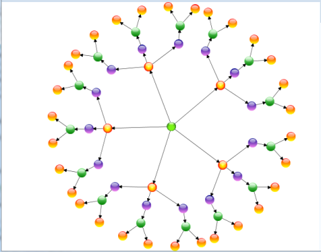

Fit-to-Page Enabled
{:.caption}

### Using Command

You can execute a fit-to-page command to bring the whole diagram within the viewport either by zooming in or zooming out.

N> Using this command you can fit the content within the viewport even if the EnableFitToPage property of the diagram view is set to False.

The following code illustrates how to bring the whole diagram into the viewport using a command: 



 <Button Command="FitToPage" CommandTarget="{Binding ElementName=diagramView}"CommandParameter="{Binding ElementName=diagramPage}">

    FitToPage

</Button>




 

DiagramCommandManager.FitToPage.Execute.(diagramView.Page, diagramView);



## Table Layout for Selected Nodes

From version 10.1.0.44, Essential Diagram for WPF enables you to apply the table layout on selected nodes instead of applying it to the entire diagram. This arranges selected nodes or a given node collection in a tabular structure based on specified intervals between them. The number of nodes in each row and column can be specified and the layout will be applied accordingly. 

Use Case Scenarios

* Users can easily make the layout with a specific collection of nodes called ordered nodes.
* Users can easily position the layout.
* Users can easily align the layout by using the layout alignment properties.
* Users can set a rectangle boundary around nodes by using the Layout Bounds property.

### Properties

<table>
<tr>
<th>
Property</th><th>
Description</th><th>
Type</th><th>
Data Type</th></tr>
<tr>
<td>
OrderedNodes</td><td>
This property is used to get or set the Collection of Nodes for table layout.</td><td>
Dependency property</td><td>
List&gt;IShape&lt;</td></tr>
</table>

### Sample Link

To view a sample of this feature:

1. Open Dashboard.
2. Click User Interface > WPF. 
3. Click Run Samples. 
4. Navigate to Diagram > Automatic Layout > Table Layout.

Adding Table Layout for selected Nodes 

To apply a table layout to the selected nodes, assign the selected nodes to the OrderNodes property of the DiagramModel. You can also assign your own collection of IShape to the OrderNodes property. Then create an instance of the TableLayout and call the RefreshLayout method for this instance.

The following code illustrates this: 



       // Assigning selected node to the OrderedNodes property.

          diagramModel.OrderedNodes= diagramView.SelectionList.OfType<IShape>().ToList(); 

       // Create an instance of TableLayout and refresh it.

          TableLayout table = new TableLayout(diagramModel, diagramView);

          table.RefreshLayout();




'Assigning selected node to the OrderedNodes property.

diagramModel.OrderedNodes= diagramView.SelectionList.OfType(Of IShape)().ToList()

'Create an instance of TableLayout and refresh it.

Dim table As New TableLayout(diagramModel, diagramView)

table.RefreshLayout()



When the code runs, the table layout will be applied to the specified node collection.  

N> If the OrderNodes property is set to null, then the table layout will be applied to the entire diagram.

Table Layout Applied for Specified Nodes
{:.caption}

### Aligning the Layout on a Specified Location

To align the ordered nodes in a particular position, call the _TableLayout’s__RefreshLayout_ (Point PivotPoint) method and specify the particular point as a parameter. The layout will be positioned in the specified pivot point. 

The following code illustrates this:



       // Assigning selected node to the OrderedNodes.

          diagramModel.OrderedNodes= diagramView.SelectionList.OfType<IShape>().ToList(); 

          TableLayout table = new TableLayout(diagramModel, diagramView);

          table.RefreshLayout(300,400);




‘Assigning selected node to the OrderedNodes.

diagramModel.OrderedNodes= diagramView.SelectionList.OfType(Of IShape)().ToList()

Dim table As New TableLayout(diagramModel, diagramView)

table.RefreshLayout(300,400)



### Removing Table Layout from the Specific Nodes

You can remove the table layout applied to specific nodes. To achieve this set the OrderedNodes property of the DiagramMode to null, and call the RefreshLayout method of the TableLayout. The layout will be applied to the entire diagram. By default the OrderedNodes property is set to null.

The following code illustrates how to remove the layout from the specific nodes:



       // Set null value to the OrderedNodes property.

          diagramModel.OrderedNodes = null;

          TableLayout table = new TableLayout(diagramModel, diagramView);

          table.RefreshLayout(300,400);




 ’Set null value to the OrderedNodes property.

diagramModel.OrderedNodes = Nothing

Dim table As New TableLayout(diagramModel, diagramView)

table.RefreshLayout(300,400)



## PageMargin 

The PageMargin property is used to maintain the distance between DiagramPage and DiagramView element.

### Properties

<table>
<tr>
<th>
Property </th><th>
Description </th><th>
Type </th><th>
Data Type </th></tr>
<tr>
<td>
PageMargin </td><td>
Gets or the diagram Page Margin.</td><td>
Dependency Property  </td><td>
Thickness </td></tr>
</table>

### Adding PageMargin to an Application 

PageMargin can be set to diagram page by using DiagramView’s PageMargin property. The default value is set to 0. The property is in DiagramView and the value can be set in following ways:

* Through XAML
* Through Code behind



<syncfusion:DiagramControl Name="diagramControl" IsSymbolPaletteEnabled="True">

             <syncfusion:DiagramControl.Model>

                    <syncfusion:DiagramModel x:Name="diagramModel"/>

             </syncfusion:DiagramControl.Model>

            <syncfusion:DiagramControl.View>

                  <syncfusion:DiagramView Name="diagramView" Margin="10,20,10,20"/> 

             </syncfusion:DiagramControl.View>

            </syncfusion:DiagramControl>




DiagramView diagramView = new DiagramView();

diagramView.PageMargin = new Thickness(10, 20, 10, 20);




Dim diagramView As New DiagramView()

diagramView.PageMargin = New Thickness(10, 20, 10, 20)



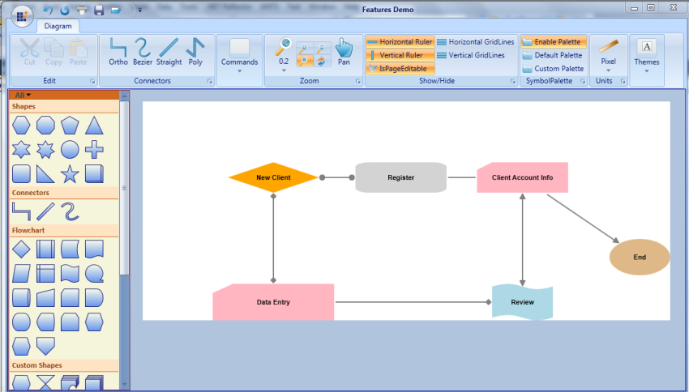

Features Demo
{:.caption}

## Virtualization for DiagramControl

### Virtualization

Virtualization is the process of loading the diagram page elements that are available in the visible area of the diagram control, i.e page elements that lie within the viewport of the ScrollViewer will be in loaded state and the rest will not be loaded until they come into view.

This feature gives optimizes performance while loading and dragging items to diagram control when many Nodes and LineConnectors are added in the diagram page. 

### Use Case Scenarios

The loading time and the UI response will be proportional to the number of elements used in a page. When you want to display a page with large number of Nodes and LineConnectors, such as floor plan application, the processing speed will be slow in user interaction. If virtualization is enabled, application will load only elements that lie in the visible area. This leads to fast loading and fast user interactivity. 

Tables for Properties, Methods, and Events

### Properties

<table>
<tr>
<th>
Property </th><th>
Description </th><th>
Type </th><th>
Data Type </th><th>
Reference links </th></tr>
<tr>
<td>
EnableVirtualization</td><td>
Gets or sets a value indicating whether the diagram page can be virtualized. The default value is set to false.</td><td>
Dependency Property </td><td>
Boolean</td><td>
No</td></tr>
<tr>
<td>
Enable Caching</td><td>
Gets or sets a value indicating whether the loaded object in diagram page can be virtualized. The default value is true.</td><td>
Dependency Property </td><td>
Boolean</td><td>
</td></tr>
</table>

Adding Virtualization feature to an Application 

### EnableVirtualization Property:

To enable virtualization set the EnableVirtualization property to true. Page elements within the viewport alone will be loaded. The default value is false.

The property is in DiagramView and can be set in the following methods.

* Through XAML
* Through Code behind

The following code illustrates how to set EnableVirtualization property through XAML.



<!---DiagramControl--->         

             <syncfusion:DiagramControl  Name="diagramControl" >

                <syncfusion:DiagramControl.Model>

                    <syncfusion:DiagramModel   x:Name="diagramModel" >

                    </syncfusion:DiagramModel>

                </syncfusion:DiagramControl.Model>

                <syncfusion:DiagramControl.View>

                   <syncfusion:DiagramView EnableVirtualization="True" Name="diagramView" 

                    </syncfusion:DiagramView>

                </syncfusion:DiagramControl.View>

            </syncfusion:DiagramControl>


The following code illustrates how to set EnableVirtualization property through Code behind.



DiagramView diagramView = new DiagramView();

diagramView.EnableVirtualization = true; 




Dim diagramView As New DiagramView()

diagramView.EnableVirtualization = True 

### EnableCaching Property:

EnableCaching decides whether the element should be in loaded state or unloaded state, when the element is outside the viewport area. To set the element in unloaded state set the EnableCaching to false. To set it in loaded state set the EnableCaching to true. 




DiagramView diagramView = new DiagramView();

diagramView.EnableCaching = true; 




Dim diagramView As New DiagramView()

diagramView.EnableCaching = True



### Node/LineConnector AllowVirtualization Property:

AllowVirtualization property is used to enable/disable the Node/LineConnector virtualization. When AllowVirtualization is set to false for an element that lies outside the viewport It will be in loaded state when Virtualization is enabled. The default value is true.

The AllowVirtualization property can be set as given in the following code.



//Node Virtualization

Node NodeObject = new Node();

NodeObject.AllowVirtualization = true;

//LineConnector Virtualization  

LineConnector LineConnectorObject = new LineConnector();

LineConnectorObject.AllowVirtualization = true;




'Node Virtualization

Dim NodeObject As New Node()

NodeObject.AllowVirtualization = True

'LineConnector Virtualization

Dim LineConnectorObject As New LineConnector()

LineConnectorObject.AllowVirtualization = True



### Limitations:

Due to virtualization behavior there are some limitations  in the diagram control. They are:

1. As Gridlines and Rulers are not visualized, when node or line connector is placed at a distance for example 2,000,000 pixels away, rendering will take place from zero to end. This leads to performance issues in rendering Gridlines or Rulers.
2. Save and load is not supported for Nodes and LineConnectors that are in unloaded state.
3. When diagram is virtualized, many nodes will be in unloaded state and their Width and Height will not be set. As the automatic layout depends on the size of the node, predefined width and height for the node is required for updating the layout.
## Measurement Units

As different fields require different units of measure, several measurement units are provided such that you can choose the unit that is most comfortable and suitable to use. All basic properties can be defined in the specified measurement unit. It is also possible to dynamically change the units at run-time. The rulers are updated accordingly to represent the coordinates in the currently selected unit.

<table>
<tr>
<th>
Property</th><th>
Description</th><th>
Type of the Property</th><th>
Value it Accepts</th><th>
Any other Dependencies/ Sub-Properties Associated</th></tr>
<tr>
<td>
MeasurementUnits</td><td>
Gets or sets the Measurement unit property.</td><td>
DependencyProperty</td><td>
MeasureUnits.PixelMeasureUnits.PointMeasureUnits.DocumentMeasureUnits.DisplayMeasureUnits.SixteenthInchMeasureUnits.EighthInchMeasureUnits.QuarterInchMeasureUnits.HalfInchMeasureUnits.InchMeasureUnits.FootMeasureUnits.YardMeasureUnits.MileMeasureUnits.MillimeterMeasureUnits.CentimeterMeasureUnits.MeterMeasureUnits.Kilometer</td><td>
No</td></tr>
</table>

The measurement units property can be specified in the following way.



<sfdiagram:DiagramControl IsSymbolPaletteEnabled="True" >

    <sfdiagram:DiagramControl.Model>

        <sfdiagram:DiagramModel x:Name="diagramModel" >

        </sfdiagram:DiagramModel>

    </sfdiagram:DiagramControl.Model>

    <sfdiagram:DiagramControl.View >

        <sfdiagram:DiagramView ShowHorizontalGridLine="True" ShowVerticalGridLine="True">

            <syncfusion:DiagramView.Page>

                <syncfusion:DiagramPage x:Name="diagramPage" MeasurementUnits="Inch"/>

            </syncfusion:DiagramView.Page>

        </sfdiagram:DiagramView>

    </sfdiagram:DiagramControl.View>

</sfdiagram:DiagramControl>




DiagramControl dc = new DiagramControl();

dc.IsSymbolPaletteEnabled = true;

DiagramView view = new DiagramView();

(view.Page as DiagramPage).MeasurementUnits = MeasureUnits.Inch;



Dim dc As New DiagramControl()

dc.IsSymbolPaletteEnabled = True

Dim view As New DiagramView()

TryCast(view.Page, DiagramPage).MeasurementUnits = MeasureUnits.Inch



Once the Measurement unit is specified, all the values must be specified with respect to that unit. For instance, If the unit is set to Inch then the node's properties can be set as follows.



Node n1 = new Node(Guid.NewGuid(), "Node1");

n1.IsLabelEditable = true;

n1.Label = "Alarm Rings";

n1.OffsetX = 1.5;

n1.OffsetY = 1.25;

n1.Width = 1.5;

n1.Height = 0.75;

n1.LabelVerticalAlignment = VerticalAlignment.Center;

diagramModel.Nodes.Add(n1);




Dim n1 As New Node(Guid.NewGuid(), "Node1")

n1.IsLabelEditable = True

n1.Label = "Alarm Rings"

n1.OffsetX = 1.5

n1.OffsetY = 1.25

n1.Width = 1.5

n1.Height = 0.75

n1.LabelVerticalAlignment = VerticalAlignment.Center

diagramModel.Nodes.Add(n1)



You can also dynamically change the units at runtime. The ruler values get changed according to the measurement unit selected. The rulers then indicate the position of the graphical objects with respect to the selected measurement unit.

Units changed to Inches
{:.caption}

### DateTime Unit

This feature enables the ruler to display the position of diagram contents (nodes, line connectors) in a date-time format. This feature also allows users to access nodes, line connectors, and double values as DateTime types.

### Properties

<table>
<tr>
<th>
Property</th><th>
Description</th><th>
Type</th><th>
Data Type</th></tr>
<tr>
<td>
DateTimeSettings</td><td>
Used to get or set the value for DateTime unit values for the ruler.</td><td>
Dependency</td><td>
DateTimeSettings</td></tr>
</table>

### Adding DateTime Unit Support for Ruler to an Application 

#### DateTimeSettings

DateTime unit support enables the ruler to display the position of diagram contents (nodes, line connectors) in the DateTime format.

 The DateTime settings have two important properties to display the date-time in the ruler.

1. TimeSpan—Gets or sets the TimeSpan for a unit. The default value is a new TimeSpan (1, 0, 0, 0).
2. PixelUnit—Gets or sets the number of pixels to be considered for TimeSpan specified. The default value is 100d.



DiagramView diagramView = new DiagramView();

//Setting DateTimeSettings property value.

diagramView.DateTimeSettings = new DateTimeSettings(new TimeSpan(1, 0, 0, 0, 0), 50);




Dim diagramView As New DiagramView()

'Setting DateTimeSettings property value.

diagramView.DateTimeSettings=New DateTimeSettings(New TimeSpan(1,0,0,0,0),50)



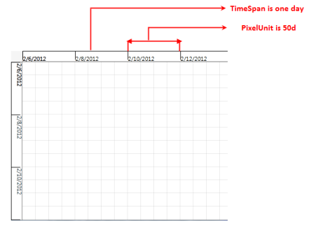

Ruler Representing 50 Pixels as One Day
{:.caption}

### Ruler Interval

RulerInterval represents the interval (distance) between two major stroke lines of the ruler.



DiagramView diagramView = new DiagramView();

diagramView.DateTimeSettings.RulerInterval = new TimeSpan(2, 0, 0, 0, 0); 



RulerInterval Set as Two Days
{:.caption}

### Enable DateTimeSettings

By default, the DateTimeSettings property is set to false. A node’s DateTime-related property will work only after enabling this property. Also, DateTime values will be displayed only after enabling this feature.



DiagramView diagramView = new DiagramView();

diagramView.DateTimeSettings.IsEnabled = true;



### DateTime Format

The CustomFormatString property is used to specify the format of the date-time to be displayed in the ruler. The default value is "{0:d}".

The available standard date and time format strings are explained in the following link:

[http://msdn.microsoft.com/en-us/library/az4se3k1.aspx](http://msdn.microsoft.com/en-us/library/az4se3k1.aspx)



DiagramView diagramView = new DiagramView();

diagramView.DateTimeSettings.CustomFormatString = "{0:HH:mm}";



### OriginofRuler

The origin (0,0) of the diagram page can be represented as a DateTime value by using the OriginDateX and OriginDateY properties in the ruler.

* OriginDateX represents the origin of the ruler on the x-axis. The default value is a new DateTime (2000, 1, 1).
* OriginDateY represents the origin of the ruler in the y-axis. The default value is a new DateTime (2000, 1, 1).



   DiagramView diagramView = new DiagramView();

   diagramView.DateTimeSettings.CustomFormatString = "{0:HH:mm}";

   diagramView.DateTimeSettings.OriginDateX = DateTime.Now;         

   diagramView.DateTimeSettings.OriginDateY = DateTime.Now;



### ShowDateTime

The ShowDateTime property of the ruler is used to display the DateTime values (based on PixelUnit, TimeSpan, RulerInterval, etc.) in the ruler. The default value is false. Refer to the following code snippet:



 

DiagramView diagramView = new DiagramView();   

diagramView.HorizontalRuler.ShowDateTime = true;

diagramView.VerticalRuler.ShowDateTime = true;



### Node

The following properties are used to specify the position and size of the node when the DateTime support in the ruler is enabled.

1. Position
* StartDateX is similar to the OffsetX property of the node.
* StartDateY is similar to the OffsetY property of the node.
2. Size 
* DurationX represents the width of the node.
* DurationY represents the height of the node.

### Position

Positioning of the node in the diagram page can be accessed using DateTime values instead of double values (OffsetX, OffsetY) though the StartDateX and StartDateY properties. It accepts the DateTime value.



 

                 Node node = new Node();

                 node.StartDateX = DateTime.Now;

                 node.StartDateY = DateTime.Now + new TimeSpan(3, 0, 0, 0);



### Size

The size of the node can be accessed using DateTime values instead of double values (Width, Height) though the DurationX and DurationY properties. It accepts the DateTime value.


 

                 Node node = new Node();

                 node.DurationX = new TimeSpan(4, 5, 45, 24, 4799);

                 node.DurationY = new TimeSpan(3, 6, 43, 12, 0);



N> Use these node properties after the nodes are loaded. Also, the unit conversion methods can be used (we have provided methods for conversion as explained below) for converting the double values into DateTime and vice versa.

### Methods for Converting

We have provided some methods to convert the DateTime and Timespan as double and vice versa. Please refer to the table and code snippet.

<table>
<tr>
<th>
Method</th><th>
Description</th><th>
Return type</th><th>
Arguments</th></tr>
<tr>
<td>
ToPixel</td><td>
Convert DateTime to double value.</td><td>
double</td><td>
DateTime</td></tr>
<tr>
<td>
ToPixel</td><td>
Convert TimeSpan to double value.</td><td>
double</td><td>
TimeSpan</td></tr>
<tr>
<td>
ToDateTime</td><td>
Convert double to DateTime value.</td><td>
DateTime</td><td>
double</td></tr>
<tr>
<td>
ToTimeSpan</td><td>
Convert double to TimeSpan value.</td><td>
TimeSpan</td><td>
double</td></tr>
</table>

### Node
This code example demonstrates how to create the position and size of the node using the methods listed above.


 

Node n = new Node()  {Shape = Shapes.Star };

n.OffsetX = diagramView.DateTimeSettings.ToPixel(new DateTime(2012, 2, 10));

n.OffsetY = diagramView.DateTimeSettings.ToPixel(new DateTime(2012, 2, 10));

n.Width = diagramView.DateTimeSettings.ToPixel(new DateTime(2012, 2, 11));

n.Height = diagramView.DateTimeSettings.ToPixel(new DateTime(2012, 2,11));

diagramModel.Nodes.Add(n);



#### LineConnector

This code example demonstrates how to create the start point position and end point position of the line connector using the methods listed above.



 

LineConnector line = new LineConnector();

//Converting the DateTime into double

double x=diagramView.DateTimeSettings.ToPixel(new DateTime(2012, 2, 10));

double y=diagramView.DateTimeSettings.ToPixel(new DateTime(2012, 2, 10));

line.StartPointPosition = new Point(x,y);

//Converting the DateTime into double

double x1 = diagramView.DateTimeSettings.ToPixel(new DateTime(2012, 2, 10));

double y1=diagramView.DateTimeSettings.ToPixel(new DateTime(2012, 2, 15));

line.EndPointPosition = new Point(x1,y1);

line.ConnectorType = ConnectorType.Straight;

diagramModel.Connections.Add(line);



## Grid Lines

The drawing area of a DiagramControl can be rendered with horizontal and vertical grid lines to allow for proper positioning of the nodes.

<table>
<tr>
<th>
Property</th><th>
Description</th><th>
Type of the property</th><th>
Value it accepts</th><th>
Any other dependencies/ sub properties associated</th></tr>
<tr>
<td>
ShowVerticalGridLine</td><td>
Gets or sets a value indicating whether vertical grid lines are displayed or not.Default valueisTrue.</td><td>
Dependency property</td><td>
Boolean(True/False)</td><td>
No</td></tr>
<tr>
<td>
ShowHorizontalGridLine</td><td>
Gets or sets a value indicating whether horizontal grid lines are displayed or not.Default value is True.</td><td>
Dependency property</td><td>
Boolean(True/False)</td><td>
No</td></tr>
</table>

### Show or Hide Grid Lines

The horizontal and vertical grid lines can be enabled or disabled using the ShowHorizontalGridLine and ShowVerticalGridLine properties.

The following code can be used to set these properties.



<Window x:Class="WpfApplication1.Window1" xmlns="http://schemas.microsoft.com/winfx/2006/xaml/presentation"

xmlns:x="http://schemas.microsoft.com/winfx/2006/xaml" Title="EssentialDiagramWPF" Height="400" Width="600"

xmlns:sfdiagram="clr-namespace:Syncfusion.Windows.Diagram;assembly=Syncfusion.Diagram.WPF" xmlns:local="clr-namespace:WpfApplication1">

    <Grid Name="diagramgrid">

        <sfdiagram:DiagramControl IsSymbolPaletteEnabled="True" >

            <sfdiagram:DiagramControl.Model>

                <sfdiagram:DiagramModel x:Name="diagramModel" >

                </sfdiagram:DiagramModel>

            </sfdiagram:DiagramControl.Model>

            <sfdiagram:DiagramControl.View >

                <sfdiagram:DiagramView ShowHorizontalGridLine="True" ShowVerticalGridLine="True">

                </sfdiagram:DiagramView>

            </sfdiagram:DiagramControl.View>

        </sfdiagram:DiagramControl>

    </Grid>

</Window>




DiagramControl dc = new DiagramControl();

dc.IsSymbolPaletteEnabled = true;

DiagramView view = new DiagramView();

view.ShowHorizontalGridLine = true;

view.ShowVerticalGridLine = true;

view.Bounds = new System.Drawing.Thickness(0, 0, 1000, 1000);

dc.View = view;

diagramgrid.Children.Add(dc);




Dim dc As New DiagramControl()

dc.IsSymbolPaletteEnabled = True

Dim view As New DiagramView()

view.ShowHorizontalGridLine = True

view.ShowVerticalGridLine = True

view.Bounds = New System.Drawing.Thickness(0, 0, 1000, 1000)

dc.View = view

diagramgrid.Children.Add(dc)


GridLines
{:.caption}

### GridLine Offset

The vertical and horizontal spacing between grid lines can be specified using the GridVerticalOffset and GridHorizontalOffset properties respectively.

The default value is 25d for both properties. 

<table>
<tr>
<th>
Property</th><th>
Description</th><th>
Type of the property</th><th>
Value it accepts</th><th>
Any other dependencies/ sub properties associated</th></tr>
<tr>
<td>
GridHorizontalOffset</td><td>
Gets or sets the HorizontalOffset value of the grid.</td><td>
CLR Property</td><td>
double</td><td>
No</td></tr>
<tr>
<td>
GridVerticalOffset</td><td>
Gets or sets the VerticalOffset value of the grid.</td><td>
CLR Property</td><td>
double</td><td>
No</td></tr>
</table>

The following code can be used to set these properties.



<Window x:Class="WpfApplication1.Window1" xmlns="http://schemas.microsoft.com/winfx/2006/xaml/presentation"

xmlns:x="http://schemas.microsoft.com/winfx/2006/xaml" Title="EssentialDiagramWPF" Height="400" Width="600"

xmlns:sfdiagram="clr-namespace:Syncfusion.Windows.Diagram;assembly=Syncfusion.Diagram.WPF" xmlns:local="clr-namespace:WpfApplication1">

    <Grid Name="diagramgrid">

        <sfdiagram:DiagramControl IsSymbolPaletteEnabled="True" >

            <sfdiagram:DiagramControl.Model>

                <sfdiagram:DiagramModel x:Name="diagramModel" >

                </sfdiagram:DiagramModel>

            </sfdiagram:DiagramControl.Model>

            <sfdiagram:DiagramControl.View >

                <sfdiagram:DiagramView ShowHorizontalGridLine="True" ShowVerticalGridLine="True">

                    <syncfusion:DiagramView.Page>

                        <syncfusion:DiagramPage  x:Name="diagramPage" MeasurementUnits="Pixels" GridHorizontalOffset="100"                                        GridVerticalOffset="100"/>

                    </syncfusion:DiagramView.Page>

                </sfdiagram:DiagramView>

            </sfdiagram:DiagramControl.View>

        </sfdiagram:DiagramControl>

    </Grid>

</Window>




DiagramControl dc = new DiagramControl();

dc.IsSymbolPaletteEnabled = true;

DiagramView view = new DiagramView();

view.ShowHorizontalGridLine = true;

view.ShowVerticalGridLine = true;

(view.Page as DiagramPage).GridHorizontalOffset = 100;

(view.Page as DiagramPage).GridVerticalOffset = 100;

dc.View = view;

diagramgrid.Children.Add(dc);



Dim dc As New DiagramControl()

dc.IsSymbolPaletteEnabled = True

Dim view As New DiagramView()

view.ShowHorizontalGridLine = True

view.ShowVerticalGridLine = True

TryCast(view.Page, DiagramPage).GridHorizontalOffset = 100

TryCast(view.Page, DiagramPage).GridVerticalOffset = 100

dc.View = view

diagramgrid.Children.Add(dc)



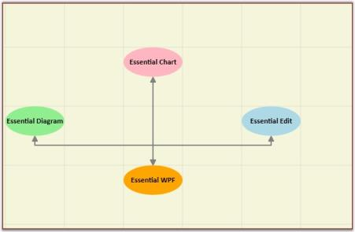

GridOffset
{:.caption}

### Customizing the GridLineStyle

The following code illustrates how to customize GridLineStyle:



          Pen pen = new Pen(Brushes.Gray, 1)

            {

                DashCap = PenLineCap.Triangle,

                Thickness=3, 

                DashStyle = new DashStyle(new double[] { 2, 8 }, 1),

                Brush=new SolidColorBrush(Colors.MidnightBlue)

            };

            Pen pen1 = new Pen(Brushes.Gray, 1)

            {

                DashCap = PenLineCap.Round,

                Thickness=2, 

                DashStyle = new DashStyle(new double[] { 2, 8 },1),

                Brush=new SolidColorBrush(Colors.Green)

            };

            diagramView.HorizontalGridLineStyle = pen1;

            diagramView.VerticalGridLineStyle = pen;




Dim pen As New Pen(Brushes.Gray, 1) With {.DashCap = PenLineCap.Triangle, .DashStyle = New DashStyle(New Double() { 2, 8 }, 1), .Brush = New SolidColorBrush(Colors.MidnightBlue)}

Dim pen1 As New Pen(Brushes.Gray, 1) With {.DashCap = PenLineCap.Round, .DashStyle = New DashStyle(New Double() { 2, 8 },1), .Brush = New SolidColorBrush(Colors.Green)}

diagramView.HorizontalGridLineStyle = pen1

diagramView.VerticalGridLineStyle = pen



## Snapping

### Snap to Grid

The Snap to Grid feature enables dragging nodes and connectors in multiples of offset values, which is specified by using DiagramView’s SnapOffsetX and SnapOffsetY properties. For example, if a node is dragged when SnapOffsetX is set to 25, then the nodes OffsetX value will change in multiples of 25.

#### Use Case Scenarios

Users can snap objects with respect to grid lines in the Design environment by using Snap to Grid instead of smooth dragging.

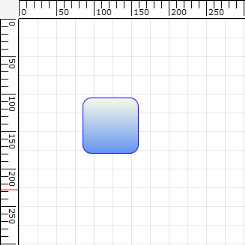

Node Before Snapping
{:.caption}

Node After Snapping
{:.caption}

#### Enabling Snap to Grid

The Snap to Grid feature for nodes and connectors can be enabled by setting DiagramView’s SnapToHorizontalGrid and SnapToVerticalGrid properties to ”True”, as shown in the following code snippets.

In the following code example, diagramView is an instance of DiagramView.



<syncfusion:DiagramView  x:Name="diagramView" SnapToHorizontalGrid="True" SnapToVerticalGrid="True" >

</syncfusion:DiagramView>




// Enable snap to vertical grid.

diagramView.SnapToVerticalGrid = True;

// Enable snap to horizontal grid.

diagramView.SnapToHorizontalGrid = True;




'Enable snap to vertical grid.

diagramView.SnapToVerticalGrid = True

'Enable snap to horizontal grid.

diagramView.SnapToHorizontalGrid = True



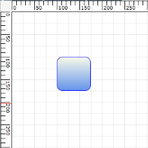

Snap to Grid Enabled
{:.caption}

#### Customizing Snap to Grid Offset Values

By default, the SnapOffsetX and SnapOffsetY values are set to 25 pixels. However, these values can be changed so that objects will snap to the horizontal grid by using SnapOffsetX and snap to the vertical grid by using SnapOffsetY, as shown in the following code example.

In the following code example, diagramView is an instance of DiagramView.



<syncfusion:DiagramView  x:Name="diagramView" SnapOffsetX ="50" SnapOffsetY ="50">

</syncfusion:DiagramView>




diagramView.SnapOffsetX = 50;

diagramView.SnapOffsetY = 50;




diagramView.SnapOffsetX = 50

diagramView.SnapOffsetY = 50



N> SnapToGrid will snap objects based on the offset values specified in DiagramView’s SnapOffsetX and SnapOffsetY values and it works independently from grid lines. However, to snap objects along with the grid lines, specify the same offset values for grid lines and snap offset.

Also, snapping of objects will occur only when the objects are dragged during runtime. Even after snapping is enabled, users can specify their own offset values in code behind.

The properties of the Snap to Grid feature are described in the following tabulation:

<table>
<tr>
<th>
Property </th><th>
Description </th><th>
Type </th><th>
Data Type </th><th>
Reference links </th></tr>
<tr>
<td>
SnapOffsetX</td><td>
Snaps to the horizontal offset value.</td><td>
Dependency property</td><td>
double</td><td>
Not applicable </td></tr>
<tr>
<td>
SnapOffsetY</td><td>
Snaps to the vertical offset value.</td><td>
Dependency property</td><td>
double</td><td>
Not applicable</td></tr>
<tr>
<td>
SnapToHorizontalGrid</td><td>
Enables or disables snap to horizontal grid.</td><td>
Dependency property</td><td>
bool, true/false</td><td>
 Not applicable</td></tr>
<tr>
<td>
SnapToVerticalGrid</td><td>
Enables or disables snap to vertical grid.</td><td>
Dependency property</td><td>
bool, true/false</td><td>
 Not applicable</td></tr>
</table>

#### Sample Link

To view a sample:

Open the Diagram Sample Browser from the dashboard. (Refer to the Samples and Location chapter.)

Navigate to Editable Diagram > SnapToGrid Demo.

### Snap-To-Node

This feature enables you to properly align a node with neighboring nodes. This is useful when multiples nodes need to be aligned horizontally or vertically to each other. While dragging the nodes, drawing guidelines will be shown to indicate how the nodes are aligned.

#### Properties

<table>
<tr>
<th>
Property</th><th>
Description</th><th>
Type</th><th>
Data Type</th></tr>
<tr>
<td>
Left </td><td>
This property is used to enable/disable the left alignment support.</td><td>
Dependency</td><td>
bool</td></tr>
<tr>
<td>
Top </td><td>
This property is used to enable/disable the top alignment support.</td><td>
Dependency</td><td>
bool</td></tr>
<tr>
<td>
Right </td><td>
This property is used to enable/disable the right (width oriented) alignment support.</td><td>
Dependency</td><td>
bool</td></tr>
<tr>
<td>
Bottom</td><td>
This property is used to enable/disable the bottom (height oriented) alignment support.</td><td>
Dependency</td><td>
bool</td></tr>
<tr>
<td>
CenterX</td><td>
This property is used to enable/disable the center alignment support based on X-coordinate alignment.</td><td>
Dependency</td><td>
bool</td></tr>
<tr>
<td>
CenterY</td><td>
This property is used to enable/disable the center alignment support based on Y-coordinate alignment.</td><td>
Dependency</td><td>
bool</td></tr>
<tr>
<td>
SnapLinePen</td><td>
This property is used to customize drawing guideline properties such as brush, thickness, etc.</td><td>
Dependency</td><td>
Pen</td></tr>
<tr>
<td>
SnapAdjustmentDistance</td><td>
This property is used to adjust the snapping distance.</td><td>
Dependency</td><td>
double</td></tr>
</table>

N> By default, all the properties of the SnapSettings class are set to true.

#### Enabling Snap-To-Node Feature

To enable the snap-to-node feature, create an instance for the SnapSettings class of DiagramView and set the EnableSnapNode property of the SnapSettings class to true. By default, the value of the EnableSnapNode property is set to NULL.



DiagramView diagramView = new DiagramView();

diagramView.SnapSettings = new SnapSettings();

diagramView.SnapSettings.EnableSnapNode = true;



### SnapSettings

By default, two nodes can be snapped in six positions. To disable snapping on a particular direction, you need to set the corresponding property to false.

#### Customizing the Snapping Lines

Snapping to object can be done in six ways. They are:

1. Left
2. Top
3. Right
4. Bottom
5. CenterX
6. CenterY

#### Customizing the Drawing Guidelines

The appearance of the drawing guidelines can be customized using the SnapLinePen property of the SnapSettings class.



DiagramView diagramView = new DiagramView();

//Creating Instance for SnapSettings class.

SnapSettings snapSettings = new SnapSettings();

//Customize the SnapAutoAdjustment distance between the elements.

 snapSettings.SnapAdjustmentDistance = 25;

//Customize the SnapLine Pen Color, Thickness.etc….

snapSettings.SnapLinePen = new Pen() { Brush = Brushes.Blue, Thickness = 0.7 };

//Assinging the SnapSettings instance to SnapSettings property of the DiagramView.

diagramView.SnapSettings = snapSettings;



#### Enabling/Disabling Drawing Guidelines

By default, all the properties of the SnapSettings class are set to true. To disable the drawing guidelines, set these properties to false as explained in the following code example.



DiagramView diagramView = new DiagramView();

//Creating Instance for SnapSettings class.

SnapSettings snapSettings=new SnapSettings();

//Customize the SnapAutoAdjustment distance between the elements.

snapSettings.SnapAdjustmentDistance = 25;

//Disable Left Alignment Support line.

snapSettings.Left = false;

//Disable Right Alignment Support line.

snapSettings.Right = false;

//Disable CenterX Alignment Support line.

snapSettings.CenterX = false;

//Assinging the SanpSettings instance to SnapSettings property of the DiagramView.

diagramView.SnapSettings = snapSettings;



### Snapping Port Support

This support is used to align a connection port with other ports horizontally or vertically.

Enabling the Snapping Port Support

To enable this feature, create an instance for the SnapSettings class of DiagramView and set the EnableSnapPort property of the SnapSettings class to true.



DiagramView diagramView = new DiagramView(); 

diagramView.SnapSettings = new SnapSettings();

diagramView.SnapSettings.EnableSnapPort = true;



#### Disabling the Snaping Port Feature

To disable this feature, set the EnableSnapPort property of the SnapSettings class to false. The following code example illustrates this.



DiagramView diagramView = new DiagramView();

diagramView.SnapSettings.EnableSnapPort = false;



## Zoom Commands

The diagram page can be zoomed in and out. Zooming can be achieved in the following two ways.

* Using the zoom commands.
* Using the mouse wheel.

<table>
<tr>
<th>
Property</th><th>
Description </th><th>
Type of the property</th><th>
Value it accepts</th><th>
Any other dependencies/ sub properties associated</th></tr>
<tr>
<td>
IsZoomEnabled</td><td>
Gets or sets a value indicating whether zoom is enabled or not.Default value is True.</td><td>
Dependency property</td><td>
Boolean(True/False)</td><td>
No</td></tr>
<tr>
<td>
ZoomFactor</td><td>
Gets or sets a factor for the zoom.Default value is 0.2.</td><td>
Dependency property</td><td>
Double</td><td>
No</td></tr>
</table>

### Steps to zooming using the zoom commands

### Zooming in

The following code can be added to a Button's click event to facilitate zooming in.


DiagramView diagramView = new DiagramView();

ZoomCommands.ZoomIn.Execute(diagramView.Page, diagramView);




Dim diagramView As New DiagramView()

ZoomCommands.ZoomIn.Execute(diagramView.Page, diagramView)

The diagram page elements will be zoomed in each time the button is clicked.



### Zoom out

The following code can be added to a button's click event to facilitate zooming out.


DiagramView diagramView = new DiagramView();

ZoomCommands.ZoomOut.Execute(diagramView.Page, diagramView);




Dim diagramView As New DiagramView()

ZoomCommands.ZoomOut.Execute(diagramView.Page, diagramView)


The diagram page elements will be zoomed out each time the button is clicked.

Steps to zooming using the mouse wheel

1. Ensure the IsZoomEnabled property is set to True. By default it is set to true.


DiagramView diagramView = new DiagramView();

diagramView.IsZoomEnabled = true;




Dim diagramView As New DiagramView()

diagramView.IsZoomEnabled = True



2. Now while the CTRL key is pressed, roll the mouse wheel up to zoom in or down to zoom out.

N> All other operations can be performed on page elements while IsZoomEnabled is set to True.

Zooming the Diagram Control
{:.caption}

### Zoom Factor

Essential Diagram WPF allows you to set the factor by which you can zoom in or out. This factor can be specified using the ZoomFactor property. The default value is 0.2.

The following code can be used to set the ZoomFactor property.


<Window x:Class="WpfApplication1.Window1" xmlns="http://schemas.microsoft.com/winfx/2006/xaml/presentation"

xmlns:x="http://schemas.microsoft.com/winfx/2006/xaml" Title="EssentialDiagramWPF" Height="400" Width="600"

xmlns:sfdiagram="clr-namespace:Syncfusion.Windows.Diagram;assembly=Syncfusion.Diagram.WPF" xmlns:local="clr-namespace:WpfApplication1">

    <Grid Name="diagramgrid">

        <sfdiagram:DiagramControl IsSymbolPaletteEnabled="True">

            <sfdiagram:DiagramControl.View>

                <sfdiagram:DiagramView Name="diagramView" ZoomFactor="0.5">

                </sfdiagram:DiagramView>

            </sfdiagram:DiagramControl.View>

        </sfdiagram:DiagramControl>

    </Grid>

</Window>




DiagramView diagramView = new DiagramView();

diagramView.ZoomFactor = 0.5;




Dim diagramView As New DiagramView()

diagramView.ZoomFactor = 0.5


## Nudge Commands

Nudge commands allows you to move the selected objects on the page by 1 pixel. This can be done in two ways:

Using Nudge Commands

### NudgeUp

Moves the selected object to the top by 1 pixel.


DiagramCommandManager.NudgeUp.Execute(diagramView.Page, diagramView);



DiagramCommandManager.NudgeUp.Execute(diagramView.Page, diagramView)



### NudgeDown

Moves the selected object to the bottom by 1 pixel.


DiagramCommandManager.NudgeDown.Execute(diagramView.Page, diagramView);


DiagramCommandManager.NudgeDown.Execute(diagramView.Page, diagramView)


### NudgeLeft

Moves the selected object to the left by 1 pixel.


DiagramCommandManager.NudgeLeft.Execute(diagramView.Page, diagramView);


DiagramCommandManager.NudgeLeft.Execute(diagramView.Page, diagramView)


### NudgeRight

Moves the selected object to the right by 1 pixel.


DiagramCommandManager.NudgeRight.Execute(diagramView.Page, diagramView);


DiagramCommandManager.NudgeRight.Execute(diagramView.Page, diagramView)



### Nudge by using Arrow Keys

The corresponding arrow keys can be used to move the selected objects to top, bottom, left or right. 

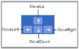

Nudge by using Arrow Keys
{:.caption}

Nudge commands are particularly useful for accurate placement of objects on the page as it allows you to move by 1 pixel each time.

## Clipboard Commands

Clipboard commands are used to perform cut copy and paste operations.

<table>
<tr>
<th>
Property</th><th>
Description</th><th>
Type of the property</th><th>
Value it accepts</th><th>
Any other dependencies/ sub properties associated</th></tr>
<tr>
<td>
IsCutEnabled</td><td>
Gets or sets a value indicating whether cut command is enabled. Default valueisTrue.</td><td>
Dependency property</td><td>
Boolean(True/False)</td><td>
No</td></tr>
<tr>
<td>
IsCopyEnabled</td><td>
Gets or sets a value copy command is enable Default value is True.</td><td>
Dependency property</td><td>
Boolean(True/False)</td><td>
No</td></tr>
<tr>
<td>
IsPasteEnabled</td><td>
Gets or sets a value indicating whether paste command is enable Default value is True.</td><td>
Dependency property</td><td>
Boolean(True/False)</td><td>
No</td></tr>
</table>

Clipboard commands allows you to cut or copy the selected objects in the page to the clipboard and paste the valid clipboard content into the page. This can be done in two ways:

### Using Clipboard Commands 

### Cut Command

Cut the selected objects from the page into the Clipboard.


<Button Command="Cut" CommandTarget="{Binding ElementName=diagramView}" CommandParameter="{Binding ElementName=diagramPage}">

    Cut

</Button>




ApplicationCommands.Cut.Execute(diagramView.Page, diagramView);


ApplicationCommands.Cut.Execute(diagramView.Page, diagramView)</td></tr>



Copy Command

Copies the selected objects from the page into the Clipboard.


<Button Command="Copy" CommandTarget="{Binding ElementName=diagramView}" CommandParameter="{Binding ElementName=diagramPage}">

    Copy</Button>




ApplicationCommands.Copy.Execute(diagramView.Page, diagramView);


ApplicationCommands.Copy.Execute(diagramView.Page, diagramView)


### Paste Command

Paste the contents of the valid clipboard into the page.


<Button Command="Paste" CommandTarget="{Binding ElementName=diagramView}" CommandParameter="{Binding ElementName=diagramPage}">

    Paste

</Button>




ApplicationCommands.Paste.Execute(diagramView.Page, diagramView);


ApplicationCommands.Paste.Execute(diagramView.Page, diagramView)



Using Shotcut Keys

* Cut – Ctrl + X
* Copy – Ctrl + C
* Paste – Ctrl + V

### Disable Clipboard Commands

Each clipboard command can be disabled as shown in the following code example.


<Window x:Class="RadialTreeLayout_2008.Window1"

    xmlns="http://schemas.microsoft.com/winfx/2006/xaml/presentation"

    xmlns:x="http://schemas.microsoft.com/winfx/2006/xaml"

    Title="Disable Cut Copy Paste Demo" WindowState="Maximized"

    WindowStartupLocation="CenterScreen" Name="mainwindow"

    xmlns:syncfusion="http://schemas.syncfusion.com/wpf" Icon="App.ico"

    xmlns:local="clr-namespace:DisableCutCopyPaste_2008

    >

    <!--Diagram Control-->

    <syncfusion:DiagramControl  Name="diagramControl">

        <syncfusion:DiagramControl.Model>

            <syncfusion:DiagramModel x:Name="diagramModel">

            </syncfusion:DiagramModel>

        </syncfusion:DiagramControl.Model>

        <!-- Disable Cut, Copy and Past -->

        <syncfusion:DiagramControl.View>

            <syncfusion:DiagramView IsCutEnabled="False" IsCopyEnabled="False" IsPasteEnabled="False" Name="diagramView">

            </syncfusion:DiagramView>

        </syncfusion:DiagramControl.View>

    </syncfusion:DiagramControl>

</Window>




diagramView.IsCutEnabled = false;

diagramView.IsCopyEnabled = false;

diagramView.IsPasteEnabled = false;




diagramView.IsCutEnabled = False

diagramView.IsCopyEnabled = False

diagramView.IsPasteEnabled = False



## ZOrder Commands

The ordering commands allows you to change the z-index value of the selected objects (nodes and connectors) on the page. The objects can be made to go back or front so that they get displayed over other objects in case two or more objects overlap.

The commands are listed as follows.

### BringToFront

Moves the selected object over other objects by increasing the z-index to maximum value.


DiagramCommandManager.BringToFront.Execute(diagramView.Page, diagramView);


DiagramCommandManager.BringToFront.Execute(diagramView.Page, diagramView)


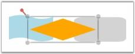

Bring To Front
{:.caption}

### SendToBack

Moves the selected object behind all other objects by setting the z-index to 0.


DiagramCommandManager.SendToBack.Execute(diagramView.Page, diagramView);


DiagramCommandManager.SendToBack.Execute(diagramView.Page, diagramView)


Send To Back
{:.caption}

### MoveForward

Increases the z-index value of the selected object by 1.


DiagramCommandManager.MoveForward.Execute(diagramView.Page, diagramView);


DiagramCommandManager.MoveForward.Execute(diagramView.Page, diagramView)


Move Forward
{:.caption}

###  SendBackward

Decreases the z-index value of the selected object by 1.


DiagramCommandManager.SendBackward.Execute(diagramView.Page, diagramView);



DiagramCommandManager.SendBackward.Execute(diagramView.Page, diagramView)


Send Backward
{:.caption}

## ZOrder Mode

Essential Diagram for WPF provides support for the ZOrder mode for diagram view elements. This allows the user to decide whether the ZOrdering of diagram view elements should be done by index or be visually based.

### Properties

<table>
<tr>
<th>
Property</th><th>
Description</th><th>
Type of property</th><th>
Value it Accepts</th><th>
Any other dependencies/ sub properties associated</th></tr>
<tr>
<td>
ZOrderMode</td><td>
Specifies the ZOrder mode for diagram view elements. The default value is Index.</td><td>
Dependency property</td><td>
ZOrderModes.VisualZOrderModes.Index</td><td>
No</td></tr>
</table>

This property is in DiagramView and can be set in the following ways.

* Through XAML
* Through Code Behind

The following code illustrates how to set the ZorderMode as Index:


    <!--Diagram Control-->

    <syncfusion:DiagramControl  Name="diagramControl">

        <!-- Model to add nodes and connections.-->

        <syncfusion:DiagramControl.Model>

            <syncfusion:DiagramModel x:Name="diagramModel">

            </syncfusion:DiagramModel>

        </syncfusion:DiagramControl.Model>

        <!--View to display nodes and connections added through the model.-->

<syncfusion:DiagramControl.View>

   <syncfusion:DiagramView Name="diagramView" ZOrderMode="Index">

   </syncfusion:DiagramView>

</syncfusion:DiagramControl.View>

    </syncfusion:DiagramControl>




DiagramView diagramView = new DiagramView();

diagramview.ZOrderMode = ZOrderModes.Index; 




Dim diagramView As New DiagramView()

diagramview.ZOrderMode = ZOrderModes.Index; 



The following code illustrates how to set the ZOrderMode as Visual:


    <!--Diagram Control-->

    <syncfusion:DiagramControl  Name="diagramControl">

        <!-- Model to add nodes and connections.-->

        <syncfusion:DiagramControl.Model>

            <syncfusion:DiagramModel x:Name="diagramModel">

            </syncfusion:DiagramModel>

        </syncfusion:DiagramControl.Model>

        <!--View to display nodes and connections added through the model.-->

<syncfusion:DiagramControl.View>

   <syncfusion:DiagramView Name="diagramView" ZOrderMode="Index">

   </syncfusion:DiagramView>

</syncfusion:DiagramControl.View>

    </syncfusion:DiagramControl>




DiagramView diagramView = new DiagramView();

diagramview.ZOrderMode = ZOrderModes.Visual; 




Dim diagramView As New DiagramView()

diagramview.ZOrderMode = ZOrderModes.Visual; 



## Alignment Commands

Alignment commands enable you to align selected objects (nodes and connectors) on a page with respect to a reference object. The first object in the selection is considered the reference object. 

The following alignment commands are used to align objects.

### Left Alignment

The AlignLeft command aligns all selected objects along the left corner of the reference object.


DiagramCommandManager.AlignLeft.Execute(diagramView.Page, diagramView);


DiagramCommandManager.AlignLeft.Execute(diagramView.Page, diagramView)



The following screenshot illustrates how the last two nodes are aligned to the left with respect to the first node.

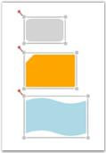

AlignLeft command applied to Diagram Objects
{:.caption}

### Center Alignment (Horizontal Axis)

The AlignCenter command aligns all selected objects to the center. This command center-aligns selected objects with respect to the horizontal axis, i.e., by changing the x-coordinate of the object.


DiagramCommandManager.AlignCenter.Execute(diagramView.Page, diagramView);


DiagramCommandManager.AlignCenter.Execute(diagramView.Page, diagramView)



The following screenshot illustrates how the last two nodes are aligned to the center with respect to the horizontal axis of the first node.

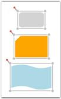

AlignCenter command applied to Diagram Objects
{:.caption}

### Right Alignment

The AlignRight command aligns all selected objects along the right corner of the reference object.


DiagramCommandManager.AlignRight.Execute(diagramView.Page, diagramView);



DiagramCommandManager.AlignRight.Execute(diagramView.Page, diagramView)


The following screenshot illustrates how the last two nodes are aligned to the right with respect to the first node.

AlignRight command applied to Diagram Objects
{:.caption}

### Top Alignment

The AlignTop command aligns all selected objects along the top surface of the reference object.


DiagramCommandManager.AlignTop.Execute(diagramView.Page, diagramView);


DiagramCommandManager.AlignTop.Execute(diagramView.Page, diagramView)


The following screenshot illustrates how the last two nodes are aligned to the top with respect to the first node.

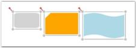

AlignTop command applied to Diagram Objects
{:.caption}

### Center Alignment (Vertical Axis)

The AlignMiddle command aligns all selected objects at the center. This command center-aligns selected objects with respect to the vertical axis, i.e., by changing the y-coordinate of the object. 


DiagramCommandManager.AlignMiddle.Execute(diagramView.Page, diagramView);


DiagramCommandManager.AlignMiddle.Execute(diagramView.Page, diagramView)


The following screenshot illustrates how the last two nodes are aligned to the center with respect to the vertical axis of the first node.

AlignMiddle command applied to Diagram Objects
{:.caption}

## Bottom Alignment

The AlignBottom command aligns all selected objects along the bottom surface of the reference object.


DiagramCommandManager.AlignBottom.Execute(diagramView.Page, diagramView);


DiagramCommandManager.AlignBottom.Execute(diagramView.Page, diagramView)


The following screenshot illustrates how the last two nodes are aligned to the bottom with respect to the first node.

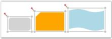

AlignBottom command applied to Diagram Objects

{:.caption}

N> The connector gets aligned only when the head node and the tail node of the connector is Null.

Alignment commands are useful for ordering the layout of the objects on a page and provide a professional appearance to the diagram.

## Spacing Commands

Spacing commands enables you to place selected objects (nodes and connectors) on the page at equal intervals from each other. The objects are spaced within the bounds of the first and last objects in the selection object.

The following spacing commands are used to space objects.

### Horizontal Spacing

The SpaceAcross command spaces selected objects with equal horizontal distance between them.


DiagramCommandManager.SpaceAcross.Execute(diagramView.Page, diagramView);


DiagramCommandManager.SpaceAcross.Execute(diagramView.Page, diagramView)


The following screenshot illustrates horizontally spaced objects.

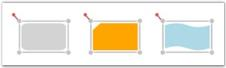

SpaceAcross command applied to Diagram Objects
{:.caption}

### Vertical Spacing

The SpaceDown command spaces selected objects with equal vertical distance between them.


DiagramCommandManager.SpaceDown.Execute(diagramView.Page, diagramView);


DiagramCommandManager.SpaceDown.Execute(diagramView.Page, diagramView)


The following screenshot illustrates vertically spaced objects.

SpaceDown command applied to Diagram Objects
{:.caption}

N> The connector gets spaced only when the head node and the tail node of the connector is Null.

## Delete Command

Diagram WPF provides support to delete nodes and connectors by using the Delete command.

The following steps illustrate how to delete a node or connector.

1. Select the node or the connector to be deleted.
2. Press the DELETE key. The selected node or connector will be deleted.

N> When a node is deleted, all the connectors connected to that node are also deleted. Deleting a connector leads to the deletion of that particular connector only.

The following code example illustrates how to invoke the Delete command.


DiagramCommandManager.Delete.Execute(diagramView.Page, diagramView);




DiagramCommandManager.Delete.Execute(diagramView.Page, diagramView)


## Sizing Commands

Sizing commands enable you to resize selected objects (nodes and connectors) on the page. The selected objects get resized with respect to the first object in the selection list.  

The following sizing commands are used to resize objects.

### Height Customization

The SameHeight command resizes selected objects to the height of the first object in the selection list.


DiagramCommandManager.SameHeight.Execute(diagramView.Page, diagramView);


DiagramCommandManager.SameHeight.Execute(diagramView.Page, diagramView)


SameHeight command applied to Diagram Objects
{:.caption}

N> The width of the selected object remains the same.

### Width Customization

The SameWidth command resizes selected objects to the width of the first object in the selection list.


DiagramCommandManager.SameWidth.Execute(diagramView.Page, diagramView);


DiagramCommandManager.SameWidth.Execute(diagramView.Page, diagramView)



SameWidth command applied to Diagram Objects
{:.caption}

N> The height of the selected object remains the same.

### Height and Width Customization

The SameSize command resizes selected objects to the height and width of the first object in the selection list.


DiagramCommandManager.SameSize.Execute(diagramView.Page, diagramView);


DiagramCommandManager.SameSize.Execute(diagramView.Page, diagramView)


SameSize command applied to Diagram Objects
{:.caption}

N> The connector gets spaced only when the head node and the tail node of the connector is Null.

## Undo and Redo Command

Undo command reverses the last action performed. For example: Some of the basic operations like translation, rotation, resizing, grouping, ungrouping, changing z-order, addition, deletion etc., which are performed on diagram objects (Nodes and Line Connectors) can be reversed. Redo command undoes the last Undo action. Alternatively these commands can be executed using the keyboard shortcuts; Ctrl +Z for Undo command and Ctrl+Y for Redo command.

Undo Command can be specified in the following way.


DiagramCommandManager.Undo.Execute(diagramView.Page, diagramView);


DiagramCommandManager.Undo.Execute(diagramView.Page, diagramView)


Redo Command can be specified in the following way.


DiagramCommandManager.Redo.Execute(diagramView.Page, diagramView);


DiagramCommandManager.Redo.Execute(diagramView.Page, diagramView)


### Disable Undo and Redo

Disabling Undo and Redo is helpful when the Diagram control has large number of nodes and line connectors where insertion and deletion are very frequently used. This property can be disabled so that all the references are removed for the stack. This implies that deleted nodes will lose their references and Garbage collected.

<table>
<tr>
<th>
Property</th><th>
Description </th><th>
Type of the property</th><th>
Value it accepts</th><th>
Any other dependencies/ sub properties associated</th></tr>
<tr>
<td>
UndoRedoEnabled</td><td>
Gets or sets a value indicating whether undo redo is enabled or not.</td><td>
Dependency property</td><td>
Boolean(True/False)</td><td>
No</td></tr>
</table>

The following code example shows how to disable Undo Redo operation.


        <sfdiagram:DiagramControl IsSymbolPaletteEnabled="True" >

            <sfdiagram:DiagramControl.Model>

                <sfdiagram:DiagramModel x:Name="diagramModel" >

                </sfdiagram:DiagramModel>

            </sfdiagram:DiagramControl.Model>

            <sfdiagram:DiagramControl.View >

                <sfdiagram:DiagramView UndoRedoEnabled="False" 

 ShowHorizontalGridLine="True" ShowVerticalGridLine="True">

                </sfdiagram:DiagramView>

            </sfdiagram:DiagramControl.View>

        </sfdiagram:DiagramControl>




DiagramView diagramView = new DiagramView();

diagramView.UndoRedoEnabled = false;




Dim diagramView As New DiagramView()

diagramView.UndoRedoEnabled = False



### Clearing Undo Redo Stack

The following code example illustrates how to clear Undo Redo stack.


DiagramView diagramView = new DiagramView();

diagramView.ClearUndoRedoStack();




Dim diagramView As New DiagramView()

diagramView.ClearUndoRedoStack()



## Printing Enhancements for Diagram Page

This feature enables you to print a copy of the diagram page, with or without using Print Dialog Box. This feature comes with two functionalities:

1. Printing a diagram using Print Dialog and Print Preview, and
2. Printing a diagram without using Print Dialog.

### Use Case Scenarios

To print the diagram page, you can use this feature as it enables printing with different functionalities.

Tables for Properties, Methods and Events

### Properties

<table>
<tr>
<th>
Property</th><th>
Description</th><th>
Type</th><th>
Value It Accepts</th><th>
Default Values</th><th>
Any other dependencies/ sub properties associated</th></tr>
<tr>
<td>
ShowDialog </td><td>
Gets or sets the Print Dialog to show or not.</td><td>
CLR property </td><td>
Bool (true/false)</td><td>
True </td><td>
No</td></tr>
<tr>
<td>
PrintStretch</td><td>
Gets or sets the page stretch for printing the document.</td><td>
CLR property</td><td>
Stretch.Fill,Stretch.None,Stretch.Uniform,Stretch.UniformToFill</td><td>
-</td><td>
No</td></tr>
</table>

### Methods

<table>
<tr>
<th>
Method </th><th>
Description </th><th>
Parameters </th><th>
Return Type </th><th>
Reference links </th></tr>
<tr>
<th>
Print</th><th>
Prints the diagram page using Print Dialog Box and Print Preview</th><th>
void</th><th>
void </th><th>
No</th></tr>
<tr>
<th>
Print</th><th>
Prints the diagram page without using Print Dialog Box and Print Preview</th><th>
PrintParameters</th><th>
void </th><th>
No</th></tr>
</table>

### Sample Link

To view the sample for this feature:

1. Open the WPF Sample Browser from the Dashboard. 
2. Navigate to Diagram -> Static Diagram ->Export Demo.

Adding Printing Enhancements for Diagram Page to an Application 

This feature enables you to print a copy of diagram though: 

* PrintPeview, 
* Without PrintDialog (though code behind)

### Print Preview

Diagram can be printed though PrintPreview using following code snippet:

* Through Code behind. 


       DiagramView diagramView = new DiagramView();

diagramView.Print();




       Dim diagramView As New DiagramView()

diagramView.Print()



The following custom options can be customized using PrintPreview.

* Print Preview—To view the page before printing
* Different modes—To select printing such as Color, and Black and White
* Stretch—To adjust the fit of the image on the page

Print and PrintPreview Dialog Box
{:.caption}

### Printing a Diagram without PrintDialog Box

Diagram can be printed without using PrintDialog or PrintPreview, and by sending PrintPreview as an argument for printing as shown blow:

Print without dialog box


       DiagramView diagramView = new DiagramView();

PrintParameters p = new PrintParameters();

p.ShowDialog = false;

p.PrintStretch = Stretch.Fill;

diagramView.Print(p);




       Dim diagramView As New DiagramView()

      Dim p As New PrintParameters()

      p.ShowDialog = False

      p.PrintStretch = Stretch.Fill

      diagramView.Print(p)



### Support to Print the Diagram Shapes with Effects

Essential Diagram for WPF provides support to print the diagram shapeswiththeapplied effects. When effects are applied to the nodes, they cannot be printed properly, due to the framework limitation. This feature enables you to overcome this limitation. 

#### Use Case Scenarios

When you want to print a diagram page, in which you have applied effects for the nodes, you can use this feature to achieve this.

#### Properties

<table>
<tr>
<th>
Property </th><th>
Description </th><th>
Type </th><th>
Data Type </th><th>
Reference links </th></tr>
<tr>
<td>
CustomEffect</td><td>
Gets or sets a value of the applied effect of the Node.</td><td>
Dependency property</td><td>
Effect</td><td>
NA</td></tr>
</table>

#### Printing the Diagram Shapes with Effects

You can print the diagram shapes with the applied effects using the _CustomEffect_ property. The following code illustrates this:


DropShadowEffect effect = new DropShadowEffect();

          effect.BlurRadius = 10;

           Node node = new Node();

           node.Shape = Shapes.Ellipse;
           node.CustomEffect = effect;

           diagramModel.Nodes.Add(node);




Dim effect As New DropShadowEffect()

effect.BlurRadius = 10

Dim node As New Node()

node.Shape = Shapes.Ellipse

node.CustomEffect = effect

diagramModel.Nodes.Add(node)



Printed Nodes with Effects
{:.caption}

## Drawing Tools 

This feature enables you to draw different shapes and lines. The drawn shapes and lines will be converted into Node and LineConnector respectively.

The following shapes and lines are available in DrawingTools:

1. Ellipse
2. Rectangle
3. Rounded Rectangle
4. Polygon
5. Straight Line
6. Bezier Line
7. Orthogonal Line
8. Polyline

### Use Case Scenarios

DrawingTools such as Microsoft Paint and Expression Blend support drawing a particular shape continually on a page. This feature too, enables you to draw a shape repeatedly without selecting it manually each time.

### Properties

<table>
<tr>
<th>
Property </th><th>
Description </th><th>
Type of the Property</th><th>
Value It Accepts</th><th>
Any Other Dependencies/ Sub properties Associated</th></tr>
<tr>
<td>
EnableDrawingTools</td><td>
Gets or sets a value indicating whether   EnableDrawingTools is enabled or not.</td><td>
Dependency property</td><td>
Boolean(True/False)</td><td>
No</td></tr>
<tr>
<td>
DrawingTools</td><td>
Gets or sets the ShapeType to be used. Default value isDrawingTools.Ellipse</td><td>
Dependency property</td><td>
DrawingTools.EllipseDrawingTools.RectangleDrawingTool.RoundedRectangleDrawingTools.PolygonDrawingTools.StraightLineDrawingTools.BezierLineDrawingTools.OrthogonalLineDrawingTools.PolyLine</td><td>
No</td></tr>
</table>

### Sample Link

To view a sample:

1. Open the WPF sample browser from the dashboard. 
2. Navigate to WPF Diagram > Product Showcase >Features demo
### Enable Drawing Tools 

To enable DrawingTools set EnableDrawingTools property to true. Shapes and line connectors are enabled, when the EnableDrawingTools property is enabled. By default, the value is set to false.

 DrawingTools can be enabled using two methods.

* Through XAML.

The following code illustrates how to enable the DrawingTools.



<syncfusion:DiagramControl Name="diagramControl" 

     <syncfusion:DiagramControl.Model>

         <syncfusion:DiagramModel x:Name="diagramModel">

         </syncfusion:DiagramModel>  

     </syncfusion:DiagramControl.Model> 

    <syncfusion:DiagramControl.View>

       <syncfusion:DiagramView Name="diagramView" EnableDrawingTools="True">

        </syncfusion:DiagramView>

     </syncfusion:DiagramControl.View>

</syncfusion:DiagramControl>



* Through Code behind

The following code illustrates how to enable the DrawingTools.


       DiagramView diagramView = new DiagramView();

       diagramView.EnableDrawingTools = true;




       Dim diagramView As New DiagramView()

diagramView.EnableDrawingTools = True



N> When the EnableDrawingToolsis set to True, it has to be disabled manually, i.e. it cannot be disabled automatically. This will facilitate drawing shapes or lines continually until EnableDrawingTools is set to false manually. ObjectDrawn Event

The ObjectDrawn event will be raised when the node or line connector is drawn using the EnableConnection/Drawing Tools property of the diagram view. This event is used to identify the source of the drawing object. 

#### Events

<table>
<tr>
<th>
Event</th><th>
Description</th><th>
Arguments</th></tr>
<tr>
<td>
ObjectDrawn </td><td>
Raised when the node or line connector will be drawn using the Drawing Tools property.Event cannot be cancelled. </td><td>
Drawing Object--Get the object that is drawn (node or line connector). Drawing Type--Get the type of object. For example, if the drawing object is a node, the drawing type is a Rectangle, RoundedRectangle, Ellipse, etc. If the drawing object is a line connector, the drawing type is an Arc, BezierLine, OrthogonalLine, etc.</td></tr>
</table>

The following code illustrates this feature.

In XAML


  <syncfusion:DiagramControl.View>

                <syncfusion:DiagramView Name="diagramView" ObjectDrawn="diagramView_ObjectDrawn">

                </syncfusion:DiagramView>

</syncfusion:DiagramControl.View>



In C#


diagramView.ObjectDrawn += new Syncfusion.Windows.Diagram.DrawingToolEventHandler(diagramView_ObjectDrawn);

//Event handler. 

void diagramView_ObjectDrawn(object sender, Syncfusion.Windows.Diagram.DrawingToolEventArgs evtArgs)

{

   //User-specified code.


### Drawing Mode

Essential Diagram for WPF provides support for Drawing mode in the diagram view drawing tool. It can be used to draw elements in diagram view by continuously or only once.

#### Properties

<table>
<tr>
<th>
Property</th><th>
Description</th><th>
Type of property</th><th>
Value it Accepts</th><th>
Any other dependencies/ sub properties associated</th></tr>
<tr>
<td>
DrawingMode</td><td>
Specifies the drawing mode for the drawing tool. The default value is Default.</td><td>
Dependency property</td><td>
DrawingMode.ContinousDrawingMode.Default</td><td>
No</td></tr>
</table>

This property is in DiagramView and can be set in the following ways:

* Through XAML
* Through code behind

The following code illustrates how to set the DrawingMode as Default:


    <!--Diagram Control-->

    <syncfusion:DiagramControl  Name="diagramControl">

        <!-- Model to add nodes and connections.-->

        <syncfusion:DiagramControl.Model>

            <syncfusion:DiagramModel x:Name="diagramModel">

            </syncfusion:DiagramModel>

        </syncfusion:DiagramControl.Model>

        <!--View to display nodes and connections added through the model.-->

<syncfusion:DiagramControl.View>

   <syncfusion:DiagramView Name="diagramView" DrawingMode="Default">

   </syncfusion:DiagramView>

</syncfusion:DiagramControl.View>

    </syncfusion:DiagramControl>




DiagramView diagramView = new DiagramView();

diagramview.ZOrderMode = DrawingMode.Default; 




Dim diagramView As New DiagramView()

diagramview.ZOrderMode = DrawingMode.Default;



DrawingMode is Default

{:.caption}

The following code illustrates how to set the DrawingMode as Default:


    <!--Diagram Control-->

    <syncfusion:DiagramControl  Name="diagramControl">

        <!-- Model to add nodes and connections.-->

        <syncfusion:DiagramControl.Model>

            <syncfusion:DiagramModel x:Name="diagramModel">

            </syncfusion:DiagramModel>

        </syncfusion:DiagramControl.Model>

        <!--View to display nodes and connections added through the model.-->

<syncfusion:DiagramControl.View>

   <syncfusion:DiagramView Name="diagramView" DrawingMode="Continous">

   </syncfusion:DiagramView>

</syncfusion:DiagramControl.View>

    </syncfusion:DiagramControl>




DiagramView diagramView = new DiagramView();

diagramview.ZOrderMode = DrawingMode.Continous;




Dim diagramView As New DiagramView()

diagramview.ZOrderMode = DrawingMode.Continous;



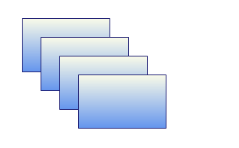

DrawingMode is Continous
{:.caption}

### Select a Drawing Tool 

DrawingTools consist of different shapes and line connectors. You can choose one of the DrawingTools at a time. By default, it is set to Ellipse.

The DrawingTool selection in Diagram View can be set in two methods:

* Through XAML.      

The following code illustrates how to select a DrawingTool.


<syncfusion:DiagramControl Name="diagramControl">

       <syncfusion:DiagramControl.Model>

            <syncfusion:DiagramModel x:Name="diagramModel">

            </syncfusion:DiagramModel>

        </syncfusion:DiagramControl.Model>

       <syncfusion:DiagramControl.View>

            <syncfusion:DiagramView Name="diagramView" DrawingTool="Polygon">

                <syncfusion:DiagramView.Page>

                </syncfusion:DiagramView>

            </syncfusion:DiagramControl.View>

        </syncfusion:DiagramControl>



* Through Code behind

The following code illustrates how to select a DrawingTool. 


       DiagramView diagramView = new DiagramView();

       diagramView.DrawingTool = DrawingTools.Rectangle;       




       Dim diagramView As New DiagramView()

diagramView.DrawingTool = DrawingTools.Rectangle



### Steps for Drawing 

 You can draw on a page by clicking and drag on the page.

 Follow are the below steps to draw a shape or a line: 

* Set the EnableDrawingTools property of DiagramView to true.
* Select the DrawingTool as required from DrawingTools option.
* Click and drag. Preview of the drawing will be displayed.
* Release the mouse. Shape or line will be drawn. 

N> These steps are common for all shapes and lines drawing, except Polygon and Polyline.

#### Shape Drawing

Preview Ellipse – while Drawing 

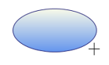

Ellipse Preview
{:.caption}

Ellipse – After Drawing.

Ellipse(Node)
{:.caption}

Line Drawing

Bezier Line Preview – While Drawing 

Bezier Line Preview
{:.caption}

Bezier Line – After Drawing

Bezier Line(Line Connector)
{:.caption}

N> * The drawn shape will be converted into a Node. * The drawn line will be converted into a LineConnector. * You can continually draw the selected shape. * Lines cannot be drawn continually.

Steps for drawing a Polygon and Polyline Drawing:

* Set the EnableDrawingTools property of DiagramView to be true.
* Select the DrawingTool as required from DrawingTools option.
* Click, where you want the first point for polygon (or) polyline.
* Drag the mouse pointer. Preview of the drawing will be displayed. 
* Click, where you want to place the Intermediate points of Polygon (or) Polyline
* Right-click to complete the drawing.

Preview Polygon – While Drawing 

Polygon Preview

Polygon – After Drawing

Polygon (Node)
{:.caption}

#### Sample Link

To view a sample:

1. Open the WPF sample browser from the dashboard. 
2. Navigate to WPF Diagram > Product Showcase >Features demo.

### Preview Style for Line Connectors

This feature allows you to modify the preview of a line connector by using the CustomPathStyle property of the DiagramView.

#### Properties

<table>
<tr>
<th>
Property </th><th>
Description </th><th>
Type </th><th>
Data Type </th></tr>
<tr>
<td>
CustomPathStyle </td><td>
Defines the path or style that has to be applied in the preview of a line connector. </td><td>
Dependency Property</td><td>
Style </td></tr>
</table>

### Adding Options for Dashed Line Connector to an Application_

#### Defining the Preview Style

The preview style for line connectors can be defined either through XAML or code behind.

To define a preview style, see the following code. This code sample is for setting the preview of the line connector as dashed.




#### Applying the Preview Style

To apply the preview style to a line connector, it has to be assigned to the CustomPathStyle property of DiagramView.


DiagramView View1 = new DiagramView();

View1.CustomPathStyle = this.Resources["MyStyle"] as Style;




Dim view1 As New DiagramView()

View1.CustomPathStyle = this.Resources["MyStyle"] as Style


The CustomPathStyle property of DiagramView applies the style that is assigned to the preview of the drawing objects.

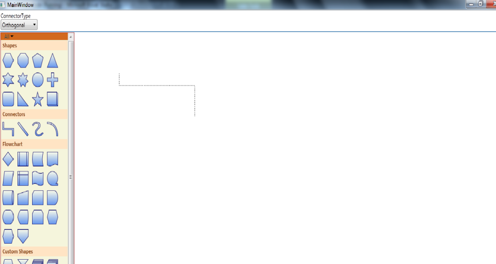

Preview of Dashed Orthogonal Line Connector
{:.caption}

## Export Diagram 

Essential Diagram for WPF can be exported to the following File formats:

* Exporting into Image File Format
* Bitmap(.bmp)
* JPEG
* PNG
* GIF
* TIFF
* WDP
* Exporting into XPS Format
* Export to Clipboard

The Diagram can be exported using following overloaded methods:

* Stream
* Stream
* Stream with BitmapEncoder
* Stream with Rect
* Stream with Rect and BitmapEncoder
* FileName
* FileName
* FileName with BitmapEncoder
* FileName with Rect
* FileName with Rect and BitmapEncoder
* XPS
* Stream 
* Stream with Rect
* FileName
* FileName with Rect

The following code illustrates how to export the Page as an image file.

### Stream

Page can be exported into any streams such as FileStream and MemoryStream.


System.IO.FileStream filestream = new System.IO.FileStream("Diagram.jpeg",System.IO.FileMode.Create);

diagramview.Save(filestream);



#### Stream with Rect and Encoder

You can also save to a stream with type of encoder and rectangle portion to be clipped.


System.IO.FileStream filestream = new System.IO.FileStream("Diagram.jpeg",System.IO.FileMode.Create);

TiffBitmapEncoder encoder = new TiffBitmapEncoder();

Rect rect = new Rect(new Point(100, 100), new Point(300, 300));

diagramview.Save(filestream, rect, encoder);


### Filename

#### Filename with Path

You can also export Page as an image file with directory path and file name. 


diagramview.Save(@"D:\ Diagram.jpeg");



#### Filename with Rect and Encoder

You can also specify the name of the file directly, specified portions of the DiagramPage, type of encoder such as TiffBitmapEncoder and GifBitmapEncoder.


TiffBitmapEncoder encoder = new TiffBitmapEncoder();

 Rect rect = new Rect(new Point(100, 100), new Point(300, 300));

 string filename = " Diagram.jpeg";

diagramview.Save(filename, rect, encoder);



### XPS

The DiagramPage can be exported in different ways:

* Stream
* Filename with Path
* Filename with Rect
* Stream with Rect

#### Stream

You can also save to a stream.

The following code illustrates how to save the Page.


System.IO.FileStream filestream = new System.IO.FileStream("Diagram.xps", System.IO.FileMode.Create);

diagramview.SaveToXps(filestream);



#### Stream with Rect

You can also save to a stream with specified size of the save area.


System.IO.FileStream filestream = new System.IO.FileStream("(@"D:\Diagram.xps",System.IO.FileMode.Create);

Rect rect = new Rect(new Point(200,200),new Point(500,500));

diagramview.SaveToXps(filestream,rect);



#### Filename with Path

You can also specify the name of the file directly in the save method.


diagramview.SaveToXps(@"D:\Diagram.xps", rect);



#### Filename with Rect

You can also specify the name of the file directly; Specified size of the save area.in the save method.


Rect rect = new Rect(new Point(100, 100), new Point(500, 500));

            diagramview.SaveToXps(@"D:\Diagram.xps", rect);


### Shrink and Expand Options

While exporting a diagram as an image, the exported image size can be shrunk or expanded to a specific size. An aspect ratio of 1:1 will always be maintained while exporting. If the diagram size and the proposed size are in different ratios, the size of the image will be decided internally based on the ImageStretch property.

### Parameters

<table>
<tr>
<th>
Parameter</th><th>
Description</th><th>
Type of Property</th><th>
Value It Accepts </th><th>
Other Dependencies/ Subproperties Associated</th></tr>
<tr>
<td>
filename</td><td>
Target file name where the image will be saved (e.g., @"E:\Fig3.jpg") </td><td>
CLR property</td><td>
String</td><td>
None</td></tr>
<tr>
<td>
imagesize</td><td>
Target image size. This property can be set to fit or expand the diagram to the specified size (e.g.: new Size(500, 500)).</td><td>
CLR property</td><td>
Size</td><td>
None</td></tr>
<tr>
<td>
ImageStretch</td><td>
Decides whether the target image will be the same size as the diagram, expanded to a specified size, or shrunk to a specified size.</td><td>
CLR property</td><td>
EnumImageStretch.NoneImageStretch.BestFitImageStretch.ExpandImageStretch.Shrink</td><td>
None</td></tr>
</table>
The following table lists the four options available for the ImageStretch property and their descriptions.

<table>
<tr>
<th>
Option</th><th>
Description</th></tr>
<tr>
<td>
None</td><td>
Target image will be the same size as the actual diagram.</td></tr>
<tr>
<td>
Expand</td><td>
Expands a small diagram to the specified size while exporting. </td></tr>
<tr>
<td>
Shrink</td><td>
Shrinks a huge diagram to the specified size while exporting. </td></tr>
<tr>
<td>
BestFit</td><td>
(Expand | Shrink). Decides whether the diagram should be expanded or shrunk and will export it as an image.</td></tr>
</table>

The following code sample demonstrates how to use the imagesize and ImageStretch options.


DiagramView diagramView = new DiagramView(); 

diagramView.Save(@"E:\Fig3.jpg", new Size(500, 500), ImageStretch.Shrink);



N> By default, when exporting a diagram that is huge in size (for example, 30,000 × 2,000), an ‘Out of memory’ exception is raised. By shrinking the diagram to a smaller size, the memory occupied will be less, so the exception will not be raised.

## Export to Clipboard

Content of the Page can be copied onto the clipboard as an image, and can be pasted into applications such as Paint and Microsoft Word.

The following Code illustrates how to export the Page content into clipboard.


diagramview.CopyToClipboard();



### SizeToContent

SizeToContent support enables you to resize the diagram page depending upon the content size. This option can also be disabled. You can also define the size of diagram page and restrict the diagram element from moving out of a specified area. 

### Properties 

<table>
<tr>
<th>
Name</th><th>
Description</th><th>
Type</th><th>
Data Type</th><th>
Reference Links</th></tr>
<tr>
<td>
SizeToContent</td><td>
Specifies whether SizeToContent behavior is enabled or disabled. </td><td>
Dependency Property</td><td>
Bool</td><td>
NA</td></tr>
<tr>
<td>
BoundaryConstraintsArea</td><td>
Defines the diagram page area.</td><td>
Dependency Property</td><td>
Rect</td><td>
NA</td></tr>
<tr>
<td>
BoundaryConstarintsEnabled</td><td>
Restricts the diagram element moving out of a specified area. </td><td>
Dependency Property</td><td>
Bool</td><td>
NA</td></tr>
<tr>
<td>
PageBackgroundEffect</td><td>
Sets the page background effect. </td><td>
Dependency Property</td><td>
Effect</td><td>
NA</td></tr>
<tr>
<td>
OffPageBackground</td><td>
Sets the background brush for area outside Diagram Page.</td><td>
Dependency Property</td><td>
Brush</td><td>
NA</td></tr>
</table>

### Enabling SizeToContent

To enable SizeToContent support, set the SizeToContent property of DiagramView to true. To disable, set this to false. Default value is true. 

Following code illustrates how to enable SizeToContent support:


   <syncfusion:DiagramControl  Name="diagramControl" IsSymbolPaletteEnabled="True">

            <syncfusion:DiagramControl.Model>

                <syncfusion:DiagramModel x:Name="diagramModel"></syncfusion:DiagramModel>

            </syncfusion:DiagramControl.Model>

            <syncfusion:DiagramControl.View>

                <syncfusion:DiagramView SizeToContent="True"  Name="diagramView"/>

            </syncfusion:DiagramControl.View>

        </syncfusion:DiagramControl>




    DiagramView diagramView = new DiagramView();

diagramView.SizeToContent = true;




Dim diagramView As New DiagramView()

diagramView.SizeToContent = True


###  Defining Diagram Page

You can define the Diagram Page area. Use the BoundaryConstraintsArea__property of DiagramView to define Diagram Page area. 

Following code illustrates how to define Diagram Page area:


   <syncfusion:DiagramControl  Name="diagramControl" IsSymbolPaletteEnabled="True">

            <syncfusion:DiagramControl.Model>

                <syncfusion:DiagramModel x:Name="diagramModel"></syncfusion:DiagramModel>

            </syncfusion:DiagramControl.Model>

            <syncfusion:DiagramControl.View>

                <syncfusion:DiagramView BoundaryConstraintsArea="100,100,850,1195" Name="diagramView"/>

            </syncfusion:DiagramControl.View>

        </syncfusion:DiagramControl>




DiagramView diagramView = new DiagramView();

            diagramView.BoundaryConstraintsArea = new Rect(100, 100, 850, 1195);




Dim diagramView As New DiagramView()

diagramView.BoundaryConstraintsArea = New Rect(100, 100, 850, 1195)


### Restricting the Diagram Element

You can restrict the diagram element moving out of a specified area. Use the BoundaryConstraintsEnabled property of DiagramView for this purpose.   

Following code illustrates how to restrict diagram element moving out of specific area:

   

 <syncfusion:DiagramControl  Name="diagramControl" IsSymbolPaletteEnabled="True">

            <syncfusion:DiagramControl.Model>

                <syncfusion:DiagramModel x:Name="diagramModel"></syncfusion:DiagramModel>

            </syncfusion:DiagramControl.Model>

            <syncfusion:DiagramControl.View>

                <syncfusion:DiagramView BoundaryConstraintsEnabled="True" Name="diagramView"/>

            </syncfusion:DiagramControl.View>

        </syncfusion:DiagramControl>




DiagramView diagramView = new DiagramView();

diagramView.BoundaryConstraintsEnabled = true;




Dim diagramView As New DiagramView()

diagramView.BoundaryConstraintsEnabled = True

### Customizing options

Following properties enables to customize the appearance of the diagram page:

* PageBackground specifies the background of the diagram page.
* OffPageBackground specifies the off page background.
* PageEffect specifies the background effect of the diagram page.

### Customizing Background

To customize the background, use the PageBackground of DiagramView. Default value is White.

Following code illustrated how to customize the background:


    <syncfusion:DiagramControl  Name="diagramControl" IsSymbolPaletteEnabled="True">

            <syncfusion:DiagramControl.Model>

                <syncfusion:DiagramModel x:Name="diagramModel"></syncfusion:DiagramModel>

            </syncfusion:DiagramControl.Model>

            <syncfusion:DiagramControl.View>

                <syncfusion:DiagramView OffPageBackground="White" PageBackground="White" Name="diagramView"/>

            </syncfusion:DiagramControl.View>

        </syncfusion:DiagramControl>




  DiagramView diagramView = new DiagramView();

            diagramView.PageBackground = new SolidColorBrush(Colors.Gray);




Dim diagramView As New DiagramView()

diagramView.PageBackground = New SolidColorBrush(Colors.Gray)


### Customizing the Off Page’s Background 

To customize the background of the Off Page, use the OffPageBackground__property of DiagramView. Default value is White. 

Following code illustrates how to customize the background of the Off Page:


   <syncfusion:DiagramControl  Name="diagramControl" IsSymbolPaletteEnabled="True">

            <syncfusion:DiagramControl.Model>

                <syncfusion:DiagramModel x:Name="diagramModel"></syncfusion:DiagramModel>

            </syncfusion:DiagramControl.Model>

            <syncfusion:DiagramControl.View>

                <syncfusion:DiagramView OffPageBackground="White" PageBackground="White" Name="diagramView"/>

            </syncfusion:DiagramControl.View>

        </syncfusion:DiagramControl>




       DiagramView diagramView = new DiagramView();

            diagramView.OffPageBackground = new SolidColorBrush(Colors.White);




Dim diagramView As New DiagramView()

diagramView.OffPageBackground = New SolidColorBrush(Colors.White)


### Customizing page effect

To customize the page effect, use the PageEffect property of DiagramView. 

Following code illustrates how to customize the page effect:


   <syncfusion:DiagramControl  Name="diagramControl" IsSymbolPaletteEnabled="True">

            <syncfusion:DiagramControl.Model>

                <syncfusion:DiagramModel x:Name="diagramModel"></syncfusion:DiagramModel>

            </syncfusion:DiagramControl.Model>

            <syncfusion:DiagramControl.View>

                <syncfusion:DiagramView OffPageBackground="White" PageBackground="White" Name="diagramView">

                    <syncfusion:DiagramView.BackgroundEffect>

                        <DropShadowEffect BlurRadius="12" Color="Black" Direction="-350" ShadowDepth="30"/>

                    </syncfusion:DiagramView.BackgroundEffect>

                </syncfusion:DiagramView>

            </syncfusion:DiagramControl.View>

        </syncfusion:DiagramControl>




            DropShadowEffect drop = new DropShadowEffect();

            drop.BlurRadius = 25;

            drop.Color = new Color { B = 205, G = 148, R = 79 };

            drop.Direction = 450;

            drop.ShadowDepth = -2;

            diagramView.BackgroundEffect = drop;




Dim drop As New DropShadowEffect()

drop.BlurRadius = 25

drop.Color = New Color With {.B = 205, .G = 148, .R = 79}

drop.Direction = 450

drop.ShadowDepth = -2

diagramView.BackgroundEffect = drop



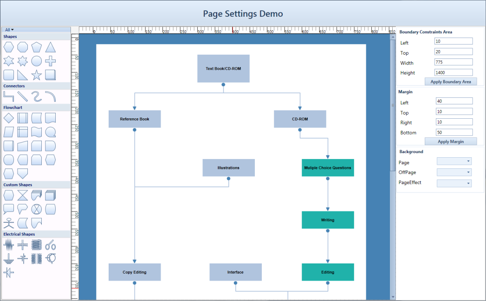

Customized Diagram Page
{:.caption}

## Touch Support

Touch support for diagram view has the following features:

* Drag and Drop from the SymbolPalette
* Dragging the Node and LineConnector on DiagramView
* Panning
* Multiple selection

### Steps for Dragging

Dragging operation can be performed by 

1. Touch a particular element in the touch screen monitor.
2. Start dragging the element to the desired location.
3. Take the finger off from the screen after it is reached to the desired location.

This dragging gesture is used to perform the following operation. 

### Drag and Drop from the SymbolPalette

4. Touch the SymbolPaletteItem for Drag and Drop.
5. Drag the SymbolPaletteItem and Drop onto DiagramView by touching the finger in DiagramView.

### Dragging the Node and LineConnector on DiagramView

6. Touch the Node or Lineconnector for Dragging.
7. The selected item can be moved around using your finger.

### Panning

1. Please enable the IsPanEnabled property of the DiagramView.
2. Drag the finger over DiagramView, the DiagramView gets panned along the finger.

### Multiple selections

1. Touch the empty space of the DiagramView.
2. Drag the finger in DiagramView, the Selection Adorner will be visible.
3. Objects which are getting intersected while dragging will get selected.

Drag
{:.caption}

### MultiTouch Support

MultiTouch support has been provided to enable zoom the page and resizing a Node.

Steps for Spreading and Pinching

1. Use two fingers to touch the monitor.
2. Move the fingers away to perform spread operation.
3. Move the fingers close to each other to perform pinch operation.
4. Take the fingers off from the screen after the required size is achieved.

This spread and pinch gesture is used to perform, zooming and resizing operation.

* Zooming the DiagramView with two fingers can be done
* Resizing the Node with two fingers can be done

Spread
{:.caption}

Pinch
{:.caption}

### Steps for Zooming

1. Touch the DiagramView with two fingers.
2. Pinch represents the ZoomOut.
3. Spread represents the ZoomIn.

### Steps for Resizing

1. Touch the Node for resizing with two Fingers.
2. Pinch Represents - Increase the size of the Node.
3. Spread Represents - Decrease the size of the Node.

## Overview Control

The Overview control enables you to focus on a particular area of the entire diagram page. The Overview control displays a preview of the entire diagram page with a ZoomPan window. The ZoomPan window is a resizable red rectangle which allows you to focus on the desired area.

For more details about the Overview control refer to the user guide of Essential Tools for WPF>Tools WPF Controls>Overview 

### Use Case Scenarios

This control helps you view huge content hosted within a scroll viewer.

### Sample Link

WPF > Diagram > Performance Samples > Overview Demo

Using Overview Control in Diagram Control

Follow the steps below to use the Overview control for DiagramControl:

4. Create an instance of DiagramControl.


<!-- Diagram Control -->

        <syncfusion:DiagramControl Name="diagramControl" IsSymbolPaletteEnabled="True">

            <syncfusion:DiagramControl.Model>

                <syncfusion:DiagramModel x:Name="diagramModel"/>

            </syncfusion:DiagramControl.Model>

            <syncfusion:DiagramControl.View>

                <syncfusion:DiagramView Name="diagramView"/>

            </syncfusion:DiagramControl.View>

        </syncfusion:DiagramControl>



5. Create an instance of Overview and set the OverviewSourceAncestor property to DiagramControl.


<!-- Overview Control -->

        <shared:Overview Grid.Column="1" OverviewSourceAncestor="{Binding ElementName=diagramView}"/>

    </Grid>



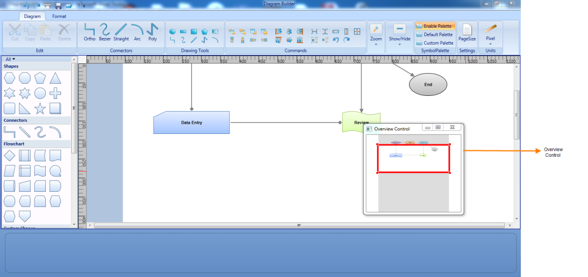

Overview Control in a Diagram
{:.caption}

## BringIntoCenter

The bring-into-center feature provides the option to bring the element or Rect area into center of the viewport.

This is can be used to clearly view the particular element and its neighbor elements in the center of the viewport.

Methods

<table>
<tr>
<th>
Method</th><th>
Description</th><th>
Parameters</th><th>
Type</th><th>
Return Type</th></tr>
<tr>
<td>
BringIntoCenter</td><td>
Used to bring the element into the center of the page. </td><td>
BringIntoCenter(Object pageElement)This method only accepts Node, LineConnector, or Rect type objects.</td><td>
WPF</td><td>
Void</td></tr>
</table>

### Adding BringIntoCenter to an Application 



DiagramView diagramView=new DiagramView();

//Call the Bring IntoCenter method to bring the “node” object into center of the viewport.

diagramView.BringIntoCenter(node);




Dim diagramView As New DiagramView()

'Call the Bring IntoCenter method to bring the “node” object into center of the viewport.

diagramView.BringIntoCenter(node)



The BringIntoCenter method of the DiagramView class is used to bring the object into center of the viewport. This method will accept only parameters of type Node, LineConnector, or Rect.

### Bring Into Viewport

The Bring Into ViewPort feature provides option to bring the element or Rect area into the Viewport.

This feature can be applied to the Nodes and Connectors.

<table>
<tr>
<th>
Method</th><th>
Description</th><th>
Parameters</th><th>
Return Type</th></tr>
<tr>
<td>
BringIntoViewPort</td><td>
brings the element into the Viewport of the page.</td><td>
Bring Into ViewPort(Object pageElement)This method accepts the Node and LineConnector type objects.</td><td>
Void</td></tr>
</table>

### Adding BringIntoViewPort to an Application

The BringIntoViewPort method of the DiagramView class is used to bring the object into the Viewport. This method accepts only the parameters of type Node, LineConnector, or Rect.


DiagramView diagramview = new DiagramView();

//Calls the BringIntoViewPort method to bring the “node” object to viewport of the diagrampage.

diagramview.BringIntoViewPort(node);




Dim diagramview As New DiagramView()

//Calls the BringIntoViewPort method to bring the “node” object to viewport of the diagrampage.

diagramview.BringIntoViewPort(node)



## Item Selection Mode

Essential Diagram for WPF provides support for the Item selection mode for diagram view elements. This determines whether the user can select single or multiple elements at a time.

### Properties

<table>
<tr>
<th>
Property</th><th>
Description</th><th>
Type of property</th><th>
Value it Accepts</th><th>
Any other dependencies/ sub properties associated</th></tr>
<tr>
<td>
ItemSelectionMode</td><td>
Specifies the item selection mode for diagram view elements. The default value is Multiple.</td><td>
Dependency property</td><td>
ItemSelectionMode.SingleItemSelectionMode.Multiple</td><td>
No</td></tr>
</table>

This property is available in DiagramView and can be set in the following ways:

* Through XAML
* Through code behind

The following code illustrates how to set the ItemSelectionMode as Single:


    <!--Diagram Control-->

    <syncfusion:DiagramControl Name="diagramControl">

        <!-- Model to add nodes and connections.-->

        <syncfusion:DiagramControl.Model>

            <syncfusion:DiagramModel x:Name="diagramModel">

            </syncfusion:DiagramModel>

        </syncfusion:DiagramControl.Model>

        <!--View to display nodes and connections added through the model.-->

<syncfusion:DiagramControl.View>

   <syncfusion:DiagramView Name="diagramView" ItemSelectionMode="Single">

   </syncfusion:DiagramView>

</syncfusion:DiagramControl.View>

    </syncfusion:DiagramControl>




DiagramView diagramView = new DiagramView();

diagramview.ItemSelectionMode = ItemSelectionMode.Single;




Dim diagramView As New DiagramView()

diagramview.ItemSelectionMode = ItemSelectionMode.Single;



ItemSelectionMode is Single
{:.caption}

The following code illustrates how to set the ItemSelectionMode as Multiple:


    <!--Diagram Control-->

    <syncfusion:DiagramControl Name="diagramControl">

        <!-- Model to add nodes and connections.-->

        <syncfusion:DiagramControl.Model>

            <syncfusion:DiagramModel x:Name="diagramModel">

            </syncfusion:DiagramModel>

        </syncfusion:DiagramControl.Model>

        <!—View to display nodes and connections added through the model.-->

<syncfusion:DiagramControl.View>

   <syncfusion:DiagramView Name="diagramView" ItemSelectionMode="Multiple">

   </syncfusion:DiagramView>

</syncfusion:DiagramControl.View>

    </syncfusion:DiagramControl>




DiagramView diagramView = new DiagramView();

diagramview.ItemSelectionMode = ItemSelectionMode.Multiple;




Dim diagramView As New DiagramView()

diagramview.ItemSelectionMode = ItemSelectionMode.Multiple;



ItemSelectionMode is Multiple
{:.caption}

