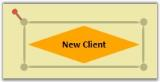
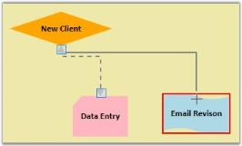
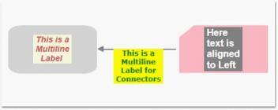
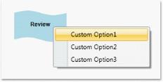

# General in WPF Diagram (classic)

This section illustrates the general features pertaining to both Node and LineConnector.

## Select Nodes and Connectors

The corresponding node or connector is selected by moving the mouse pointer to the desired node or connector and by clicking the left mouse button. This is indicated by an adorner being displayed. It also displays a RotateThumb on the top left corner of the node.

* Items on the drawing area are selected automatically if they fall within the bounds of the drag adorner.
* The drag adorner is displayed when you click anywhere on the page and start dragging the mouse pointer.
* A rectangle formed with a drag start-point as one of its points, and the point where the mouse button is released as its second point, defines the drag adorner's bounds.

Node Selection
{:.caption}

## Move Nodes and Connectors

Click and drag the desired node for moving nodes from one position to another.. Connections can also be moved to other nodes and a new node will start acting as the head node or the tail node depending on where the connector was moved from.

To move the connector, follow these steps.

* Click on the connector to be moved.
* An adorner will be displayed on the head and the tail decorators which indicates the selection of the connector.
* Now click and drag the desired decorator shape and drop it on the node to which you want to connect.

Moving Connector
{:.caption}

As seen, the connector will then be removed from the old node and added to the node that is currently hit.

## Customize the Label of Nodes and Line Connectors

The labels of the nodes and connectors are equipped with Multiline support i.e. you can specify the labels to span multiple lines by setting the LabelTextWrapping property to wrap the text and by specifying the width of the label. Also, several other customization properties have been added for the labels. These are listed below: 

<table>
<tr>
<th>
Property</th><th>
Description</th><th>
Type of the property</th><th>
Value it accepts</th><th>
Any other dependencies/ sub properties associated</th></tr>
<tr>
<td>
LabelTextTrimming</td><td>
Gets or sets the text trimming style. Default value is CharacterEllipsis.</td><td>
Dependency property</td><td>
TextTrimming.CharacterEllipsisTextTrimming.NoneTextTrimming.WordEllipsis</td><td>
No</td></tr>
<tr>
<td>
LabelForeground</td><td>
Gets or sets the foreground of the label. Default value is Black.</td><td>
Dependency property</td><td>
Brush</td><td>
No</td></tr>
<tr>
<td>
LabelBackground</td><td>
Gets or sets the background of the label. Default value is White.</td><td>
Dependency property</td><td>
Brush</td><td>
No</td></tr>
<tr>
<td>
LabelFontStyle</td><td>
Gets or sets the background of the label. Default value is White.</td><td>
Dependency property</td><td>
FontStyles.ObliqueFontStyles.ItalicFontStyles.Normal</td><td>
No</td></tr>
<tr>
<td>
LabelFontFamily</td><td>
Gets or sets the font family of the label. Default value is Arial.</td><td>
Dependency property</td><td>
FontFamily</td><td>
No</td></tr>
<tr>
<td>
LabelTextAlignment</td><td>
Gets or sets the text alignment of the label. Default value is Center.</td><td>
Dependency property</td><td>
TextAlignment.RightTextAlignment.LeftTextAlignment.CenterTextAlignment.Justify</td><td>
No</td></tr>
<tr>
<td>
LabelFontSize</td><td>
Gets or sets the font size of the label. Default value is 11.</td><td>
Dependency property</td><td>
Double</td><td>
No</td></tr>
<tr>
<td>
LabelFontWeight</td><td>
Gets or sets the font weight of the label. Default value is SemiBold.</td><td>
Dependency property</td><td>
FontWeights</td><td>
No</td></tr>
<tr>
<td>
LabelTextWrapping</td><td>
Gets or sets the text wrapping of the label. Default value is NoWrap.</td><td>
Dependency property</td><td>
TextWrapping.NoWrapTextWrapping.WrapTextWrapping.WrapWithOverflow</td><td>
No</td></tr>
<tr>
<td>
LabelWidth</td><td>
Gets or sets the width of the label. Default value is node’s width.</td><td>
Dependency property</td><td>
Double</td><td>
No</td></tr>
</table>

The following code example illustrates the implementation of the properties mentioned in the table above.


Node node1 = new Node(Guid.NewGuid(), "Register");

            node1.Shape = Shapes.RoundedSquare;

            node1.Width = 150;

            node1.Height = 50;

            node1.OffsetX = 250;

            node1.OffsetY = 100;

            node1.Label = "This is a Multiline Label ";

            node1.LabelWidth = 70;

            node1.LabelTextWrapping = TextWrapping.Wrap;

            node1.LabelForeground = Brushes.IndianRed;

            node1.LabelFontSize = 14;

            node1.LabelFontStyle = FontStyles.Italic;

            node1.LabelBackground = Brushes.Beige;

Node node2 = new Node(Guid.NewGuid(), "ClientAccountInfo");

            node2.Shape = Shapes.FlowChart_Card;

            node2.Width = 150;

            node2.Height = 50;

            node2.OffsetX = 450;

            node2.OffsetY = 100;

            node2.LabelWidth = 75;

            node2.LabelTextWrapping = TextWrapping.Wrap;

            node2.LabelForeground = Brushes.White;

            node2.LabelFontSize = 16;

            node2.LabelBackground = Brushes.Gray;

            node2.LabelTextAlignment = TextAlignment.Left;

            node2.Label = "Here text is aligned to Left";

LineConnector line = new LineConnector();

            line.ConnectorType = ConnectorType.Straight;

            line.TailNode = node1;

            line.HeadNode = node2;

            line.HeadDecoratorShape = DecoratorShape.None;

            line.Label = "This is a Multiline Label for Connectors";

            line.LabelWidth = 84;

            line.LabelTextWrapping = TextWrapping.Wrap;

            line.LabelForeground = Brushes.Green;

            line.LabelFontSize = 12;

            line.LabelFontStyle = FontStyles.Normal;

            line.LabelBackground = Brushes.Yellow;




Dim node1 As New Node(Guid.NewGuid(), "Register")

node1.Shape = Shapes.RoundedSquare

node1.Width = 150

node1.Height = 50

node1.OffsetX = 250

node1.OffsetY = 100

node1.Label = "This is a Multiline Label "

node1.LabelWidth = 70

node1.LabelTextWrapping = TextWrapping.Wrap

node1.LabelForeground = Brushes.IndianRed

node1.LabelFontSize = 14

node1.LabelFontStyle = FontStyles.Italic

node1.LabelBackground = Brushes.Beige

Dim node2 As New Node(Guid.NewGuid(), "ClientAccountInfo")

node2.Shape = Shapes.FlowChart_Card

node2.Width = 150

node2.Height = 50

node2.OffsetX = 450

node2.OffsetY = 100

node2.LabelWidth = 75

node2.LabelTextWrapping = TextWrapping.Wrap

node2.LabelForeground = Brushes.White

node2.LabelFontSize = 16

node2.LabelBackground = Brushes.Gray

node2.LabelTextAlignment = TextAlignment.Left

node2.Label = "Here text is aligned to Left"

Dim line As New LineConnector()

line.ConnectorType = ConnectorType.Straight

line.TailNode = node1

line.HeadNode = node2

line.HeadDecoratorShape = DecoratorShape.None

line.Label = "This is a Multiline Label for Connectors"

line.LabelWidth = 84

line.LabelTextWrapping = TextWrapping.Wrap

line.LabelForeground = Brushes.Green

line.LabelFontSize = 12

line.LabelFontStyle = FontStyles.Normal

line.LabelBackground = Brushes.Yellow


The following output is generated using the code snippets above:

Customized Multiline Label
{:.caption}

### Customize the Context Menu of Nodes and Line Connectors

Essential Diagram for WPF provides support for the display of context menus for nodes and connectors on right-clicking the node or connector. The context menu contains the default commands, Z-order BringToFront, SendToBack, MoveForward, SendBackward, Grouping (Group and Ungroup), and Delete. The context menu can be customized so that you can add some custom options to the context menu. This can be done using the ContextMenu property of the nodes and the line connectors.

The following code example illustrates addition of custom options to the context menu.


Node node1 = new Node(Guid.NewGuid(), "Register");

            node1.Shape = Shapes.RoundedSquare;

            node1.Width = 150;

            node1.Height = 50;

            node1.OffsetX = 250;

            node1.OffsetY = 100;

ContextMenu menu = new ContextMenu();

            MenuItem item1 = new MenuItem();

            item1.Header = "Custom Option1";

            MenuItem item2 = new MenuItem();

            item2.Header = "Custom Option2";

            MenuItem item3 = new MenuItem();

            item3.Header = "Custom Option3";

            menu.Items.Add(item1);

            menu.Items.Add(item2);

            menu.Items.Add(item3);

            node1.ContextMenu = menu;




Dim node1 As New Node(Guid.NewGuid(), "Register")

node1.Shape = Shapes.RoundedSquare

node1.Width = 150

node1.Height = 50

node1.OffsetX = 250

node1.OffsetY = 100

Dim menu As New ContextMenu()

Dim item1 As New MenuItem()

item1.Header = "Custom Option1"

Dim item2 As New MenuItem()

item2.Header = "Custom Option2"

Dim item3 As New MenuItem()

item3.Header = "Custom Option3"

menu.Items.Add(item1)

menu.Items.Add(item2)

menu.Items.Add(item3)

node1.ContextMenu = menu


Similarly we can set it for the connectors as follows:


LineConnector line = new LineConnector();

line.ContextMenu = menu;




Dim line As New LineConnector()

line.ContextMenu = menu



Custom Context Menu
{:.c}

The context menu can also be specified for all the nodes on the page using the NodeContextMenu property. Similarly to specify custom context menu for all the lines on the page, the LineConnectorContextMenu property of DiagramView can be used as follows:


ContextMenu menu1 = new ContextMenu();

            MenuItem item11 = new MenuItem();

            item11.Header = "Custom Option11";

            MenuItem item21 = new MenuItem();

            item21.Header = "Custom Option21";

            MenuItem item31 = new MenuItem();

            item31.Header = "Custom Option31";

            menu1.Items.Add(item11);

            menu1.Items.Add(item21);

            menu1.Items.Add(item31);

            diagramView.NodeContextMenu = menu1;

diagramView.LineConnectorContextMenu = menu1;




Dim menu1 As New ContextMenu()

Dim item11 As New MenuItem()

item11.Header = "Custom Option11"

Dim item21 As New MenuItem()

item21.Header = "Custom Option21"

Dim item31 As New MenuItem()

item31.Header = "Custom Option31"

menu1.Items.Add(item11)

menu1.Items.Add(item21)

menu1.Items.Add(item31)

diagramView.NodeContextMenu = menu1

diagramView.LineConnectorContextMenu = menu1



N> If any node’s context menu is assigned using the ContextMenu property of that node, then it will take precedence over the DiagramView’s NodeContextMenu property. The same applies to Line Connectors.

