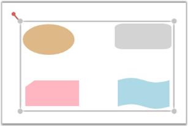
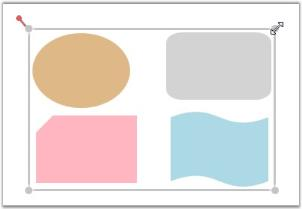
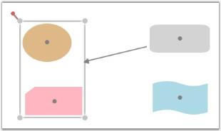

# Groups in WPF Diagram (classic)

Essential Diagram WPF provides support to group and ungroup nodes. Grouping feature comes in handy when you want to apply the same edits to a number of objects and yet retain their individuality. All the operations performed on the group also affect the individual items in the group. However any item in the group can also be edited individually. On ungrouping, the items in the group again act as individual entities.

A Group is essentially just another node added which acts as a container for other objects. Therefore a group node is referred to as the parent node, and the grouped objects are referred to as the children of the group.

The Group class is inherited from the Node class. Therefore all the node properties apply to a group too.

The following table lists the methods that are used for grouping.

<table>
<tr>
<th>
Name</th><th>
Parameter</th><th>
Return Type</th><th>
Description</th><th>
Reference Type</th></tr>
<tr>
<td>
Group.AddChild(INodeGroup)</td><td>
INodeGroup</td><td>
void</td><td>
Adds the specified INodeGroup object to the group. INodeGroup provides an interface to the nodes and the connectors.</td><td>
N/A</td></tr>
<tr>
<td>
Group.RemoveChild(INodeGroup)</td><td>
INodeGroup</td><td>
void</td><td>
Removes the specified INodeGroup object from the group. INodeGroup provides an interface to the nodes and the connectors.</td><td>
N/A</td></tr>
<tr>
<td>
AllowSingleChild</td><td>
Gets or sets a value indicating whether grouping can be allowed for a single child.</td><td>
CLR property</td><td>
Boolean (true/false)</td><td>
No</td></tr>
<tr>
<td>
AlwaysSelected</td><td>
Gets or sets a value indicating whether a group can be always selected.</td><td>
CLR property</td><td>
Boolean (true/false)</td><td>
</td></tr>
<tr>
<td>
NodeChildren</td><td>
Gets the group children.</td><td>
CLR property</td><td>
CollectionExt</td><td>
</td></tr>
<tr>
<td>
ItemTemplate</td><td>
Gets or sets the item template used to display the group items.</td><td>
CLR property</td><td>
HierarchicalDataTemplate</td><td>
</td></tr>
<tr>
<td>
GroupChildrenRef</td><td>
Gets or sets the group children reference number. Used for serialization purposes.</td><td>
CLR property</td><td>
CollectionExt</td><td>
</td></tr>
<tr>
<td>
GroupNodes</td><td>
Gets or sets the areas.</td><td>
CLR property</td><td>
IEnumerable</td><td>
</td></tr>
</table>

## Create Group

The following are the three ways to create a group in Essential Diagram WPF. 

* By using Code Behind
* By using the Group Command
* By using the Context Menu

### Grouping By Using Code Behind

The Group class enables to group nodes in Essential Diagram WPF. The AddChild method is used to add the elements to the group.

The following code example illustrates how to create a group by using code behind.



public DiagramControl Control;

public DiagramModel Model;

public DiagramView View;

public Window1 ()

{

    Control = new DiagramControl ();

    Model = new DiagramModel ();

    View = new DiagramView ();

    Control.View = View;

    Control.Model = Model;

    View.Bounds = new Thickness(0, 0, 1000, 1000);

    Node n = new Node(Guid.NewGuid(), "Start");

    n.Shape = Shapes.FlowChart_Card;

    n.Level = 1;

    n.OffsetX = 150;

    n.OffsetY = 25;

    n.Width = 150;

    n.Height = 75;

    Node n1 = new Node(Guid.NewGuid(), "End");

    n1.Shape = Shapes.RoundedRectangle;

    n1.Level = 1;

    n1.OffsetX = 350;

    n1.OffsetY = 325;

    n1.Width = 100;

    n1.Height = 75;

    Model.Nodes.Add(n);

    Model.Nodes.Add(n1);

    Group g = new Group(Guid.NewGuid(), "group1");

    g.AddChild(n);

    g.AddChild(n1);

    Model.Nodes.Add(g);

}




Public Control As DiagramControl

Public Model As DiagramModel

Public View As DiagramView

'INSTANT VB WARNING: The following constructor is declared outside of its associated class:

        'ORIGINAL LINE: public Window1 ()

        Public Sub New()

            Control = New DiagramControl()

            Model = New DiagramModel()

            View = New DiagramView()

            Control.View = View

            Control.Model = Model

            View.Bounds = New Thickness(0, 0, 1000, 1000)

            Dim n As New Node(Guid.NewGuid(), "Start")

            n.Shape = Shapes.FlowChart_Card

            n.Level = 1

            n.OffsetX = 150

            n.OffsetY = 25

            n.Width = 150

            n.Height = 75

            Dim n1 As New Node(Guid.NewGuid(), "End")

            n1.Shape = Shapes.RoundedRectangle

            n1.Level = 1

            n1.OffsetX = 350

            n1.OffsetY = 325

            n1.Width = 100

            n1.Height = 75

            Model.Nodes.Add(n)

            Model.Nodes.Add(n1)

            Dim g As New Group(Guid.NewGuid(), "group1")

            g.AddChild(n)

            g.AddChild(n1)

            Model.Nodes.Add(g)

        End Sub



The following screenshot illustrates a group of two nodes created by using code behind.

Group of Two Nodes
{:.caption}

### Grouping By Using the Group Command

The Group command is used to group two or more objects.

The following code example illustrates how to group objects by using the Group command.



DiagramCommandManager.Group.Execute(diagramView.Page, diagramView);




DiagramCommandManager.Group.Execute(diagramView.Page, diagramView)



The following steps illustrate how to create a group by using the Group command.

1. Select the objects to be grouped.

   

   Selection of Objects to be Grouped
   {:.caption}

   

   Selected Objects
   {:.caption}

2. Invoke the Group command. This creates a group.

   The new group is indicated by the selection rectangle which is displayed surrounding the objects in the group.

   

   Grouped Objects inside the Selection Rectangle
   {:.caption}

   Grouping By Using the Context Menu

   You can also invoke the Group command by using the context menu which is displayed on right-clicking a particular Node or Line Connector.

   

   Grouping By Using the Context Menu
   {:.caption}

   N> The Group command is enabled only when two or more objects are selected.

   

   Multi-Select Nodes Refer Concepts and Features -> Nodes -> Node Resize -> Resize Single Node on Multiple Selection
  
   
## Select Group

You can select a group by clicking on any one of its children. Consecutive clicks on a child object select the parent groups in the order of their creation. In a similar way, consecutive clicks on a child object leads to the selection of inner groups, and eventually the object itself, and the cycle continues. An object can belong to multiple groups, and groups may in turn have multiple subgroups.

The following steps illustrate how to select an object which has two groups.

1. Click on the brown color node to select the outer group.

   

   Outer Group Selected
   {:.caption}

2. Click again to select the inner group of which it is a part of.

   

   Inner Group Selected
   {:.caption}

3. Finally, click again to select the child itself after all its groups have been traversed.

   

   Selecting the Child Node Again
   {:.caption}
   

## Edit Group

To edit a group, you have to make sure that the corresponding group is selected. The following features apply to the edits performed on an object.

* If the edit operation is performed on an object which is a group, then all its children are also affected. For example, resizing a group, automatically resizes its child objects to fit the selection area.

 Resizing a Group 
 {:.caption}

* If an individual object is selected, then the edit operation will be performed on that particular object only. 

Resizing a Child Object
{:.caption}

Once a group is edited, the group's selection rectangle updates its area to fit the child objects.

Updated Selection Rectangle
{:.caption}



* Node Resize Refer Concepts and Features -> Nodes -> Node Resize
* Node Rotate Refer Concepts and Features -> Nodes -> Node Rotate



## Connecting Groups

Grouping enables to connect to groups as well as to individual objects in a group. This section illustrates how to create connections to a group and its child objects.

### Creating Connections to a Group

The following steps illustrate how to create connections to a group.

1. Press the left mouse button while the mouse pointer is over any of the child objects of the group.
2. While the left mouse button is pressed, drag one end of the line connector to any of the group's children.

   This will display a red adorner along the group's boundary, indicating that the connection is to be made to that particular group.

   

   Creating Connection to a Group
   {:.caption}

3. Release the mouse button at that point to connect to the group's boundary.

   

   Connection Created to the Group
   {:.caption}
   
### Creating Connections to a Objects in a Group

The following steps illustrate how to create connections to individual objects in a group.

1. Press the left mouse button while the mouse pointer is over the node to which the connection is to be made.
2. While the left mouse button is pressed, drag the line connector to the center port of that particular node.

   When the mouse pointer is over the center port, a red adorner will be displayed along the node's boundary, indicating that the connection is to be made to that particular node.

   

   Creating Connection to a Child Object
   {:.caption}
 
3. Release the mouse button at that point to connect to the node's boundary.

   

   Connection Created to the Child Object
   {:.caption}

   N> Connections cannot be created between a group and its own children. However child objects belonging to the same group can be connected to each other.

   

   Create Line Connectors Refer Concepts and Features -> Line Connector -> Create Line Connector
  

## Ungroup

Ungrouping a group deletes the group and removes all the child elements from the group. Once a group is ungrouped, the child elements behave as individual entities.

The following are the three ways to ungroup a group in Essential Diagram WPF. 

* By using Code Behind
* By using the Ungroup Command
* By using the Context Menu

By Using Code Behind

The RemoveChild method is used to remove elements from a group.

For example, the following code illustrates how to remove node n from a group by using code behind.



public DiagramControl Control;

public DiagramModel Model;

public DiagramView View;

public Window1 ()

{

    Control = new DiagramControl();

    Model = new DiagramModel();

    View = new DiagramView();

    Control.View = View;

    Control.Model = Model;

    View.Bounds = new Thickness(0, 0, 1000, 1000);

    Node n = new Node(Guid.NewGuid(), "Start");

    n.Shape = Shapes.FlowChart_Start;

    n.Level = 1;

    n.OffsetX = 150;

    n.OffsetY = 25;

    n.Width = 150;

    n.Height = 75;

    Node n1 = new Node(Guid.NewGuid(), "End");

    n1.Shape = Shapes.FlowChart_Start;

    n1.Level = 1;

    n1.OffsetX = 350;

    n1.OffsetY = 325;

    n1.Width = 100;

    n1.Height = 75;

    Model.Nodes.Add(n);

    Model.Nodes.Add(n1);

    Group g = new Group(Guid.NewGuid(), "group1");

    g.AddChild(n);

    g.AddChild(n1);

    Model.Nodes.Add(g);

    g.RemoveChild(n);}




Public Control As DiagramControl

Public Model As DiagramModel

Public View As DiagramView

'INSTANT VB WARNING: The following constructor is declared outside of its associated class:

        'ORIGINAL LINE: public Window1 ()

        Public Sub New()

            Control = New DiagramControl()

            Model = New DiagramModel()

            View = New DiagramView()

            Control.View = View

            Control.Model = Model

            View.Bounds = New Thickness(0, 0, 1000, 1000)

            Dim n As New Node(Guid.NewGuid(), "Start")

            n.Shape = Shapes.FlowChart_Start

            n.Level = 1

            n.OffsetX = 150

            n.OffsetY = 25

            n.Width = 150

            n.Height = 75

            Dim n1 As New Node(Guid.NewGuid(), "End")

            n1.Shape = Shapes.FlowChart_Start

            n1.Level = 1

            n1.OffsetX = 350

            n1.OffsetY = 325

            n1.Width = 100

            n1.Height = 75

            Model.Nodes.Add(n)

            Model.Nodes.Add(n1)

            Dim g As New Group(Guid.NewGuid(), "group1")

            g.AddChild(n)

            g.AddChild(n1)

            Model.Nodes.Add(g)

            g.RemoveChild(n)

        End Sub



The following screenshot illustrates a group of two nodes created by using code behind.

By Using the Ungroup Command

The Ungroup command is used to ungroup two or more objects.

The following code example illustrates how to ungroup objects by using the Ungroup command.



DiagramCommandManager.Ungroup.Execute(diagramView.Page, diagramView);




DiagramCommandManager.Ungroup.Execute(diagramView.Page, diagramView)



The following steps illustrate how to ungroup a group by using the Ungroup command.

1. Select the group to be ungrouped.

   

   Selecting a Group
   {:.caption}

2. Invoke the Ungroup command. This ungroup the nodes.

   As soon as the group is ungrouped, the selection rectangle disappears indicating that the group has been ungrouped.

   

   Objects Ungrouped
   {:.caption}

   By Using the Context Menu

   You can also invoke the Ungroup command by using the context menu which is displayed on right-clicking a particular Node or Line Connector.

   

   Ungrouping By Using the Context Menu
   {:.caption}

   N> The Ungroup command is enabled only when two or more objects are selected.

   
   
## Layers

Essential Diagram for WPF supports layer display. Numerous nodes and line connectors can be added to a layer and the visible property of its contents can be hidden by changing the visible property of the layer. A node or line connector can be added to any number of layers and the node is visible only if all layers to which this node or line connector belongs to are visible.

This feature will be useful when there are many nodes or connector in the page. If it is required to see only a particular part or particular set of nodes or connector create separate layers and categorize nodes and connectors in different layers. Then set the IsVisible of each layers accordingly.

The following topics are explained subsequently,

* Creating a Layer 
* Adding the Layer to a Model
* Active Layer
* Hiding a Layer

<table>
<tr>
<th>
Name</th><th>
Parameters </th><th>
Return Type</th><th>
Description</th><th>
Reference Links</th></tr>
<tr>
<td>
Nodes.Add(Node)</td><td>
Node</td><td>
void</td><td>
To add a node into the layer.</td><td>
N/A</td></tr>
<tr>
<td>
Lines.Add(Node)</td><td>
LineConnector</td><td>
Void</td><td>
To add a line connector into the layer.</td><td>
N/A</td></tr>
</table>

### Creating a Layer 

The following code example illustrates the creation of a layer with two Nodes and one LineConnector added.



Node n1 = new Node();

n1.Shape = Shapes.FlowChart_Card;

diagramModel.Nodes.Add(n1);

n1.OffsetX = 50;

n1.OffsetY = 50;

Node n2 = new Node();

n2.Shape = Shapes.FlowChart_Delay;

diagramModel.Nodes.Add(n2);

n2.OffsetX = 150;

n2.OffsetY = 250;

LineConnector l1 = new LineConnector();

l1.HeadNode = n1;

l1.TailNode = n2;

diagramModel.Connections.Add(l1);

Layer Lan1;

Lan1 = new Layer();

Lan1.Name = "Lan1";

Lan1.Nodes.Add(n1);

Lan1.Nodes.Add(n2);

Lan1.Lines.Add(l1);

Lan1.Background = Brushes.Transparent;




Dim n1 As New Node()

n1.Shape = Shapes.FlowChart_Card

diagramModel.Nodes.Add(n1)

n1.OffsetX = 50

n1.OffsetY = 50

Dim n2 As New Node()

n2.Shape = Shapes.FlowChart_Delay

diagramModel.Nodes.Add(n2)

n2.OffsetX = 150

n2.OffsetY = 250

Dim l1 As New LineConnector()

l1.HeadNode = n1

l1.TailNode = n2

diagramModel.Connections.Add(l1)

Dim Lan1 As Layer

Lan1 = New Layer()

Lan1.Name = "Lan1"

Lan1.Nodes.Add(n1)

Lan1.Nodes.Add(n2)

Lan1.Lines.Add(l1)

Lan1.Background = Brushes.Transparent

### Adding the Layer to a Model

The following code example illustrates the addition of a layer to a model.




Node n1 = new Node();

n1.Shape = Shapes.FlowChart_Card;

diagramModel.Nodes.Add(n1);

n1.OffsetX = 50;

n1.OffsetY = 50;

Node n2 = new Node();

n2.Shape = Shapes.FlowChart_Delay;

diagramModel.Nodes.Add(n2);

n2.OffsetX = 150;

n2.OffsetY = 250;

LineConnector l1 = new LineConnector();

l1.HeadNode = n1;

l1.TailNode = n2;

diagramModel.Connections.Add(l1);

Layer Lan1;

Lan1 = new Layer();

Lan1.Name = "Lan1";

Lan1.Nodes.Add(n1);

Lan1.Nodes.Add(n2);

Lan1.Lines.Add(l1);

Lan1.Background = Brushes.Transparent;

diagramModel.Layers.Add(Lan1)




Dim n1 As New Node()

n1.Shape = Shapes.FlowChart_Card

diagramModel.Nodes.Add(n1)

n1.OffsetX = 50

n1.OffsetY = 50

Dim n2 As New Node()

n2.Shape = Shapes.FlowChart_Delay

diagramModel.Nodes.Add(n2)

n2.OffsetX = 150

n2.OffsetY = 250

Dim l1 As New LineConnector()

l1.HeadNode = n1

l1.TailNode = n2

diagramModel.Connections.Add(l1)

Dim Lan1 As Layer

Lan1 = New Layer()

Lan1.Name = "Lan1"

Lan1.Nodes.Add(n1)

Lan1.Nodes.Add(n2)

Lan1.Lines.Add(l1)

Lan1.Background = Brushes.Transparent

diagramModel.Layers.Add(Lan1)



## Hidden or Active Layer

#### Active Layer

When a new Node or LineConnector is dropped from SymbolPalette into the DiagramPage, it will be added into all the active layers automatically. A layer can be activated or deactivated as shown in following code snippet.



Node n1 = new Node();

n1.Shape = Shapes.FlowChart_Card;

diagramModel.Nodes.Add(n1);

n1.OffsetX = 50;

n1.OffsetY = 50;

Node n2 = new Node();

n2.Shape = Shapes.FlowChart_Delay;

diagramModel.Nodes.Add(n2);

n2.OffsetX = 150;

n2.OffsetY = 250;

LineConnector l1 = new LineConnector();

l1.HeadNode = n1;

l1.TailNode = n2;

diagramModel.Connections.Add(l1);

Layer Lan1;

Lan1 = new Layer();

Lan1.Name = "Lan1"; 

Lan1.Nodes.Add(n1);

Lan1.Nodes.Add(n2);

Lan1.Lines.Add(l1);

Lan1.Background = Brushes.Transparent;

diagramModel.Layers.Add(Lan1); 

Lan1.Active = false;




Dim n1 As New Node()

n1.Shape = Shapes.FlowChart_Card

diagramModel.Nodes.Add(n1)

n1.OffsetX = 50

n1.OffsetY = 50

Dim n2 As New Node()

n2.Shape = Shapes.FlowChart_Delay

diagramModel.Nodes.Add(n2)

n2.OffsetX = 150

n2.OffsetY = 250

Dim l1 As New LineConnector()

l1.HeadNode = n1

l1.TailNode = n2

diagramModel.Connections.Add(l1)

Dim Lan1 As Layer

Lan1 = New Layer()

Lan1.Name = "Lan1"

Lan1.Nodes.Add(n1)

Lan1.Nodes.Add(n2)

Lan1.Lines.Add(l1)

Lan1.Background = Brushes.Transparent

diagramModel.Layers.Add(Lan1)

Lan1.Active = False



### Hiding a Layer

The following code example illustrates hiding a layer. When a layer is hidden all the nodes and connectors belonging to this layer will be hidden.



Node n1 = new Node();

n1.Shape = Shapes.FlowChart_Card;

diagramModel.Nodes.Add(n1);

n1.OffsetX = 50;

n1.OffsetY = 50;

Node n2 = new Node();

n2.Shape = Shapes.FlowChart_Delay;

diagramModel.Nodes.Add(n2);

n2.OffsetX = 150;

n2.OffsetY = 250;

LineConnector l1 = new LineConnector();

l1.HeadNode = n1;

l1.TailNode = n2;

diagramModel.Connections.Add(l1);

Layer Lan1;

Lan1 = new Layer();

Lan1.Name = "Lan1"; 

Lan1.Nodes.Add(n1);

Lan1.Nodes.Add(n2);

Lan1.Lines.Add(l1);

Lan1.Background = Brushes.Transparent;

diagramModel.Layers.Add(Lan1); 

Lan1.Visible = false;




Dim n1 As New Node()

n1.Shape = Shapes.FlowChart_Card

diagramModel.Nodes.Add(n1)

n1.OffsetX = 50

n1.OffsetY = 50

Dim n2 As New Node()

n2.Shape = Shapes.FlowChart_Delay

diagramModel.Nodes.Add(n2)

n2.OffsetX = 150

n2.OffsetY = 250

Dim l1 As New LineConnector()

l1.HeadNode = n1

l1.TailNode = n2

diagramModel.Connections.Add(l1)

Dim Lan1 As Layer

Lan1 = New Layer()

Lan1.Name = "Lan1"

Lan1.Nodes.Add(n1)

Lan1.Nodes.Add(n2)

Lan1.Lines.Add(l1)

Lan1.Background = Brushes.Transparent

diagramModel.Layers.Add(Lan1)

Lan1.Visible = False



Before hiding the layer
{:.caption}

After hiding the layer
{:.caption}

