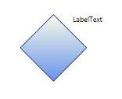
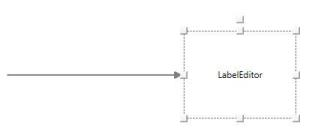

#  Advanced support in WPF Diagram (Classic)

This section answers the following questions that are in an advanced level, meant for experts.

## Animate the Nodes in the Diagram

You can perform many kinds of animations on nodes by using the double animation. Rotation and Translation are some of the basic operations performed on the nodes. You can use double animation to perform these operations on the node in a specific pattern.

To rotate a node, the following code can be used.


DoubleAnimation nodeanimation = new DoubleAnimation();

nodeanimation.From = 0;

nodeanimation.To = 360;

nodeanimation.Duration = new Duration(new TimeSpan(0, 0, 0, 0, 500));

nodeanimation.RepeatBehavior = new RepeatBehavior(15);

RotateTransform rt = new RotateTransform();

nodeObj.RenderTransform = rt;

nodeObj.RenderTransformOrigin = new Point(.5, .5);

rt.BeginAnimation(RotateTransform.AngleProperty, nodeanimation);




Dim nodeanimation As New DoubleAnimation()

nodeanimation.From = 0

nodeanimation.To = 360

nodeanimation.Duration = New Duration(New TimeSpan(0, 0, 0, 0, 500))

nodeanimation.RepeatBehavior = New RepeatBehavior(15)

Dim rt As New RotateTransform()

nodeObj.RenderTransform = rt

nodeObj.RenderTransformOrigin = New Point(.5,.5)

rt.BeginAnimation(RotateTransform.AngleProperty, nodeanimation)


To translate a node with respect to the x-axis, the TranslateTransform can be applied.



DoubleAnimation nodeanimation = new DoubleAnimation();

nodeanimation.From = 500;

nodeanimation.To = 0;

nodeanimation.Duration = new Duration(new TimeSpan(0, 0, 0, 0, 500));

nodeanimation.RepeatBehavior = new RepeatBehavior(1);




Dim nodeanimation As New DoubleAnimation()

nodeanimation.From = 500

nodeanimation.To = 0

nodeanimation.Duration = New Duration(New TimeSpan(0, 0, 0, 0, 500))

nodeanimation.RepeatBehavior = New RepeatBehavior(1)


Once you have created the double animation, you can then apply it to the node which we want to translate in the following way.



DoubleAnimation nodeanimation = new DoubleAnimation();

nodeanimation.From = 500;

nodeanimation.To = 0;

nodeanimation.Duration = new Duration(new TimeSpan(0, 0, 0, 0, 500));

nodeanimation.RepeatBehavior = new RepeatBehavior(1);

TranslateTransform rt = new TranslateTransform();

nodeObj.RenderTransform = rt;

rt.BeginAnimation(TranslateTransform.XProperty, nodeanimation);




Dim nodeanimation As New DoubleAnimation()

nodeanimation.From = 500

nodeanimation.To = 0

nodeanimation.Duration = New Duration(New TimeSpan(0, 0, 0, 0, 500))

nodeanimation.RepeatBehavior = New RepeatBehavior(1)

Dim rt As New TranslateTransform()

nodeObj.RenderTransform = rt

rt.BeginAnimation(TranslateTransform.XProperty, nodeanimation)


## Print DiagramPage in Uniform Print Mode Using Framework Print Dialog

DiagramPage can also be printed using Framework PrintDialog instead of using Syncfusion DiagramControlPrintPreview Dialog, as shown in the following code example.



     //Create Framwork Print Dialog.

            PrintDialog PrintDialog = new PrintDialog();

            //Open Print Dialog.

            Nullable<Boolean> printClicked = PrintDialog.ShowDialog();

            //If Print is clicked.

            if (printClicked == true)

            {

                //Print the Diagram Page.

                //Get Printer Capabilities.

                PrintCapabilities printCapabilities = PrintDialog.PrintQueue.GetPrintCapabilities(PrintDialog.PrintTicket);

                Size pageAreaSize = new Size(printCapabilities.PageImageableArea.ExtentWidth, printCapabilities.PageImageableArea.ExtentHeight);

                //Visual Brush for the DiagramPage to be printed.

                VisualBrush VisualBrush = new VisualBrush(diagramView.Page);

                VisualBrush.Stretch = Stretch.Uniform;

                VisualBrush.ViewboxUnits = BrushMappingMode.Absolute;

                VisualBrush.Viewbox = new Rect(0, 0, diagramView.Page.ActualWidth, diagramView.Page.ActualHeight);

                //Rectangle to contain the VisualBrush. 

                Rectangle rect = new Rectangle();

                rect.Fill = VisualBrush;

                rect.Arrange(new Rect(new Point(0, 0), pageAreaSize));

                SetViewport(VisualBrush, new Size(diagramView.Page.ActualWidth, diagramView.Page.ActualHeight));

                //Print the Page.

                XpsDocumentWriter writer = PrintQueue.CreateXpsDocumentWriter(PrintDialog.PrintQueue);

                writer.Write(rect, PrintDialog.PrintTicket);

            }

        //Paint the brush to fit uniformly.

        private void SetViewport(VisualBrush brush, Size size)

        {

            double coefficientHeight = size.Height / brush.Viewbox.Height;

            double coefficientWidth = size.Width / brush.Viewbox.Width;

            if (coefficientHeight < coefficientWidth)

            {

                double width = coefficientHeight * brush.Viewbox.Width / size.Width;

                double x = (1 - width) / 2;

                brush.Viewport = new Rect(new Point(x, 0), new Size(width, 1));

            }

            else if (coefficientHeight > coefficientWidth)

            {

                double height = coefficientWidth * brush.Viewbox.Height / size.Height;

                double y = (1 - height) / 2;

                brush.Viewport = new Rect(new Point(0, y), new Size(1, height));

            }

        }




     'Create Framwork Print Dialog.

        Dim PrintDialog As New PrintDialog()

        'Open Print Dialog.

        Dim printClicked As Nullable(Of Boolean) = PrintDialog.ShowDialog()

        'If Print is clicked.

If printClicked.GetValueOrDefault() = True Then

        'Print the Diagram Page.

        'Get Printer Capabilities.

        Dim printCapabilities As PrintCapabilities = PrintDialog.PrintQueue.GetPrintCapabilities(PrintDialog.PrintTicket)

        Dim pageAreaSize As New Size(PrintCapabilities.PageImageableArea.ExtentWidth, PrintCapabilities.PageImageableArea.ExtentHeight)

        'Visual Brush for the DiagramPage to be printed.

        Dim VisualBrush As New VisualBrush(DiagramView.Page)

VisualBrush.Stretch = Stretch.Uniform

VisualBrush.ViewboxUnits = BrushMappingMode.Absolute

VisualBrush.Viewbox = New Rect(0, 0, diagramView.Page.ActualWidth, diagramView.Page.ActualHeight)

        'Rectangle to contain the VisualBrush. 

        Dim rect As New Rectangle()

rect.Fill = VisualBrush

rect.Arrange(New Rect(New Point(0, 0), pageAreaSize))

SetViewport(VisualBrush, New Size(diagramView.Page.ActualWidth, diagramView.Page.ActualHeight))

        'Print the Page.

        Dim writer As XpsDocumentWriter = PrintQueue.CreateXpsDocumentWriter(PrintDialog.PrintQueue)

writer.Write(rect, PrintDialog.PrintTicket)

End If

        'Paint the brush to fit uniformly.

private void SetViewport(VisualBrush brush, Size size)

        Dim coefficientHeight As Double = Size.Height / Brush.Viewbox.Height

        Dim coefficientWidth As Double = Size.Width / Brush.Viewbox.Width

If coefficientHeight < coefficientWidth Then

        Dim width As Double = coefficientHeight * Brush.Viewbox.Width / Size.Width

        Dim x As Double = (1 - Width) / 2

brush.Viewport = New Rect(New Point(x, 0), New Size(width, 1))

ElseIf coefficientHeight > coefficientWidth Then

        Dim height As Double = coefficientWidth * Brush.Viewbox.Height / Size.Height

        Dim y As Double = (1 - Height) / 2

brush.Viewport = New Rect(New Point(0, y), New Size(1, height))

End If


## Save the Current Zoom Settings and Load the Settings Back

Zoom settings can be saved into variables and this saved settings can be applied back again using the following code example.


            //Save current zoom setting.

            double SavedZoomFactor = diagramView.ZoomFactor;

            double SavedCurrentZoom = (double) diagramView.GetValue(DiagramView.CurrentZoomProperty);

            //Load the saved zoom settings.

            //Reset the current zoom

            ZoomCommands.Reset.Execute(diagramView.Page, diagramView);

            //Set the zoom factor temporarily to the stored CurrentZoomProperty 

            diagramView.ZoomFactor = SavedCurrentZoom - 1;

            //Now if a zoom operation is performed, we will get the stored zoom setting.

            ZoomCommands.ZoomIn.Execute(diagramView.Page, diagramView);

            //Change the Zoom factor to the required value.

            diagramView.ZoomFactor = SavedZoomFactorr;




'Save current zoom setting.

        Dim SavedZoomFactor As Double = DiagramView.ZoomFactor

        Dim SavedCurrentZoom As Double = CDbl(DiagramView.GetValue(DiagramView.CurrentZoomProperty))

        'Load the saved zoom settings.

        'Reset the current zoom

ZoomCommands.Reset.Execute(diagramView.Page, diagramView)

        'Set the zoom factor temporarily to the stored CurrentZoomProperty 

diagramView.ZoomFactor = SavedCurrentZoom - 1

        'Now if a zoom operation is performed, we will get the stored zoom setting.

ZoomCommands.ZoomIn.Execute(diagramView.Page, diagramView)

        'Change the Zoom factor to the required value.

diagramView.ZoomFactor = SavedZoomFactorr


## Label Alignment

You are provided with a lot more alignment options to customize Label of Node and Connector.

<table>
<tr>
<th>
Property</th><th>
Description</th><th>
Property Type</th><th>
Accepted Value</th><th>
Any other dependencies/ sub-properties associated</th></tr>
<tr>
<td>
LabelHorizontalTextAlignment</td><td>
Specifies the Horizontal Text alignment of the Label. </td><td>
Dependency property</td><td>
HorizontalAlignment.CenterHorizontalAlignment.LeftHorizontalAlignment.RightHorizontalAlignment.Stretch;</td><td>
No</td></tr>
<tr>
<td>
LabelVerticalTextAlignment</td><td>
Specifies the Vertical Text alignment of the Label.</td><td>
Dependency property</td><td>
VerticalAlignment.Center;VerticalAlignment.Top;VerticalAlignment.Bottom;VerticalAlignment.Stretch;</td><td>
No</td></tr>
</table>

The following code snippet depicts the behavior of LabelHorizontalTextAlignment and LabelVerticalTextAlignment.


Node node = new Node();

node.Label = "LabelText";

node.Shape = Shapes.FlowChart_Decision;

node.LabelHorizontalTextAlignment = HorizontalAlignment.Right;

node.LabelVerticalTextAlignment = VerticalAlignment.Top;



LabelAlignment
{:.caption}

##  Label Resizer

You are provided with support for Label Selection and Resizing at runtime. This feature can be enabled by using IsEnableLabelSelection property in DiagramView. By enabling this property you are able to resize, drag and rotate the LabelEditor like Nodes. The default value is “False”.

<table>
<tr>
<th>
Property</th><th>
Description</th><th>
Property Type</th><th>
Accepted Value</th><th>
Any other dependencies/ sub-properties associated</th></tr>
<tr>
<td>
IsEnableLabelSelection</td><td>
Gets or sets a value indicating whether to select the node or not. The default value is 'False'.</td><td>
Dependency property</td><td>
Boolean (True/False)</td><td>
No</td></tr>
</table>

The following code example is used to enable LabelEditor for Nodes.


DiagramView view = new DiagramView();

view.IsEnableLabelSelection = true;

Node node = new Node();

node.LabelWidth = 100;

node.LabelHeight = 100;

node.Label = "LabelEditor";



LabelEditor for Node
{:.caption}

The following code example is used to enable LabelEditor for Connectors.


DiagramView view = new DiagramView();

view.IsEnableLabelSelection = true;

LineConnector conn = new LineConnector();

conn.LabelWidth = 100;

conn.LabelHeight = 100;

conn.Label = "LabelEditor";


LabelEditor for Connector
{:.caption}

