# Line Connectors in WPF Diagram (classic)

Connectors are objects that are used to create a link between two nodes. Each connector has two ends whose position can be specified as point or directly connected to Node. One end of the connector can be defined either by using the ‘Start Point Position’ or ‘Head Node’, similarly other end can be defined using ‘End Point Position’ or ‘Tail Node’. 

<table>
<tr>
<th>
Property</th><th>
Description</th><th>
Type of the property</th><th>
Value it accepts</th><th>
Any other dependencies/ sub properties associated</th></tr>
<tr>
<td>
EnableConnection</td><td>
Gets or sets a value indicating whether  connection is enabled or not.</td><td>
Dependency property</td><td>
Boolean (true/ false)</td><td>
No</td></tr>
<tr>
<td>
IsLabelEditable</td><td>
Gets or sets a value indicating whether line’s label can be edited or not. Default value: True</td><td>
Dependency property</td><td>
Boolean (true/ false)</td><td>
No</td></tr>
<tr>
<td>
IntermediatePoints</td><td>
Gets or sets the intermediate points.</td><td>
Dependency property</td><td>
List&lt;Point&gt;></td><td>
No</td></tr>
<tr>
<td>
Label</td><td>
Gets or sets the line's label. Default value: Empty String.</td><td>
Dependency property</td><td>
String</td><td>
No</td></tr>
<tr>
<td>
LabelTemplate</td><td>
Gets or sets a template for the label. Default value: null.</td><td>
Dependency property</td><td>
DataTemplate</td><td>
No</td></tr>
<tr>
<td>
LabelVisibility</td><td>
Gets or sets the label visibility. Default value: Visibility.Visible</td><td>
Dependency property</td><td>
Visibility.HiddenVisibility.CollapsedVisibility.Visible</td><td>
No</td></tr>
<tr>
<td>
LabelHorizontalAlignment</td><td>
Gets or sets the node’s label horizontal Alignment. Default value: HorizontalAlignment.Center</td><td>
Dependency property</td><td>
HorizontalAlignment.CenterHorizontalAlignment.LeftHorizontalAlignment.RightHorizontalAlignment.Stretch</td><td>
No</td></tr>
<tr>
<td>
ConnectionEndSpace</td><td>
Gets or sets the distance between the connector end position and the node. Default Value: 6</td><td>
CLR property</td><td>
Double</td><td>
No</td></tr>
<tr>
<td>
ConnectorType</td><td>
Gets or sets the connector type to be used. Three values namely Orthogonal, Straight and Bezier can be specified. Default Value: ConnectorType.Orthogonal</td><td>
Dependency property</td><td>
ConnectorType.OrthogonalConnectorType.BezierConnectorType.Straight</td><td>
No</td></tr>
<tr>
<td>
HeadNode</td><td>
Gets or sets the head node of the connection. Default value: null.</td><td>
Dependency property</td><td>
IShape</td><td>
No</td></tr>
<tr>
<td>
TailNode</td><td>
Gets or sets the tail node of the connection. Default value: null.</td><td>
Dependency property</td><td>
IShape</td><td>
No</td></tr>
<tr>
<td>
HeadDecoratorShape</td><td>
Gets or sets the head decorator shape of the connection.Four values namely None, Arrow , Diamond and Circle can be specified.Default value: HeadDecoratorShape.None</td><td>
CLR property</td><td>
DecoratorShape.NoneDecoratorShape.ArrowDecoratorShape.DiamondDecoratorShape.Circle</td><td>
No</td></tr>
<tr>
<td>
TailDecoratorShape</td><td>
Gets or sets the head decorator shape of the connection.Four values namely None, Arrow , Diamond and Circle can be specified.Default value: TailDecoratorShape.Arrow</td><td>
CLR property</td><td>
DecoratorShape.NoneDecoratorShape.ArrowDecoratorShape.DiamondDecoratorShape.Circle</td><td>
No</td></tr>
<tr>
<td>
HeadDecoratorStyle</td><td>
Provides customization option for the head decorator shape.</td><td>
CLR property</td><td>
DecoratorStyle</td><td>
No</td></tr>
<tr>
<td>
TailDecoratorStyle</td><td>
Provides customization option for the tail decorator shape.</td><td>
CLR property</td><td>
DecoratorStyle</td><td>
No</td></tr>
<tr>
<td>
LineStyle</td><td>
Provides customization option for the line connector.</td><td>
CLR property</td><td>
LineStyle</td><td>
No</td></tr>
<tr>
<td>
LabelTextTrimming</td><td>
Gets or sets the text trimming style. Default value is CharacterEllipsis.</td><td>
Dependency property</td><td>
TextTrimming.CharacterEllipsisTextTrimming.NoneTextTrimming.WordEllipsis</td><td>
No</td></tr>
<tr>
<td>
LabelForeground</td><td>
Gets or sets the label foreground. Default value is Black.</td><td>
Dependency property</td><td>
Brush</td><td>
No</td></tr>
<tr>
<td>
LabelBackground</td><td>
Gets or sets the label background. Default value is White.</td><td>
Dependency property</td><td>
Brush</td><td>
No</td></tr>
<tr>
<td>
LabelFontStyle</td><td>
Gets or sets the label background. Default value is White.</td><td>
Dependency property</td><td>
FontStyle</td><td>
No</td></tr>
<tr>
<td>
LabelFontFamily</td><td>
Gets or sets the label font family. Default value is Arial.</td><td>
Dependency property</td><td>
FontFamily</td><td>
No</td></tr>
<tr>
<td>
LabelTextAlignment</td><td>
Gets or sets the label text alignment. Default value is Center.</td><td>
Dependency property</td><td>
TextAlignment.CenterTextAlignment.JustifyTextAlignment.LeftTextAlignment.Right</td><td>
No</td></tr>
<tr>
<td>
LabelFontSize</td><td>
Gets or sets the label font size. Default value is 11.</td><td>
Dependency property</td><td>
Double</td><td>
No</td></tr>
<tr>
<td>
LabelFontWeight</td><td>
Gets or sets the label font weight. Default value is SemiBold.</td><td>
Dependency property</td><td>
FontWeight</td><td>
No</td></tr>
<tr>
<td>
LabelTextWrapping</td><td>
Gets or sets the label text wrapping. Default value is NoWrap.</td><td>
Dependency property</td><td>
TextWrapping.NoWrapTextWrapping.WrapTextWrapping.WrapWithOverflow</td><td>
No</td></tr>
<tr>
<td>
LabelWidth</td><td>
Gets or sets the label width. Default value is line’s width.</td><td>
Dependency property</td><td>
Double</td><td>
No</td></tr>
<tr>
<td>
LineBridgingEnabled</td><td>
Gets or sets a value indicating whether line bridging is enabled.</td><td>
Dependency property</td><td>
Boolean (true/ false)</td><td>
No</td></tr>
<tr>
<td>
FirstSegmentLength</td><td>
Gets or sets the FirstSegmentLength of the Orthogonal LineConnector </td><td>
Dependency Property</td><td>
double</td><td>
No</td></tr>
<tr>
<td>
LastSegmentLength</td><td>
Gets or sets FirstSegmentLength of the Orthogonal LineConnector</td><td>
Dependency Property </td><td>
double</td><td>
No</td></tr>
<tr>
<td>
AutoAdjustPoints</td><td>
Gets or sets AutoAdjustPoints of Orthogonal LineConnector.</td><td>
Dependency Property</td><td>
Boolean(True/False)</td><td>
No</td></tr>
<tr>
<td>
LabelPosition</td><td>
Gets or sets the Position of the LineConnector’s Label from the DiagramPage.</td><td>
Dependency  property</td><td>
Point</td><td>
Point(0,0)</td></tr>
<tr>
<td>
CustomLabelPosition</td><td>
Gets or sets the Label of LineConnector is Dragging or Not.</td><td>
Dependency  property</td><td>
Enum.CustomLabelPositions.AutoCustomLabelPositions.CustomCustomLabelPositions.Drag</td><td>
CustomLabelPositions.Auto</td></tr>
<tr>
<td>
LabelAngle</td><td>
Gets or sets the angle of the Label of LineConnector.</td><td>
Dependency  property</td><td>
double</td><td>
0</td></tr>
<tr>
<td>
Ports</td><td>
Gets or sets connection ports for line connectors.</td><td>
Dependency  property</td><td>
ObservableCollection&lt;ConnectionPort&gt;()</td><td>
No</td></tr>
<tr>
<td>
HeadDecoratorAngle</td><td>
Gets or sets the angle at which the head decorator is to be positioned.</td><td>
CLR property</td><td>
Double</td><td>
No</td></tr>
<tr>
<td>
HeadDecoratorPosition</td><td>
Gets or sets the point where the head decorator is to be positioned.</td><td>
CLR property</td><td>
Point</td><td>
No</td></tr>
<tr>
<td>
TailDecoratorAngle</td><td>
Gets or sets the angle at which the tail decorator is to be positioned.</td><td>
CLR property</td><td>
Double</td><td>
No</td></tr>
<tr>
<td>
TailDecoratorPosition</td><td>
Gets or sets the point where the tail decorator is to be positioned.</td><td>
CLR property</td><td>
Point</td><td>
No</td></tr>
<tr>
<td>
IsDecoratorMovable</td><td>
Gets or sets a value indicating whether the decorator can be moved.</td><td>
Dependency property</td><td>
Boolean (true/false)</td><td>
No</td></tr>
<tr>
<td>
IsDecoratorVisible</td><td>
Gets or sets a value indicating whether the decorator can be moved.</td><td>
Dependency property</td><td>
Boolean (true/false)</td><td>
No</td></tr>
<tr>
<td>
LabelTextDecoration</td><td>
Gets or sets a value for decorations for the label.</td><td>
Dependency property</td><td>
TextDecorationCollection</td><td>
No</td></tr>
<tr>
<td>
EnableCumulativeUpdate</td><td>
Gets or sets a value indicating whether a line can be updated cumulatively.</td><td>
Dependency property</td><td>
Boolean (true/false)</td><td>
No</td></tr>
</table>

## FirstSegmentLength:

FirstSegmentLength defines the distance between StartPointPosition and the first IntermediatePoint. This property is applicable only for Orthogonal LineConnector whose end points are connected to ports.

## LastSegmentLength:

LastSegmentLength defines the distance between the EndPointPosition and the last IntermediatePoint. This property is applicable only for Orthogonal LineConnector whose end points are connected to ports.

## AutoAdjustPoints:

AutoAdjustPoints enables the Orthogonal LineConnector to adjust the intermediate points (add, remove, or modify intermediate points) depending upon the ports to which it is connected. This property is applicable only for Orthogonal LineConnector whose end points are connected to ports.  

The following is a code snippet that connects two Nodes with a LineConnector with FirstSegmentLength and LastSegmentLength.


 

Node headnode = new Node();

headnode.Shape = Shapes.RoundedRectangle;

headnode.Label = "Head Node";

headnode.Height = 100;

headnode.Width = 100;

headnode.OffsetX = 200;

headnode.OffsetY = 200;

diagramModel.Nodes.Add(headnode);

Node tailnode = new Node();

tailnode.Shape = Shapes.RoundedRectangle;

tailnode.Label = "Tail Node";

tailnode.Height = 100;

tailnode.Width = 100;

tailnode.OffsetX = 400;

tailnode.OffsetY = 500;

diagramModel.Nodes.Add(tailnode);

ConnectionPort port1 = new ConnectionPort(headnode, new Point(50, 100));

port1.Width = 10;

port1.Height = 10;

port1.PortShape = PortShapes.Circle;

headnode.Ports.Add(port1);

ConnectionPort port2 = new ConnectionPort(tailnode, new Point(50, 0));

port2.Width = 10;

port2.Height = 10;

port2.PortShape = PortShapes.Diamond;

tailnode.Ports.Add(port2);

LineConnector line = new LineConnector();

line.ConnectorType = ConnectorType.Orthogonal;

line.HeadNode = headnode;

line.TailNode = tailnode;

line.ConnectionHeadPort = port1;

line.ConnectionTailPort = port2;

line.FirstSegmentLength = 50;

line.LastSegmentLength =100;

line.AutoAdjustPoints = true;

diagramModel.Connections.Add(line); 




Dim headnode As New Node()

headnode.Shape = Shapes.RoundedRectangle

headnode.Label = "Head Node"

headnode.Height = 100

headnode.Width = 100

headnode.OffsetX = 200

headnode.OffsetY = 200

diagramModel.Nodes.Add(headnode)

Dim tailnode As New Node()

tailnode.Shape = Shapes.RoundedRectangle

tailnode.Label = "Tail Node"

tailnode.Height = 100

tailnode.Width = 100

tailnode.OffsetX = 400

tailnode.OffsetY = 50

diagramModel.Nodes.Add(tailnode)

Dim port1 As New ConnectionPort(headnode, New Point(50, 100))

port1.Width = 10

port1.Height = 10

port1.PortShape = PortShapes.Circle

headnode.Ports.Add(port1)

Dim port2 As New ConnectionPort(tailnode, New Point(50, 0))

port2.Width = 10

port2.Height = 10

port2.PortShape = PortShapes.Diamond

tailnode.Ports.Add(port2)

Dim line As New LineConnector()

line.ConnectorType = ConnectorType.Orthogonal

line.HeadNode = headnode

line.TailNode = tailnode

line.ConnectionHeadPort = port1

line.ConnectionTailPort = port2

line.FirstSegmentLength = 50

line.LastSegmentLength = 100

line.AutoAdjustPoints = True

diagramModel.Connections.Add(line) 





* Connector Type
* Decorator Shapes
* Create Connection Port on Line Connector
* Customize Line Connectors
* Line Connector Label
* Customize the label of Nodes and LineConnectors
* Customize the ContextMenu of Nodes and LineConnectors
* LineBridging



## Create Line Connector

Like nodes, connectors can also be added in two ways. 

* At run time
* Through model

<table>
<tr>
<th>
Property</th><th>
Description</th><th>
Type of the property</th><th>
Value it accepts</th><th>
Any other dependencies/ sub properties associated</th></tr>
<tr>
<td>
EnableConnection</td><td>
Gets or sets a value indicating whether [enable connection].</td><td>
Dependency property</td><td>
Boolean (true/ false)</td><td>
No</td></tr>
</table>

### Steps for adding a connector to a diagram at run time

* First set the EnableConnection property of DiagramView to _True_. This has to be set to true every time the user makes a connection. 
* Press the left mouse button while the pointer is over the node where the connection is to start. This acts as the head node for the connector. 
* While the left button is pressed, drag the pointer to the node to where you want to create a link. The cursor will change to a cross while dragging. 

N> If a node is not hit while making a connection, then no connector gets added.

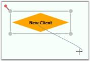

* When you hit any node in the process, you can see an adorner showing what the link will look like if created.

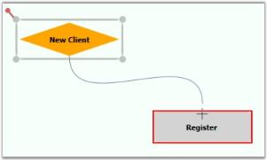

* Release the left button over the target node where you want to connect. This acts as the tail node for the connector and hence the link is created.

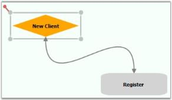

The connector's path geometry is dynamically created based on the start and end points and the connector type.

It is also possible to drag-and-drop line connectors from the SymbolPalette. Three shapes of the line connectors have been added in a group named “Connectors”. The desired line can be dragged onto the page. Initially, the head node and the tail node will be null. The steps to be followed to add a line connector from SymbolPalette are as follows:

1. Drag the desired line connector onto the page.

   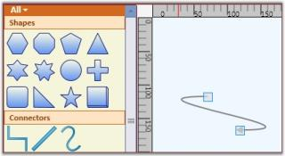

2. Then drag the head thumb of the line connector to the desired node to make a connection.

   

3. Similarly drag the tail thumb of the line connector to the desired node. Now, this creates a link between the two nodes.

   

   

### Add Connectors through a Model

You can create connections between nodes through a model. The Line Connector class is used to create the connection. We need to specify the head node and the tail node for the connection.



Node n1 = new Node();

n1.Shape = Shapes.FlowChart_Card;

diagramModel.Nodes.Add(n1);

n1.OffsetX = 50;

n1.OffsetY = 50;

Node n2 = new Node();

n2.Shape = Shapes.FlowChart_Delay;

diagramModel.Nodes.Add(n2);

n2.OffsetX = 150;

n2.OffsetY = 250;

LineConnector l1 = new LineConnector();

l1.HeadNode = n1;

l1.TailNode = n2;

diagramModel.Connections.Add(l1);




Dim n1 As New Node()

n1.Shape = Shapes.FlowChart_Card

diagramModel.Nodes.Add(n1)

n1.OffsetX = 50

n1.OffsetY = 50

Dim n2 As New Node()

n2.Shape = Shapes.FlowChart_Delay

diagramModel.Nodes.Add(n2)

n2.OffsetX = 150

n2.OffsetY = 250

Dim l1 As New LineConnector()

l1.HeadNode = n1

l1.TailNode = n2

diagramModel.Connections.Add(l1)



This creates a connection between the two specified nodes.

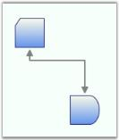

N> For orthogonal and Bezier connectors, the connection always happens at the center of the node's edge.

For straight line connectors, the connection happens at the intersection point of the edge and the line connector.

## Setting Constraints for EnableConnection Property

This feature provides the ability to drag nodes and connection ports when the EnableConnection property is set to ‘True’. The ConnectionMode enum is used to define the node or connection port for connecting.

Properties

## Setting Constraints for EnableConnection Property

<table>
<tr>
<th>
Property</th><th>
Description</th><th>
Type</th><th>
Data Type</th></tr>
<tr>
<td>
NodeModePortMode</td><td>
Allows nodes to be dragged when EnableConnection is enabled.Allows connection ports to be dragged when EnableConnection is enabled.</td><td>
DependencyPropertyDependencyProperty</td><td>
EnumEnum</td></tr>
</table>

### Enabling Connection Mode Constraints for Nodes and Connection Ports

### NodeMode

This property is used to define whether the node can be movable when the EnableConnection property of the DiagramView is set to true.

This property can be set to the following:

* Connect
* Move

By default, this property is set to Connect.

If the NodeMode property of DiagramView is set to Connect, the diagram nodes can be connected to other nodes.

To set this property to Connect, use the following code.



DiagramView View1 = new DiagramView();

View1.NodeMode = ConnectionMode.Connect; 




Dim view1 As New DiagramView()

View1.NodeMode = ConnectionMode.Connect



If the NodeMode property of DiagramView is set to Move, even though the EnableConnection is set to ‘true’ a node can be moved and will not be able to be connected to a line connector.

To set this property to Move, use the following code.



DiagramView View1 = new DiagramView();

View1.NodeMode = ConnectionMode.Move;




Dim view As New DiagramView()

view.NodeMode = ConnectionMode.Move



### PortMode

This property is used to define whether a connection port can be movable when the EnableConnection property of the DiagramView is set to true.

This property can be set to the following:

* Connect
* Move

By default, this property is set to Connect.

If the PortMode property of the DiagramView is set to Connect, we can create port-to-port connections.

To set the PortMode property to Connect, use the following code.



DiagramView View1 = new DiagramView();

View1.PortMode = ConnectionMode.Connect;




Dim view As New DiagramView()

view.PortMode = ConnectionMode.Connect



If the PortMode property of the DiagramView is set to Move, even though EnableConnection is set to true, a port can be moved yet a port-to-port connection can’t be created. 

To set the PortMode property to Move, use the following code.



DiagramView View1 = new DiagramView();

View1.PortMode = ConnectionMode.Move;





Dim view1 As New DiagramView()

View1.PortMode = ConnectionMode.Move



## Connector Type

The ConnectorType property specifies the type of connector to be used for connection.

<table>
<tr>
<th>
Property</th><th>
Description</th><th>
Type</th><th>
Data Type</th></tr>
<tr>
<td>
ConnectorType</td><td>
Gets or sets the connector type to be used. There are four values namely Orthogonal, Straight, Bezier and Arc can be specified. Default Value is Orthogonal.</td><td>
Dependency property</td><td>
ConnectorType.OrthogonalConnectorType.BezierConnectorType.StraightConnectorType.Arc</td></tr>
</table>

Following types of connectors are supported: 

* Orthogonal—creates a line in which line segments (if any) are placed at right angles to each other.
* Bezier—Renders a Bezier curve with two points.
* Straight—renders a line with two points.
* Arc—creates a link between two nodes. 

The following code illustrates how to set the connector type:



LineConnector l1 = new LineConnector();

l1.HeadNode = n1;

l1.TailNode = n2;

l1.ConnectorType = ConnectorType.Bezier;

diagramModel.Connections.Add(l1);




Dim l1 As New LineConnector()

l1.HeadNode = n1

l1.TailNode = n2

l1.ConnectorType = ConnectorType.Bezier

diagramModel.Connections.Add(l1)



Arc Line Connector Type

Arc Line Connector creates link between two nodes. This can act as other line connectors like Bezier, Straight and Orthogonal. You can blend the Arc Line Connector and change its angel. Arc height and direction can be customized. 

Properties

<table>
<tr>
<th>
Property</th><th>
Description </th><th>
Type of the property</th><th>
Data Type</th><th>
Reference Links</th></tr>
<tr>
<td>
ArcHeight</td><td>
Gets or sets a value for the height of the Arc connector.The default value is 50.</td><td>
Dependency property</td><td>
double </td><td>
NA</td></tr>
<tr>
<td>
ArcDirection</td><td>
Gets or sets a value for the direction of the Arc connector.The default value is Clockwise</td><td>
Dependency property</td><td>
SweepDirection</td><td>
NA </td></tr>
</table>

Customizing Arc Line Connector type

Use the ArcHeight and the ArcDirection__property__of ConnectorBase to customize the height and direction of the Arc. 

* ArcHeight – Gets or Sets the height of the Arc.
* ArcDirection – Gets or Sets the direction of the Arc

Following code illustrates how to customize the height and direction of the Arc:



 

           LineConnector l = new LineConnector();

          l.ConnectorType = ConnectorType.Arc;

          l.ArcHeight = 100;

          //l.ArcDirection = SweepDirection.Clockwise; // Default

          l.ArcDirection = SweepDirection.Counterclockwise;

          l.StartPointPosition = new Point(50, 150);

          l.EndPointPosition = new Point(150, 150);

          diagramModel1.Connections.Add(l);




          Dim l As New LineConnector()

l.ConnectorType = ConnectorType.Arc

l.ArcHeight = 100

'l.ArcDirection = SweepDirection.Clockwise; // Default

l.ArcDirection = SweepDirection.Counterclockwise

l.StartPointPosition = New Point(50, 150)

l.EndPointPosition = New Point(150, 150)

diagramModel1.Connections.Add(l)



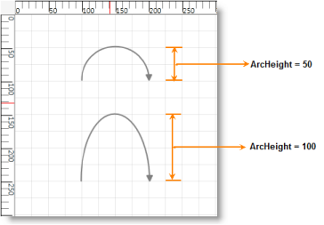

## Polyline

Line connector can be used to draw polylines using IntermediatePoints property. Polylines are drawn using intermediate points for straight lines and orthogonal line connectors. For orthogonal lines, intermediate points are updated so that the adjacent line segments are always perpendicular to each other. These intermediate points are visually represented as vertex.

<table>
<tr>
<th>
Property</th><th>
Description </th><th>
Type of the property</th><th>
Value it accepts</th><th>
Any other dependencies/ sub properties associated</th></tr>
<tr>
<td>
IntermediatePoints</td><td>
Gets or sets the intermediate points.</td><td>
Dependency property</td><td>
List&lt;Point&gt;</td><td>
No</td></tr>
</table>

### Polylines

Straight line connectors can be used as poly line by using IntermediatePoints property. This can be achieved at run time by holding Ctrl + Shift and Click on the line, or by simply changing the IntermediatePoints collection. This will reflect in the line connector.

### Poly Orthogonal Lines

Orthogonal lines can have more than two intermediate points. All these Intermediate points are can be dragged. Unlike straight lines, orthogonal lines maintain their perpendicularity even after the intermediate points are dragged.

### Intermediate Points

Adding Intermediate Points

Intermediate points can be added in two ways:

* Using Ctrl + Shift Key
* Through Code Behind

Intermediate points can be added at run time by holding Ctrl + Shift and clicking on the line. Intermediate points can be added programmatically. The following code snippet illustrates addition of intermediate lines.



LineConnector lc = new LineConnector();

lc.ConnectorType=ConnectorType.Straight;

lc.StartPointPosition = new Point(100, 100);

lc.EndPointPosition = new Point(300, 300);

lc.IntermediatePoints.Add(new Point(200,100));

lc.IntermediatePoints.Add(new Point(200,300));




Dim lc As New LineConnector()

lc.ConnectorType=ConnectorType.Straight

lc.StartPointPosition = New Point(100, 100)

lc.EndPointPosition = New Point(300, 300)

lc.IntermediatePoints.Add(New Point(200,100))

lc.IntermediatePoints.Add(New Point(200,300))



N> By default, an orthogonal line connector has two intermediate points. So, newly added intermediate points will need to be added beyond the default intermediate points. If users need to add new intermediate points to the line connector only, they must clear all of the default intermediate points and then add the intermediate points. Otherwise, the newly added intermediate points will be added beyond the default intermediate points.

Modifying Intermediate Points

Intermediate Points can be modified in two ways:

* Dragging the Vertex
* Through Code Behind

Intermediate points can be modified at run time by clicking and dragging the vertex of the line connector. Intermediate points can be modified programmatically also. The following code snippet illustrates modification of intermediate lines.



LineConnector lc = new LineConnector();

lc.ConnectorType=ConnectorType.Straight;

lc.StartPointPosition = new Point(100, 100);

lc.EndPointPosition = new Point(300, 300);

lc.IntermediatePoints.Add(new Point(200,100));

lc.IntermediatePoints.Add(new Point(200,300));

lc.IntermediatePoints[1] = new Point(200,200));




Dim lc As New LineConnector()

lc.ConnectorType=ConnectorType.Straight

lc.StartPointPosition = New Point(100, 100)

lc.EndPointPosition = New Point(300, 300)

lc.IntermediatePoints.Add(New Point(200,100))

lc.IntermediatePoints.Add(New Point(200,300))

lc.IntermediatePoints(1) = New Point(200,200))



Delete Intermediate Points

Intermediate points can be deleted in two ways:

* Using Ctrl + Shift Key
* Through Code Behind

Intermediate points can be deleted by holding Ctrl + Shift and clicking on the vertex that represents intermediate point to be deleted. Intermediate points can be deleted programmatically also. The following code example illustrates deletion of intermediate lines.



LineConnector lc = new LineConnector();

lc.ConnectorType=ConnectorType.Straight;

lc.StartPointPosition = new Point(100, 100);

lc.EndPointPosition = new Point(300, 300);

lc.IntermediatePoints.Add(new Point(200,100));

lc.IntermediatePoints.Add(new Point(200,300));

lc.IntermediatePoints.RemoveAt(1);




Dim lc As New LineConnector()

lc.ConnectorType=ConnectorType.Straight

lc.StartPointPosition = New Point(100, 100)

lc.EndPointPosition = New Point(300, 300)

lc.IntermediatePoints.Add(New Point(200,100))

lc.IntermediatePoints.Add(New Point(200,300))

lc.IntermediatePoints.RemoveAt(1)



### Vertex Template for Intermediate Points

Vertex template for intermediate points can be set using ConnectorAdornerVertexStyle property of line connector. Custom styles can be set. The following code example illustrates the same.

<table>
<tr>
<th>
Property</th><th>
Description </th><th>
Type of the property</th><th>
Value it accepts</th><th>
Any other dependencies/ sub properties associated</th></tr>
<tr>
<td>
VertexStyle</td><td>
Gets or sets the vertex style.</td><td>
Dependency property</td><td>
Style</td><td>
No</td></tr>
</table>



<Window.Resources>

        <ResourceDictionary>

        </ResourceDictionary>

    </Window.Resources>




LineConnector lc = new LineConnector();

lc.ConnectorType = ConnectorType.Straight;

lc.StartPointPosition = new Point(100, 100);

lc.EndPointPosition = new Point(300, 300);

lc.IntermediatePoints.Add(new Point(200, 100));

lc.IntermediatePoints.Add(new Point(200, 300));

lc.VertexStyle = this.Resources["vertexStyle"] as Style;




Dim lc As New LineConnector()

lc.ConnectorType = ConnectorType.Straight

lc.StartPointPosition = New Point(100, 100)

lc.EndPointPosition = New Point(300, 300)

lc.IntermediatePoints.Add(New Point(200, 100))

lc.IntermediatePoints.Add(New Point(200, 300))

lc.VertexStyle = TryCast(Me.Resources("vertexStyle"), Style)



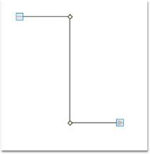

### Template for End Points

Vertex template for terminal points can be set using ConnectorAdornerThumbStyle property of line connector. Custom styles can be set. Following code example illustrates the same.

<table>
<tr>
<th>
Property</th><th>
Description </th><th>
Type of the property</th><th>
Value it accepts</th><th>
Any other dependencies/ sub properties associated</th></tr>
<tr>
<td>
DecoratorAdornerStyle</td><td>
Gets or sets the decorator adorner style.</td><td>
Dependency property</td><td>
Style</td><td>
No</td></tr>
</table>



<Window.Resources>

        <ResourceDictionary>

        </ResourceDictionary>

    </Window.Resources>




LineConnector lc = new LineConnector();

lc.ConnectorType = ConnectorType.Straight;

lc.StartPointPosition = new Point(100, 100);

lc.EndPointPosition = new Point(300, 300);

lc.IntermediatePoints.Add(new Point(200, 100));

lc.IntermediatePoints.Add(new Point(200, 300));

lc.DecoratorAdornerStyle = this.Resources["decorator"] as Style;




Dim lc As New LineConnector()

lc.ConnectorType = ConnectorType.Straight

lc.StartPointPosition = New Point(100, 100)

lc.EndPointPosition = New Point(300, 300)

lc.IntermediatePoints.Add(New Point(200, 100))

lc.IntermediatePoints.Add(New Point(200, 300))

lc.DecoratorAdornerStyle = TryCast(Me.Resources("decorator"), Style)



### Hide Vertex

The user can hide the vertex of a line connector by setting the IsVertexVisible property to False. The following code snippet illustrates the same. 

Property Table

<table>
<tr>
<th>
Property</th><th>
Description </th><th>
Type of the property</th><th>
Value it accepts</th><th>
Any other dependencies/ sub properties associated</th></tr>
<tr>
<td>
IsVertexVisible</td><td>
Gets or sets a value indicating whether this instance is vertex visible.</td><td>
Dependency property</td><td>
Style</td><td>
No</td></tr>
</table>



LineConnector lc = new LineConnector();

lc.ConnectorType = ConnectorType.Straight;

lc.StartPointPosition = new Point(100, 100);

lc.EndPointPosition = new Point(300, 300);

lc.IntermediatePoints.Add(new Point(200, 100));

lc.IntermediatePoints.Add(new Point(200, 300));

lc.IsVertexVisible = false; 




Dim lc As New LineConnector()

lc.ConnectorType = ConnectorType.Straight

lc.StartPointPosition = New Point(100, 100)

lc.EndPointPosition = New Point(300, 300)

lc.IntermediatePoints.Add(New Point(200, 100))

lc.IntermediatePoints.Add(New Point(200, 300))

lc.IsVertexVisible = False



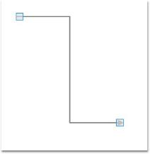

### Arresting Vertex Drag

You can disable the drag operation on the vertex of a line connector by setting the IsVertexMovable property to False. The following code example illustrates the same. 

Property Table

<table>
<tr>
<th>
Property</th><th>
Description </th><th>
Type of the property</th><th>
Value it accepts</th><th>
Any other dependencies/ sub properties associated</th></tr>
<tr>
<td>
IsVertexMovable</td><td>
Gets or sets a value indicating whether this instance is vertex movable.</td><td>
Dependency property</td><td>
Boolean (true/ false)</td><td>
No</td></tr>
</table>


LineConnector lc = new LineConnector();

lc.ConnectorType = ConnectorType.Straight;

lc.StartPointPosition = new Point(100, 100);

lc.EndPointPosition = new Point(300, 300);

lc.IntermediatePoints.Add(new Point(200, 100));

lc.IntermediatePoints.Add(new Point(200, 300));

lc.IsVertexMovable = false;




Dim lc As New LineConnector()

lc.ConnectorType = ConnectorType.Straight

lc.StartPointPosition = New Point(100, 100)

lc.EndPointPosition = New Point(300, 300)

lc.IntermediatePoints.Add(New Point(200, 100))

lc.IntermediatePoints.Add(New Point(200, 300))

lc.IsVertexMovable = False



The vertex drag of a line connector is arrested.

## Decorator Shapes

Head and tail decorator shape properties provide an option to add arrows and to customize these arrows. End point decorators can be provided for all types of connectors. There are a number of shapes available for head and tail decorators. 

Property Table

<table>
<tr>
<th>
Property</th><th>
Description </th><th>
Type of the property</th><th>
Value it accepts</th><th>
Any other dependencies/ sub properties associated</th></tr>
<tr>
<td>
HeadDecoratorShape</td><td>
Gets or sets the head decorator shape of the connection.Four values namely None, Arrow , Diamond and Circle can be specified.Default value: HeadDecoratorShape.None</td><td>
CLR property</td><td>
* DecoratorShape.None* DecoratorShape.Arrow* DecoratorShape.Diamond* DecoratorShape.Circle* DecoratorShape. Custom </td><td>
No</td></tr>
<tr>
<td>
TailDecoratorShape</td><td>
Gets or sets the head decorator shape of the connection.Four values namely None, Arrow , Diamond and Circle can be specified.Default value: TailDecoratorShape.Arrow</td><td>
CLR property</td><td>
* DecoratorShape.None* DecoratorShape.Arrow* DecoratorShape.Diamond* DecoratorShape.Circle* DecoratorShape.Custom </td><td>
No</td></tr>
<tr>
<td>
HeadDecoratorStyle</td><td>
Provides customization option for the head decorator shape.</td><td>
CLR property</td><td>
DecoratorStyle</td><td>
No</td></tr>
<tr>
<td>
TailDecoratorStyle</td><td>
Provides customization option for the tail decorator shape.</td><td>
CLR property</td><td>
DecoratorStyle</td><td>
No</td></tr>
<tr>
<td>
CustomHeadDecoratorStyle</td><td>
Provides option for Custom Head Decorator Style for LineConnector</td><td>
Style</td><td>
Dependency Property</td><td>
No</td></tr>
<tr>
<td>
CustomTailDecoratorStyle</td><td>
Provides option for Custom Tail Decorator Style for LineConnector</td><td>
Style</td><td>
Dependency Property</td><td>
No</td></tr>
</table>

Arrow settings can be changed using HeadDecoratorShape and TailDecoratorShape properties. Both head and tail decorators consist of the same set of properties that allow one to customize the settings as required.

Types of decorator shapes

* Arrow
* Diamond
* Circle

The following code shows how to set these properties.



LineConnector l1 = new LineConnector();

l1.HeadNode = n1;

l1.TailNode = n2;

l1.ConnectorType = ConnectorType.Bezier;

l1.HeadDecoratorShape = DecoratorShape.Diamond;

l1.TailDecoratorShape = DecoratorShape.Circle;

diagramModel.Connections.Add(l1); 




Dim l1 As New LineConnector()

l1.HeadNode = n1

l1.TailNode = n2

l1.ConnectorType = ConnectorType.Bezier

l1.HeadDecoratorShape = DecoratorShape.Diamond

l1.TailDecoratorShape = DecoratorShape.Circle

diagramModel.Connections.Add(l1)



CustomDecoratorShape

Decorator shapes can be customized in two ways.

* Using CustomHeadDecoratorStyle and CustomTailDecoratorStyle
* Using HeadDecoratorStyle and TailDecoratorStyle

CustomDecoratorShape using Style and Setters

HeadDecoratorShape and TailDecoratorShape can be customized by defining a required style for CustomHeadDecoratorStyle, and CustomTailDecoratorStyle respectively. 



<Window.Resources>

</Window.Resources>




<syncfusion:LineConnector ConnectorType="Bezier"  Label="Line1" LabelWidth="50" IsSelected="True" StartPointPosition="100,400" EndPointPosition="100,500" HeadDecoratorShape="Custom" CustomHeadDecoratorStyle="{StaticResource Deco1}"/>




LineConnector l1 = new LineConnector();

l1.ConnectorType = ConnectorType.Bezier;

l1.HeadDecoratorShape = DecoratorShape.Custom;

l1.StartPointPosition = New Point(100, 100);

l1.EndPointPosition = New Point(200, 200);

l1.CustomHeadDecoratorStyle = this.Resources["deco1"] as Style;

diagramModel.Connections.Add(l1); 




Dim l1 As New LineConnector()

l1.ConnectorType = ConnectorType.Bezier

l1.HeadDecoratorShape = DecoratorShape.Custom

l1.StartPointPosition = New Point(100, 100)

l1.EndPointPosition = New Point(200, 200)

l1.CustomHeadDecoratorStyle = TryCast(Me.Resources("Deco1"), Style)

diagramModel.Connections.Add(l1) 





<Window.Resources>

</Window.Resources>




<syncfusion:LineConnector ConnectorType="Orthogonal” Name="Line1" LabelWidth="50" IsSelected="True" StartPointPosition="100,400" EndPointPosition="100,500" TailDecoratorShape="Custom" CustomTailDecoratorStyle="{StaticResource Deco1}"/>




 

LineConnector l1 = new LineConnector();

l1.ConnectorType = ConnectorType.Orthogonal;

l1.HeadDecoratorShape = DecoratorShape.Custom;

l1.StartPointPosition = New Point(100, 100);

l1.EndPointPosition = New Point(200, 200);

l1.CustomTailDecoratorStyle = this.Resources["deco1"] as Style;

diagramModel.Connections.Add(l1);




Dim l1 As New LineConnector()

l1.ConnectorType = ConnectorType. Orthogonal

l1.TailDecoratorShape = DecoratorShape.Custom

l1.StartPointPosition = New Point(100, 100)

l1.EndPointPosition = New Point(200, 200)

l1.TailHeadDecoratorStyle = TryCast(Me.Resources("Deco1"), Style)

diagramModel.Connections.Add(l1) 



CustomDecoratorShape using DecoratorStyle

HeadDecoratorShape and TailDecoratorShape can be customized by defining a required style for HeadDecoratorStyle and TailDecoratorStyle respectively. 



LineConnector line1 = new LineConnector();

line1.ConnectorType = ConnectorType.Straight;

line1.HeadDecoratorShape = DecoratorShape.Custom;

line1.HeadDecoratorStyle = new DecoratorStyle()

{

    Fill = Brushes.Red,

    Data = Geometry.Parse("M160.329212944922,-3.01862318403769L-2.5,130.5 -                      5.00506481618589,311.336343115124 163.335290725089,448.012415349887 436.888368720338,448.012420654297 593,309 591.5,133.5 429.5,-1.5z"),

    Stroke = Brushes.Black,

    Height=20,

    Width=20

};

line1.StartPointPosition = new Point(100, 100);

line1.EndPointPosition = new Point(200, 200);

diagramModel.Connections.Add(line1); 




Dim line1 As New LineConnector()

line1.ConnectorType = ConnectorType.Straight

line1.HeadDecoratorShape = DecoratorShape.[Custom]

line1.HeadDecoratorStyle = New DecoratorStyle() With { _

    .Fill = Brushes.Red, _

    .Data = Geometry.Parse("M160.329212944922,-3.01862318403769L-2.5,130.5 -5.00506481618589,311.336343115124 163.335290725089,448.012415349887 436.888368720338,448.012420654297 593,309 591.5,133.5 429.5,-1.5z"), _

    .Stroke = Brushes.Black, _

    .Height = 20, _

    .Width = 20 _

        }

line1.StartPointPosition = New Point(100, 100)

line1.EndPointPosition = New Point(200, 200)

diagramModel.Connections.Add(line1) 



Customizing TailDecoratorShape with TailDecoratorStyle



LineConnector line1 = new LineConnector();

line1.ConnectorType = ConnectorType.Bezier;

line1.TailDecoratorShape = DecoratorShape.Custom;

line1.TailDecoratorStyle = new DecoratorStyle()

{

   Fill = Brushes.Red,

   Data = Geometry.Parse("M160.329212944922,-3.01862318403769L-2.5,130.5 -5.00506481618589,311.336343115124 163.335290725089,448.012415349887 436.888368720338,448.012420654297 593,309 591.5,133.5 429.5,-1.5z"),

   Stroke = Brushes.Black,

   Height=20,

   Width=20

};

line1.StartPointPosition = new Point(200, 200);

line1.EndPointPosition = new Point(100, 100);

diagramModel.Connections.Add(line1); 




Dim line1 As New LineConnector()

line1.ConnectorType = ConnectorType.Bezier

line1.TailDecoratorShape = DecoratorShape.[Custom]

line1.TailDecoratorStyle = New DecoratorStyle() With

{ _

         .Fill = Brushes.Red, _

         .Data = Geometry.Parse("M160.329212944922,-3.01862318403769L-2.5,130.5 -5.00506481618589,311.336343115124 163.335290725089,448.012415349887 436.888368720338,448.012420654297 593,309 591.5,133.5 429.5,-1.5z"), _

         .Stroke = Brushes.Black, _

         .Height = 20, _

         .Width = 20 _

}

line1.StartPointPosition = New Point(200, 200)

line1.EndPointPosition = New Point(100, 100)

diagramModel.Connections.Add(line1) 



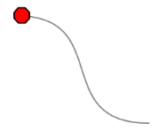

### SegmentDecoratorShape

SegmentDecoratorShape provides the option to place decorator shapes for each segment of Straight and Orthogonal lines.

_SegmentDecorator Shape_

<table>
<tr>
<th>
 Property </th><th>
Description </th><th>
Type </th><th>
Data Type </th><th>
Reference links </th></tr>
<tr>
<td>
Unit</td><td>
Gets or sets the Unit for the SegmentDecoratorSettingsDefault Value is RelativeFraction</td><td>
Dependency property</td><td>
EnumLineUnit. AbsoluteFractionLineUnit. RelativeFractionLineUnit .AbsoluteValueLineUnit .RelativeValue</td><td>
No</td></tr>
<tr>
<td>
DecoratorOffset</td><td>
Gets or sets DecoratorOffset for the SegmentDecorator</td><td>
Property</td><td>
Double</td><td>
 No</td></tr>
<tr>
<td>
DecoratorShape</td><td>
Gets or sets DecoratorShape for the SegmentDecorator</td><td>
Property</td><td>
DecoratorShape</td><td>
No</td></tr>
<tr>
<td>
CustomDecoratorStyle</td><td>
Gets or sets CustomDecoratorStyle for the SegmentDecorator</td><td>
Property</td><td>
Style</td><td>
No</td></tr>
</table>

### To set unit property for Segment decorator setting

LineUnit property is used to access the following:

* AbsoluteFraction: the fraction values (double value between 0 to 1) entered are considered from the particular segment’s StartPointPosition
* RelativeFraction:  the fraction values (double value between 0 to 1) entered are considered from the previous DecoratorShape position
* AbsoluteValue: the pixel values (double) entered are considered from the particular segment’s StartPointPosition
* RelativeValue: the pixel values (double) entered are considered from the previous DecoratorShape position

Through XAML


<syncfusion:LineConnector.SegmentDecoratorSettings>

   <syncfusion:SegmentDecoratorSettings Unit="RelativeFraction">

      <syncfusion:SegmentDecoratorSettings.SegmentDecorator>

         <syncfusion:CollectionExt>

          <syncfusion:SegmentDecorator DecoratorOffset="0.2" DecoratorShape="Arrow" />

          <syncfusion:SegmentDecorator DecoratorOffset="0.5" DecoratorShape="Diamond"/>

         </syncfusion:CollectionExt>

      </syncfusion:SegmentDecoratorSettings.SegmentDecorator> 

     </syncfusion:SegmentDecoratorSettings>

</syncfusion:LineConnector.SegmentDecoratorSettings>




Through code behind 

           SegmentDecorator decorator1=new SegmentDecorator ();

            decorator1.DecoratorOffset=0.2;

            decorator1.DecoratorShape=Syncfusion.Windows.Diagram.DecoratorShape.Arrow;

              SegmentDecorator decorator2=new SegmentDecorator ();

            decorator2.DecoratorOffset=0.5;

            decorator2.DecoratorShape=Syncfusion.Windows.Diagram.DecoratorShape.Diamond;

            CollectionExt collection=new CollectionExt ();

            collection.Add(decorator1);

            collection.Add(decorator2);

            SegmentDecoratorSettings decoratorsettings = new SegmentDecoratorSettings();

            decoratorsettings.Unit = LineUnit.RelativeFraction;

            decoratorsettings.SegmentDecorator = collection;

            line.SegmentDecoratorSettings = decoratorsettings;


### DecoratorShape Customization

DecoratorStyle

The decorator shapes used for the connector can be customized by specifying the property values under the CustomDecoratorStyle property. Same Style and shapes can be given to an entire line segment or different shapes and styles can be given to each part of the line segment, the various properties under the CustomDecoratorStyle property are as follows:

* Fill - Specifies the color to be used to fill the decorator
* StrokeThickness - Specifies the thickness value for the decorator's border
* Stroke - Specifies the color to be used for the border of the decorator
* StrokeStartLineCap - Specifies the shape used at the start of a line or segment
* StrokeEndLineCap - Specifies the shape at the end of a line or segment
* StrokeLineJoin - Specifies the shape that joins two lines or segments
* StrokeDashArray - Specifies a collection of double values that indicate the pattern of dashes and gaps used to outline shapes.
* Width- Specifies the Width of the shape
* Height- Specifies the Height of the shape

To set the same Style and Shape for the entire Line segment



  <syncfusion:SegmentDecoratorSettings.CustomDecoratorStyle>

                       </syncfusion:SegmentDecoratorSettings.CustomDecoratorStyle>




 

       Style decoratorstyle = new System.Windows.Style();

       decoratorstyle.BasedOn = decoratorsettings.CustomDecoratorStyle;

       decoratorstyle.TargetType = typeof(Path);

        decoratorstyle.Setters.Add(new Setter(Path.StrokeProperty, new                                                                                                                                                                 SolidColorBrush(Colors.LightSteelBlue)));

      decoratorstyle.Setters.Add(new Setter(Path.StrokeThicknessProperty, 2d));

      decoratorstyle.Setters.Add(new Setter(Path.WidthProperty, 15d));

       decoratorstyle.Setters.Add(new Setter(Path.HeightProperty, 15d));

       decoratorstyle.Setters.Add(new Setter(Path.FillProperty, new SolidColorBrush(Colors.YellowGreen)));

              decoratorsettings.CustomDecoratorStyle = decoratorstyle;

            line.SegmentDecoratorSettings = decoratorsettings;



To set different shapes and styles to the line segment



<syncfusion:SegmentDecoratorSettings.SegmentDecorator>

<syncfusion:CollectionExt>

<syncfusion:SegmentDecorator DecoratorOffset="0.2" DecoratorShape="Arrow" CustomDecoratorStyle="{StaticResource de}" />

<syncfusion:SegmentDecorator DecoratorOffset="0.5" DecoratorShape="Diamond"/>

</syncfusion:CollectionExt>

</syncfusion:SegmentDecoratorSettings.SegmentDecorator>




       Style decoratorstyle = new System.Windows.Style();

       decoratorstyle.BasedOn = decoratorsettings.CustomDecoratorStyle;

       decoratorstyle.TargetType = typeof(Path);

        decoratorstyle.Setters.Add(new Setter(Path.StrokeProperty, new                                                                                                                                                                 SolidColorBrush(Colors.LightSteelBlue)));

      decoratorstyle.Setters.Add(new Setter(Path.StrokeThicknessProperty, 2d));

      decoratorstyle.Setters.Add(new Setter(Path.WidthProperty, 15d));

       decoratorstyle.Setters.Add(new Setter(Path.HeightProperty, 15d));

       decoratorstyle.Setters.Add(new Setter(Path.FillProperty, new SolidColorBrush(Colors.YellowGreen)));

              decoratorsettings.CustomDecoratorStyle = decoratorstyle;

            line.SegmentDecoratorSettings = decoratorsettings;



Appearance



<syncfusion:LineConnector.SegmentDecoratorSettings>

   <syncfusion:SegmentDecoratorSettings Unit="AbsoluteFraction">

<syncfusion:SegmentDecoratorSettings.SegmentDecorator>

  <syncfusion:CollectionExt>

      <syncfusion:SegmentDecorator DecoratorOffset="0.25" DecoratorShape="Arrow" />

     <syncfusion:SegmentDecorator DecoratorOffset="0.5" DecoratorShape="Diamond"/>

     </syncfusion:CollectionExt>

  </syncfusion:SegmentDecoratorSettings.SegmentDecorator>

</syncfusion:SegmentDecoratorSettings>

</syncfusion:LineConnector.SegmentDecoratorSettings>





<syncfusion:LineConnector.SegmentDecoratorSettings>

   <syncfusion:SegmentDecoratorSettings Unit="RelativeFraction">

<syncfusion:SegmentDecoratorSettings.SegmentDecorator>

  <syncfusion:CollectionExt>

      <syncfusion:SegmentDecorator DecoratorOffset="0.25" DecoratorShape="Arrow" />

     <syncfusion:SegmentDecorator DecoratorOffset="0.5" DecoratorShape="Diamond"/>

     </syncfusion:CollectionExt>

  </syncfusion:SegmentDecoratorSettings.SegmentDecorator>

</syncfusion:SegmentDecoratorSettings>

</syncfusion:LineConnector.SegmentDecoratorSettings>





<syncfusion:LineConnector.SegmentDecoratorSettings>

   <syncfusion:SegmentDecoratorSettings Unit="AbsoluteValue">

<syncfusion:SegmentDecoratorSettings.SegmentDecorator>

  <syncfusion:CollectionExt>

      <syncfusion:SegmentDecorator DecoratorOffset="25" DecoratorShape="Arrow" />

     <syncfusion:SegmentDecorator DecoratorOffset="50" DecoratorShape="Diamond"/>

     </syncfusion:CollectionExt>

  </syncfusion:SegmentDecoratorSettings.SegmentDecorator>

</syncfusion:SegmentDecoratorSettings>

</syncfusion:LineConnector.SegmentDecoratorSettings>





<syncfusion:LineConnector.SegmentDecoratorSettings>

   <syncfusion:SegmentDecoratorSettings Unit="RelativeValue">

<syncfusion:SegmentDecoratorSettings.SegmentDecorator>

  <syncfusion:CollectionExt>

      <syncfusion:SegmentDecorator DecoratorOffset="25" DecoratorShape="Arrow" />

     <syncfusion:SegmentDecorator DecoratorOffset="50" DecoratorShape="Diamond"/>

     </syncfusion:CollectionExt>

  </syncfusion:SegmentDecoratorSettings.SegmentDecorator>

</syncfusion:SegmentDecoratorSettings>

</syncfusion:LineConnector.SegmentDecoratorSettings>



## Customize Line Connectors

This topic describes two properties:

* LineStyle
* DecoratorStyle

Line Style

A connector can be customized by specifying the values under the LineStyle property. The various properties under LineStyle are,

* Fill - Specifies the color used to fill the connector.
* StrokeThickness - Specifies the thickness value for the connector's border.
* Stroke - Specifies the color used for the border of the connector.
* StrokeStartLineCap - Specifies the shape to be used at the start of a line or segment.
* StrokeEndLineCap - Specifies the shape at the end of a line or segment.
* StrokeLineJoin - Specifies the shape that joins two lines or segments.
* StrokeDashArray - Specifies a collection of double values that indicate the pattern of dashes and gaps used to outline shapes. 

As an example, the Stroke property can be applied as follows.



LineConnector l1 = new LineConnector();

l1.HeadNode = n1;

l1.TailNode = n2;

l1.ConnectorType = ConnectorType.Bezier;

l1.LineStyle.Stroke = Brushes.Red;

diagramModel.Connections.Add(l1);




Dim l1 As New LineConnector()

l1.HeadNode = n1

l1.TailNode = n2

l1.ConnectorType = ConnectorType.Bezier

l1.LineStyle.Stroke = Brushes.Red

diagramModel.Connections.Add(l1)



CustomPathStyle

A connector can be customized using CustomPathStyle. The CustomPathStyle property enables you to customize the appearance of LineConnector. 

Properties

Property Table

<table>
<tr>
<th>
Property </th><th>
Description </th><th>
Type </th><th>
Data Type </th><th>
Reference links </th></tr>
<tr>
<td>
CustomPathStyle </td><td>
Get or Set CustomPathStyle for LineConnector </td><td>
Dependency Property </td><td>
Style </td><td>
NA</td></tr>
</table>

#### Applying Style for CustomPathStyle

Appearance of the LineConnector can be customized by applying style for the CustomPathStyle property. Style can be applied for CustomPathStyle as illustrated in the following code:

* Through XAML



<Window.Resources>

</Window.Resources>

         



* Through Code-behind



LineConnector l1 = new LineConnector();

l1.ConnectorType = ConnectorType.Bezier;

l1.HeadDecoratorShape = DecoratorShape.Custom;

l1.StartPointPosition = New Point(100, 100);

l1.EndPointPosition = New Point(200, 200);

l1.CustomPathStyle = this.Resources["Deco1"] as Style;

diagramModel.Connections.Add(l1); 




Dim l1 As New LineConnector()

l1.ConnectorType = ConnectorType.Bezier

l1.HeadDecoratorShape = DecoratorShape.Custom

l1.StartPointPosition = New Point(100, 100)

l1.EndPointPosition = New Point(200, 200)

l1.CustomPathStyle = TryCast(Me.Resources("Deco1"), Style)

diagramModel.Connections.Add(l1) 


#### DecoratorStyle

The decorator shapes used for the connector can be customized by specifying the property values under the DecoratorStyle property. To change the decorator style, the HeadDecoratorStyle and TailDecoratorStyle properties can be used. 

The various properties under the DecoratorStyle property are as follows.

* Fill - Specifies the color used to fill the connector.
* StrokeThickness - Specifies the thickness value for the connector's border.
* Stroke - Specifies the color used for the border of the connector.
* StrokeStartLineCap - Specifies the shape to be used at the start of a line or segment.
* StrokeEndLineCap - Specifies the shape at the end of a line or segment.
* StrokeLineJoin - Specifies the shape that joins two lines or segments.
* StrokeDashArray - Specifies a collection of double values that indicate the pattern of dashes and gaps used to outline shapes. 

An example of the Stroke property can be applied to the head decorator as follows.



LineConnector l1 = new LineConnector();

l1.HeadNode = n1;

l1.TailNode = n2;

l1.ConnectorType = ConnectorType.Bezier;

l1.HeadDecoratorStyle.Stroke = Brushes.Red;

l1.TailDecoratorStyle.Stroke = Brushes.Red;

diagramModel.Connections.Add(l1);




Dim l1 As New LineConnector()

l1.HeadNode = n1

l1.TailNode = n2

l1.ConnectorType = ConnectorType.Bezier

l1.HeadDecoratorStyle.Stroke = Brushes.Red

l1.TailDecoratorStyle.Stroke = Brushes.Red

diagramModel.Connections.Add(l1)



### First Segment Orientation 

This feature enables you to orient the FirstSegment of the Orthogonal LineConnector as needed. 

This feature provides the following options to orient the first segment:

* Auto – The first segment of orthogonal LineConnector will always be perpendicular to the sides of the HeadNode, to which it is connected.
* Horizontal – The FirstSegment of the Orthogonal LineConnector will always be connected horizontally to the HeadNode.
* Vertical - The FirstSegment of the Orthogonal LineConnector will always be connected vertically to the HeadNode.

Use Case Scenarios

By default line connector will be drawn based on the space between the nodes. If you want to customize the default patter, you can achieve this using this feature. This enables you to align the first segment of the connector and rest will be aligned based on this. 

Tables for Properties, Methods, and Events

Properties

PropertyTable

<table>
<tr>
<th>
Property</th><th>
Description</th><th>
Type</th><th>
Data Type</th><th>
Reference links</th></tr>
<tr>
<td>
FirstSegmentOrientation</td><td>
Gets or sets a value to orient the FirstSegment.Default Value is Auto</td><td>
Dependency property</td><td>
SegmentOrientation.AutoSegmentOrientation.HorizontalSegmentOrientation.Vertical </td><td>
NA</td></tr>
</table>

Orienting the First Segment

You can orient the FirstSegment of the Orthogonal LineConnector using the FirstSegmentOrientation property. 

The following code illustrates how to set the FirstSegmentOrientation to Auto:



LineConnector line = new LineConnector();

line.FirstSegmentOrientation = SegmentOrientation.Auto;




Dim line As New LineConnector()
line.FirstSegmentOrientation = SegmentOrientation.Auto



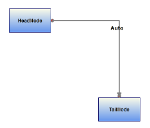

The following code illustrates how to set the FirstSegmentOrientation to Horizontal:



LineConnector line = new LineConnector();

line.FirstSegmentOrientation = SegmentOrientation.Horizontal;  




Dim line As New LineConnector()
line.FirstSegmentOrientation = SegmentOrientation.Horizontal



The following code illustrates how to set the FirstSegmentOrientation to Vertical.



LineConnector line = new LineConnector();

line.FirstSegmentOrientation = SegmentOrientation.Vertical; 




Dim line As New LineConnector()
line.FirstSegmentOrientation = SegmentOrientation.Vertical 



N> This FirstSegmentOrientation property is only works as expected when the LineConnector satisfies the following things.

* _LineConnector is connected between Nodes through ConnectionPort._
* _When there is only one intermediate Point in Orthogonal LineConnector._

## Line Connector Label

Label is a single line or multiline text that is displayed over the Node. This Label is used to textually represent a LineConnector with a string that can be edited in run time, there are many properties that can be used to change the alignment and appearance settings. Label can be represented as multiline text using the TextWrapping property.

<table>
<tr>
<th>
Property</th><th>
Description</th><th>
Type of the property</th><th>
Value it accepts</th><th>
Any other dependencies/ sub properties associated</th></tr>
<tr>
<td>
IsLabelEditable</td><td>
Gets or sets a value indicating whether line’s label that can be edited or not. Default value is True.</td><td>
Dependency property</td><td>
Boolean (true/ false)</td><td>
No</td></tr>
<tr>
<td>
Label</td><td>
Gets or sets the line's label. Default value is Empty String.</td><td>
Dependency property</td><td>
String</td><td>
No</td></tr>
<tr>
<td>
LabelTemplate</td><td>
Gets or sets a template for the label. Default value is null.</td><td>
Dependency property</td><td>
DataTemplate</td><td>
No</td></tr>
<tr>
<td>
LabelVisibility</td><td>
Gets or sets the label visibility. Default value is Visibility.Visible</td><td>
Dependency property</td><td>
Visibility.HiddenVisibility.CollapsedVisibility.Visible</td><td>
No</td></tr>
<tr>
<td>
LabelHorizontalAlignment</td><td>
Gets or sets the node’s label horizontal Alignment. Default value isHorizontalAlignment.Center</td><td>
Dependency property</td><td>
HorizontalAlignment.CenterHorizontalAlignment.LeftHorizontalAlignment.RightHorizontalAlignment.Stretch</td><td>
No</td></tr>
<tr>
<td>
LabelTextTrimming</td><td>
Gets or sets the text trimming style . Default value is CharacterEllipsis.</td><td>
Dependency property</td><td>
TextTrimming.CharacterEllipsisTextTrimming.NoneTextTrimming.WordEllipsis </td><td>
No</td></tr>
<tr>
<td>
LabelForeground</td><td>
Gets or sets the label foreground. Default value is Black.</td><td>
Dependency property</td><td>
Brush</td><td>
No</td></tr>
<tr>
<td>
LabelBackground</td><td>
Gets or sets the label background. Default value is White.</td><td>
Dependency property</td><td>
Brush</td><td>
No</td></tr>
<tr>
<td>
LabelFontStyle</td><td>
Gets or sets the label background. Default value is White.</td><td>
Dependency property</td><td>
FontStyle</td><td>
No</td></tr>
<tr>
<td>
LabelFontFamily</td><td>
Gets or sets the label font family. Default value is Arial.</td><td>
Dependency property</td><td>
FontFamily</td><td>
No</td></tr>
<tr>
<td>
LabelTextAlignment</td><td>
Gets or sets the label text alignment. Default value is Center.</td><td>
Dependency property</td><td>
TextAlignment.CenterTextAlignment.JustifyTextAlignment.LeftTextAlignment.Right</td><td>
No</td></tr>
<tr>
<td>
LabelFontSize</td><td>
Gets or sets the label font size. Default value is 11.</td><td>
Dependency property</td><td>
Double</td><td>
No</td></tr>
<tr>
<td>
LabelFontWeight</td><td>
Gets or sets the label font weight. Default value is SemiBold.</td><td>
Dependency property</td><td>
FontWeight</td><td>
No</td></tr>
<tr>
<td>
LabelTextWrapping</td><td>
Gets or sets the label text wrapping. Default value is NoWrap.</td><td>
Dependency property</td><td>
TextWrapping.NoWrapTextWrapping.WrapTextWrapping.WrapWithOverflow</td><td>
No</td></tr>
<tr>
<td>
LabelWidth</td><td>
Gets or sets the label width. Default value is line’s width.</td><td>
Dependency property</td><td>
Double</td><td>
No</td></tr>
<tr>
<td>
EnableMultilineLabel</td><td>
Gets or sets a value indicating whether the   label line  can be multiline or not. Default value is False.</td><td>
Dependency Property</td><td>
Boolean (True / False)</td><td>
No</td></tr>
</table>

A connector can be specified with a label, similar to node, using the Label property. The default value is an empty string. By default, the label starts at the center point of the connector.



LineConnector l1 = new LineConnector();

l1.HeadNode = n1;

l1.TailNode = n2;

l1.ConnectorType = ConnectorType.Bezier;

l1.Label = "Connect";

diagramModel.Connections.Add(l1);




Dim l1 As New LineConnector()

l1.HeadNode = n1

l1.TailNode = n2

l1.ConnectorType = ConnectorType.Bezier

l1.Label = "Connect"

diagramModel.Connections.Add(l1)



Label Template

You can set a custom template for labels. The following code illustrates on how to set a label template. 

Create a DataTemplate and add the resource “text.png” to your application.



<DataTemplate x:Key="LabelCustomTemplate">

   <StackPanel Orientation="Horizontal">

       <Image Source="text.png" Width="20" Height="20"/>

       <Border Background="AliceBlue">

         <TextBlock Text="Hello"/>

       </Border>

   </StackPanel>

</DataTemplate>


Now, you can apply the template to the connector as follows.



LineConnector l1 = new LineConnector();

l1.HeadNode = n1;

l1.TailNode = n2;

l1.ConnectorType = ConnectorType.Straight;

l1.HeadDecoratorShape= DecoratorShape.Arrow;

l1.TailDecoratorShape= DecoratorShape.Arrow;

l1.HeadDecoratorStyle.Fill = new SolidColorBrush(Colors.LightGray); 

l1.TailDecoratorStyle.Fill = new SolidColorBrush(Colors.LightGray);

l1.LabelTemplate = this.Resources["LabelCustomTemplate"] as DataTemplate ;

diagramModel.Connections.Add(l1);



 

Dim l1 As New LineConnector()

l1.HeadNode = n1

l1.TailNode = n2

l1.ConnectorType = ConnectorType.Straight

l1.HeadDecoratorShape= DecoratorShape.Arrow

l1.TailDecoratorShape= DecoratorShape.Arrow

l1.HeadDecoratorStyle.Fill = New SolidColorBrush(Colors.LightGray)

l1.TailDecoratorStyle.Fill = New SolidColorBrush(Colors.LightGray) 

l1.LabelTemplate = CType(Me.Resources("LabelCustomTemplate"), DataTemplate)

diagramModel.Connections.Add(l1)


The following screenshot illustrates "Hello" text on an Alice Blue background with an image on the left.

Multi line label 

Label text can be displayed in multiple lines using LabelTextWrapping property set to wrap. If there is no enough space for the text to get displayed within connector in a single line then text will get wrapped within connector boundaries or LabelWidth and starts to display the label in multiple lines.



LineConnector l = new LineConnector();

l.Label = "This is a Multiline Label for Connectors";

l.LabelHeight = 110;

l.LabelTextWrapping = TextWrapping.Wrap;

l.IsLabelEditable = true;



Dim l As New LineConnector()

l.Label = "This is a Multiline Label for Connectors"

l.LabelHeight = 110

l.LabelTextWrapping = TextWrapping.Wrap

l.IsLabelEditable = True



Label Editing

A connector's label can be edited at run time by setting IsLabelEditable to ‘True’. The following code shows how it can be done.



LineConnector l1 = new LineConnector();

l1.Shape = Shapes.RoundedRectangle;

l1.IsLabelEditable = true;




Dim l1 As New LineConnector()

l1.Shape = Shapes.RoundedRectangle

l1.IsLabelEditable = True



You can specify a label at run time by following the below mentioned steps.

* Double click the left mouse button on any part of the connector. A text box will appear with the cursor at the beginning.
* Now type the label name and press ENTER. The label will be displayed on the connector. Press ESC key if you do not want to apply the new label value.

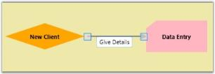

Label Visibility

A label's visibility can be changed using the LabelVisibility property. The default value is visible.



LineConnector l1 = new LineConnector();

l1.LabelVisibility = Visibility.Hidden;




Dim l1 As New LineConnector()

l1.LabelVisibility = Visibility.Hidden



The label will not get displayed.

Multiline Label Support for LabelEditor:

LineConnector’s Label can be set as Multiline Label by setting the EnableMultiline property as ‘True’. The default Value is ‘False’.



<syncfusion:LineConnector ConnectorType="Straight"  Label="Line1" IsSelected="True"      StartPointPosition="100,400" EndPointPosition="100,500" EnableMultilineLabel="True"

/>




LineConnector line1 = new LineConnector();

line1.ConnectorType = ConnectorType.Orthogonal;

line1.StartPointPosition = new Point(100, 100);

line1.EndPointPosition = new Point(200, 200);

line1.EnableMultilineLabel = true;

diagramModel.Connections.Add(line1); 




Dim line1 As New LineConnector()

line1.ConnectorType = ConnectorType.Orthogonal

line1.StartPointPosition = New Point(100, 100)

line1.EndPointPosition = New Point(200, 200)

line1.EnableMultilineLabel = True

diagramModel.Connections.Add(line1) 



Custom Label Support for LineConnector

This feature enables you to customize the Label Position of the LineConnector. The CustomLabelPosition property for LineConnector are Auto, Drag and Custom.

* Drag: The label can be dragged
* Auto: Label position and angle will be updated internally based on the position of the LineConnector. This is a default value.
* Custom: You can customize the Label position

We can also set the Label Position using LabelPosition property of the LineConnector.

<table>
<tr>
<th>
Property</th><th>
Description</th><th>
Type</th><th>
Value It Accepts</th><th>
Default Values</th><th>
Any other dependencies/ sub properties associated</th></tr>
<tr>
<td>
LabelPosition</td><td>
Gets or sets the Position of the LineConnector’s Label from the DiagramPage.</td><td>
Dependency  property</td><td>
Point</td><td>
Point(0,0)</td><td>
No</td></tr>
<tr>
<td>
CustomLabelPosition</td><td>
Gets or sets the Label of the LineConnector to be Dragged or Not.</td><td>
Dependency  property</td><td>
Enum.CustomLabelPositions.AutoCustomLabelPositions.CustomCustomLabelPositions.Drag</td><td>
CustomLabelPositions.Auto</td><td>
No</td></tr>
<tr>
<td>
LabelAngle</td><td>
Gets or sets the angle of the Label of LineConnector.</td><td>
Dependency  property</td><td>
double</td><td>
0</td><td>
No</td></tr>
</table>

Adding Custom Label Enhancements for LineConnector to an Application 

Label Dragging support for LineConnector

The Label can be dragged from the Line Connector.



       (line as LineConnector).CustomLabelPosition = CustomLabelPositions.Drag;



Set the LabelPosition for LineConnector

When the values are given the position of the label will be exactly at the point of the specified values.



       (line as LineConnector).LabelPosition = new Point(100,100);



Set the LabelAngle for LineConnector

The labels rotate when values are given for the label angle.


       (line as LineConnector).LabelAngle = 45;



### Label Orientation

Essential Diagram for WPF provides support to orient the LineConnector label as needed. 

Use Case Scenarios

When the label overlaps with the nodes or connectors, it will not be legible. In such case you can use this feature to align the label to make it legible. 

<table>
<tr>
<th>
Property</th><th>
Description</th><th>
Type</th><th>
Data Type</th><th>
Reference links</th></tr>
<tr>
<td>
LabelOrientation</td><td>
Gets or sets a value to  orient the labelDefault Value is Auto.</td><td>
Dependency property</td><td>
LabelOrientation.AutoLabelOrientation.HorizontalLabelOrientation.Vertical</td><td>
NA</td></tr>
</table>

Orienting the Label 

You can orient the label using the LabelOrientation__property_._ You__can set this to Horizontal, Vertical or Auto. By default this is set to auto. 

The following code illustrates how to set the LabelOrientation to Auto:



  LineConnector line = new LineConnector();

  line.LabelOrientation = Syncfusion.Windows.Diagram.LabelOrientation.Auto;




Dim line As New LineConnector()

line.LabelOrientation = Syncfusion.Windows.Diagram.LabelOrientation.Auto



N> When this property is set to Auto, the label will be positioned along the angle of the line drawn.

The following code illustrates how to set the LabelOrientation to Horizontal:



LineConnector line = new LineConnector();

line.LabelOrientation = Syncfusion.Windows.Diagram.LabelOrientation.Horizontal;




LineConnector line = new LineConnector();

line.LabelOrientation = Syncfusion.Windows.Diagram.LabelOrientation.Horizontal;


The following code illustrates how to set the LabelOrientation to Vertical:



LineConnector line = new LineConnector();

line.LabelOrientation = Syncfusion.Windows.Diagram.LabelOrientation.Vertical; 



Dim line As New LineConnector()

line.LabelOrientation = Syncfusion.Windows.Diagram.LabelOrientation.Vertical



### Label Template Alignment

You can set an Alignment for the label template. The following code shows how to set the label template’s alignment. Label template supports horizontal alignment.

Properties

<table>
<tr>
<th>
Property</th><th>
Description</th><th>
Type of property</th><th>
Value it Accepts</th><th>
Any other dependencies/ sub properties associated</th></tr>
<tr>
<td>
LabelTemplateHorizontalAlignment</td><td>
Specifies the horizontal alignment for the label template. The default value is Center.</td><td>
Dependency property</td><td>
HorizontalAlignment.CenterHorizontalAlignment.LeftHorizontalAlignment.RightHorizontalAlignment.Stretch</td><td>
No</td></tr>
</table>

The following code illustrates how to set the LabelTemplateHorizontalAlignment to Auto:


LineConnector Line = new DiagramView();

Line.LabelTemplateHorizontalAlignment=Syncfusion.Windows.Diagram.HorizontalAlignment.Auto




Dim Line As New LineConnector()

Line.LabelTemplateHorizontalAlignment=Syncfusion.Windows.Diagram.HorizontalAlignment.Auto



The following code illustrates how to set the LabelTemplateHorizontalAlignment to Left:



LineConnector Line = new DiagramView();

Line.LabelTemplateHorizontalAlignment=Syncfusion.Windows.Diagram.HorizontalAlignment.Left;




Dim Line As New LineConnector()

Line.LabelTemplateHorizontalAlignment=Syncfusion.Windows.Diagram.HorizontalAlignment.Left



The following code illustrates how to set the LabelTemplateHorizontalAlignment to Right:



LineConnector Line = new DiagramView();

Line.LabelTemplateHorizontalAlignment=Syncfusion.Windows.Diagram.HorizontalAlignment.Right;




Dim Line As New LineConnector()

Line.LabelTemplateHorizontalAlignment=Syncfusion.Windows.Diagram.HorizontalAlignment.Right



The following code illustrates how to set the LabelTemplateHorizontalAlignment to Stretch:



LineConnector Line = new DiagramView();

Line.LabelTemplateHorizontalAlignment=Syncfusion.Windows.Diagram.HorizontalAlignment.Stretch;




Dim Line As New LineConnector()

Line.LabelTemplateHorizontalAlignment=Syncfusion.Windows.Diagram.HorizontalAlignment.Stretch



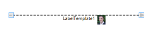

### Label Template Orientation

You can set an orientation for the label template. The following property can be used to set the label template alignment.

Properties

<table>
<tr>
<th>
Property</th><th>
Description</th><th>
Type of property</th><th>
Value it Accepts</th><th>
Any other dependencies/ sub properties associated</th></tr>
<tr>
<td>
LabelTemplateHorizontalAlignment</td><td>
Specifies the horizontal alignment for label template. The default value is Center.</td><td>
Dependency property</td><td>
HorizontalAlignment.CenterHorizontalAlignment.LeftHorizontalAlignment.RightHorizontalAlignment.Stretch</td><td>
No</td></tr>
</table>

The following code illustrates how to set the LabelTemplateOrientation to Auto:



LineConnector Line = new DiagramView();

Line.LabelTemplateHorizontalAlignment=Syncfusion.Windows.Diagram.LabelOrientation.Auto




Dim Line As New LineConnector()

Line.LabelTemplateHorizontalAlignment=Syncfusion.Windows.Diagram.LabelOrientation.Auto



The following code illustrates how to set the LabelTemplateOrientation to Horizontal:



LineConnector Line = new DiagramView();

Line.LabelTemplateHorizontalAlignment=Syncfusion.Windows.Diagram.LabelOrientation.Horizontal




Dim Line As New LineConnector()

Line.LabelTemplateHorizontalAlignment=Syncfusion.Windows.Diagram.LabelOrientation. Horizontal



The following code illustrates how to set the LabelTemplateOrientation to Vertical:



LineConnector Line = new DiagramView();

Line.LabelTemplateHorizontalAlignment=Syncfusion.Windows.Diagram.LabelOrientation.Vertical;





Dim Line As New LineConnector()

Line.LabelTemplateHorizontalAlignment=Syncfusion.Windows.Diagram.LabelOrientation.Vertical



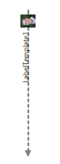

## Line Bridging

<table>
<tr>
<th>
Property</th><th>
Description </th><th>
Type of the property</th><th>
Value it accepts</th><th>
Any other dependencies/ sub properties associated</th></tr>
<tr>
<td>
LineBridgingEnabled</td><td>
Gets or sets a value indicating whether line bridging is enabled.</td><td>
Dependency property</td><td>
Boolean (true/ false)</td><td>
No</td></tr>
</table>

Line Bridging creates a bridge for lines to smartly cross over other line at points of intersection.

When two line connectors meets each other, line with higher z-order will draw an arc over the line with lower z-order. 

Only Straight and Orthogonal Connector type supports line bridging.

Enabling Line Bridging for LineConnector

LineBridging for a line connector can be enabled using the LineBridgingEnabled property. 

By default this property will be set to ‘False’.



LineConnector lc = new LineConnector();

lc.ConnectorType = ConnectorType.Straight;

lc.LineBridgingEnabled = true;




Dim lc As New LineConnector()

lc.ConnectorType = ConnectorType.Straight

lc.LineBridgingEnabled = True



The line bridge is enabled.

Disable LineBridging from DiagramModel

When LineBridging for DiagramModel is disabled, LineBridging for all the lines will be disabled. You can change this binding by specifying a value for an individual LineConnector. 



DiagramModel model = new DiagramModel();

model.LineBridgingEnabled = false;




Dim model As New DiagramModel()

model.LineBridgingEnabled = False



The line bridge is disabled completely.

### LineBridging Style

Default arc segment is customized by overriding CreateSegments method. 

Example1: Draw an invisible segment, by setting IsStroked to false.



 protected override IEnumerable<PathSegment> CreateSegments(Point start, Point end, double angle)

{

  //InVisible ArcSegment

  var collection = new List<PathSegment>()

  {

      new ArcSegment()

      {

        Point = end,

        IsStroked = false,

        SweepDirection = SweepDirection.Clockwise,

        Size = new Size(1,1),

        RotationAngle = 0,

        IsLargeArc = false

      }

  };

  foreach (var line in collection)

  {

      yield return line;

  }

}



Example2: Draw a rectangular bridge instead of arc.



protected override IEnumerable<PathSegment> CreateSegments(Point start, Point end, double angle)

{

   Matrix m = Matrix.Identity;

   m.RotateAt(angle, start.X, start.Y);

   MatrixTransform trans = new MatrixTransform(m);

   //List of LineSegements

   var coll = new List<PathSegment>()

      {

         new LineSegment() {Point = trans.Transform(new Point(start.X, start.Y - 10))},

         new LineSegment() {Point = trans.Transform(new Point(start.X + 16, start.Y - 10))},

         new LineSegment() {Point = trans.Transform(new Point(start.X + 16, start.Y))},

         new LineSegment() {Point = end}

      };

    foreach (var line in coll)

    {

       yield return line;

    }

}


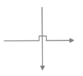

### Line Bridging Direction

Direction of the Line Bridge is customized using BridgeDirection property. This property decides which intersecting segment shows a bridge based path on the preferred direction. The Default value is BridgeDirection.Top.

<table>
<tr>
<th>
 Properties</th><th>
Description</th><th>
Value</th></tr>
<tr>
<td>
BridgeDirection</td><td>
Gets or Sets the BridgeDirection for Horizontal and vertical lines.</td><td>
EnumBridgeDirection.LeftBridgeDirection.RightBridgeDirection.TopBridgeDirection.Bottom</td></tr>
</table>

Example 1: Bridge for Horizontal Connector (with BridgeDirection.Top)
The following code example explains how to enable the Bridging and to set Bridge Direction.


//Initializing Bridging and setting Bridge Direction

connector.LineBridgingEnabled=true;

diagramview.BridgeDirection=BridgeDirection.Top;


Example 2: Bridge for Vertical Connector (with BridgeDirection.Left)



// setting Bridge Direction

diagramview.BridgeDirection=BridgeDirection.Left



## Line Routing

When a link is drawn between two nodes, by enabling the LineRoutingEnabled property of that link and the diagram view, and if any other node is found in between them, the line will be automatically re-routed around those nodes.

Property

<table>
<tr>
<th>
Property</th><th>
Description </th><th>
Type</th><th>
Data type</th><th>
Reference links </th></tr>
<tr>
<td>
LineRoutingEnabled</td><td>
Specifies whether the links must be re-routed when nodes are found in the path. Default value is True.</td><td>
Dependency</td><td>
Boolean</td><td>
NA</td></tr>
</table>

Disable Line Routing for LineConnector

Line Routing for a line connector can be disabled using the LineRoutingEnabled property.

By default this property will be set to ‘True’.



LineConnector lc = new LineConnector();

lc.ConnectorType = ConnectorType.Orthogonal;

lc.LineBridgingEnabled = false;




Dim lc As New LineConnector()

lc.ConnectorType = ConnectorType.Orthogonal

lc.LineBridgingEnabled = False


The Line Routing is disabled.

Enable LineRouting from DiagramView

When LineRouting for DiagramView is enabled, LineRouting for all the lines will be enabled. You can change this binding by specifying a value for an individual LineConnector. 



DiagramView view = new DiagramView ();

view.LineRoutingEnabled = true




Dim view As New DiagramView ()

view.LineRoutingEnabled = True


The Line Routing is enabled completely.

N> Only Orthogonal Connector type supports Line Routing.

Node settings

By default, TreatAsObstacle property of the Node is set to true to avoid the lines overlapping them. If not set for a Node, then it will not be considered as an obstacle and the line might overlap on them.

Property

<table>
<tr>
<th>
Property</th><th>
Description </th><th>
Type</th><th>
Data type</th><th>
Reference links </th></tr>
<tr>
<td>
TreatAsObstacle</td><td>
Gets or sets a value indicating whether the node treats as Obstacle.Default value is True.</td><td>
Dependency</td><td>
Boolean</td><td>
NA</td></tr>
</table>

### Customization of LineRouting

This feature defines when the connectors have to be routed, by setting the RoutingMode property of DiagramView. LineRouting can be executed after dragging the node by using this behavior.

Properties

<table>
<tr>
<th>
Property</th><th>
Description</th><th>
Type</th><th>
Data Type</th></tr>
<tr>
<td>
RoutingMode</td><td>
Decides when the connectors have to be routed.</td><td>
Dependency Property</td><td>
Enum</td></tr>
</table>

### Adding Customization of LineRouting into Application

Enabling the LineRouting

To enable LineRouting, use the following code example:



LineConnector line = new LineConnector();

line.LineRoutingEnabled = true;




Dim line As New LineConnector()

line.LineRoutingEnabled = True



RoutingMode 

The RoutingMode property defines when the connectors have to be routed.

It can be set to: 

1. DragEnd
2. Immediate

If this property is set to DragEnd, the connectors are routed only when the DiagramPage is stable. If the elements in the DiagramPage are moving or being dragged, the connectors are not routed. Only after the completion of the change, the connectors are routed.

To set the RoutingMode property to DragEnd, use the following code example.



DiagramView View1 = new DiagramView();

View1.RoutingMode = RoutingMode.DragEnd;




Dim view As New DiagramView()

view.RoutingMode = RoutingMode.DragEnd


If this property is set to Immediate, the connectors are routed, while the element in the DiagramPage is dragged.

To set the RoutingMode property to Immediate, use the following the code example:



DiagramView View1 = new DiagramView();

View1.RoutingMode = RoutingMode.Immediate;




Dim view As New DiagramView()

view.RoutingMode = RoutingMode.Immediate


## Select, Move, Delete LineConnector

As this is a general topic to be share between Node and LineConnector, please refer general topic under Concepts and features using the following links.

* Select Node and Connectors
* Move Node and Connectors
* Delete Command

## Customize the Label, Context Menu for LineConnector

As this is a general topic to be shared between Node and LineConnector, please refer general topic under Concepts and features using the following links.

* Customize Label
* Customize ContextMenu

