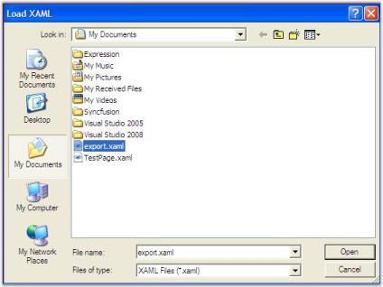
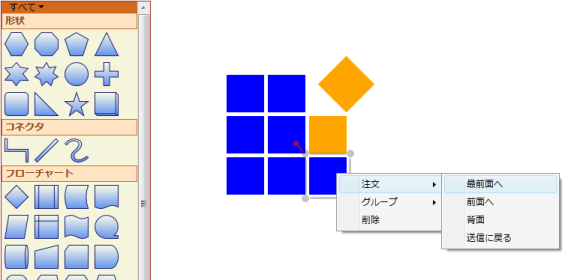

# Serialization in WPF Diagram (classic)

Serialization is the process of saving and retrieving the Essential Diagram file. Essential Diagram WPF supports saving the diagram page as an XAML file. The page and all its properties get saved. On loading, the page gets loaded in the current view with all its nodes and connections. This load and save feature allows you to save their diagram page for future use. You can continue working on their page by loading the appropriate XAML file.

<table>
<tr>
<th>
Name</th><th>
Parameters</th><th>
Return Type</th><th>
Description</th><th>
Reference Links</th></tr>
<tr>
<td>
Save()</td><td>
Null</td><td>
Void</td><td>
Displays the Save Dialog Box to save the DiagramPage into XAML file.</td><td>
Save Diagram Page</td></tr>
<tr>
<td>
Save(string)</td><td>
String</td><td>
Void</td><td>
Saves the DiagramPage into  XAML file whose file name is specified.</td><td>
Save Diagram Page</td></tr>
<tr>
<td>
Save(Stream)</td><td>
System.IO.Stream </td><td>
Void</td><td>
Saves the DiagramPage into memory stream.</td><td>
Save Diagram Page</td></tr>
<tr>
<td>
Load()</td><td>
Null</td><td>
Void</td><td>
Displays the Load Dialog Box to load the DiagramPage from selected XAML file.</td><td>
Load Diagram Page</td></tr>
<tr>
<td>
Load(string)</td><td>
String</td><td>
Void</td><td>
Loads the DiagramPage from the file name mentioned.</td><td>
Load Diagram Page</td></tr>
<tr>
<td>
Load(Stream)</td><td>
System.IO.Stream</td><td>
Void</td><td>
Loads the DiagramPage from the memory stream.</td><td>
Load Diagram Page</td></tr>
</table>

 This process is explained in the following topic:

## Save Diagram Page

Save operation can be done in three ways,

* Using the Save Dialog Box.
* File name with full path.
* Using Memory Stream

Using the Save Dialog Box

To save the page, the following code can be used.


DiagramControl dc = new DiagramControl();

dc.Save();




Dim dc As New DiagramControl()

dc.Save()


The Save Dialog box will appear. Select the 'Save as Type' as XAML and select the location at which the file is to be saved and click the save button in the dialog box after specifying a name for the file.

Save Dialog Box
{:.caption}

File name with path

You can also specify the name of the file directly in the Save method.


DiagramControl dc = new DiagramControl();

dc.Save(@"C:\TestPage.xaml");




Dim dc As New DiagramControl()

dc.Save("C:\TestPage.xaml")



N> Essential Diagram WPF does not support serializing bindings and bitmap Images.

Saving to a stream

You can also save to a stream. 

The following code example shows how it can be done.


DiagramControl dc = new DiagramControl();

System.IO.MemoryStream stream = new System.IO.MemoryStream();

dc.Save(stream as System.IO.Stream);




Dim dc As New DiagramControl()

Dim stream As New System.IO.MemoryStream()

dc.Save(TryCast(stream, System.IO.Stream))


### Loading the Diagram Page

Load operation can be done in three ways,

* Using the Load Dialog Box.
* File name with full path.
* Using Memory Stream

Load using the Load Dialog Box

To load the page, the following code can be used.


DiagramControl dc = new DiagramControl();

dc.Load();




Dim dc As New DiagramControl()

dc.Load()


The Load Dialog box will appear. Select the 'Files of Type' as XAML and specify the path of the file to be loaded and click the Open button in the dialog box. The selected page gets loaded in the current view and the page is ready to be edited.

Load Dialog Box
{:.caption}

File name with path

You can also specify the name of the file directly in the Load method.


DiagramControl dc = new DiagramControl();

dc.Load(@"C:\TestPage.xaml");




Dim dc As New DiagramControl()

dc.Load("C:\TestPage.xaml")



N> Essential Diagram WPF does not support serializing bindings and bitmap Images.

Loading from a stream

You can also load from a stream. 

To load from the stream use the following code snippet.


stream.Position = 0;

dc.Load(stream as System.IO.Stream);




stream.Position = 0

dc.Load(TryCast(stream, System.IO.Stream))



N> While loading from memory stream please make sure the stream’s Position property is set to 0.

## Localization

Localization is the process of providing controls in different cultures to help users to easily set their own culture.

Use Case Scenarios

Localization is the process of customizing the User Interface (UI) in a language and culture specific to a particular country or region to display regional data. Localization is the key feature that provides solutions to global customers with the help of localized resource files provided by controls.

_Localization Sample in Japanese Language_

Localizing the Application

Adding Resource Files

To localize the Syncfusion Diagram WPF control, you need to create a resource file for each culture. The following steps should be performed when localizing strings for your culture:

1. Add the resource (.resx) files in the Resources folder for different cultures. The .resx files for the different cultures or invariant cultures should be placed in the Resources folder of your project.
2. Name the resource files according to the formats specified, namely AssemblyName.CultureName.resx and AssemblyName.resx for the invariant cultures. Here, AssemblyName is the Syncfusion WPF control assembly name and CultureName is the culture code of the resource file that you want to show in the UI. If your conversion is only for the invariant culture, then the .resx file does not require a culture suffix.

Examples

Syncfusion.Diagram.Wpf.ja.resx - A Japanese resource file for the Syncfusion.Diagram.Wpf assembly.

Syncfusion.Diagram.Wpf.resx - An invariant culture resource file for the Syncfusion.Diagram.Wpf assembly. 

Assigning the Current UI Culture to the Application

By default, the current culture is set to “en-US”. You can check the current culture from “System.Threading.Thread.CurrentThread.CurrentUICulture”. CurrentUICulture can be changed, as shown in the following code snippets. 

In the following example, CurrentUICulture is set before InitializeComponent in the StartUp page (MainPage.xaml.cs).


public MainPage()

{

    System.Threading.Thread.CurrentThread.CurrentUICulture = new System.Globalization.CultureInfo("ja");

    InitializeComponent();

}




'INSTANT VB WARNING: The following constructor is declared outside of its associated class:

'ORIGINAL LINE: public MainPage()

 Public Sub New()

   System.Threading.Thread.CurrentThread.CurrentUICulture = New                       System.Globalization.CultureInfo("ja")

   InitializeComponent()

End Sub



Else, CurrentUICulture is set in the Application_Startup event in the App.xaml.cs file, as shown in the following example.


private void Application_Startup(object sender, StartupEventArgs e)

{

    System.Threading.Thread.CurrentThread.CurrentUICulture = new System.Globalization.CultureInfo("ja");

    this.RootVisual = new MainPage();

}




Private Sub Application_Startup(ByVal sender As Object, ByVal e As StartupEventArgs)

System.Threading.Thread.CurrentThread.CurrentUICulture = New System.Globalization.CultureInfo("ja")

Me.RootVisual = New MainPage()

End Sub



_Localization Sample in Japanese Language_

Specifying the Directory Location of the Resource File

By default, the resource file for a specific culture is obtained from the Resources directory. However, the location of the resource file can be changed by using DiagramControl’s LocalizationPath property, as shown in the following code snippet.


// The location of the localized resource file is stored in the \Resources\Controls directory.

diagramControl.LocalizationPath = "Resources.Controls";




'The location of the localized resource file is stored in the \Resources\Controls directory.

diagramControl.LocalizationPath = "Resources.Controls"



_Customized LocalizationPath_

Example


// The location of the localized resource file is stored in the \Resources\X\Y\Z directory.

diagramControl.LocalizationPath = "Resources.X.Y.Z";




'The location of the localized resource file is stored in the \Resources\X\Y\Z directory.

diagramControl.LocalizationPath = "Resources.X.Y.Z"



_Customized LocalizationPath_

N> LocalizationPath for the resource file should be specified before DiagramControl’s Template is applied.

Properties

The property of the Localization feature is described in the following tabulation:

<table>
<tr>
<th>
Property </th><th>
Description </th><th>
Type </th><th>
Data Type </th><th>
Reference links </th></tr>
<tr>
<td>
LocalizationPath</td><td>
Indicates the directory in which the resource files are located. </td><td>
CLR</td><td>
string </td><td>
Not applicable </td></tr>
</table>

### Sample Link

To view a sample

1. Open the Diagram Sample Browser from the dashboard. (Refer to the Samples and Location chapter.)
2. Navigate to Editable Diagram -> Localization Demo.
