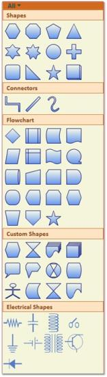
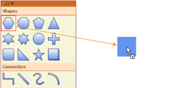
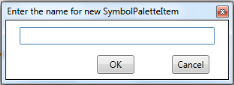
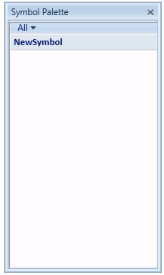
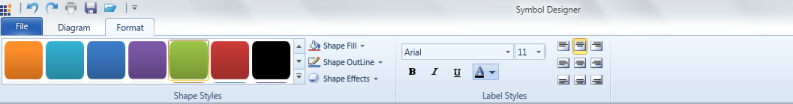
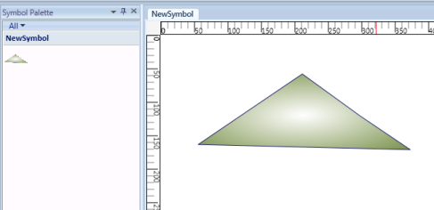
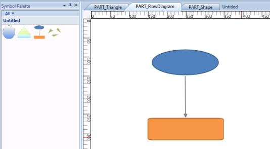
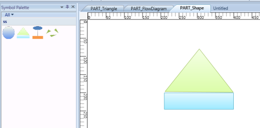
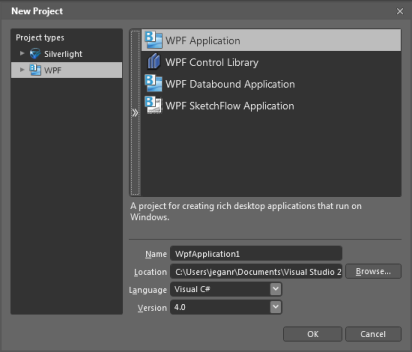

# SymbolPalette in WPF Diagram (classic)

The SymbolPalette control displays node shapes and allows you to drag and drop symbols onto diagrams. It supports grouping and filtering symbols. It allows you to classify items as groups so they can be navigated easily. Also, custom shapes can be added to the SymbolPalette.

## Methods for SymbolGroups in SymbolPalette

<table>
<tr>
<th>
Name</th><th>
Parameters</th><th>
Return Type</th><th>
Description</th><th>
Reference Links</th></tr>
<tr>
<td>
Add(SymbolPaletteGroup)</td><td>
SymbolPaletteGroup</td><td>
Void</td><td>
Adds the SymbolPaletteGroup to the SymbolPalette.</td><td>
Symbol Groups</td></tr>
<tr>
<td>
Remove(SymbolPaletteGroup)</td><td>
SymbolPaletteGroup</td><td>
Void</td><td>
Removes the SymbolPaletteGroup from SymbolPalette.</td><td>
Symbol Groups</td></tr>
<tr>
<td>
RemoveAt(int)</td><td>
Int</td><td>
Void</td><td>
Removes the SymbolPaletteGroup from SymbolPalette at the given index.</td><td>
Symbol Groups</td></tr>
<tr>
<td>
Clear()</td><td>
Null</td><td>
Void</td><td>
Clears all the SymbolPaletteGroups from the SymbolPalette.</td><td>
Symbol Groups</td></tr>
</table>

## Methods for SymbolFilters in SymbolPalette

<table>
<tr>
<th>
Name</th><th>
Parameters</th><th>
Return Type</th><th>
Description</th><th>
Reference Links</th></tr>
<tr>
<td>
Add(SymbolPaletteFilter)</td><td>
SymbolPaletteFilter</td><td>
Void</td><td>
Adds the SymbolPaletteFilter to the SymbolPalette.</td><td>
Symbol Filters</td></tr>
<tr>
<td>
Remove(SymbolPaletteFilter)</td><td>
SymbolPaletteFilter </td><td>
Void</td><td>
Removes the SymbolPaletteFilter from SymbolPalette.</td><td>
Symbol Filters</td></tr>
<tr>
<td>
RemoveAt(int)</td><td>
Int</td><td>
Void</td><td>
Removes the SymbolPaletteFilter from SymbolPalette at the given index.</td><td>
Symbol Filters_Symbol_Groups</td></tr>
<tr>
<td>
Clear()</td><td>
Null</td><td>
Void</td><td>
Clears all the SymbolPaletteFilter from the SymbolPalette.</td><td>
Symbol Filters</td></tr>
</table>

### Enable/Disable SymbolPalette

The SymbolPalette can be displayed by setting the IsSymbolPaletteEnabled property to True. By default, this property is disabled.

The following code can be used to enable the SymbolPalette.


<Window x:Class="WpfApplication1.Window1" xmlns="http://schemas.microsoft.com/winfx/2006/xaml/presentation"

xmlns:x="http://schemas.microsoft.com/winfx/2006/xaml" Title="EssentialDiagramWPF" Height="400" Width="600"

xmlns:sfdiagram="clr-namespace:Syncfusion.Windows.Diagram;assembly=Syncfusion.Diagram.WPF" xmlns:local="clr-namespace:WpfApplication1">

    <Grid Name="diagramgrid">

        <sfdiagram:DiagramControl IsSymbolPaletteEnabled="True">

        </sfdiagram:DiagramControl>

    </Grid>

</Window>




DiagramControl diagramcontrol = new DiagramControl();

diagramcontrol.IsSymbolPaletteEnabled = true;




Dim diagramcontrol As New DiagramControl()

diagramcontrol.IsSymbolPaletteEnabled = True



### Preview for Symbol Palette Item

Essential Diagram for WPF provides preview support for Symbol Palette. When you drag an item from Symbol Palette to Diagram View, Preview of the dragged item will be displayed. You can enable or disable the preview support. You can also customize the preview.  

#### Use Case Scenario

This feature displays a preview of the item you drag from Symbol Palette, thus enables you to identify the item you are dragging from the symbol palette to Diagram view.

#### Properties

<table>
<tr>
<th>
Property </th><th>
Description </th><th>
Type </th><th>
Data Type </th><th>
Reference links </th></tr>
<tr>
<td>
ShowPreview</td><td>
Gets or sets a value indicating whether preview is enabled.The default value is true.</td><td>
Dependency property</td><td>
Boolean </td><td>
NA</td></tr>
<tr>
<td>
PreviewBrush</td><td>
Gets or sets a value for preview content.</td><td>
Dependency property</td><td>
Brush</td><td>
NA</td></tr>
</table>

#### Enabling Preview Support

To enable preview for the dragged item from Symbol Palette, set the ShowPreview property of SymbolPalette to true. To disable preview set this to false. By default this is set to true.  

Following code example illustrates how to enable preview support:  


      DiagramControl diagramControl1 = new DiagramControl();

diagramControl1.SymbolPalette.ShowPreview = true;




       Dim diagramControl1 As New DiagramControl()

      diagramControl1.SymbolPalette.ShowPreview = true



Preview of Dragged Item
{:.caption}

Change the preview content using PreviewBrush

You can customize the preview content using the PreviewBrush property of SymbolPaletteItem. Following code example illustrates how to customize preview content: 


       DiagramControl diagramControl1 = new DiagramControl();

      (diagramControl1.SymbolPalette.SymbolGroups[0].Items[0] as    SymbolPaletteItem).PreviewBrush = Brushes.CornflowerBlue;




       Dim diagramControl1 As New DiagramControl()

TryCast(diagramControl1.SymbolPalette.SymbolGroups(0).Items(0),  SymbolPaletteItem).PreviewBrush = Brushes.CornflowerBlue



Customized Preview Content
{:.caption}

### Symbol Filters

A SymbolPalette filter can be added to the SymbolPalette control, using the SymbolFilters property, so that only desired SymbolPalette groups get displayed. The SetFilterIndexes property is used to specify the index value of the filters for which the group is to be displayed. The filter names are specified integer values, with the first filter index starting from 0. Based on the filter indexes specified for that particular group, the visibility of the group is controlled. So the group gets displayed only when any of the specified filter names are selected.

The following lines of code can be used to specify the SymbolPalette filter of the SymbolPalette Group.


SymbolPaletteFilter sfilter = new SymbolPaletteFilter();

sfilter.Label = "Custom";

dc.SymbolPalette.SymbolFilters.Add(sfilter);

SymbolPaletteGroup group = new SymbolPaletteGroup();

group.Label = "Custom";

SymbolPalette.SetFilterIndexes(group, new Int32Collection(new int[] { 0, 6 }));

dc.SymbolPalette.SymbolGroups.Add(s);




Dim sfilter As New SymbolPaletteFilter()

sfilter.Label = "Custom"

dc.SymbolPalette.SymbolFilters.Add(sfilter)

Dim group As New SymbolPaletteGroup()

group.Label = "Custom"

SymbolPalette.SetFilterIndexes(group, New Int32Collection(New Integer() { 0, 6 }))

dc.SymbolPalette.SymbolGroups.Add(s)


This adds a new empty group named "Custom" and creates a filter for it.

SymbolPalette Filter
{:.caption}

The SetFilterIndexes property specifies the index value for the group as 0,4 which implies that this group should be displayed when the filter index is 0 ("All") or 4 ("Custom").

#### Remove SymbolPaletteFilters

Like SymbolPaletteGroups, the SymbolPaletteFilters are also indexed from 0. The index 0 refers to the filter All. The index 1 refers to the filter Shapes and so on. The following table lists the filters with their index numbers.

<table>
<tr>
<th>
Filter name</th><th>
Index</th></tr>
<tr>
<td>
All</td><td>
0</td></tr>
<tr>
<td>
Shapes</td><td>
1</td></tr>
<tr>
<td>
Connectors</td><td>
2</td></tr>
<tr>
<td>
Flowchart</td><td>
3</td></tr>
<tr>
<td>
Custom Shapes</td><td>
4</td></tr>
<tr>
<td>
Electrical Shapes</td><td>
5</td></tr>
</table>

a) Removing filters and groups named Shapes, Custom Shapes and Electrical Shapes

Use the following code to remove the filters and groups named Shapes, Custom Shapes and Electrical Shapes:


DiagramControl diagramControl = new DiagramControl();

diagramControl.SymbolPalette.SymbolGroups.Remove(diagramControl.SymbolPalette.SymbolGroups[4]);

diagramControl.SymbolPalette.SymbolGroups.Remove(diagramControl.SymbolPalette.SymbolGroups[3]);

diagramControl.SymbolPalette.SymbolGroups.Remove(diagramControl.SymbolPalette.SymbolGroups[0]);

diagramControl.SymbolPalette.SymbolFilters.Remove(diagramControl.SymbolPalette.SymbolFilters[5]);

diagramControl.SymbolPalette.SymbolFilters.Remove(diagramControl.SymbolPalette.SymbolFilters[4]);

diagramControl.SymbolPalette.SymbolFilters.Remove(diagramControl.SymbolPalette.SymbolFilters[1]);



Dim diagramControl As New DiagramControl()

diagramControl.SymbolPalette.SymbolGroups.Remove(diagramControl.SymbolPalette.SymbolGroups(4))

diagramControl.SymbolPalette.SymbolGroups.Remove(diagramControl.SymbolPalette.SymbolGroups(3))

diagramControl.SymbolPalette.SymbolGroups.Remove(diagramControl.SymbolPalette.SymbolGroups(0))

diagramControl.SymbolPalette.SymbolFilters.Remove(diagramControl.SymbolPalette.SymbolFilters(5))

diagramControl.SymbolPalette.SymbolFilters.Remove(diagramControl.SymbolPalette.SymbolFilters(4))

diagramControl.SymbolPalette.SymbolFilters.Remove(diagramControl.SymbolPalette.SymbolFilters(1))



Run the application. The following output is displayed and the groups and filters are removed.

Palette with Groups and Filters removed
{:.caption}

### Symbol Groups

A SymbolPaletteGroup is a collection of SymbolPalette items. It is used to group the items in the SymbolPalette control based on classifications provided. The SymbolPalette group can be added to the SymbolPalette using the SymbolGroups property.  The filter index for the new groups should always start from 6 as the first five indices are predefined for the existing groups.

Use the following code to add a group to SymbolPalette:


SymbolPaletteGroup s = new SymbolPaletteGroup();

s.Label = "Custom";

SymbolPalette.SetFilterIndexes(s, new Int32Collection(new int[] { 0, 6 }));

diagramControl.SymbolPalette.SymbolGroups.Add(s);




Dim s As New SymbolPaletteGroup()

s.Label = "Custom"

SymbolPalette.SetFilterIndexes(s, New Int32Collection(New Integer() { 0, 6 }))

diagramControl.SymbolPalette.SymbolGroups.Add(s)



Run the application. A new empty group named Custom is added to the SymbolPalette.

#### Remove SymbolPaletteGroups

The SymbolPaletteGroups are indexed from 0. Therefore, the group with name Shapes is indexed as 0, the group with name Connectors is indexed as 1 and so on. The groups can be removed using their corresponding index values. The following table lists the groups with their index numbers.

<table>
<tr>
<th>
Group Name</th><th>
Index</th></tr>
<tr>
<td>
Shapes</td><td>
0</td></tr>
<tr>
<td>
Connectors</td><td>
1</td></tr>
<tr>
<td>
Flowchart</td><td>
2</td></tr>
<tr>
<td>
Custom Shapes</td><td>
3</td></tr>
<tr>
<td>
Electrical Shapes</td><td>
4</td></tr>
</table>

a) Removing filter and group named Electrical Shapes and refreshing the Filters

Use the following code to remove the filter and group named Electrical Shapes:


DiagramControl diagramControl = new DiagramControl();

diagramControl.SymbolPalette.SymbolGroups.Remove(diagramControl.SymbolPalette.SymbolGroups[4]);

diagramControl.SymbolPalette.SymbolFilters.Remove(diagramControl.SymbolPalette.SymbolFilters[5]);

//Refreshing the filters

foreach (SymbolPaletteGroup group in diagramControl.SymbolPalette.SymbolGroups)

            {

                Int32Collection indices = SymbolPalette.GetFilterIndexes(group);

                if (indices.Contains(5))

                {

                    indices.Remove(5);

                    SymbolPalette.SetFilterIndexes(group, indices);

                }

                if (indices.Contains(6))

                {

                    indices.Remove(6);

                    indices.Add(5);

                    SymbolPalette.SetFilterIndexes(group, indices);

                }

            }




Dim diagramControl As New DiagramControl()

diagramControl.SymbolPalette.SymbolGroups.Remove(diagramControl.SymbolPalette.SymbolGroups(4))

diagramControl.SymbolPalette.SymbolFilters.Remove(diagramControl.SymbolPalette.SymbolFilters(5))

'Refreshing the filters

For Each group As SymbolPaletteGroup In diagramControl.SymbolPalette.SymbolGroups

        Dim indices As Int32Collection = SymbolPalette.GetFilterIndexes(Group)

If indices.Contains(5) Then

indices.Remove(5)

SymbolPalette.SetFilterIndexes(group, indices)

End If

If indices.Contains(6) Then

indices.Remove(6)

indices.Add(5)

SymbolPalette.SetFilterIndexes(group, indices)

End If

Next group

Run the application. The following output is displayed and the groups and filters are removed.

Palette with Groups and Filters removed
{:.caption}

N> Whenever a filter is removed the group containing the next filter index must be decremented by one to get the proper output as mentioned in the above code snippet.

b) Removing all the groups from the palette

To remove all the groups from the palette, the Clear method can be used. The following code illustrates the usage of Clear method.


DiagramControl diagramControl = new DiagramControl();

diagramControl.SymbolPalette.SymbolGroups.Clear();




Dim diagramControl As New DiagramControl()

diagramControl.SymbolPalette.SymbolGroups.Clear()



Run the application. All the groups are removed from the SymbolPalette.

### Symbol Designer

Symbol Designer application allows you to create new palettes with symbols, and also modify the existing palettes. You can use these palettes in your applications, and also in the Diagram Builder. 

Software Path

..\..\Syncfusion\Essential Studio\<Version Number>\utilities\Diagram WPF\Symbol Designer

(or)

Start Menu > All Programs > Syncfusion > Utilities > Diagram > WPF > Symbol Designer

Creating SymbolPaletteItem

To create your own custom symbols in the symbol designer, follow the procedure given below:

1. Open the Symbol Designer tool which is available in the software path given above.
2. If you want to create a new symbol, select New option in the File menu. Type a name for the palette as shown in the below sample and click OK.

   

   New Symbol PaletteItem Dialog Box
   {:.caption}

3. A new symbol palette is created with the given name after which, you can design your own symbol.

   

   Flow Diagram Symbol Palette
   {:.caption}

4. Draw the desired shapes using drawing tool in the work area.

   

   Symbol
   {:.caption}

   The Shape of the SymbolPaletteItem can be customized further using format tab in Symbol Designer: 

   * Background
   * Outline
   * Dash array
   * Shadow
   * Soft edges
   * Glow visual effect

   The node label can also be customized.

   

   Format tab
   {:.caption}

5. After creating required symbols, we have to save this symbol into the symbol palette. Go to the File menu and click Save. A Save SymbolPaletteGroup dialog will appear as in the following screen shot.

   

   Save SymbolPalette Group Dialog
   {:.caption}

6. Give a relevant file name for the palette and click Save. As the PaletteGroup is saved, preview of the symbol will be shown in Symbol Palette.

   

   Symbol Palette With New Symbol
   {:.caption}

7. Repeat the steps 3 to 7 for creating more symbols.

   

   Symbol pallet with PART_Triangle
   
   {:.caption}

   

   

   Different Symbols
   
   {:.caption}

8. If you create symbols using more than one shape, you need to group all the shapes into a single symbol using the Group option in Symbol Designer.
9. Finally, Save the NewSymbol Group. Now the above symbols will be available in the SymbolPaletteGroup. The saved SymbolPaletteGroup can be loaded back later.
   
   
### SymbolPalette in WPF Diagram (classic) Item

SymbolPaletteItems are contained in the SymbolPalette group. A SymbolPalette item does not restrict users to the type of content that can be added to it. A SymbolPalette item can be a text box, combo box, image, button, and so on.

The Name property of the SymbolPaletteItem can be used to refer to the custom item being added in the NodeDrop event. The name of the SymbolPaletteItem becomes the name of the node.

The following code example can be used to add a SymbolPalette item that has an image as its content. 


SymbolPaletteGroup group = new SymbolPaletteGroup();

group.Label = "Custom";

SymbolPalette.SetFilterIndexes(group, new Int32Collection(new int[] { 0, 6 }));

dc.SymbolPalette.SymbolGroups.Add(group);

SymbolPaletteItem item = new SymbolPaletteItem();

Image i = new Image();

BitmapImage bi3 = new BitmapImage();

bi3.BeginInit();

bi3.UriSource = new Uri("Custom.png", UriKind.RelativeOrAbsolute);

bi3.EndInit();

i.Stretch = Stretch.Fill;

i.Source = bi3;

item.Content = i;

group.Items.Add(item);




Dim group As New SymbolPaletteGroup()

group.Label = "Custom"

SymbolPalette.SetFilterIndexes(group, New Int32Collection(New Integer() { 0, 6 }))

dc.SymbolPalette.SymbolGroups.Add(group)

Dim item As New SymbolPaletteItem()

Dim i As New Image()

Dim bi3 As New BitmapImage()

bi3.BeginInit()

bi3.UriSource = New Uri("Custom.png", UriKind.RelativeOrAbsolute)

bi3.EndInit()

i.Stretch = Stretch.Fill

i.Source = bi3

item.Content = i

group.Items.Add(item)



This adds the image content to the newly created SymbolPaletteitem that belongs to the SymbolPalettegroup named "Custom".

Custom Group and Item
{:.caption}

#### Create SymbolPaletteItem

You can create SymbolPaletteItem in two methods. They are:

* Using Symbol Designer
* Using Microsoft Expression Blend 4

#### Using Symbol Design 

To create SymbolPaletteItem using Symbol Designer, refer to the Symbol Designer section. 

#### Using Microsoft Expression Blend 4

Essential Diagram provides an add-on for creating SymbolPaletteItem’s content. You can also export the created content as SymbolPaletteItem using this add on.  The exported content can be imported into the diagram control for later.

To enable this you need to add the Syncfusion.Diagram.SymbolExporter.dll in the Extension folder.

When Microsoft Expression Blend is installed before installing Essential Studio, the exporter assembly will automatically be placed in the Extensions folder. 

When Microsoft Expression Blend is installed after installing Essential Studio, then you need to run the SyncfusionExpressionBlendAddins EXE, to place assembly in the correct location.

The SyncfusionExpressionBlendAddins EXE is available in the following location:

[$Essential Studio]\[$Current Version]\Utilities\Diagram\WPF

Or you can also place the assembly manually in the following location:

_{$Microsoft Expression]\Blend 4\Extensions_

N> currently exporter support is available only for the Blend 4  stable release(4.0.20525.0) and Blend 4 service packs 1 (version 4.0.20901.0).

To Create SymbolPaletteItem Content  

1. Create a symbol that has to be exported.
2. Select the element that has to be exported as a SymbolPaletteItem.
3. The Name property has to be provided for the element that has to be exported as the symbol content.
4. The selected SymbolPalette content will be exported as a XAML file using the add-on.
5. The exported XAML file can be imported in the DiagramControl as SymbolPaletteItem.

   The following are the steps to create a SymbolPaletteItem and import symbols from Blend:

6. Create a WPF application.

   

   New Project
   {:.caption}

7. Design the content as required.

   

   Design Content
   {:.caption}

8. Select the part of the element, which you want to export as symbol content. You can also select this from the Object and Timeline. 

   N> The selected part will act as the parent element, name the element as desired.

9. Specify the Name property for parent element.
   <table>
   <tr>
   <td>
   <brN> This name property is required for serialization. So this property cannot be set to null.</td></tr>
   <tr>
   <td>
10. Click Window option in the blend menu.11. Select the Syncfusion Symbol Exporter add-on. 12. A popup window will be displayed. You can dock this within the blend as shown in following screenshot:</td></tr>
    </table>

    

    Syncfusion Symbol Exporter
	{:.caption}
 
    

    Object and Timeline Window
	{:.caption}

13. Click Export.
14. The Save SymbolPaletteItem dialog opens.
15. Name the file and save this as XAML file in the desired location.

    

    Save Dialog Box
	{:.caption}

16. The selected part will be exported as the SymbolPaletteItem content.

    The exported file can be imported in SymbolPalette. To import symbols from XAML file, refer to the SymbolPaletteSerialization. 
    
	
####  Define Node, Port, Group definitions in SymbolPalette

The following steps demonstrate how to specify a Node or Node with Ports in SymbolPaletteItem:

1. To add more than one port, a node is created.
2. Then several ports are added to it.
3. Create a SymbolPaletteItem and add the node as content for the SymbolPaletteItem.

At runtime, Nodes that are added in SymbolPalette can be dragged and dropped on the page. All the ports, and their properties will be cloned and a new copy of the node will be created.

Node with several Ports
{:.caption}

To create a new Node

Node node = new Node();

            node.Width = 100;

            node.Height = 100;

            node.OffsetX = 200;

            node.OffsetY = 200;

            node.Background = new SolidColorBrush(Colors.Aqua);

            AddMorePorts(node);

#### To add more Ports

private void AddMorePorts(Node node)

        {

            Left=10;

            Top=10;

            for (int i = 0; i < 4; i++)

            {

                ConnectionPort port = new ConnectionPort();

                port.Left = Left;

                port.Top = Top;

                port.Node = node;

                node.Ports.Add(port);

                Left += 10;

                Top += 10;

            }

        }



#### Creating Groups and SymbolPaletteItems


SymbolPaletteGroup group = new SymbolPaletteGroup();

group.Label = "Custom";

SymbolPalette.SetFilterIndexes(group, new List<int>()[] { 0, 6 }));

dc.SymbolPalette.SymbolGroups.Add(group);

SymbolPaletteItem item = new SymbolPaletteItem(); 

// Node added as SymbolPaletteItem's Content

item.Content = node ;

group.Items.Add(item);



Define Group definition in SymbolPalette

The groups can be given as SymbolPaletteItem’s content. At runtime, they can be Dragged and Dropped to create a clone of the group and its children will be added on the page.

To Drag and Drop Groups

{:.caption}

#### To create new Node and Groups


public DiagramControl Control;

public DiagramModel Model;

public DiagramView View;

public Window1 ()

{

    Control = new DiagramControl ();

    Model = new DiagramModel ();

    View = new DiagramView ();

    Control.View = View;

    Control.Model = Model;

    View.Bounds = new Thickness(0, 0, 1000, 1000);

    Node n = new Node(Guid.NewGuid(), "Start");

    n.Shape = Shapes.FlowChart_Card;

    n.Level = 1;

    n.OffsetX = 150;

    n.OffsetY = 25;

    n.Width = 150;

    n.Height = 75;

    Node n1 = new Node(Guid.NewGuid(), "End");

    n1.Shape = Shapes.RoundedRectangle;

    n1.Level = 1;

    n1.OffsetX = 350;

    n1.OffsetY = 325;

    n1.Width = 100;

    n1.Height = 75;

    Model.Nodes.Add(n);

    Model.Nodes.Add(n1);

    Group g = new Group(Guid.NewGuid(), "group1");

    g.AddChild(n);

    g.AddChild(n1);

    Model.Nodes.Add(g);

}



To create new SymbolPalette Group and Item


SymbolPaletteGroup group = new SymbolPaletteGroup();

group.Label = "Custom";

SymbolPalette.SetFilterIndexes(group, new List<int> ()[] { 0, 6 }));

dc.SymbolPalette.SymbolGroups.Add(group);

SymbolPaletteItem item = new SymbolPaletteItem(); 

// Group added as SymbolPaletteItem's Content

item.Content = g ;

group.Items.Add(item);



## Adding Through SymbolPalette

## Customize the SymbolPalette

The appearance of the SymbolPalette can be customized to suit any application. Several properties have been provided in the SymbolPalette class to enable its customization.

The following properties can be used to customize the SymbolPalette in your application.

<table>
<tr>
<th>
Property</th><th>
Description</th><th>
Type of the property</th><th>
Value it accepts</th><th>
Any other dependencies/ sub properties associated</th></tr>
<tr>
<td>
Background</td><td>
Specifies the background color of the SymbolPalette.The default color is Beige.</td><td>
Dependency property</td><td>
Brush</td><td>
No</td></tr>
<tr>
<td>
BorderThickness</td><td>
Gets or sets the border thickness of the SymbolPalette.The default value is 1.</td><td>
Dependency property</td><td>
Thickness</td><td>
No</td></tr>
<tr>
<td>
BorderBrush</td><td>
Specifies the border color of the SymbolPalette.The default color is Brown.</td><td>
Dependency property</td><td>
Brush</td><td>
No</td></tr>
<tr>
<td>
SymbolPaletteGroupBackground</td><td>
Specifies the background color of the SymbolPalette Group.The default color is Bisque.</td><td>
Dependency property</td><td>
Brush</td><td>
No</td></tr>
<tr>
<td>
SymbolPaletteGroupForeground</td><td>
Specifies the foreground color of the SymbolPalette Group.The default color is SaddleBrown_._</td><td>
Dependency property</td><td>
Brush</td><td>
No</td></tr>
<tr>
<td>
SymbolPaletteGroupBorderBrush</td><td>
Specifies the border color of the SymbolPalette Group.The default color is Chocolate_._</td><td>
Dependency property</td><td>
Brush</td><td>
No</td></tr>
<tr>
<td>
ItemBorderThickness</td><td>
Gets or sets the border thickness of the SymbolPalette Item.The default value is 1.</td><td>
Dependency property</td><td>
Thickness</td><td>
No</td></tr>
<tr>
<td>
ItemCornerRadius</td><td>
Gets or sets the corner radius of the SymbolPalette Item.The default value is 2.</td><td>
Dependency property</td><td>
CornerRadius</td><td>
No</td></tr>
<tr>
<td>
ItemMouseOverBorderBrush</td><td>
Specifies the border color of the SymbolPalette Item over which the mouse pointer rests.The default value is Orange.</td><td>
Dependency property</td><td>
Brush</td><td>
No</td></tr>
<tr>
<td>
ItemCheckedBorderBrush</td><td>
Specifies the border color of the SymbolPalette Item that is selected.The default value is Red.</td><td>
Dependency property</td><td>
Brush</td><td>
No</td></tr>
<tr>
<td>
ItemCheckedMouseOverBorderBrush</td><td>
Specifies the border color of the selected SymbolPalette Item over which the mouse pointer rests.The default value is Green.</td><td>
Dependency property</td><td>
Brush</td><td>
No</td></tr>
<tr>
<td>
FilterSelectorBackground</td><td>
Specifies the background color of the SymbolPalette Filter.The default value is Chocolate.</td><td>
Dependency property</td><td>
Brush</td><td>
No</td></tr>
<tr>
<td>
FilterSelectorForeground</td><td>
Specifies the foreground color of the SymbolPalette Filter.The default value is DarkSlateGray.</td><td>
Dependency property</td><td>
Brush</td><td>
No</td></tr>
<tr>
<td>
FilterSelectorBorderThickness</td><td>
Gets or sets the border thickness of the SymbolPalette Filter.The default value is (0,0,0,1).</td><td>
Dependency property</td><td>
Thickness</td><td>
No</td></tr>
<tr>
<td>
FilterSelectorMouseOverForeground</td><td>
Specifies the foreground color of the SymbolPalette Filter over which the mouse pointer rests.The default value is OldLace.</td><td>
Dependency property</td><td>
Brush</td><td>
No</td></tr>
<tr>
<td>
FilterSelectorBorderBrush</td><td>
specifies the border color of the SymbolPalette FilterThe default value is Chocolate.</td><td>
Dependency property</td><td>
Brush</td><td>
No</td></tr>
<tr>
<td>
PopUpBackground</td><td>
Specifies the background color of the SymbolPalette Pop-up.The default value is WhiteSmoke.</td><td>
Dependency property</td><td>
Brush</td><td>
No</td></tr>
<tr>
<td>
PopUpForeground</td><td>
Specifies the foreground color of the SymbolPalette Pop-up.The default value is DarkSlateGray.</td><td>
Dependency property</td><td>
Brush</td><td>
No</td></tr>
<tr>
<td>
PopUpBorderThickness</td><td>
Gets or sets the border thickness of the SymbolPalette Pop-upThe default value is (0,1,1,1).</td><td>
Dependency property</td><td>
Thickness</td><td>
No</td></tr>
<tr>
<td>
PopUpMouseOverBrush</td><td>
Specifies the background color of the SymbolPalette pop-up Item over which the mouse pointer rests.The default value is LightSalmon.</td><td>
Dependency property</td><td>
Brush</td><td>
No</td></tr>
<tr>
<td>
PopUpBorderBrush</td><td>
Specifies the border color of the SymbolPalette pop-up.The default value is Chocolate.</td><td>
Dependency property</td><td>
Brush</td><td>
No</td></tr>
<tr>
<td>
PopUpLeftColumnBackground</td><td>
Specifies the background color of the Check Box Column in the SymbolPalette pop-up.The default value is LightGray.</td><td>
Dependency property</td><td>
Brush</td><td>
No</td></tr>
<tr>
<td>
CheckerBackground</td><td>
Specifies the the background color of the Check Boxes in the SymbolPalette pop-up.The default value is Bisque.</td><td>
Dependency property</td><td>
Brush</td><td>
No</td></tr>
<tr>
<td>
CheckerBorderBrush</td><td>
Specifies the the border color of the Check Boxes in the SymbolPalette pop-up.The default value is DarkSlateGray_._</td><td>
Dependency property</td><td>
Brush</td><td>
No</td></tr>
<tr>
<td>
CheckerTickBrush</td><td>
Specifies the Tick color of the selected Check Box in the SymbolPalette pop-up.The default value is DarkSlateGray_._</td><td>
Dependency property</td><td>
Brush</td><td>
No</td></tr>
</table>

The following code example illustrates how to set some of the SymbolPalette properties.


DiagramControl diagramControl = new DiagramControl(); diagramControl.SymbolPalette.BorderThickness = new Thickness(2);

diagramControl.SymbolPalette.BorderBrush = Brushes.MidnightBlue;

diagramControl.SymbolPalette.Background = Brushes.Blue; diagramControl.SymbolPalette.SymbolPaletteGroupBackground = Brushes.DarkBlue; diagramControl.SymbolPalette.SymbolPaletteGroupForeground = Brushes.White;

diagramControl.SymbolPalette.SymbolPaletteGroupBorderBrush = Brushes.SlateBlue;

diagramControl.SymbolPalette.FilterSelectorBackground = Brushes.SkyBlue; diagramControl.SymbolPalette.FilterSelectorForeground = Brushes.White;

diagramControl.SymbolPalette.FilterSelectorBorderBrush = Brushes.Blue; diagramControl.SymbolPalette.FilterSelectorBorderThickness = new Thickness(0);

diagramControl.SymbolPalette.CheckerTickBrush = Brushes.White;

diagramControl.SymbolPalette.CheckerBorderBrush = Brushes.MidnightBlue;

diagramControl.SymbolPalette.CheckerBackground = Brushes.LightBlue; diagramControl.SymbolPalette.PopUpItemMouseOverBrush = Brushes.CornflowerBlue;

diagramControl.SymbolPalette.PopUpBorderBrush = Brushes.MidnightBlue;

diagramControl.SymbolPalette.ItemBorderThickness = new Thickness(2);




Dim diagramControl As New DiagramControl()

diagramControl.SymbolPalette.BorderThickness = New Thickness(2)

diagramControl.SymbolPalette.BorderBrush = Brushes.MidnightBlue

diagramControl.SymbolPalette.Background = Brushes.Blue

diagramControl.SymbolPalette.SymbolPaletteGroupBackground = Brushes.DarkBlue

diagramControl.SymbolPalette.SymbolPaletteGroupForeground = Brushes.White

diagramControl.SymbolPalette.SymbolPaletteGroupBorderBrush = Brushes.SlateBlue

diagramControl.SymbolPalette.FilterSelectorBackground = Brushes.SkyBlue

diagramControl.SymbolPalette.FilterSelectorForeground = Brushes.White

diagramControl.SymbolPalette.FilterSelectorBorderBrush = Brushes.Blue

diagramControl.SymbolPalette.FilterSelectorBorderThickness = New Thickness(0)

diagramControl.SymbolPalette.CheckerTickBrush = Brushes.White

diagramControl.SymbolPalette.CheckerBorderBrush = Brushes.MidnightBlue

diagramControl.SymbolPalette.CheckerBackground = Brushes.LightBlue

diagramControl.SymbolPalette.PopUpItemMouseOverBrush = Brushes.CornflowerBlue

diagramControl.SymbolPalette.PopUpBorderBrush = Brushes.MidnightBlue

diagramControl.SymbolPalette.ItemBorderThickness = New Thickness(2)


The following screenshot illustrates the various customization options that are available for the SymbolPalette Item, Group and Filter Selector.

SymbolPalette Item, Group and Filter Selector Customization Properties

{:.caption}

The following screenshot illustrates the various customization options available for the SymbolPalette PopUp.

SymbolPalette PopUp Customization Properties
{:.caption}

### Customize the SymbolPaletteItem

This feature improves the performance of SymbolPaletteItem dragging, by avoiding serialization and deserialization of the item.

<table>
<tr>
<th>
Method</th><th>
Description</th><th>
Parameters</th><th>
Return Type</th></tr>
<tr>
<td>
CloneContent</td><td>
This method assigns the customized and serialized content to the symbol palette item, while performing drag and drop.</td><td>
No parameters </td><td>
object </td></tr>
</table>

### Adding this Feature to an Application

Creating Custom SymbolPaletteItem

The content for the custom SymbolPaletteItem is assigned by overriding the CloneContent method.


                 public class customItem : SymbolPaletteItem

        {

            public customItem()

            { }

            public override object CloneContent()

            {

                return new Button() { Height = 50, Width = 50, Content = "Custom" };

            }

        }




Public Class customItem

Inherits SymbolPaletteItem

Public Sub New()

End Sub

Public Overrides Function CloneContent() As Object

            Dim button As New Button()

            button.Content = "asas"

            button.Width = 50

            button.Height = 50

            Return button

End Function

End Class



Adding CustomItem to SymbolPalette

To add CustomItem to SymbolPalette, use the code example given below:


customItem custom = new customItem();

custom.Content = "asd";

(diagramControl.SymbolPalette.SymbolGroups[0] as SymbolPaletteGroup).Items.Add(custom);




Dim custom As New customItem()

custom.Content = "asd"

TryCast(customs.SymbolGroups(0), SymbolPaletteGroup).Items.Add(custom)


When you drag and drop the custom SymbolPaletteItem, the content that is assigned in the CloneContent method is applied to the content of the dropped item.

Thereby, the performance of dragging the SymbolPaletteItem is improved by 40%. If the default base method is returned in the CloneContent method, the default content is dragged and dropped.

## SymbolPalette in WPF Diagram (classic) Serialization

Serialization is the process of saving and retrieving the SymbolPalette groups and items. Essential DiagramWPF supports saving the SymbolPalette as an XAML file. This load and save feature allows you to save the SymbolPalette for future use. You can continue working on their page by loading the appropriate XAML file.

SymbolPaletteSerialization feature provides an option to save and load the SymbolPalette, SymbolPalette groups, elements and items in diagram control. So any item can be customized and imported onto the SymbolPalette.

* User can easily Save/Load the SymbolPalette
*  User can Save/Load the SymbolPaletteGroup
*  User can Save/Load the SymbolPaletteItem

### Methods 

<table>
<tr>
<th>
Method </th><th>
Description </th><th>
Parameters </th><th>
Return Type </th><th>
Reference links </th></tr>
<tr>
<td>
SaveSymbolPalette</td><td>
Displays the save dialog box to save the entire SymbolPalette(including all SymbolPalette groups) into XAML file.</td><td>
NA </td><td>
Void</td><td>
NA </td></tr>
<tr>
<td>
LoadSymbolPalette</td><td>
The existing SymbolPalette groups will be cleared and new groups will be added from selected XAML file.</td><td>
NA </td><td>
Void</td><td>
NA </td></tr>
<tr>
<td>
SaveSymbolPaletteGroup</td><td>
Saves the Symbol Palette Group into XAML file using the given  SymbolPaletteGroup parameter. </td><td>
SymbolPaletteGroup </td><td>
Void</td><td>
NA </td></tr>
<tr>
<td>
LoadSymbolPaletteGroup</td><td>
Displays the Load Dialog Box to load the Symbol Palette Group from the selected XAML file.</td><td>
NA </td><td>
Void</td><td>
NA </td></tr>
<tr>
<td>
SaveSymbolPaletteItem</td><td>
Saves the Symbol Palette Item into XAML file using the given SymbolPaletteItem parameter.</td><td>
SymbolPaletteItem </td><td>
Void</td><td>
NA </td></tr>
<tr>
<td>
LoadSymbolPaletteItem</td><td>
Loads the SymbolPalette Item from the XAML file. The Items are loaded in any given Symbol Palette Group using the SymbolPaletteGroup parameter. </td><td>
SymbolPaletteGroup </td><td>
Void</td><td>
NA </td></tr>
</table>

## Bind to ItemSource

The symbol palette supports binding with business objects. A symbol group will be created and added to the symbol palette depending upon the business objects and template provided. The symbol group itself supports binding with business objects. Symbol palette items will be created and added to it depending upon the business objects and template.

### Properties

<table>
<tr>
<th>
Property</th><th>
Description</th><th>
Type</th><th>
Data Type</th><th>
Reference links</th></tr>
<tr>
<td>
ItemGenerateMode</td><td>
Specifies the ItemGenerateMode for symbol palette. Default is Manual. </td><td>
Dependency property</td><td>
ItemGenerateMode.ItemsSourceItemGenerateMode.Manual </td><td>
No</td></tr>
<tr>
<td>
ItemsSource</td><td>
Gets or sets the source for the list of the items, the containers about to represent.</td><td>
DependencyProperty</td><td>
IEnumerable</td><td>
No</td></tr>
</table>

ItemSource property gets the source for the list of Symbol groups to be added to symbol palette.

The following code samples illustrate this.


<Window.Resources>

        

</Window.Resources>




symbol = diagramControl.SymbolPalette;

// Set the ItemGenerateMode property value to ItemsSource

symbol.ItemGenerateMode = ItemGenerateMode.ItemsSource;

//Clear the default filter item from the SymbolFilter collections.

symbol.SymbolFilters.Clear();

//Clear default items added in SymbolGroups

symbol.SymbolGroups.Clear();

//Then assign ItemsSource for the SymbolPalette

symbol.ItemsSource = CreatingBusinessObjForSymbolPalette();

//ItemsSource for SymbolPalette

private System.Collections.IEnumerable CreatingBusinessObjForSymbolPalette()

{

ObservableCollection<SymbGroup> grp = new ObservableCollection<SymbGroup>();

grp.Add(new SymbGroup() { Label = "Label1", Filter = new Int32Collection(new int[] { 0, 1 }) });

grp.Add(new SymbGroup() { Label = "Label2", Filter = new Int32Collection(new int[] { 0, 2 }) });

return grp;

}

//ItemsSource for SymbolPaletteGroup assigned when group collection changed.

void SymbolGroups_CollectionChanged(object sender, System.Collections.Specialized.NotifyCollectionChangedEventArgs e)

{

if (e.NewItems != null)

{

ObservableCollection<SymbolItem> symbolItemCollection = new

ObservableCollection<SymbolItem>();

symbolItemCollection.Add(new SymbolItem() { Content = "Item1" });

symbolItemCollection.Add(new SymbolItem() { Content = "Item2" });

(e.NewItems[0] as SymbolPaletteGroup).ItemsSource = symbolItemCollection;

}

}

//Business object for symbol group and symbol palette item.

public class SymbGroup

{

public String Label { get; set; }

public Int32Collection Filter { get; set; }

}

public class SymbolItem

{

public string Content { get; set; }

}



Symbol palette ItemSource
{:.caption}

N> Symbol groups are not allowed to be added manually when ItemSource is used.
