# Data-Presentation in WPF GridDataControl (Classic)

GridData control data can be presented in several ways. 

This section illustrates those data presentation techniques in the following topics:

* Grouping—This topic discusses on grouping feature in the grid.
* Sorting—This topic discusses on sorting feature in the grid.
* Filters—This topic discusses on applying filters in the grid.
* Summaries—This topic describes on adding summaries in the grid.
* Column Drag and Drop—This topic discusses on column-level drag-and-drop support.
* Hierarchy—This topic discusses on nested table hierarchy.
* Stacked Headers—This topic discusses on the addition of unbound header rows called stacked headers.
* Expression Fields—This topic discusses how to create expression columns that hold calculated values based on other fields in the same record.
* ToolTips—This topic describes the addition of tooltips for the grid cells.

## Grouping

This section elaborates the grouping feature of Essential Grid. By using this feature, you can wrap a set of records that belong to the same category into a separate block, called Group. Grid enables you to group data by one or more columns. When grouping is applied, the records having identical values for the grouped columns are combined together forming a hierarchical structure.

Each group is identified by its Group Caption Section that can be expanded to bring the underlying records into view. This Group Caption Section contains the information about a particular group such as group name, number of records in the group, and so on.

This section comprises the following:

### Creating Groups

Grid groups can be created at design-time as well as run time. They are managed by the GroupedColumns collection which holds one entry for every grouped column. A group can be created programmatically by adding the desired column into this collection. The records are sorted in the ascending (default) or descending order of their Grouped Column values. The GroupedColumns collection can have more than one entry to form Nested Groups.



<syncfusion:GridDataControl x:Name="dataGrid" ShowAddNewRow="False" ShowFilters="False" AutoPopulateColumns="True"

AutoPopulateRelations="True" ItemsSource="{StaticResource ordersSource}" ShowGroupDropArea="True">

<syncfusion:GridDataControl.GroupedColumns >

<syncfusion:GridDataGroupColumn ColumnName="ShipCountry"></syncfusion:GridDataGroupColumn>

</syncfusion:GridDataControl.GroupedColumns>

</syncfusion:GridDataControl>





GridDataGroupColumn groupedCol = new GridDataGroupColumn();

groupedCol.ColumnName = "ShipCountry";

dataGridControl.GroupedColumns.Add(groupedCol);



#### Run Time Grouping

Run time grouping is enabled by displaying the group drop area, a placeholder to store the current groups. Such groups can be created interactively through the drag-and-drop operation. For example, to group data against a particular column, drag the desired column header and drop it into the group drop area.

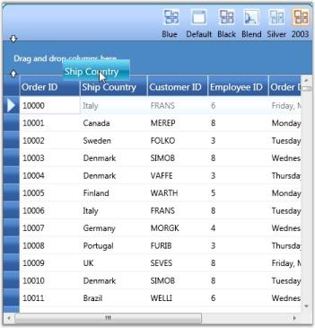



Nested Groups and Custom Groups



### Nested Groups

When you have the grid data grouped against more than one column, the groups are nested in different levels forming a hierarchical, multilevel structure. You can expand or collapse the underlying groups and records from a parent group by clicking the PlusMinus button preceding its group caption.

MultiColumn (Nested) groups can be easily created by simply adding multiple columns into the GroupedColumns collection. You can also generate multilevel groups by just dragging multiple column headers into the group drop area.



GridDataGroupColumn groupedCol1 = new GridDataGroupColumn();

groupedCol1.ColumnName = "ShipCountry";

dataGrid.GroupedColumns.Add(groupedCol1);

GridDataGroupColumn groupedCol2 = new GridDataGroupColumn();

groupedCol2.ColumnName = "EmployeeID";

dataGrid.GroupedColumns.Add(groupedCol2);





Creating Groups



### Group Events

The following table lists the events that are associated with Grid Groups.

_Events_

<table>
<tr>
<th>
Event</th><th>
Description</th></tr>
<tr>
<td>
GroupExpanding</td><td>
This event is raised when a group is about to be expanded. This operation can be optionally canceled.</td></tr>
<tr>
<td>
GroupExpanded</td><td>
This event is raised when a group is expanded.</td></tr>
<tr>
<td>
GroupCollapsing</td><td>
This event is raised when a group is about to be collapsed. This operation can be optionally canceled.</td></tr>
<tr>
<td>
GroupCollapsed</td><td>
This event is raised when a group is collapsed.</td></tr>
</table>

#### GroupExpanding Event

The following code example illustrates how to handle the GroupExpanding event.


// Subscribe to the event.

dataGrid.Model.Table.GroupExpanding+=new GroupExpandingEventHandler(Table_GroupExpanding);

// Handle the event.

void Table_GroupExpanding(object sender, GroupExpandingEventArgs args)

{

args.Cancel = true;

}



#### GroupExpanded Event

The following code example illustrates how to handle the GroupExpanded event.



// Subscribe to the event.

dataGrid.Model.Table.GroupExpanded += new GroupExpandedEventHandler(Table_GroupExpanded);

// Handle the event.

void Table_GroupExpanded(object sender, GroupExpandedEventArgs args)

{

// Print the group caption text.

Console.WriteLine("Expanded: "+ dataGrid.Model.Table.GroupModel.GetGroupCaptionText((GridDataGroupItem)args.Group.Item));

}



#### GroupCollapsing Event

The following code example illustrates how to handle the GroupCollapsing event.



// Subscribe to the event.

dataGrid.Model.Table.GroupCollapsing+=new GroupCollapsingEventHandler(Table_GroupCollapsing);

// Handle the event.

void Table_GroupCollapsing(object sender, GroupCollapsingEventArgs args)

{

args.Cancel = true;

}



## GroupCollapsed Event

The following code example illustrates how to handle the GroupCollapsed event.



// Subscribe to the event.

dataGrid.Model.Table.GroupCollapsed+=new GroupCollapsedEventHandler(Table_GroupCollapsed);

// Handle the event.

void Table_GroupCollapsed(object sender, GroupCollapsedEventArgs args)

{

// Print the group caption text.

Console.WriteLine("Expanded: " + dataGrid.Model.Table.GroupModel.GetGroupCaptionText((GridDataGroupItem)args.Group.Item));

}



## Sorting

Sorting arranges the records either in ascending or in descending order of the selected field values. Essential Grid allows you to sort the data against one or more columns. The number of columns on which the sorting can be applied is unlimited.

### SortColumns Collection

The information about all the sorted columns for a grid is managed by Grid.SortColumns collection. It is an observable collection of type GridDataSortColumn, where each entry holds the following two properties:

* Name of the sorted column 
* SortDirection-an object of type ListSortDirection 

You can add, modify and remove any item of this collection to manage the sorted columns of a grid.

### Apply Sorting

There are a couple of ways to apply sorting to the grid data. A simple one is just by clicking the column header by which the grid data needs to be sorted. Once the sorting is applied, the grid shows a sort icon in the respective column headers indicating the direction of sorting.

You can also perform sorting through the code. This requires you to define a number of GridDataSortColumn objects specifying the desired column names and sort directions and then add these objects into TableProperties.SortColumns collection. The following code illustrates this:



<syncfusion:GridDataControl x:Name="dataGrid"  AutoPopulateColumns="True"    AutoPopulateRelations="False"  ItemsSource="{StaticResource customerSource}">

    <syncfusion:GridDataControl.SortColumns>

       <syncfusion:GridDataSortColumn ColumnName="ContactTitle" SortDirection="Descending" />

    </syncfusion:GridDataControl.SortColumns>

</syncfusion:GridDataControl>



The following screenshot shows a GDC enabled with sorting feature:

### Enable/Disable Sorting

It is possible to prevent sorting on specific grid columns or all the columns at once. Grid.AllowSort property is set to _true_ by default. Set the Grid.AllowSort property to _false_ to disable sorting on all the columns. To disallow sorting on a particular column, set its visibleColumn.AllowSort property to _false_. The following code illustrates setting these properties:

#### Disable Sort on All Columns



<syncfusion:GridDataControl x:Name="dataGrid" ItemsSource="{StaticResource customerSource}" AllowSort="False" />



Disable Sort on Single Column (Example-CustomerID)



<syncfusion:GridDataControl x:Name="dataGrid"  AutoPopulateColumns="True"    AutoPopulateRelations="False"  ItemsSource="{StaticResource customerSource}">

   <syncfusion:GridDataControl.VisibleColumns>

      <syncfusion:GridDataVisibleColumn MappingName="CustomerID" HeaderText="CustomerID" AllowSort="False" />

   </syncfusion:GridDataControl.VisibleColumns>

</syncfusion:GridDataControl>



### Multicolumn Sorting

To apply sorting on more than one column at run time, click the desired column headers by pressing the CTRL key. 

Below is the code that sorts the grid by two columns: 



<syncfusion:GridDataControl x:Name="dataGrid" AutoPopulateColumns="True" AutoPopulateRelations="False" ItemsSource="{StaticResource customerSource}">

    <syncfusion:GridDataControl.SortColumns>

         <syncfusion:GridDataSortColumn ColumnName="CompanyName" SortDirection="Ascending" />

         <syncfusion:GridDataSortColumn ColumnName="ContactTitle" SortDirection="Descending" />

    </syncfusion:GridDataControl.SortColumns>

</syncfusion:GridDataControl>



N> When the grid is sorted against multiple columns, the affected column headers get painted with a number that starts from 0, 1 ... representing the sort order.

The following screenshot shows a multicolumn sorting enabled GDC:

### Custom Sorting

Custom sorting helps you to sort the records of the selected field values depending on your needs.  It also allows you to sort the data against one or more columns in the GridDataControl.

The custom sorting sorts the values using custom sorting logic. To perform the custom sorting, you need to hook the SortColumnChanging or SortColumnChangingCommand event and pass the custom sorting logic to the CustomComparer.

To create a custom comparer to implement the custom sorting logic, you need to derive the logic from _IComparer<object>_ and _ISortDirection_. The custom sorting is performed by comparing the values of particular columns. When grouping is applied, the custom sorting can be performed by comparing the Group keys.

#### Example Scenario

The following code examples illustrate how to perform the custom sorting for the names in the Company Name column according to the string length of the names.

To enable the custom sorting, hook the _SortColumnsChanging_ event.



this.dataGrid.Model.Table.SortColumnsChanging += new GridDataSortColumnsChan

gingEventHandler(Table_SortColumnsChanging);



Set the comparer for the column on which the data needs to be sorted using the custom sorting logic. Here, the comparer is assigned to CompanyName.



//This method is hooked when clicking the header 

void Table_SortColumnsChanging(object sender, GridDataSortColumnsChangingEventArgs args)
{
    if (args != null)
    {
        foreach (var item in args.AddedItems)
        {
           //Choosing the column to be sorted

           if (item.ColumnName.Equals("CompanyName"))
           {

               //Passing the custom sort logic to CustomComparer

               item.CustomComparer = new CustomerInfo();
           }
        }
    }
}



Check the direction of the sorting by using the SortDirection property of the ListSortDirection class. The Compare method of the IComparer interface uses two parameters to compare the length of the string.



public class CustomerInfo : IComparer<Object>, ISortDirection
    {
        //Implementation of ICompare method

        public int Compare(object x, object y)
        {
            int namX;
            int namY;
            //For Normal case

            if (x.GetType() == typeof(Customers))
            {
                //Calculating the length if the object is of Customers type

                namX = ((Customers)x).CompanyName.Length;
                namY = ((Customers)y).CompanyName.Length;
            }

            //While Grouping

            else if (x.GetType() == typeof(Group))
            {
                //Calculating the length if the object is of Group type

                namX = ((Group)x).Key.ToString().Length;
                namY = ((Group)y).Key.ToString().Length;
            }
            else
            {
                namX = x.ToString().Length;
                namY = y.ToString().Length;
            }
            //Object is passed through the Compare method and gets the SortDirection.
            if (namX.CompareTo(namY) > 0)
                return SortDirection == ListSortDirection.Ascending ? 1 : -1;
            else if (namX.CompareTo(namY) == -1)
                return SortDirection == ListSortDirection.Ascending ? -1 : 1;
            else
                return 0;
        }

        //gets or sets the SortDirection

        private ListSortDirection _SortDirection;
        public ListSortDirection SortDirection
        {
            get
            {
                return _SortDirection;
            }
            set
            {
                _SortDirection = value;
            }
        }
    }



The following screenshot displays the Company Name column with the sorted names according to their length.

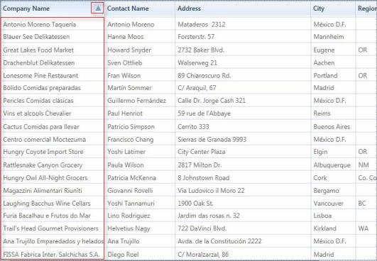

## Filters

Essential Grid allows you to restrict the display of records using a mechanism called Filters. A filter lets you to extract a subset of records that meet certain filter criteria. Filters can be applied to one or more columns.

### Functions

* Apply Filters
* Enable/Disable Filters
* Filters Collection

Now, let us see these functionalities one-by-one in detail.

### Apply Filters

When this feature is enabled, every column header displays a filter icon. Clicking this icon opens a drop-down list, which is actually a Checked List Box control that holds the possible values for the column clicked. To filter the data by a specific value, just select the check box that prefixes the desired value. This is then reload the grid with only those records, which has the selected value on the particular column. The filter drop-down also provides a SelectAll option either to select or deselect all the values at once.

### Enable/Disable Filters

It is possible to turn on and turn off the filters in specific column or in all the columns as a whole. To enable filters in all the columns, the Grid.ShowFilters must be set to true. To turn on the filters for specific column, simply set its AllowFilter property to true.

The following are the code snippets that illustrate this property:

Enable Filter for the Whole Grid



<syncfusion:GridDataControl x:Name="dataGrid"  AutoPopulateColumns="True"    AutoPopulateRelations="False"  ItemsSource="{StaticResource customerSource}" ShowFilters="True" />



#### Enable Filter for Single Column



<syncfusion:GridDataControl x:Name="dataGrid" AutoPopulateColumns="False" AutoPopulateRelations="False"  ItemsSource="{StaticResource customerSource}">

   <syncfusion:GridDataControl.VisibleColumns>

      <syncfusion:GridDataVisibleColumn MappingName="CustomerID" HeaderText="CustomerID"/>

      <syncfusion:GridDataVisibleColumn MappingName="CompanyName" HeaderText="CompanyName" AllowFilter="True" />

      <syncfusion:GridDataVisibleColumn MappingName="ContactTitle" HeaderText="ContactTitle" />

   </syncfusion:GridDataControl.VisibleColumns>

</syncfusion:GridDataControl>



The following image shows a GridData control with filter feature enabled for "CompanyName" column:

CompanyName in GridData control is now enabled with filtering feature.

Here is an example code that enables filter on all the columns:



<syncfusion:GridDataControl x:Name="dataGrid"  AutoPopulateColumns="True"    AutoPopulateRelations="False"  ItemsSource="{StaticResource customerSource}"

ShowFilters="True" />



The following image illustrates the columns, filtered against the criteria ContactTitle=’Accounting Manager'.

### Filters Collection

All the filters for a particular column are managed by VisibleColumn.Filters property. You can apply or  clear any number of filters by adding or removing the appropriate entries from this collection.

The following code illustrates the addition of a filter to the column 'ContactTitle'.



<syncfusion:GridDataVisibleColumn MappingName="ContactTitle" HeaderText="ContactTitle">

<syncfusion:GridDataVisibleColumn.Filters>

	<syncfusion:GridDataFilterPredicate FilterType="StartsWith" FilterValue="Sales" IsCaseSensitive="False" />

</syncfusion:GridDataVisibleColumn.Filters>

</<syncfusion:GridDataVisibleColumn>



## Advanced Filtering

This feature provides advanced filtering options for the end-user. It overrides the default filter and displays an advanced filter drop-down that lists the available filter operators for the respective filtering column and provides a text box, where the user is allowed to type the filter string. It exhibits a dynamic filtering mechanism by applying filter as the characters are typed.

### APIs Used 

This advanced filter pane comes in following two forms. 

* GridDataTextFilteringPane, which can be used with any column type
* GridDataInt32SliderFilteringPane, which works only with integer columns

### Filter Operators

The filter combo is the place where you get the available list of filter operators supported for  the corresponding column type.  The following table provides the list of filter choices for each column type.

_Filter Choices_

<table>
<tr>
<th>
Column Type</th><th>
Filter Choices</th></tr>
<tr>
<td>
String</td><td>
StartsWithEndsWithContainsEqualsNotEquals</td></tr>
<tr>
<td>
Int32 /DateTime</td><td>
LessThanLessThanOrEqualGreaterThanGreaterThanOrEqualEqualNotEqual</td></tr>
</table>

The GridDataTextFilteringPane, which is common to all column types, associate appropriate filter choice list according to the type of the column. When GridDataInt32SliderFilteringPane is used, the filter combo is always loaded with Int32 filter choices.

### Clearing Filter

To clear any filter, you can simply erase the characters from filter text box. If you are using SliderFilteringPane, select the “None” option from the filter combo in order to clear the filter.

### Customization Options

The Filtering Pane classes provide different customization properties that assist you to customize the filtering pane. These properties are described below:

_Properties_

<table>
<tr>
<th>
Customization Property</th><th>
Description</th></tr>
<tr>
<td>
Background</td><td>
Brush for filter pane background</td></tr>
<tr>
<td>
Foreground</td><td>
Brush for filter pane foreground</td></tr>
<tr>
<td>
PredicateType</td><td>
Specifies the predicate type: OR (or) AND</td></tr>
<tr>
<td>
CurrentFilterType</td><td>
Specifies the filter operator to be used for the filter column</td></tr>
<tr>
<td>
MatchCase</td><td>
Boolean property; when {{'_true_'|markdownify }}, performs case-sensitive filtering</td></tr>
</table>
The filtering panes are optional. It is possible to enable the filtering panes feature in few specific columns and allow other columns to use the default filter.

To enable this feature, you can simply attach an object of the desired filtering pane to the corresponding visible column. The columns that does not have this specification use the default filtering mechanism. It is obvious that the AllowFilter property of the visible column should be set to true in both the cases.

#### Example

Let us see some code examples that set up the two kinds of filtering panes. 



<syncfusion:GridDataControl x:Name="dataGrid" ShowAddNewRow="False" AutoPopulateColumns="False" AutoPopulateRelations="False"  

ItemsSource="{StaticResource orderSource}" ShowColumnOptions="True">

    <syncfusion:GridDataControl.VisibleColumns>

        <syncfusion:GridDataVisibleColumn MappingName="OrderID"/>

        <!--Frieght column using Slider Filtering Pane.-->

        <syncfusion:GridDataVisibleColumn MappingName="Freight" AllowFilter="True">

            <syncfusion:GridDataVisibleColumn.FilterPane>

                <syncfusion:GridDataInt32SliderFilteringPane />

            </syncfusion:GridDataVisibleColumn.FilterPane>

        </syncfusion:GridDataVisibleColumn>

        <!--ShipCountry column using Text Filtering Pane with the Foreground and PredicateType properties set.-->

        <syncfusion:GridDataVisibleColumn MappingName="ShipCountry" AllowFilter="True">

            <syncfusion:GridDataVisibleColumn.FilterPane>

                <syncfusion:GridDataTextFilteringPane IsThemed="True" Foreground="Black" PredicateType="And" />

            </syncfusion:GridDataVisibleColumn.FilterPane>

        </syncfusion:GridDataVisibleColumn>

        <!--ShipCountry column using Text Filtering Pane with the Background and CurrentFilterType properties set.-->

        <syncfusion:GridDataVisibleColumn MappingName="ShipCity" AllowFilter="True">

            <syncfusion:GridDataVisibleColumn.FilterPane>

                <syncfusion:GridDataTextFilteringPane IsThemed="False"  Background="Orange" CurrentFilterType="GreaterThan" />

            </syncfusion:GridDataVisibleColumn.FilterPane>

        </syncfusion:GridDataVisibleColumn>

    </syncfusion:GridDataControl.VisibleColumns>

</syncfusion:GridDataControl>



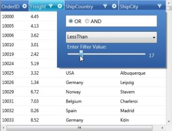

## Grid FilterBar

Essential Grid supports FilterBar, which filters the records with different expressions depending upon the Column type. The FilterBar is displayed at the top of the Grid below the Header Row by setting the “ShowFilterBar” property to true in GridDataControl class. The filtering tokens are tabulated in the Tokens to filter the value table.

### Use Case Scenarios

FilterBar can be used for applications for which the user wants to filter the Grid at run time. 

Adding FilterBar to an Application 

This topic explains the implementation of the FilterBar in an application. The following steps explain the implementation of FilterBar support in an application. 

1. Creating an application

   Create a WPF application and add GridDataControl to it. 

2. Setting the FilterBar Property

   Set the FilterBar property to “true” for the GridDataControl object.  The Filter status message can be viewed by enabling the property ShowFilterStatusMessage.  The filtering mode can be set to Immediate or OnEnter by setting the Enum property GridDataFilterBarMode.  The following code snippet explains the implementation of the FilterBar.

   ~~~ csharp

		this.dataGrid.ShowFilterBar = true;

		this.dataGrid.ShowFilterStatusMessage = true;

		this.dataGrid.FilterBarMode = GridDataFilterBarMode.Immediate;

		//this.dataGrid.FilterBarMode = GridDataFilterBarMode.OnEnter;

   ~~~

   ~~~ vbnet

		Me.dataGrid.ShowFilterBar = True

		Me.dataGrid.ShowFilterStatusMessage = True

		Me.dataGrid.FilterBarMode = GridDataFilterBarMode.Immediate

		'Me.dataGrid.FilterBarMode = GridDataFilterBarMode.OnEnter

   ~~~

3. Run the application and use the filtering tokens in the FilterBar. The valid tokens are listed in Tokens to filter the value table. The following is a sample output of FilterBar implementation.

   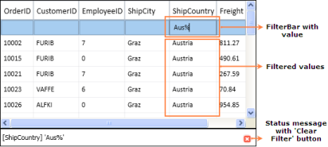

4. Clearing the Filter

   The Current filter value with the column name is displayed at the bottom of the GridDataControl (just like status bar). It contains the button (red color) called “Clear Filter”, which is used to clear the entire filter and show the default level records. 

  
### Tables for Properties, Methods, and Events

### Properties

FilterBar Support Table

<table>
<tr>
<th>
Property</th><th>
Description</th><th>
Data Type</th><th>
Default value</th><th>
Class Name</th></tr>
<tr>
<td>
ShowFilterBar</td><td>
Shows the FilterBar, if it is true.</td><td>
Boolean </td><td>
False</td><td>
GridDataControl</td></tr>
<tr>
<td>
ShowFilterStatusMessage</td><td>
Shows the message at the bottom of the grid depending on the current Filter applied, if it is true.</td><td>
Boolean </td><td>
True</td><td>
GridDataControl</td></tr>
<tr>
<td>
FilterBarMode</td><td>
Filter result is shown immediately if "Immediately" is set and is shown on pressing the Enter key  if "OnEnter" is set</td><td>
Enum </td><td>
Immediate</td><td>
GridDataControl</td></tr>
<tr>
<td>
FilterBarMode</td><td>
 Filter result is shown immediately if "Immediately" is set and is shown on pressing the Enter key  if "OnEnter" is set</td><td>
Enum </td><td>
Immediate</td><td>
GridDataVisibleColumn</td></tr>
</table>

### Tokens to Filter the Value

FilterBar Support Table

<table>
<tr>
<th>
Filter Token</th><th>
Examples(should be used as like below)</th><th>
Description</th><th>
Used at</th></tr>
<tr>
<td rowspan = "2">
%</td><td>
value%</td><td>
StartsWith</td><td>
AlphaNumeric</td></tr>
<tr>
<td>
%value</td><td>
EndsWith</td><td>
AlphaNumeric</td></tr>
<tr>
<td>
#</td><td>
#value</td><td>
Contains</td><td>
AlphaNumeric</td></tr>
<tr>
<td>
&lt;</td><td>
&lt;value</td><td>
LessThan</td><td>
Numeric & DateTime</td></tr>
<tr>
<td>
&lt;=</td><td>
&lt=value</td><td>
LessThanOrEqual</td><td>
Numeric & DateTime</td></tr>
<tr>
<td>
&gt;</td><td>
&gt;value</td><td>
GreaterThan</td><td>
Numeric & DateTime</td></tr>
<tr>
<td>
&gt;=</td><td>
&gt;=value</td><td>
GreaterThanOrEqual</td><td>
Numeric & DateTime</td></tr>
<tr>
<td>
=</td><td>
=value</td><td>
Equals</td><td>
Numeric & DateTime</td></tr>
<tr>
<td>
!</td><td>
!value</td><td>
Not Equals</td><td>
Numeric & DateTime</td></tr>
<tr>
<td>
and</td><td>
&gt;value and &lt;=value&gt;value and &lt;value&gt;=value and &lt;value&gt;=value and &lt;=value</td><td>
between</td><td>
Numeric & DateTime</td></tr>
<tr>
<td>
or</td><td>
&gt;value or &lt;=value&gt;value or &lt;value&gt;=value or &lt;value&gt;=value or &lt;=value</td><td>
between</td><td>
Numeric & DateTime</td></tr>
<tr>
<td>
0</td><td>
0</td><td>
Equals</td><td>
Boolean</td></tr>
<tr>
<td>
1</td><td>
1</td><td>
Equals</td><td>
Boolean</td></tr>
</table>

*values can be entered in any format (not case sensitive)

### Sample Link

Refer to the samples in the shipped Sample Browser. 

Go to Essential Studio WPF Sample Browser  Grid  GridDataControl-AdvancedFilterBarDemo.

### Dropdown FilterBar

Dropdown FilterBar feature is similar to Text Box Filter instead of entering the key word the dropdown button can be used to filter the items.

To filter items using Dropdown Filter

The Dropdown button is used to filter the required items. We have to set the FilterBarStyle to change the FilterBar cell type.



<syncfusion:GridDataVisibleColumn MappingName="EmployeeID" HeaderText="Employee ID">

     <syncfusion:GridDataVisibleColumn.ColumnStyle>

<syncfusion:GridDataColumnStyle CellType="IntegerEdit        " HorizontalAlignment="Right">

                  </syncfusion:GridDataColumnStyle>

                  </syncfusion:GridDataVisibleColumn.ColumnStyle>

                       <syncfusion:GridDataVisibleColumn.FilterBarStyle>

                           <syncfusion:GridDataFilterBarStyle CellType="ComboBox" />

                       </syncfusion:GridDataVisibleColumn.FilterBarStyle>

 </syncfusion:GridDataVisibleColumn>



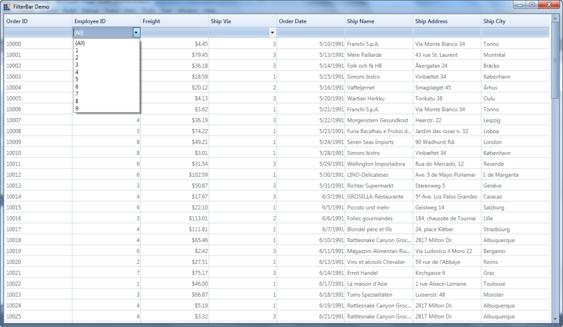

### Properties, Methods and Events tables

### Properties

<table>
<tr>
<th>
Property</th><th>
Description </th><th>
Type </th><th>
Data Type </th><th>
Reference links </th></tr>
<tr>
<td>
CellType</td><td>
Used to select ComboBox or TextBox</td><td>
Dependency</td><td>
Enum</td><td>
NA</td></tr>
<tr>
<td>
ItemsSource</td><td>
Used to bind the external item source</td><td>
Dependency</td><td>
Object</td><td>
NA</td></tr>
<tr>
<td>
DisplayMember</td><td>
This decides which member should be displayed.</td><td>
Dependency</td><td>
String</td><td>
NA</td></tr>
<tr>
<td>
ValueMember</td><td>
Based on the value the items are filtered.</td><td>
Dependency</td><td>
String</td><td>
NA</td></tr>
<tr>
<td>
FilterBarStyle</td><td>
This property used to set the style of the filterbar for the corresponding visible column.</td><td>
Dependency</td><td>
GridDataFilterBarStyle</td><td>
NA</td></tr>
</table>

To Edit items in Dropdown list 

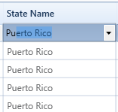

The behavior is similar to Auto-complete combo box.

### Property

<table>
<tr>
<th>
Method </th><th>
Description </th><th>
Parameters</th><th>
Return Type </th></tr>
<tr>
<td>
IsEditable</td><td>
 Combine an editable text field and provide users the additional option of typing an item and predict a word or phrase that the user wants to type in the associated text box without the user actually typing it completely.</td><td>
Dependency</td><td>
Boolean</td></tr>
</table>

## Paging Support for GridDataControl

Paging support is used to return pages of data with entries where selection of the pages can be done using the numbered buttons. There are 3 types:

* OnDemandPaging

Current page item source adding by OnDemand basis.  Using this we can fetch the data from the data source for the current page. 

* ViewLevelPaging

ItemsSource for the page load on Grid load. In this type sorting, filtering and grouping is applicable for the Current view element. Excel-like filtering is not applicable here.

* SourceLevelPaging

ItemsSource for the page load while grid load. In this type sorting, filtering and grouping is applicable for the whole collection. Excel-like filtering is not applicable here.

### Use Case Scenario

Paging Support is a very useful feature to load large amount of data. We can load millions of records in an efficient way.

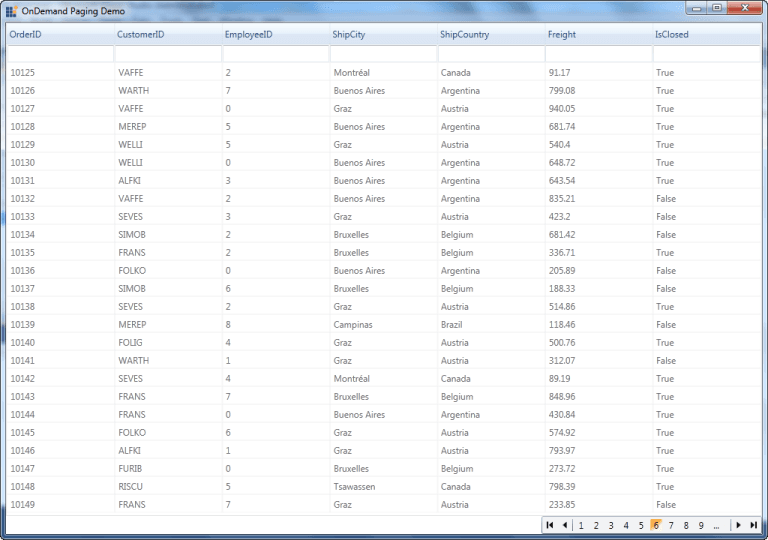

### Properties, Methods and Events tables

### Properties

<table>
<tr>
<th>
Property </th><th>
Description </th><th>
Type </th><th>
Data Type </th><th>
Reference links </th></tr>
<tr>
<td>
IsPagingOnDemand</td><td>
Loads the page based on demand</td><td>
NA</td><td>
Boolean</td><td>
NA</td></tr>
<tr>
<td>
EnablePaging</td><td>
When the property is set as true, it is loaded page wise</td><td>
NA</td><td>
Boolean</td><td>
NA</td></tr>
<tr>
<td>
IsViewLevelPaging</td><td>
It differentiated paging as view level or source level</td><td>
NA</td><td>
Boolean</td><td>
NA</td></tr>
<tr>
<td>
PageCount</td><td>
It sets the number of pages that can be viewed. This is valid only for OnDemandPage.</td><td>
NA</td><td>
Integer</td><td>
NA</td></tr>
<tr>
<td>
PageSize</td><td>
It sets the number of items to be displayed on a page.</td><td>
Dependency</td><td>
Integer</td><td>
NA</td></tr>
</table>

### Events

<table>
<tr>
<th>
Event </th><th>
Description </th><th>
Arguments </th><th>
Type </th><th>
Reference links </th></tr>
<tr>
<td>
OnDemandDataSourceLoad</td><td>
the event is triggered when it moves to the next page or when the page changes </td><td>
PagedRowsMaximumRows</td><td>
GridDataOnDemandPageLoadingEventArgs</td><td>
NA </td></tr>
</table>

### Features of Paging Support

#### OnDemandPaging

The GridDataControl supports paging on demand by specifying queries in order to get the paged records from a database. The records are displayed only when it is required. This sample retrieves fifty records from a database and displays them. Using this type we can fetch the data from the data source for the current page. The entire data is not needed to be fetched from the datasource. We can get high performance even if there are millions of records.



<syncfusion:DataPagerExt x:Name="dataPager" Grid.Row="1" HorizontalAlignment="Right" VerticalAlignment="Top" DisplayMode="PreviousNextNumeric" NumericButtonCount="10" AutoEllipsis="True" PageSize="25"/>





pager.PageCount = 400;

pager.IsPagingOnDemand = true;

pager.OnDemandDataSourceLoad += new GridDataOnDemandPageLoadingEventHandler(pager_OnDemandDataSourceLoad);

void pager_OnDemandDataSourceLoad(object sender, GridDataOnDemandPageLoadingEventArgs e)

{

   this.grid.ItemsSource = Get_Data(e.PagedRows, e.PagedRows + e.MaximumRows);

}



#### ViewLevelPaging

ViewLevel Sorting, grouping and filtering is provided. Allows to sort the view element. Sorting, filtering and grouping only for the Current page items. This type supports the Filter bar to filter the items. Advance filtering and Excel-like filtering is not applicable for this type.



<syncfusion:DataPagerExt x:Name="dataPager" Grid.Row="1" HorizontalAlignment="Right" VerticalAlignment="Top" DisplayMode="PreviousNextNumeric" NumericButtonCount="10" AutoEllipsis="True" PageSize="25"/>





var item = new NorthwindOrders(1000);

var itemlist = new PagedCollectionView(item);

pager.Source = itemlist;

grid.ItemsSource = itemlist;

grid.EnablePaging = true;

grid.IsViewLevelPaging = true;



#### SourceLevelPaging

Sorting, grouping and filtering are provided at the Source level. Allows to sort the view element. Sorting, filtering and grouping only for Whole collection. This type supports the Filter bar to filter the items. Advance filtering and Excel-like filtering is not applicable for this type.



<syncfusion:DataPagerExt x:Name="dataPager" Grid.Row="1" HorizontalAlignment="Right" VerticalAlignment="Top" DisplayMode="PreviousNextNumeric" NumericButtonCount="10" AutoEllipsis="True" PageSize="25"/>





var item = new NorthwindOrders(1000);

var itemlist = new PagedCollectionView(item);

pager.Source = itemlist;

grid.ItemsSource = itemlist;

grid.EnablePaging = true;

grid.IsViewLevelPaging = false;



## Details View

Essential Grid provides support to have a separate view for each record displayed in the grid called a details view. Every record bound to the Grid control can have some additional information about it. To display that information, you can define your own view and display it on demand whenever needed. The grid gets the view through DetailsViewTemplate and display it below every row. You can display or hide the details view of a row by using the expander available in the row header of the each row.

1. Instead of having all information in the grid initially, having abstract information initially and then displaying information on demand ensures fast performance and a compact UI look. 
2. By listening to the events, you can dynamically change the template based on the record or row.
3. By listening to the events, you can set constraints and block, expand, or collapse the view of a record or row.
4. Can create a tabbed UI to display the hierarchy information in a compact way.

### Use Case Scenarios

The details view can be used to create a compact UI to display a large amount of information. Information is displayed only on an on-demand basis. This separates the detailed information and abstract information, acting as a quick view and explorer for the required information. 

### Tables for Properties, Methods, and Events

### Properties

<table>
<tr>
<th>
Property </th><th>
Description </th><th>
Type </th><th>
Data Type </th></tr>
<tr>
<td>
DetailsViewTemplate</td><td>
Get the user-defined UI of the details view in the form of DataTemplate. This is the core input to have the details view in the GridData control.</td><td>
Dependency property </td><td>
DataTemplate </td></tr>
</table>

### Methods

N> The following methods are available in GridDataControl.Model.Table.

<table>
<tr>
<th>
Methods </th><th>
Description </th><th>
Parameters </th><th>
Type </th><th>
Return Type </th></tr>
<tr>
<td>
ExpandAllDetailsView</td><td>
Using this method, the DetailsView of all records can be expanded. When you want to expand all the details views at the same time you can use this method.</td><td>
</td><td>
</td><td>
Void </td></tr>
<tr>
<td>
ExpandDetailsViewAt</td><td>
Using this method, the DetailsView of a particular record can be expanded.this method gets the record index as an input argument and expand the details view of the corresponding record.</td><td>
Record Index</td><td>
int</td><td>
Void</td></tr>
<tr>
<td>
CollapseAllDetailsView</td><td>
Using this method, you can collapse all expanded details view at the same time.</td><td>
</td><td>
</td><td>
Void</td></tr>
<tr>
<td>
CollapseDetailsViewAt</td><td>
Using this method, you can collapse the details view of a particular record. This method gets the record index as an input argument and collapse the details view of the corresponding record.</td><td>
Record Index</td><td>
int</td><td>
Void</td></tr>
</table>

### Events

N> The following events are available in GridDataControl.Model.Table.

<table>
<tr>
<th>
Events </th><th>
Description </th><th>
Arguments </th><th>
Type </th></tr>
<tr>
<td>
DetailsViewExpanding</td><td>
this event triggers before the DetailsView is expanded.this event is a cancelable event. By canceling this event, the corresponding DetailsView remains collapsed.  </td><td>
GridDataDetailsViewExpandingEventArgs</td><td>
Routed Event </td></tr>
<tr>
<td>
DetailsViewExpanded</td><td>
this event is triggered after the DetailsView is expanded. </td><td>
GridDataDetailsViewExpandedEventArgs</td><td>
Routed Event</td></tr>
<tr>
<td>
DetailsViewCollapsing</td><td>
this event is triggered before the DetailsView is collapsed. this event is a cancelable event. By canceling this event, the corresponding DetailsView remains expanded.</td><td>
GridDataValueCancelEventArgs&lt;GridDataRecord&gt;</td><td>
</td></tr>
<tr>
<td>
DetailsViewCollapsed</td><td>
this event gets triggered after the DetailsView get collapsed. </td><td>
GridDataValueEventArgs&lt;GridDataRecord&gt;</td><td>
</td></tr>
</table>

####  Sample Link

To view samples: 

1. Select Start > Programs > Syncfusion > Essential Studio x.x.xx > Dashboard.
2. Click Run Samples for WPF in the User Interface Edition panel.
3. Select GridDataControl.
4. Expand the Appearance Features item in the Sample Browser.
5. Choose the Details View Demo sample

### Adding Details View to an Application 

One can easily add the details view to the GridData control by defining the DetailsViewTemplate and binding it to the corresponding GridData control. In the following procedure we have bound the GridData control with a list of product information and created a details view template and bound it to the GridData control.

1. Bind an items source to the grid. Refer to the following link for more information about binding items source to the grid. [Data Binding](http://help.syncfusion.com/wpf/griddata/data-binding)
2. Define a data template for the details view. You can bind the data by fetching it through Record.Data (data is the underlying object bound).

   ~~~ xaml

		<DataTemplate x:Key="EditableView">
		
			<Border HorizontalAlignment="Left" BorderThickness="0.5" BorderBrush="Gray" CornerRadius="2" ClipToBounds="True">

				<Grid Margin="5" Width="300" HorizontalAlignment="Left">
				
				<Grid.ColumnDefinitions>
				
					<ColumnDefinition Width="0.5*"/>
					
					<ColumnDefinition Width="0.5*"/>
					
				</Grid.ColumnDefinitions>
				
				<Grid.RowDefinitions>

					 <RowDefinition Height="Auto"/>                        

					<RowDefinition Height="Auto"/>

					<RowDefinition Height="Auto"/>
					                        
					<RowDefinition Height="Auto"/>
					                        
					<RowDefinition Height="Auto"/>
					                        
					<RowDefinition Height="Auto"/>
					                        
					<RowDefinition Height="Auto"/>
					                        
					<RowDefinition Height="Auto"/>
					                        
					<RowDefinition Height="Auto"/>

   			   </Grid.RowDefinitions>
				
				<Grid>

    		        <Label Content="Supplier Info" Grid.Row="0" Grid.Column="0" Grid.ColumnSpan="2" HorizontalAlignment="Center" VerticalAlignment="Top" Margin="2" FontSize="13" FontWeight="Bold"/>
					                    
					<TextBlock Text="Company" FontWeight="Bold" Margin="0,5,5,0" Grid.Row="1" Grid.Column="0" />
					                    
					<TextBox Text="{Binding Record.Data.Suppliers.CompanyName}" Margin="0,5,0,0" Grid.Row="1" Grid.Column="1" />
					                    
					<TextBlock Text="Contact Person" FontWeight="Bold" Margin="0,5,5,0" Grid.Row="2" Grid.Column="0" />
					                    
					<TextBox Text="{Binding Record.Data.Suppliers.ContactName}" Margin="0,5,0,0" Grid.Row="2" Grid.Column="1" />
					                    
					<TextBlock Text="Title" FontWeight="Bold" Margin="0,5,5,0" Grid.Row="3" Grid.Column="0" />
					                    
					<TextBox Text="{Binding Record.Data.Suppliers.ContactTitle, Mode=OneTime}" Margin="0,5,0,0" Grid.Row="3" Grid.Column="1" />
					                    
					<TextBlock Text="Address" FontWeight="Bold" Margin="0,5,5,0" Grid.Row="4" Grid.Column="0" />
					                    
					<TextBox Text="{Binding Record.Data.Suppliers.Address}" Margin="0,5,0,0" Grid.Row="4" Grid.Column="1" />
					                    
					<TextBlock Text="City" FontWeight="Bold" Margin="0,5,5,0" Grid.Row="5" Grid.Column="0" />
					                    
					<TextBox Text="{Binding Record.Data.Suppliers.City}" Margin="0,5,0,0" Grid.Row="5" Grid.Column="1" />

					<TextBlock Text="Postal Code" FontWeight="Bold" Margin="0,5,5,0" Grid.Row="6" Grid.Column="0" />
					                    
					<TextBox Text="{Binding Record.Data.Suppliers.PostalCode}" Margin="0,5,0,0" Grid.Row="6" Grid.Column="1" />
					                    
					<TextBlock Text="Country" FontWeight="Bold" Margin="0,5,5,0" Grid.Row="7" Grid.Column="0" />
					                    
					<TextBox Text="{Binding Record.Data.Suppliers.Country}" Margin="0,5,0,0" Grid.Row="7" Grid.Column="1" />
					                    
					<TextBlock Text="Phone" FontWeight="Bold" Margin="0,5,5,0" Grid.Row="8" Grid.Column="0" />
					                    
					<TextBox Text="{Binding Record.Data.Suppliers.Phone}" Margin="0,5,0,0" Grid.Row="8" Grid.Column="1" />

			 </Grid>

		 </Border>

	 </DataTemplate>

   ~~~

3. Bind the defined data template to the GridData control.

   ~~~ xaml

		<syncfusion:GridDataControl x:Name="dataGrid"
		
						Grid.Row="0"
						
						UpdateMode="PropertyChanged"
						
						AutoPopulateColumns="True"
						
						ColumnSizer="AutoOnLoad"
						
						AutoPopulateRelations="False"
						
						ShowGroupDropArea="True"
						
						IsGroupsExpanded="True"
						
						ItemsSource="{Binding ProductList}"
						
						ShowAddNewRow="False"
						
						ShowFilterBar="False"
						
						UnboundRowPosition="Top"
						
						ShowErrorTooltips="True"
						
						 DetailsViewTemplate="{StaticResource EditableView}"
						
						VisualStyle="Office14Blue"/>

   ~~~
			  
   ~~~ csharp

		/// Initializing ViewModel

		ViewModel viewModel = new ViewModel();

		/// Initializing GridDataControl

		GridDataControl dataGrid = new GridDataControl();

		/// Assigning ItemsSource

		dataGrid.ItemsSource = viewModel.ProductList;

		dataGrid.AutoPopulateColumns = true;

		dataGrid.AutoPopulateRelations = false;

		/// Assigning DetailsViewTemplate

		dataGrid.DetailsViewTemplate = (DataTemplate)this.Resources["EditableView"];

   ~~~

4. Click on the expander cell in the grid to expand or collapse the details view of that particular record or row.

   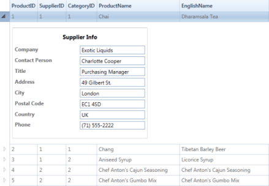

   

## Column Drag and Drop

Grid allows you to rearrange the columns by a simple drag-and-drop. Once enabled, this feature lets you drag and drop any number of column headers from one position to another and thus lets you rearrange the grid columns.

You can turn on this feature at grid level for all the columns, by setting the grid.AllowDragColumns property to true. It is also possible to control dragging at column level. Setting the AllowDrag property of the respective visible columns to true enables column dragging on those columns. This is illustrated in the following code example.

The following code illustrates dragging at grid level:



<syncfusion:GridDataControl x:Name="grid" AllowDragColumns="True" ItemsSource="{StaticResource orderSource}" ShowColumnOptions="True" />



The following code illustrates dragging at column level:



<syncfusion:GridDataControl x:Name="grid" AutoPopulateColumns="False"  AutoPopulateRelations="False" ItemsSource="{StaticResource orderSource}" ShowColumnOptions="True" >

    <syncfusion:GridDataControl.VisibleColumns>

        <syncfusion:GridDataVisibleColumn MappingName="OrderID" HeaderText="Order ID" AllowDrag="True" />

        <syncfusion:GridDataVisibleColumn MappingName="CustomerID" HeaderText="Customer ID" AllowDrag="False" />

        <syncfusion:GridDataVisibleColumn MappingName="EmployeeID" HeaderText="Employee ID" AllowDrag="True"/>

        <syncfusion:GridDataVisibleColumn MappingName="ShipName" HeaderText="ShipName" AllowDrag="True"/>

    </syncfusion:GridDataControl.VisibleColumns>

</syncfusion:GridDataControl>



The following screenshot illustrates column level dragging:

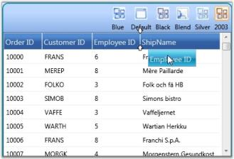

### Customizing the Drag Indicator

Grid also provides properties that let you modify the color of the drag indicators. 

The following code illustrates changing the color of drag indicator:



dataGrid.Model.TableProperties.DragIndicatorInnerBrush = Brushes.Orange;

dataGrid.Model.TableProperties.DragIndicatorOuterBrush = Brushes.Black;



## Column Options

The GridData control provides support to customize the individual columns in the grid by using the Column Options feature. The customization options are wrapped up into a panel that pops up on clicking the ColumnOptions icon in the column header, so that the users can work with them in an interactive manner. With this feature now available, you can toggle the customization options within seconds, without writing much code.

You can enable or disable this feature by using the ShowColumnOptions property of the GridData control.





<syncfusion:GridDataControl x:Name="dataGrid" ShowColumnOptions="True" ItemsSource="{StaticResource orderSource}" >

</syncfusion:GridDataControl>





this.dataGridControl.ShowColumnOptions = true;





The following screenshot illustrates how the ColumnOptions icon is displayed for individual columns.

### Customization Options

The following are the column customization options provided by the GridData control.

Column Option

<table>
<tr>
<th>
Column Option</th><th>
Description</th></tr>
<tr>
<td>
Allow Filter</td><td>
Selecting this check box, enables filtering on the respective column. To enable "filtering" on all the columns in the grid at once, set the ShowFilters property to true.</td></tr>
<tr>
<td>
Allow Sort</td><td>
Selecting this check box, enables sorting when the user clicks on the column header of the respective column. To enable "sorting" on all the columns in the grid at once, set the AllowSort property to _true_.</td></tr>
<tr>
<td>
Allow Drag</td><td>
Selecting this check box, enables you to rearrange columns in the grid by dragging the desired column headers. Also you can group the columns by dragging the column headers onto the Group Drop Area. Note that the "Allow Group" option must be set to _true_ for this to take effect.To enable "drag-and-drop" feature on all the columns in the grid at once, set the AllowDragColumns property to _true_.</td></tr>
<tr>
<td>
Allow Group</td><td>
Selecting this check box, enables you to create groups at run time by dragging column headers onto the Group Drop Area. Note that the "Allow Drag" option must be set to _true_ for this to take effect.To enable "grouping" on all the columns in the grid at once, set the ShowGroupDropArea to {{ '_true_' | markdownify }}.</td></tr>
<tr>
<td>
Allow Resize</td><td>
Selecting this check box, enables you to resize columns in the grid, by pressing and dragging the "mouse-resize" pointer that is displayed over the column divider. To enable the "resizing" operation on all the columns in the grid at once, set the AllowResizeColumns property to _true_.</td></tr>
<tr>
<td>
Is ReadOnly</td><td>
Selecting this check box, makes the respective column read-only, allowing no edits to be performed on the column. To enable the "editing" operation on all the columns in the grid at once, set the AllowEdit property to _true_.</td></tr>
<tr>
<td>
Column Format</td><td>
This drop-drown menu lists the available data formats for the respective columns types.</td></tr>
<tr>
<td>
Text Alignment</td><td>
This option enables to align text both horizontally and vertically.</td></tr>
<tr>
<td>
Auto Fit</td><td>
Selecting this check box, adjusts the width of the corresponding column to fit its content and clearing it resets the column width to its default value (i.e., DefaultColumnWidth value). Note that you must click the Apply width settings button for this option to take effect.</td></tr>
<tr>
<td>
Width</td><td>
You can select the appropriate width for the respective column by pressing and dragging the slider handle with the mouse and clicking the Apply width settings button.</td></tr>
</table>

## ColumnBasedSizing

ColumnBasedSizing enables you to set width of visible columns based on available width. This feature is useful when column sizing is required for columns based on available width, cell content. Feature can be used when GridDataControl VisibleColumns are set individually with specific widths.

### Applying Width Value  

Columns are sized based on values users set. 

Allowed width values are:

* SizeToCells
* SizeToHeader
* Auto

N> You can also provide numeric values for *, where * can be preceded by any double value.

The following code illustrates how to set the Width property of GridDataVisibleColumn.



Width Value set to Star:
<syncfusion:GridDataVisibleColumn MappingName="OrderID" Binding="{Binding OrderID}" Width="1.2*"/>

Width value set to “Double”
<syncfusion:GridDataVisibleColumn MappingName="CustomerID" Width="40" >
</syncfusion:GridDataVisibleColumn>

Width value set to “SizeToCells”                   
<syncfusion:GridDataVisibleColumn MappingName="EmployeeID" Width="SizeToCells" Binding="{Binding EmployeeID}"/>

Width value set to "SizeToHeader”
<syncfusion:GridDataVisibleColumn MappingName="ShipName" Width="SizeToHeader" Binding="{Binding ShipName}"/>
</syncfusion:GridDataControl.VisibleColumns>



Define the Width, by using the following code.



Width = new GridDataControlLength(value, GridControlLengthUnitType.Star); 

//(or)
Width = new GridDataControlLength(value); 



### Property Details

The following table consists of the property details.

<table>
<tr>
<th>
Name of the Property</th><th>
Description</th><th>
Type of Property</th><th>
Value It Accepts</th><th>
Property Syntax</th></tr>
<tr>
<td>
ActualWidth</td><td>
GridDataVisibleColumn’s actual width in double value. Users can only get the value.</td><td>
Normal</td><td>
Double</td><td>
VisibleColumn.ActualWidth  </td></tr>
<tr>
<td>
Width</td><td>
Holds the width value for GridDataVisibleColumn  in units of GridDataControlLength  </td><td>
Dependency property</td><td>
GridDataControlLength</td><td>
visibleColumn.Width=new GridDataControlLength(value, GridControlLengthUnitType);</td></tr>
<tr>
<td>
MaxLength</td><td>
Holds the value for maximum records to be considered while calculating cell content size. Default value is 1000. Set as -1 to consider all values.</td><td>
Normal</td><td>
int</td><td>
MaxLength</td></tr>
</table>

## Summaries

GridDataControl provides support to add additional rows at the bottom of the grid table. Such rows are fixed and are used to brief information about the grid data, called Summaries. For instance, you can display the record count or maximum value as summary.

The following are the built-in summary types supported by grid. They are otherwise called as basic summaries.

* CountAggregate
* Int32Aggregate
* DoubleAggregate
* CustomAggregate (used with custom summaries)

### SummaryRows Collection

Grid provides three kinds of SummaryRows collections – SummaryRows, TableSummaryRows and CaptionSummaryRows, in order to separate the summary kinds. This collection stores all the summaries for a given grid, in which each entry corresponds to a summary row holding the various summary details such as summary title, summary style, its visibility, and more importantly the SummaryColumns collection.

SummaryColumns Collection

Every summary row contains a corresponding SummaryColumns collection. This collection stores the group of columns whose values are used for the summary calculation. As this is a collection of columns, you could infer that summaries can be calculated from more than one column. This collection explores the properties that are essential for generating summary information. The following are some of the properties that are used to generate the summary information.

* MappingName: mapping name of the column used
* Format: summary format, for example, "{SUM=##.00}"
* SummaryType: built-in summary type

This section comprises the following topics:

### Creating Summaries

The following steps illustrate how to create a Summary.

1. Define the summary column that is used to calculate the summary. 
2. Then define a summary row and associate the above summary column with this summary row.
3. Finally add the summary row into the corresponding SummaryRows collection. Make sure that the appropriate summary type is enabled.

These steps have been clearly explained for individual summary types.



Group Summaries

Table Summaries

Caption Summaries

Custom Summaries



###  Summary Types

Essential Grid supports the following summary types.

### Group Summaries

As the name implies, the Group Summary is associated with every grid group. The GridDataControl.SummaryRows manages summaries of this type. It provides support to add multiple summaries, i.e., you can have more than one summary row for every group. These summaries are enabled by setting the ShowGroupSummaries property to _true_.





<syncfusion:GridDataControl x:Name="dataGrid" ShowGroupDropArea="True" AutoPopulateRelations="False" ShowAddNewRow="False"

ItemsSource="{StaticResource ordersSource}" ShowGroupSummaries="True">

<syncfusion:GridDataControl.SummaryRows>

<syncfusion:GridDataSummaryRow ShowSummaryInRow="True" Title="Total Freight: {FreightSummary} For {CountSummary} Items" TitleColumnCount="2">

<syncfusion:GridDataSummaryRow.SummaryColumns>

<syncfusion:GridDataSummaryColumn Name="FreightSummary" MappingName="Freight" SummaryType="Int32Aggregate"

Format="'{Sum:c}'"/>

<syncfusion:GridDataSummaryColumn Name="CountSummary" MappingName="OrderDate" SummaryType="CountAggregate"

Format="'{Count:d}'"/>

</syncfusion:GridDataSummaryRow.SummaryColumns>

</syncfusion:GridDataSummaryRow>

</syncfusion:GridDataControl.SummaryRows>

</syncfusion:GridDataControl>





this.dataGrid.SummaryRows.Add(new GridDataSummaryRow()

{

    ShowSummaryInRow = true,

    Title = "Total Freight: {FreightSummary} For {CountSummary} Items",

    TitleColumnCount = 2,

    SummaryColumns = new ObservableCollection<GridDataSummaryColumn>()

    {

        new GridDataSummaryColumn()

        { 

            Name = "FreightSummary", 

            MappingName="Freight", 

            SummaryType= GridDataSummaryType.Int32Aggregate, 

            Format="{Sum:c}"

        },

        new GridDataSummaryColumn()

        {

            Name = "CountSummary", 

            MappingName="OrderDate", 

            SummaryType= GridDataSummaryType.CountAggregate, 

            Format="{Count:d}"

        }

    }

});





### Combining Summary Column Values in the GridDataControl

GridDataControl enables to combine summary values in summary columns and display them in a single summary row.

For example, let us consider you want to combine the summaries from all the summary columns and display them in a single row, instead of displaying them in the individual summary columns. In such a case, you must set the ShowSummaryInRow property to _true_ and provide a proper summary title string specifying the combined summary value. The following code example illustrates this.



<syncfusion:GridDataControl.SummaryRows>

    <syncfusion:GridDataSummaryRow ShowSummaryInRow="True" Title="'Charges - {FreightSummary}$ for {OrderCount} Items'">

        <syncfusion:GridDataSummaryRow.RowStyle>

            <syncfusion:GridDataStyleInfo Background="Yellow" />

        </syncfusion:GridDataSummaryRow.RowStyle>

        <syncfusion:GridDataSummaryRow.SummaryColumns>

            <syncfusion:GridDataSummaryColumn Name="FreightSummary" MappingName="Freight" SummaryType="Int32Aggregate"

            Format="'{Sum:##.00}'" />

            <syncfusion:GridDataSummaryColumn Name="OrderCount" MappingName="OrderDate" SummaryType="CountAggregate"

            Format="'{Count}'" />

        </syncfusion:GridDataSummaryRow.SummaryColumns>

    </syncfusion:GridDataSummaryRow>

</syncfusion:GridDataControl.SummaryRows>





Table Summaries

Caption Summaries



### Table Summaries

The Table Summary is associated with the whole grid table itself. The GridDataControl.TableSummaryRows collection manages summaries of this type. It provides support to add multiple summaries. These summaries are enabled by setting the ShowTableSummaries property to true.



<syncfusion:GridDataControl x:Name="dataGrid" ShowGroupDropArea="True" AutoPopulateRelations="False" ShowAddNewRow="False"

ItemsSource="{StaticResource ordersSource}" ShowTableSummaries="True">

    <syncfusion:GridDataControl.TableSummaryRows>

        <syncfusion:GridDataSummaryRow ShowSummaryInRow="True" Title="Total Freight: {FreightSummary} For {CountSummary} Items"                   TitleColumnCount="2">

            <syncfusion:GridDataSummaryRow.SummaryColumns>

                <syncfusion:GridDataSummaryColumn Name="FreightSummary" MappingName="Freight" SummaryType="Int32Aggregate"

                Format="'{Sum:c}'" />

                <syncfusion:GridDataSummaryColumn Name="CountSummary" MappingName="OrderDate" SummaryType="CountAggregate"

                Format="'{Count:d}'" />

            </syncfusion:GridDataSummaryRow.SummaryColumns>

        </syncfusion:GridDataSummaryRow>

    </syncfusion:GridDataControl.TableSummaryRows>

</syncfusion:GridDataControl>





this.dataGrid.TableSummaryRows.Add(new GridDataSummaryRow()

{

    ShowSummaryInRow = true,

    Title = "Total Freight: {FreightSummary} For {CountSummary} Items",

    TitleColumnCount = 2,

    SummaryColumns = new ObservableCollection<GridDataSummaryColumn>()

    {

        new GridDataSummaryColumn()

        { 

            Name = "FreightSummary", 

            MappingName="Freight", 

            SummaryType= GridDataSummaryType.Int32Aggregate, 

            Format="{Sum:c}"

        },

        new GridDataSummaryColumn()

        {

            Name = "CountSummary", 

            MappingName="OrderDate", 

            SummaryType= GridDataSummaryType.CountAggregate, 

            Format="{Count:d}"

        }

    }

});


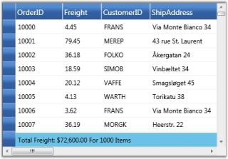



Group Summaries

Caption Summaries



## Caption Summaries

Grid provides built-in support for caption summaries, where the summary values are displayed in the group caption cells. You can have only one caption summary row for a grid table. The GridDataControl.CaptionSummaryRow property is used to set up a caption summary. The caption summary is enabled by setting the ShowGroupSummaryInCaption property to true.



<syncfusion:GridDataControl x:Name="dataGrid" ShowGroupDropArea="True" AutoPopulateRelations="False" ShowAddNewRow="False"

ItemsSource="{StaticResource ordersSource}" ShowGroupSummaryInCaption="True">

    <syncfusion:GridDataControl.CaptionSummaryRow>

        <syncfusion:GridDataSummaryRow ShowSummaryInRow="True" Title="Total Freight: {FreightSummary} For {CountSummary} Items"                   TitleColumnCount="2">

            <syncfusion:GridDataSummaryRow.SummaryColumns>

                <syncfusion:GridDataSummaryColumn Name="FreightSummary" MappingName="Freight" SummaryType="Int32Aggregate"

                Format="'{Sum:c}'" />

                <syncfusion:GridDataSummaryColumn Name="CountSummary" MappingName="OrderDate" SummaryType="CountAggregate"

                Format="'{Count:d}'" />

            </syncfusion:GridDataSummaryRow.SummaryColumns>

        </syncfusion:GridDataSummaryRow>

    </syncfusion:GridDataControl.CaptionSummaryRow>

</syncfusion:GridDataControl>





this.dataGrid.ShowGroupSummaryInCaption = true;

this.dataGrid.CaptionSummaryRow = new GridDataSummaryRow()

{

    ShowSummaryInRow = true,

    Title = "Total Freight: {FreightSummary} For {CountSummary} Items",

    TitleColumnCount = 2,

    SummaryColumns = new ObservableCollection<GridDataSummaryColumn>()

    {

        new GridDataSummaryColumn()

        { 

            Name = "FreightSummary", 

            MappingName="Freight", 

            SummaryType= GridDataSummaryType.Int32Aggregate, 

            Format="{Sum:c}"

        },

        new GridDataSummaryColumn()

        {

            Name = "CountSummary", 

            MappingName="OrderDate", 

            SummaryType= GridDataSummaryType.CountAggregate, 

            Format="{Count:d}"

        }

    }

};





Group Summaries

Table Summaries



### Custom Summaries

You can also impose custom calculation logic for deriving summary information. This is done by implementing the IGridDataSummaryAggregate interface to define the custom logic, and associating this custom logic to the SummaryColumn.CustomAggregate property. The IGridDataSummaryAggregate interface aids in building user-defined logic for summary calculation. 

The following steps illustrate the functioning of the IGridDataSummaryAggregate interface.

1. First, you need to define a custom property to get and set the summary value.
2. Then implement the CalculateAggregateFunc interface method and in-place your own logic of calculating the summary value. It returns a System.Action<T1, T2, T3> delegate for the aggregate, where T1 represents the source list of items for which the summary needs to be calculated, T2 specifies the property (summary column) and T3 is the Property Descriptor of the custom aggregate class itself. The CalculateAggregateFunc calculates the summary value using these parameters, and assigns the final summary value to the custom property defined in the first step.

The following code example illustrates the partial implementation of the built-in Int32Aggregate that implements the IGridDataSummaryAggregate. It calculates the Sum value for a specific column.



class GridDataInt32Aggregate : IGridDataSummaryAggregate

{

public GridDataInt32Aggregate()

{

}

public int Sum

{

get;

set;

}

public Action<IEnumerable, string, PropertyDescriptor> CalculateAggregateFunc()

{

return (items, property, pd) =>

{

if(pd.Name == "Sum")

this.Sum = Convert.ToInt32(items.AsQueryable().Sum(property));

};

}

}



#### Example

This example uses the Stock Portfolio Database that has a column named "Change" that shows the rate of change of market value of the stocks. Let us consider, you need to display the Standard Deviation of the values of the "Change" column, industry-wise. This can be achieved by using a group summary as the grid is already grouped by Industry. Since the built-in summaries do not support this type of calculation, you have to create custom summaries and write custom code to calculate the standard deviation values. The following steps illustrate this.

1. Define the custom summary logic to calculate the standard deviation.

   ~~~ csharp

		public class CustomAggregate : IGridDataSummaryAggregate

		{

			public CustomAggregate()

			{

			}

			public double StdDev

			{

				get;

				set;

			}

			public Action<System.Collections.IEnumerable, string, System.ComponentModel.PropertyDescriptor> CalculateAggregateFunc()

			{

				return (items, property, pd) =>

				{

					var enumerableItems = items as IEnumerable<Quotes>;

					if (pd.Name == "StdDev")

					{

						this.StdDev = enumerableItems.StdDev<Quotes>(q => q.Change);

					}

				};

			}

		}

		public static class LinqExtensions

		{

			public static double StdDev<T>(this IEnumerable<T> values, Func<T, double?> selector)

			{

				double ret = 0;

				var count = values.Count();

				if (count > 0)

				{

					// Compute the Average

					double? avg = values.Average(selector);

					// Perform the Sum of (value-avg)^2

					double sum = values.Select(selector).Sum(d =>

					{

						if (d.HasValue)

						{

							return Math.Pow(d.Value - avg.Value, 2);

						}

						return 0.0;

					});

					// Put it all together

					ret = Math.Sqrt((sum) / (count - 1));

				}

				return ret;
			}

		}

   ~~~
   
2. Bind the custom summary instance to the grid summary calculation.

   ~~~ xaml

		<syncfusion:LayoutControl.LeftContent>

			<syncfusion:GridDataControl 

			ItemsSource="{Binding Source={StaticResource Quotes}}" 

			Name="gridDataControl1" 

			ShowGroupSummaries="True"

			ShowGroupSummaryInCaption="False"

			AutoPopulateColumns="True"

			AutoPopulateRelations="False"

			ShowAddNewRow="False"

			AllowEdit="False"

			AllowDelete="False">

				<syncfusion:GridDataControl.GroupedColumns>

					<syncfusion:GridDataGroupColumn ColumnName="Industry_IndustryID"  />

				</syncfusion:GridDataControl.GroupedColumns>

				<syncfusion:GridDataControl.SummaryRows>

					<syncfusion:GridDataSummaryRow Name="StdDev" ShowSummaryInRow="False" Title="'{Name} - {Count} Items'" TitleColumnCount="2">

						<syncfusion:GridDataSummaryRow.SummaryColumns>

							<syncfusion:GridDataSummaryColumn Name="StdDevCol" MappingName="Change" SummaryType="Custom" Format="'StdDev ({StdDev})'" CustomAggregate="{Binding Source={StaticResource stdDevAggregate}}">

								<syncfusion:GridDataSummaryColumn.ColumnStyle>

									<syncfusion:GridDataStyleInfo Background="Pink" HorizontalAlignment="Center" />

								</syncfusion:GridDataSummaryColumn.ColumnStyle>

							</syncfusion:GridDataSummaryColumn>

						</syncfusion:GridDataSummaryRow.SummaryColumns>

					</syncfusion:GridDataSummaryRow>

				</syncfusion:GridDataControl.SummaryRows>

		</syncfusion:GridDataControl>

   ~~~
   



Creating Summaries



### Summary Style

You can customize the appearance of summary cells by applying the desired formatting settings to the GridDataSummaryColumn.ColumnStyle and GridDataSummaryRow.RowStyle properties. The following code example illustrates this.



<syncfusion:GridDataSummaryRow>

    <syncfusion:GridDataSummaryRow.SummaryColumns>

        <syncfusion:GridDataSummaryColumn>

            <syncfusion:GridDataSummaryColumn.ColumnStyle>

                <syncfusion:GridDataStyleInfo Background="LightPink" Foreground="MidnightBlue" />

            </syncfusion:GridDataSummaryColumn.ColumnStyle>

        </syncfusion:GridDataSummaryColumn>

    </syncfusion:GridDataSummaryRow.SummaryColumns>

    <syncfusion:GridDataSummaryRow.RowStyle>

        <syncfusion:GridDataStyleInfo Background="LightGreen" />

    </syncfusion:GridDataSummaryRow.RowStyle>

</syncfusion:GridDataSummaryRow>





GridDataSummaryColumn summaryCol = new GridDataSummaryColumn();

summaryCol.ColumnStyle = new GridDataStyleInfo();

summaryCol.ColumnStyle.Background = new SolidColorBrush(Colors.LightPink);

summaryCol.ColumnStyle.Foreground = new SolidColorBrush(Colors.MidnightBlue);

GridDataSummaryRow summaryRow = new GridDataSummaryRow();

summaryRow.SummaryColumns.Add(summaryCol);

summaryRow.RowStyle = new GridDataStyleInfo();

summaryRow.RowStyle.Background = new SolidColorBrush(Colors.LightGreen);



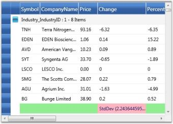

## Hierarchy

GridData control can display nested tables in a hierarchy using a master-detail configuration. In a hierarchical view, all the tables in the data source are inter-connected by means of relations. Generally a relation between any two tables can take one of the following forms: 

* 1:1 (One parent record to one child record) 
* 1:n (One parent record to n child records)
* n:1 (n parent records to one child record)
* n:n (n parent record to n child records)

where n is a number of records in a table

With the nested tables (one table nested inside another table), each record in the parent table has an associated set of records in the child table. Every record in the relation is provided with +/- button called RecordPlusMinus that can be expanded and collapsed to bring the underlying records in the child table for display. The number of tables that can be nested with relations using a GridData control is unlimited.

### The Relations Collection

A relation can be created by defining a GridDataRelation and adding it into the Grid.Relations property. This property is an Observable collection of GridDataRelation objects. It manages the entire relations for a grid. The GridDataRelation instance defines a grid relation in the following properties.

_Properties_

<table>
<tr>
<th>
Property</th><th>
Description</th></tr>
<tr>
<td>
RelationalColumn</td><td>
Specifies the column that defines the relation.</td></tr>
<tr>
<td>
RelationType</td><td>
Specifies the type of relation. Currently, only MasterDetails type relation is supported.</td></tr>
<tr>
<td>
TableProperties</td><td>
Used to set the table properties of the child table.</td></tr>
</table>

#### Example

The following code snippet illustrates how to create a relational column: 



//Fetching parent table.

DataSet ds = new DataSet();

using (SqlCeConnection con = new SqlCeConnection(string.Format(@"Data Source = {0}", LayoutControl.FindFile("Northwind.sdf"))))

{

	con.Open();

	SqlCeDataAdapter sda = new SqlCeDataAdapter("SELECT * FROM Employees", con);

	sda.Fill(ds, "Employees");

}

//Fetching child table.

	using (SqlCeConnection con1 = new SqlCeConnection(string.Format(@"Data Source = {0}", LayoutControl.FindFile("Northwind.sdf"))))

	{

		con1.Open();

		SqlCeDataAdapter sda1 = new SqlCeDataAdapter("SELECT * FROM Orders", con1);

		sda1.Fill(ds, "Orders");

	}

//Adding relation.

            ds.Relations.Add(new DataRelation("Employee_Orders", ds.Tables[0].Columns["Employee ID"], ds.Tables[1].Columns["Employee ID"]));



The following code illustrates binding of the above relation to the grid, and also customizing the child table:



<syncfusion:GridDataControl x:Name="dataGrid"  AutoPopulateColumns="False" AutoPopulateRelations="False" ItemsSource="{StaticResource orderSource}"> ShowAddNewRow="False">

<syncfusion:GridDataControl.Relations >

    <syncfusion:GridDataRelation RelationalColumn="Employee_Orders" RelationType="MasterDetails" >

        <syncfusion:GridDataRelation.TableProperties>

            <syncfusion:GridDataTableProperties AutoPopulateColumns="True" AlternatingRowBackground="BlanchedAlmond" RowBackground="Beige" >

            </syncfusion:GridDataTableProperties>

        </syncfusion:GridDataRelation.TableProperties>

     </syncfusion:GridDataRelation>

</syncfusion:GridDataControl.Relations>        

</syncfusion:GridDataControl>



The following image shows the output of the above given code:

The preceding screenshot shows a GDC bound with a nested table whose child table is set with a customized background. 

Auto Generate Relations

The grid can automatically detect the data relations in a data set for display. By default, a relation is created for each such data relation found in the data set. Hence the data relations defined in a data set are sufficient enough for the grid. 

To auto-generate the relations, set the AutoPopulateRelations property of the GridData control to _true_.



<syncfusion:GridDataControl x:Name="dataGrid"  AutoPopulateColumns="True"     AutoPopulateRelations="True" ItemsSource="{StaticResource orderSource}"> ShowAddNewRow="False"/>



## Stacked Headers

Essential Grid allows you to have additional unbound header rows, called Stacked Header Rows that span across visible grid columns. You can group one or more columns under each stacked header. 

### The StackedHeaderRows Collection

Stacked Header rows for a given grid are gathered under Grid.StackedHeaderRow collection. This collection contains the property definitions that control the behavior and appearance of the Stacked Headers. A StackedHeaderRow collection can be viewed as a set of stacked header rows in which each header row contains a collection of stacked headers, which span across multiple columns. 

Every stacked header row is defined by a GridDataStackedHeaderRow. This class contains a property named Columns that is a collection of GridDataStackedHeaderColumn objects and this collection contains an entry for each stacked header. 

Following are the properties of the GridDataStackedHeaderColumn:

<table>
<tr>
<th>
Property</th><th>
Description</th></tr>
<tr>
<td>
ColumnSpan</td><td>
Specifies the number of columns that a particular stacked header should span.</td></tr>
<tr>
<td>
ColumnStyle</td><td>
Specifies the style for the stacked header column.</td></tr>
<tr>
<td>
HeaderText</td><td>
Specifies the header text for the stacked header.</td></tr>
<tr>
<td>
VisibleColumns</td><td>
Specifies the collection of visible columns under the stacked header.</td></tr>
</table>

#### Example

The following code example illustrates the creation of two stacked headers:



<syncfusion:GridDataControl x:Name="dataGrid2" AutoPopulateColumns="True" AutoPopulateRelations="False" 

                                    ItemsSource="{StaticResource ordersSource}">

            <syncfusion:GridDataControl.StackedHeaderRows>

               <syncfusion:GridDataStackedHeaderRow Name="Row1">

                  <syncfusion:GridDataStackedHeaderRow.Columns>

                      <syncfusion:GridDataStackedHeaderColumn HeaderText="Header 1" Name="Header1" ColumnSpan="3" />

                      <syncfusion:GridDataStackedHeaderColumn HeaderText="Header 2" Name="Header2" ColumnSpan="2" />

                   </syncfusion:GridDataStackedHeaderRow.Columns>

               </syncfusion:GridDataStackedHeaderRow>

            </syncfusion:GridDataControl.StackedHeaderRows >

</syncfusion:GridDataControl>



Output of the above given code is the following image:

The preceding screenshot shows a GridData control with stacked headers.

### Expression Fields

Expression Fields enable you to add a column that holds calculated values based on other fields in the same record. These expression columns are created in the same way as any unbound column, by using the GridDataUnboundVisibleColumn class. This contains the Expression property that needs to be set with a non-null value for an expression column. Expressions can include arithmetic, logical, relational, and few string operators that finally gets translated into LINQ expressions for evaluation.

The following table lists the supported operators and examples for each.

_Supported Operators_

<table>
<tr>
<th>
Expression</th><th>
Syntax</th><th>
Description</th><th>
Example Usage</th></tr>
<tr>
<td>
Mod</td><td>
%</td><td>
Divides first argument by second argument and returns remainder.</td><td>
[UnitPrice] % 10</td></tr>
<tr>
<td>
Multiplication, Division</td><td>
*,/</td><td>
Multiplies/Divides first argument by second argument.</td><td>
[QunatityPerUnit] * [UnitsInStock]</td></tr>
<tr>
<td>
Addition, Subtraction</td><td>
+,-</td><td>
Adds first argument with second argument/Subtracts second argument from the first one.</td><td>
[UnitsInStock]+[Quantity]</td></tr>
<tr>
<td>
Or</td><td>
OR</td><td>
Returns 1 if either the first argument or the second one returns true.</td><td>
[Val]=50 OR [Val]=100</td></tr>
<tr>
<td>
And</td><td>
AND</td><td>
Returns 1 if both parameters return true.</td><td>
[Val]< 50 AND [Val]>100</td></tr>
<tr>
<td>
Less than</td><td>
<</td><td>
Returns true if first parameter is less than the second one.</td><td>
[OrderID] < 2000</td></tr>
<tr>
<td>
Greater than</td><td>
></td><td>
Returns true if first parameter is greater than the second one.</td><td>
[OrderID] > 2500</td></tr>
<tr>
<td>
Less than Or Equal to</td><td>
<=</td><td>
Returns true if first parameter is less than or equal to the second one.</td><td>
[OrderID] <= 2050</td></tr>
<tr>
<td>
Greater than Or Equal to</td><td>
>=</td><td>
Returns true if first parameter is greater than or equal to the second one.</td><td>
[OrderID] >= 2056</td></tr>
<tr>
<td>
Equal</td><td>
=</td><td>
Returns true if both arguments have same value.</td><td>
[CustomerID] = 90</td></tr>
<tr>
<td>
Not Equal to</td><td>
<></td><td>
Returns true if both arguments does not have same value.</td><td>
[CustomerID] <> 95</td></tr>
<tr>
<td>
StartsWith</td><td>
StartsWith</td><td>
Returns true if the value starts with the given string.</td><td>
ProductName StartsWith Char</td></tr>
<tr>
<td>
EndsWith</td><td>
EndsWith</td><td>
Returns true if the value ends with the specified string.</td><td>
ProductName EndsWith i</td></tr>
<tr>
<td>
Contains</td><td>
Contains</td><td>
Returns true if the value contains the specified string.</td><td>
ProductName Contains ha</td></tr>
</table>

### Example

1. Instantiate a GridDataControl and bind it to a data source.

   ~~~ csharp

		<syncfusion:GridDataControl x:Name="dataGrid" ShowAddNewRow="False" ShowFilters="False" AutoPopulateColumns="False"

		AutoPopulateRelations="False" ItemsSource="{StaticResource productsSource}" ShowGroupDropArea="True">

		</syncfusion:GridDataControl>

   ~~~

2. Add an unbound visible column and set its Expression property to the desired formula expression. The unbound visible column also contains the CaseSensitive property that makes the column names specified in the expression, case sensitive, when set to true. If necessary, you can also customize the expression like any other visible column.

   ~~~ xaml

		<syncfusion:GridDataControl.VisibleColumns>

			<syncfusion:GridDataUnboundVisibleColumn MappingName="100UnitPrice" HeaderText="Price of 100 units" Expression="UnitPrice * 100">

				<syncfusion:GridDataUnboundVisibleColumn.ColumnStyle>

					<syncfusion:GridDataColumnStyle Background="PeachPuff"/>

				</syncfusion:GridDataUnboundVisibleColumn.ColumnStyle>

			</syncfusion:GridDataUnboundVisibleColumn>

		</syncfusion:GridDataControl.VisibleColumns>

   ~~~

   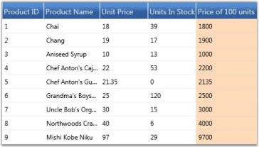

### Accessing Expression Values

You can use the GetUnboundValue method of Grid Table to access the computed expression value of a particular unbound cell. This is an overloaded method with the following prototypes:

* GetUnboundValue(RecordIndex, GridDataUnboundVisibleColumn)
* GetUnboundValue(RowIndex, ColumnIndex)

The following code example illustrates how to use this method.



// Retrieve the expression value by using row and column indices.

object value = this.dataGrid.Model.Table.GetUnboundValue(5, 5);



## ToolTips

Essential Grid provides support to associate individual cells with ToolTips. ToolTip is a small pop-up box that appears when you move the mouse over a visual element. It is used to display additional information about the elements without increasing the window size. They are mainly used to display some text data. You can also place any style content such as a group of lines of text, an image, or any control into the tooltip host.

Grid exposes a style property named TooltipTemplateKey that is the name of the template to be used for generating tooltip. You can define this template in xaml and then simply assign its name to the style.TooltipTemplateKey property. This infers that any style content that is defined in this template could be used to display the tooltip. Once the template is defined, you need to enable its display by setting the style.ShowTooltip property to true. 

N> If style.ShowTooltip is not set, then the default template associated with the Grid is loaded, and the default template would try to show the style.CellValue in a tooltip.

#### Example

The example below displays a Chart control in the tooltip host. The grid is bound to the Customers table in which the second column is assigned with a tooltip template that holds a data bound chart for tooltip display. Follow the steps below:

1. Define a Template for ToolTip as shown in the following code:

   ~~~ xaml

		<DataTemplate x:Key="chartTemplate">

			<syncfusion:Chart Grid.Row="1" Name="Chart1" Height="400" Width="400" syncfusion:SkinStorage.VisualStyle="Office2007Blue">

				<!--Chart Legend declaration-->

				<syncfusion:Chart.Legends>

					<syncfusion:ChartLegend syncfusion:ChartDockPanel.Dock="Bottom"/>

				</syncfusion:Chart.Legends>

				<!--Chart area to present chart segments.-->

				<syncfusion:ChartArea FontWeight="Bold" FontSize="14" >

					<!--X-axis declaration with required property settings.-->

					<syncfusion:ChartArea.PrimaryAxis >

						<!--Assigning text for the labels in the Primary Axis with the Product name.-->

						<syncfusion:ChartAxis  Header="Category" PositionPath="CategoryID" ContentPath="CategoryName" RangePadding="None"                         LabelRotateAngle="270" LabelsSource="{Binding ItemsSource.Categories}"/>

					</syncfusion:ChartArea.PrimaryAxis>

					<!--Y-axis declaration with required property settings.-->

					<syncfusion:ChartArea.SecondaryAxis>

						<syncfusion:ChartAxis Header="Product"  RangePadding="None" />

					</syncfusion:ChartArea.SecondaryAxis>

					<!-- Binding data to the series from the database.-->

					<syncfusion:ChartSeries Type="Column" Label="Categories List" BindingPathsY="Count"

					Interior="{StaticResource SeriesBInterior}" DataSource="{Binding ItemsSource}" />

				</syncfusion:ChartArea>

			</syncfusion:Chart>

		</DataTemplate>

   ~~~

2. Associating the above template with the Grid Cell as shown in the following code:

   ~~~ csharp

		var style = model[1, 2];

		// Enable tooltip.

		style.ShowTooltip = true;

		style.CellValue = customer.ContactName;

		var cust = customer.Orders.Select(o => o.OrderDetails.Select(od => od.Products).Select(p => p.Categories)).ToList();

		var finalList = cust.Select(c => new

		{

			Count = c.Count(),

			Categories = c

		}).ToList();

		style.ItemsSource = finalList;

		// Assign template.

		style.TooltipTemplateKey = "chartTemplate";

   ~~~
   
Here is a sample screenshot.

N> For the complete code, refer to the following browser sample.

...\My Documents\Syncfusion\EssentialStudio\<Version Number>\WPF\Grid.WPF\Samples\3.5\WindowsSamples\Product Showcase\Tooltips Demo.

## Cell Comments

Essential Grid supports the association of individual cells with Cell Comments.

Comments are notes used to provide context to your data in grid cells. They are used to display information about a cell or range of cells. Text in the comments can be placed as rich text format to emphasize a comment for a cell. You can also place content such as a group of lines (text), an image, or a control into the comment host.

There are two properties that are used to set a Comment for the cells:

* Comment Property
* CommentTemplateKey Property

### Comment Property

Comment is a string type property. You can set a comment using this property for cells. The default Data Template is displayed with the comment text.

#### Example

The following code example illustrates how to display a comment in the default comment Data Template.





style.Comment = style.Text;





style.Comment = style.Text





### CommentTemplateKey Property

Grid exposes a style property named CommentTemplateKey that is the name of the template to be used for generating Comment. You can define this template in XAML and assign its name to the style.CommentTemplateKey property. This ensures that any style content defined in the template can be used to display the comment.

#### Example

The following code example illustrates how to display a Chart control in the comment host. The grid is bound to the 'Customers' table in which the second column is assigned with a comment template that holds a data bound chart for comment display.

The following steps illustrate the same:

1. Define a Template for Comments.

   ~~~ xaml

		<DataTemplate x:Key="chartTemplate">

			<syncfusion:Chart Grid.Row="1" Name="Chart1" Height="400" Width="400" syncfusion:SkinStorage.VisualStyle="Office2007Blue">

				<!--Chart Legend declaration.-->

				<syncfusion:Chart.Legends>

					<syncfusion:ChartLegend syncfusion:ChartDockPanel.Dock="Bottom"/>

				</syncfusion:Chart.Legends>

				<!--Chart Area to present Chart Segments.-->

				<syncfusion:ChartArea FontWeight="Bold" FontSize="14" >

					<!--X-axis declaration with required property settings.-->

					<syncfusion:ChartArea.PrimaryAxis >

						<!--Assigning text for the labels in the Primary Axis with the product name.-->

						<syncfusion:ChartAxis Header="Category" PositionPath="CategoryID" ContentPath="CategoryName" RangePadding="None"                         LabelRotateAngle="270" LabelsSource="{Binding ItemsSource.Categories}"/>

					</syncfusion:ChartArea.PrimaryAxis>

					<!--Y-axis declaration with required property settings.-->

					<syncfusion:ChartArea.SecondaryAxis>

						<syncfusion:ChartAxis Header="Product" RangePadding="None" />

					</syncfusion:ChartArea.SecondaryAxis>

					<!-- Binding data to the series from the database.-->

					<syncfusion:ChartSeries Type="Column" Label="Categories List" BindingPathsY="Count"

					Interior="{StaticResource SeriesBInterior}" DataSource="{Binding ItemsSource}" />

				</syncfusion:ChartArea>

			</syncfusion:Chart>

		</DataTemplate>

   ~~~

2. Associate the above template with the Grid Cell.

   ~~~ csharp

		var style = model[1, 2];

		style.CellValue = customer.ContactName;

		var cust = customer.Orders.Select(o => o.OrderDetails.Select(od => od.Products).Select(p => p.Categories)).ToList();

		var finalList = cust.Select(c => new

		{

		Count = c.Count(),

		Categories = c

		}).ToList();

		style.ItemsSource = finalList;

		// Assign template.

		style.CommentTemplateKey = "chartTemplate";

		Dim style = model(1, 2)

		style.CellValue = customer.ContactName

		Dim cust = customer.Orders.Select(Function(o) o.OrderDetails.Select(Function(od) od.Products).Select(Function(p) p.Categories)).ToList()

		Dim finalList = cust.Select(Function(c) New With {Key .Count = c.Count(), Key .Categories = c}).ToList()

		style.ItemsSource = finalList

		' Assign template.

		style.CommentTemplateKey = "chartTemplate"

   ~~~

   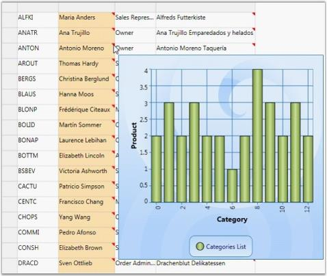
   
### Comment Alignment

By using the CommentAlignment property, you can make the cell comments appear at the top-left, top-right, bottom-left or bottom-right corners.





style.CommentAlignment = CommentAlignment.Bottom - Left;





Style.CommentAlignment = CommentAlignment.Bottom – Left





## Column Auto Sizing

This feature allows the grid columns to resize themselves automatically to fit the column content. This resize action is performed based on the size of cells, size of header or size of parent control. According to this criterion, the column resize options are defined below in the GridControlLengthUnitType enumeration.

### Resize Options

1. GridControlLengthUnitType.Auto

   In Auto type, column widths of the Grid control/GridData control are adjusted with respect to the cell and header content, i.e., each column's header length and cell content length is taken into account.

   ~~~ csharp

		this.grid.Model.Options.ColumnSizer = GridControlLengthUnitType.Auto;

   ~~~

   ~~~ vbnet

		Me.grid.Model.Options.ColumnSizer = GridControlLengthUnitType.Auto

   ~~~
   
   

2. GridControlLengthUnitType.AutoWithLastColumnFill

   In AutoWithLastColumnFill type, column width of Grid Control/GridData Control is adjusted with respect to cell and header content. The last column's width fills the unoccupied space in the parent Framework element. 

   ~~~ csharp

		id.Model.Options.ColumnSizer = GridControlLengthUnitType.AutoWithLastColumnFill;

   ~~~

   ~~~ vbnet

	  Me.grid.Model.Options.ColumnSizer = GridControlLengthUnitType.AutoWithLastColumnFill

   ~~~

   

3. GridControlLengthUnitType.SizeToCells

   In SizeToCells type, column width of Grid Control/GridData Control is adjusted with respect to cell content only.

   ~~~ csharp

		this.grid.Model.Options.ColumnSizer = GridControlLengthUnitType.SizeToCells;

   ~~~

   ~~~ vbnet

		Me.grid.Model.Options.ColumnSizer = GridControlLengthUnitType.SizeToCells

   ~~~

   

4. GridControlLengthUnitType.SizeToHeader

   In SizeToHeader type, column widths of Grid Control/GridData Control are adjusted with respect to header content only.

   ~~~ csharp

		this.grid.Model.Options.ColumnSizer = GridControlLengthUnitType.SizeToHeader;

   ~~~

   ~~~ vbnet

		Me.grid.Model.Options.ColumnSizer = GridControlLengthUnitType.SizeToHeader

   ~~~

   

5. GridControlLengthUnitType.Star

   In Star type, column widths are equal and the control and the content occupies total space in the Parent cell. The user need not specify the width for every grid column. They can opt one of these options instead.

   ~~~ csharp

		this.grid.Model.Options.ColumnSizer = GridControlLengthUnitType.Star;

   ~~~

   ~~~ vbnet

		Me.grid.Model.Options.ColumnSizer = GridControlLengthUnitType.Star

   ~~~
   
   

6. MaxLength

   The user can specify the number of rows that should be considered for calculating column widths using MaxLength property. The following code snippet allows the grid to consider only the data of first 12 rows for calculating column widths.

   ~~~ csharp

		grid.Model.Options.MaxLength = 12;

   ~~~

   ~~~ vbnet

		grid.Model.Options.MaxLength = 12

   ~~~
   
##  Look and Feel

This section discusses different ways of enhancing the grid appearance such as, 

* Row styles are used for row-wise formatting
* Conditional Formats apply formatting only when the given criteria is met
* Table Options discuss various options available to customize the table 
* Grid Skins lists the in-built themes supported by the grid

## Row Styles

There are two ways to format the grid rows. They are, 

* Using properties 
* By handling QueryCellInfo event

### Using Properties

You can change the background of the grid rows by setting a color for the RowBackground property. To override the color of the alternative rows in the same grid use the AlternatingRowBackground property. 

The following code illustrates the properties settings.



grid.AlternatingRowBackground = new SolidColorBrush(Colors.Orchid);

grid.RowBackground = new SolidColorBrush(Colors.Tan);



The following image corresponds to the output of the above given code:

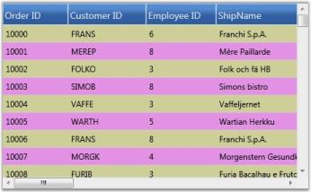

The row styles of the GDC are customized using background properties.

### Using QueryCellInfo Event

QueryCellInfo event is handled whenever a grid cell needs to be redrawn or repainted. In the GDC, you can use Model.QueryCellInfo event to format the rows by checking the row and column indices on the event arguments. 

The following code illustrates this:



grid.Model.QueryCellInfo += new GridQueryCellInfoEventHandler(Model_QueryCellInfo);

void Model_QueryCellInfo(object sender, GridQueryCellInfoEventArgs e)

{

	if (e.Cell.RowIndex > 0)

	{

		if (e.Cell.RowIndex % 2 == 0)

			e.Style.Background = Brushes.BlanchedAlmond;

		else

			e.Style.Background = Brushes.LightCyan;

	}

}



The following image corresponds to the output of the above given code:

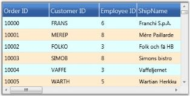

The row styles of the GDC are customized by handling the QueryCellInfo event.

## Conditional Formatting

The GridData control has in-built support for conditional formatting. This feature allows you to format grid cells based on a certain condition. This can be achieved by defining a GridDataConditionalFormat for the grid. Using this class, you can specify the filter criteria for the cells and the style to be applied for the filtered cells. Once these specifications are defined, the given styles are applied to only those cells that satisfy the condition specified.

Conditional formatting can be specified through the GridDataControl.ConditionalFormats property. This is an observable collection, into which you can add required number of formatters of type GridDataConditionalFormat. The filter criteria are specified by the GridDataConditionalFormat.Conditions property that is a collection of GridDataCondition objects. The following table describes the important properties involved:

_Property_

<table>
<tr>
<th>
Property</th><th>
Description</th></tr>
<tr>
<td colspan = "2">
GridDataConditionalFormat</td></tr>
<tr>
<td>
Conditions</td><td>
A collection of filter conditions.</td></tr>
<tr>
<td>
Style</td><td>
A GridDataStyleInfo that should be applied when the given conditions are met.</td></tr>
<tr>
<td>
ApplyStyleToColumn</td><td>
The name of the column to apply the specified style. By default, the style is applied to the entire record row. Once this property is set, the cell corresponding to this column is applied with the style.</td></tr>
<tr>
<td colspan = "2">
GridDataCondition</td></tr>
<tr>
<td>
ColumnName</td><td>
Name of the column whose values should be checked.</td></tr>
<tr>
<td>
ConditionType</td><td>
This field corresponds to one of the following conditional operators:EqualsNot EqualsLess ThanLess Than Or EqualGreater ThanGreater Than Or Equal</td></tr>
<tr>
<td>
Value</td><td>
The value to compare.</td></tr>
<tr>
<td>
PredicateType</td><td>
Specifies the PredicateType that is used to combine more than one condition. There are two types-AND, OR.</td></tr>
</table>

#### Example

Now, let us consider an example for conditional formatting. The first conditional formatter in the following example specifies the filter criteria, “{Freight} > 200 OR {Freight} < 500” that applies Yellow background to the cells satisfying this condition. 

The second conditional formatter indicates the criteria–“{ShipCountry} Equals USA OR {ShipCountry} Equals UK”. If this condition is satisfied, then the given style, Crimson background and White foreground is applied only to the corresponding record’s ShipCountry field, instead of being applied to the entire row.



<syncfusion:GridDataControl x:Name="dataGrid" AutoPopulateColumns="True" 

AutoPopulateRelations="False" ItemsSource="{StaticResource ordersSource}"

ShowGroupDropArea="True" UpdateMode="PropertyChanged">

	<syncfusion:GridDataControl.ConditionalFormats>

		<syncfusion:GridDataConditionalFormat Name="C1">

			<syncfusion:GridDataConditionalFormat.Style>

				<syncfusion:GridDataStyleInfo Background="Yellow" />

			</syncfusion:GridDataConditionalFormat.Style>

			<syncfusion:GridDataConditionalFormat.Conditions>

				<syncfusion:GridDataCondition ColumnName="Freight" ConditionType="GreaterThan" Value="200" PredicateType="Or"/>

				<syncfusion:GridDataCondition ColumnName="Freight" ConditionType="LessThan" Value="500" PredicateType="And"/>

			</syncfusion:GridDataConditionalFormat.Conditions>

		</syncfusion:GridDataConditionalFormat>

		<syncfusion:GridDataConditionalFormat Name="C2" ApplyStyleToColumn="ShipCountry" >

			<syncfusion:GridDataConditionalFormat.Style>

				<syncfusion:GridDataStyleInfo Background="Crimson" Foreground="White"  />

			</syncfusion:GridDataConditionalFormat.Style>

			<syncfusion:GridDataConditionalFormat.Conditions>

				<syncfusion:GridDataCondition ColumnName="ShipCountry" ConditionType="Equals" Value="USA" PredicateType="Or"/>

				<syncfusion:GridDataCondition ColumnName="ShipCountry" ConditionType="Equals" Value="UK" PredicateType="Or"/>

			</syncfusion:GridDataConditionalFormat.Conditions>

		</syncfusion:GridDataConditionalFormat>

   </syncfusion:GridDataControl.ConditionalFormats>

</syncfusion:GridDataControl>



The following image shows the output of the above given code:

The preceding screenshot shows a GDC applied with conditional formatting.

### Table Options

There are numerous options to customize the appearance and behavior of the GridData control. These options are exposed in the following Grid.Model.TableProperties.

### Property

<table>
<tr>
<th>
Property</th><th>
Description</th></tr>
<tr>
<td>
AllowNewRowPosition</td><td>
Indicates the position of the new row, to be added:TopBottom</td></tr>
<tr>
<td>
AllowDelete</td><td>
Indicates whether the data can be deleted.</td></tr>
<tr>
<td>
AllowDragColumns</td><td>
Allows the user to re-arrange columns, by dragging the headers.</td></tr>
<tr>
<td>
AllowEdit</td><td>
Indicates whether the data can be edited.</td></tr>
<tr>
<td>
AllowGroup</td><td>
Indicates whether the data can be grouped.</td></tr>
<tr>
<td>
AllowResizeColumns</td><td>
Indicates whether the columns can be resized.</td></tr>
<tr>
<td>
AllowResizeRows</td><td>
Indicates whether the rows can be resized.</td></tr>
<tr>
<td>
AllowSort</td><td>
Allows user to sort the columns by clicking the column header.</td></tr>
<tr>
<td>
AlternatingRowBackground</td><td>
Specifies a background brush for alternate rows.</td></tr>
<tr>
<td>
AlternatingRowCount</td><td>
Indicates the row count to apply alternate row styles. Default value is 1.</td></tr>
<tr>
<td>
AutoPopulateColumns</td><td>
If true, the grid is automatically populated with the data columns.</td></tr>
<tr>
<td>
AutoPopulateRelations</td><td>
If true, the grid is automatically loaded with dataset relations.</td></tr>
<tr>
<td>
CaptionSummaryRow</td><td>
Defines the caption summary.</td></tr>
<tr>
<td>
ConditionalFormats</td><td>
Defines the conditional formats for the grid.</td></tr>
<tr>
<td>
DefaultColumnWidth</td><td>
Default width for columns.</td></tr>
<tr>
<td>
DragIndicatorInnerBrush</td><td>
Specifies the inner brush for drag indicator.</td></tr>
<tr>
<td>
DragIndicatorOuterBrush</td><td>
Specifies the outline brush for drag indicator.</td></tr>
<tr>
<td>
GroupCaptionText</td><td>
Specifies the text to display as group caption.</td></tr>
<tr>
<td>
GroupedColumns</td><td>
Defines the grouped columns for the grid.</td></tr>
<tr>
<td>
IsSynchronizedWithCurrentItem</td><td>
If true, keeps any selector-driven control’s current selection synchronized with the selection of the grid.</td></tr>
<tr>
<td>
ItemsSource</td><td>
Specifies the item template to populate the grid.</td></tr>
<tr>
<td>
NotifyPropertyChanges</td><td>
When true, keeps the grid notified of data source changes.</td></tr>
<tr>
<td>
NullFilterText</td><td>
Sets a text to indicate null filter.</td></tr>
<tr>
<td>
PrimaryKeyColumns</td><td>
Holds the primary key columns.</td></tr>
<tr>
<td>
Relations</td><td>
Defines data relations for the grid.</td></tr>
<tr>
<td>
RowBackground</td><td>
Indicates a background brush for entire grid row.</td></tr>
<tr>
<td>
ShowAddNewRow</td><td>
Indicates whether the add new row should be visible.</td></tr>
<tr>
<td>
ShowColumnOptions</td><td>
Indicates whether the column options UI should be allowed.</td></tr>
<tr>
<td>
ShowFilters</td><td>
Indicates whether the filters should be allowed.</td></tr>
<tr>
<td>
ShowGroupCaptionPlusMinus</td><td>
Indicates whether a PlusMinus cell should appear next to group captions.</td></tr>
<tr>
<td>
ShowGroupDropArea</td><td>
Indicates whether the group drop area should be visible.</td></tr>
<tr>
<td>
ShowGroupSummaries</td><td>
Indicates whether the group summaries should be visible.</td></tr>
<tr>
<td>
ShowGroupSummaryInCaption</td><td>
Indicates whether the group summary should be displayed in group caption.</td></tr>
<tr>
<td>
ShowRecordPlusMinus</td><td>
Indicates whether a PlusMinus cell should appear next to the records. It is applicable only for nested tables.</td></tr>
<tr>
<td>
ShowRowHeader</td><td>
Indicates whether the row header column should be visible.</td></tr>
<tr>
<td>
ShowTableSummaries</td><td>
Indicates whether the table summaries should be visible.</td></tr>
<tr>
<td>
SortColumns</td><td>
Defines the sorted columns for the grid.</td></tr>
<tr>
<td>
StackedHeaders</td><td>
Defines the stacked headers for the grid.</td></tr>
<tr>
<td>
SummaryRows</td><td>
Defines the group summary rows for the grid.</td></tr>
<tr>
<td>
TableSummaryRows</td><td>
Defines the table summary rows for the grid.</td></tr>
<tr>
<td>
VisibleColumns</td><td>
Defines the visible columns of the grid.</td></tr>
<tr>
<td>
VisualStyle</td><td>
Specifies the skin for the grid.</td></tr>
</table>

### Font Settings

The GridData control lets you to set the grid font properties from the root grid. By setting the font related properties in the root GridDataControl instance, you can change the font settings for entire grid cells at once.

### Skins

GridDataControl implements visual styles that set up a common appearance to all the components in the grid. The term appearance refers not only to the way the grid elements appear but also the manner in which they behave in response to the user interactions like hovering mouse over them, clicking, and so on. Grid has in-built support for the following skins: 

* Default 
* Blend 
* Office2007Blue 
* Office2007Silver 
* Office2007Black 
* BureauBlue
* GlassyGreen
* ShinyBlue
* ShinyRed
* SunBlack 
* TwilightBlue 
* Office14Blue 
* Office14Silver 
* Office14Black 
* VS2010

### Use Case Scenarios

Skin provides better look and feel for an application.

#### Sample Link

Blend Styling Demo sample in the sample browser is purely customized in XAML through GridDataStyleManager class. To access Blend Styling Demo:

1. Open Syncfusion Dashboard.
2. Select User Interface.
3. Select WPF drop-down list and select Run Locally Installed Samples.
4. Select GridDataControl.
5. In Visual styles menu, select Grid Visual style Demo.

### Adding Skin to an Application 

Visual styles can be set for a grid by using the VisualStyle property. The following code illustrates this: 



<syncfusion:GridDataControl x:Name="dataGrid2" AutoPopulateColumns="False" AutoPopulateRelations="False"  ItemsSource="{StaticResource ordersSource}" syncfusion:SkinStorage.VisualStyle="Office2007Blue" />





SkinStorage.SetVisualStyle(dataGrid2, "Office2007Blue");



 The following images show different visual styles applied to the grid.

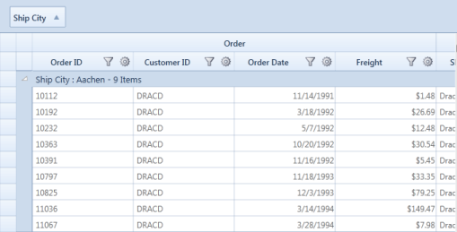

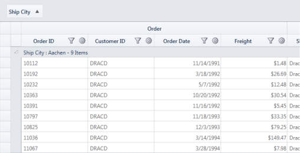

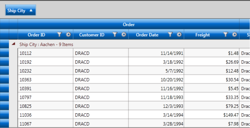

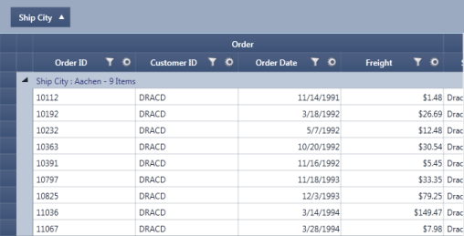

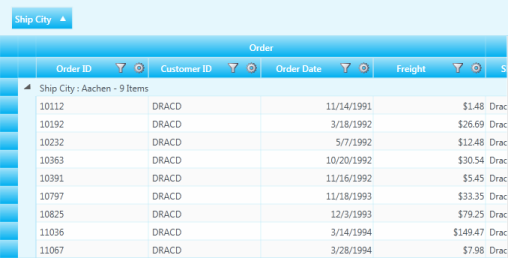

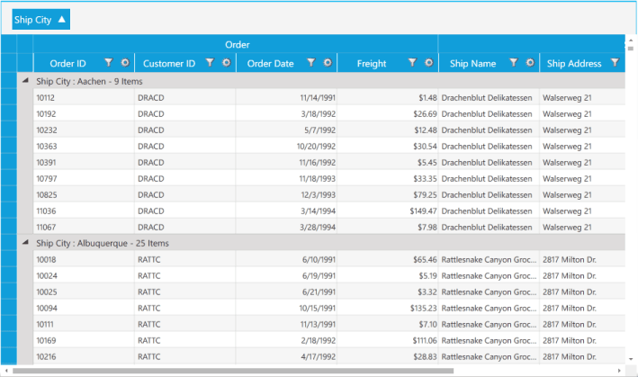

## Custom Skin

It is possible to define your own visual style for the GridData control. As a first step, you need to define a custom style by deriving from the IGridDataVisualStyle interface, and by defining custom brushes for various grid elements. 

You should direct the grid to use this custom style by specifying Custom option in its VisualStyle property. This can be done by using the following code: 



this.dataGrid.CustomVisualStyle = new GridDataGlassyGreenStyle();

this.dataGrid.VisualStyle = VisualStyle.Custom;



The following screenshot shows the custom visual style set for the grid using the above given code: 

Custom Visual Style can be defined for nested tables too. The following code illustrates this: 



<Window.Resources>

        <ObjectDataProvider x:Key="CustomerTable"

                            MethodName="GetDataTable" ObjectType="{x:Type local:Data}" />

        <CollectionViewSource x:Key="orderSource" Source="{StaticResource CustomerTable}" >

        </CollectionViewSource>

        <local:GridDataVisualStyleConverter x:Key="styleConverter" />

        <ObjectDataProvider x:Key="GreenStyle" ObjectType="{x:Type local:GridDataGlassyGreenStyle}"/>

    </Window.Resources>

<syncfusion:GridDataControl x:Name="dataGrid" ShowRowHeader="True" ShowColumnOptions="True" ShowGroupDropArea="True"  ShowFilters="True"  AutoPopulateColumns="True" AutoPopulateRelations="False"  ItemsSource="{StaticResource orderSource}">

                <syncfusion:GridDataControl.Relations >

                    <syncfusion:GridDataRelation RelationalColumn="Employee_Orders" RelationType="MasterDetails" >

                        <syncfusion:GridDataRelation.TableProperties>

                            <syncfusion:GridDataTableProperties CustomVisualStyle="{Binding Source={StaticResource GreenStyle}, Converter={StaticResource styleConverter}}" VisualStyle="Custom" AutoPopulateColumns="True">

                            </syncfusion:GridDataTableProperties>

                        </syncfusion:GridDataRelation.TableProperties>

                    </syncfusion:GridDataRelation>

                </syncfusion:GridDataControl.Relations>

</syncfusion:GridDataControl>



N>  IGridDataVisualStyle is deprecated and this information is provided only for legacy reasons. The recommended approach for customizing the GridDataControl is using_ [GridDataStyleManager](/wpf/griddata/data-presentation#adding-styles-to-an-application)_class through Microsoft Expression Blend.

### Backward Compatibility

There are substantial differences in the implementation of the new Skins in version 9.2 (and later). To maintain backward compatibility with the Skins included in earlier versions, EnableLegacyStyle property needs to be set to true. 

Breaking Change in 9.2

Previously, AlphaBlend was set in DrawSelectionOptions by default. But currently it is turned off. If you need AlphaBlend color to be applied for selection, we need to set DrawSelectionOptions property in application as mentioned in the following code snippet:



this.grid.DrawSelectionOptions = GridDrawSelectionOptions.AlphaBlend | GridDrawSelectionOptions.ReplaceBackground 

                | GridDrawSelectionOptions.ReplaceTextColor;



### Blend Support

Essential GridDataControl supports the setting of its styles by XAML and supports editing styles using Microsoft Expression Blend.

### Use Case Scenarios

This feature helps in customizing GridDataControl through Microsoft Expression Blend 3 or 4®.

#### Sample Link

Blend Styling Demo sample in the sample browser is purely customized in XAML through GridDataStyleManager class. To access Blend Styling Demo:	

1. Open Syncfusion Dashboard.
2. Select User Interface.
3. Select WPF drop-down list and select Run Locally Installed Samples.
4. Select GridDataControl. 
5. In Visual styles menu select Blend styling Demo.

### Adding Styles to an Application

GridDataControl can be customized by using Microsoft Expression Blend 3 or 4. This can be achieved through StyleManager property of _GridDataStyleManager_ type. The properties used to customize the appearance are defined in the GridDataStyleManager class.

GridDataStyleManager properties are organized under the following seven groups, each representing a specific area of the GridDataControl:

* Column Appearance
* Expander Appearance
* Group Area Appearance
* Header Appearance
* Row Appearance
* Value Cell Appearance
* Nested Grid Appearance

N> Previously, the appearance of the GridDataControl could be customized through the [IGridDataVisualStyle](/wpf/griddata/data-presentation#custom-skin) interface; even if a visual style was set for the GridDataControl, the values set in the GridDataStyleManager would override it

### Customizing the Column Appearance

In the Column group, all the properties are of _Style_ type. These properties affect the appearance of a whole column. The following table lists each property and its corresponding target _type._

### Property

<table>
<tr>
<th>
Property</th><th>
Description</th></tr>
<tr>
<td>
CheckBoxVisibleColumnStyle</td><td>
GridDataCheckBoxVisibleColumnControl</td></tr>
<tr>
<td>
CurrencyEditVisibleColumnStyle</td><td>
GridDataCurrencyEditVisibleColumnControl</td></tr>
<tr>
<td>
DatetimeVisibleColumnStyle</td><td>
GridDataDateTimeVisibleColumnControl</td></tr>
<tr>
<td>
DoubleEditVisibleColumnStyle</td><td>
GridDataDoubleEditVisibleColumnControl</td></tr>
<tr>
<td>
IntegerEditVisibleColumnStyle</td><td>
GridDataIntegerEditVisibleColumnControl</td></tr>
<tr>
<td>
PercentEditVisibleColumnStyle</td><td>
GridDataPercentEditVisibleColumnControl</td></tr>
<tr>
<td>
UpDownEditVisibleColumnStyle</td><td>
GridDataUpDownEditVisibleColumnControl</td></tr>
</table>

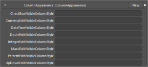

### Customizing the Expander Appearance

The Expander group properties are used to customize the Expand and Collapse buttons.

### Property

<table>
<tr>
<th>
Property</th><th>
Description</th></tr>
<tr>
<td>
PlusPath</td><td>
Gets or sets the vector path of Collapsed Parent and the Group Caption rows.</td></tr>
<tr>
<td>
MinusPath</td><td>
Gets or sets the vector path of Expanded Parent and the Group Caption rows.</td></tr>
<tr>
<td>
PlusMinusButtonBackground</td><td>
Gets or sets the background color for the default Expander icon (that is, Expander icon in Collapsed state).</td></tr>
<tr>
<td>
PlusMinusButtonBorderBrush</td><td>
Gets or sets the border color for the default Expander icon.</td></tr>
<tr>
<td>
PlusMinusButtonForeground</td><td>
Gets or sets the foreground color for the default Expander icon.</td></tr>
<tr>
<td>
PlusMinusExpandedButtonBackground</td><td>
Gets or sets the background color for the default expanded Expander icon.</td></tr>
<tr>
<td>
PlusMinusExpandedButtonBorderBrush</td><td>
Gets or sets the border color for the default expanded Expander icon.</td></tr>
<tr>
<td>
PlusMinusExpandedButtonForeground</td><td>
Gets or sets the foreground color for the default expanded Expander icon.</td></tr>
<tr>
<td>
PlusMinusHoverButtonBackground</td><td>
Gets or sets the background color to be displayed for the default Expander icon when the pointer is moved over it.</td></tr>
<tr>
<td>
PlusMinusHoverButtonBorderBrush</td><td>
Gets or sets the border color to be displayed for the default Expander icon when the pointer is moved over it.</td></tr>
<tr>
<td>
PlusMinusHoverButtonForeground</td><td>
Gets or sets the foreground color to be displayed for the default Expander icon when the pointer is moved over it.</td></tr>
<tr>
<td>
PlusMinusCaptionSelectedButtonBackground</td><td>
Obsolete.</td></tr>
<tr>
<td>
PlusMinusCaptionSelectedButtonBorderBrush</td><td>
Obsolete.</td></tr>
<tr>
<td>
PlusMinusCaptionSelectedButtonForeground</td><td>
Obsolete.</td></tr>
</table>

The following code example illustrates the properties in the Expander group.



<Path x:Key="plusPath" Width="8.666" Height="11.42" HorizontalAlignment="Left"

VerticalAlignment="Top" Data="M1.5,4.4500742 C2.3284271,4.4500742 3,5.1216469 3,5.9500742 C3,6.7785015 2.3284271,7.4500742 1.5,7.4500742 C0.67157292,7.4500742 0,6.7785015 0,5.9500742 C0,5.1216469 0.67157292,4.4500742 1.5,4.4500742 z M2.8990631,0.00036717192 C3.0453069,0.005159697 3.1827641,0.056897067 3.284497,0.15714154 L8.5183868,5.3089428 C8.6242905,5.4130292 8.6701775,5.5520487 8.6654148,5.6966238 L8.6658916,5.6966238 C8.6662092,5.7011499 8.6654148,5.7055159 8.6656513,5.710042 C8.6654148,5.714488 8.6662092,5.718854 8.6658916,5.7233 L8.6654148,5.7233 C8.6701775,5.867878 8.6242905,6.0069752 8.5183868,6.1111407 L3.284497,11.262862 C3.0519648,11.491915 2.6327903,11.467778 2.3486581,11.208635 C2.3486581,11.208635 2.2061534,11.101613 1.9369454,10.833023C1.6678151,10.56459 1.7572079,10.396356 1.9367857,10.137055 C2.1164434,9.8779926 4.7354136,6.097723 4.7354136,6.097723 C4.9301553,5.7890387 4.933569,5.630013 4.7354136,5.3222814 C4.7354136,5.3222814 2.1164434,1.5420915 1.9367857,1.2827913 C1.7572079,1.0237284 1.667151,0.85541332 1.9369454,0.58698106 C2.2061534,0.31847125 2.3486581,0.21136875 2.3486581,0.21136881 C2.5084825,0.065645903 2.711035,-0.0057947943 2.8990631,0.00036717192 z" Fill="#FFF5913F"

Stretch="Fill" />

<Path x:Key="minusPath" Width="8.666" Height="11.42" HorizontalAlignment="Left"

VerticalAlignment="Top"

Data="M1.5,4.4500742 C2.3284271,4.4500742 3,5.1216469 3,5.9500742 C3,6.7785015 2.3284271,7.4500742 1.5,7.4500742 C0.67157292,7.4500742 0,6.7785015 0,5.9500742 C0,5.1216469 0.67157292,4.4500742 1.5,4.4500742 z M2.8990631,0.00036717192 C3.0453069,0.005159697 3.1827641,0.056897067 3.284497,0.15714154 L8.5183868,5.3089428 C8.6242905,5.4130292 8.6701775,5.5520487 8.6654148,5.6966238 L8.6658916,5.6966238 C8.6662092,5.7011499 8.6654148,5.7055159 8.6656513,5.710042 C8.6654148,5.714488 8.6662092,5.718854 8.6658916,5.7233 L8.6654148,5.7233 C8.6701775,5.867878 8.6242905,6.0069752 8.5183868,6.1111407 L3.284497,11.262862 C3.0519648,11.491915 2.6327903,11.467778 2.3486581,11.208635 C2.3486581,11.208635 2.2061534,11.101613 1.9369454,10.833023 C1.6678151,10.56459 1.7572079,10.396356 1.9367857,10.137055 C2.1164434,9.8779926 4.7354136,6.097723 4.7354136,6.097723 C4.9301553,5.7890387 4.933569,5.630013 4.7354136,5.3222814 C4.7354136,5.3222814 2.1164434,1.5420915 1.9367857,1.2827913 C1.7572079,1.0237284 1.6678151,0.85541332 1.9369454,0.58698106 C2.2061534,0.31847125 2.3486581,0.21136875 2.3486581,0.21136881 C2.5084825,0.065645903 2.711035,-.0057947943 2.8990631,0.00036717192 z" Fill="#FFF5913F" RenderTransformOrigin="0.5,0.5" Stretch="Fill">

<Path.RenderTransform>

<RotateTransform Angle="90" />

</Path.RenderTransform>

</Path>

<syncfusion:GridDataStyleManager>

   <syncfusion:GridDataStyleManager.ExpanderAppearence>

      <syncfusion:ExpanderAppearence MinusPath="{StaticResource minusPath}"

      PlusMinusButtonBackground="#FFA21A1E"

      PlusMinusButtonBorderBrush="#FFA21A1E"

      PlusMinusButtonForeground="#FFAAAA1E"

      PlusMinusCaptionSelectedButtonBackground="White"

      PlusMinusCaptionSelectedButtonBorderBrush="White"

      PlusMinusCaptionSelectedButtonForeground="White"

      PlusMinusExpandedButtonBackground="White"

      PlusMinusExpandedButtonBorderBrush="#FFA21A1E"

      PlusMinusExpandedButtonForeground="Gray"

      PlusPath="{StaticResource plusPath}" />

   </syncfusion:GridDataStyleManager.ExpanderAppearence>

</syncfusion:GridDataStyleManager>



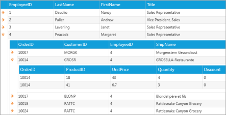

### Customizing the Group Area

Group Area group properties are used to customize the Group Area.

Customizing Group Area Appearance through the GridDataStyleManager

The following properties illustrate how to customize the appearance of the Group Area through the GridDataStyleManager.

### Property

<table>
<tr>
<th>
Property</th><th>
Description</th></tr>
<tr>
<td>
GroupAreaBackgroundBrush</td><td>
Gets or sets the background color for the Group Drop Area.</td></tr>
<tr>
<td>
GroupAreaForegroundBrush</td><td>
Gets or sets the foreground color for the text of the Group Drop Area.</td></tr>
<tr>
<td>
GroupHeaderFont</td><td>
Gets or sets the font information for the grouped header cell in the Group Drop Area.</td></tr>
<tr>
<td>
GroupCellBorders</td><td>
Gets or sets the cell border information for the grouped header cell in the Group Drop Area.</td></tr>
<tr>
<td>
GroupCellBorderMargins</td><td>
Gets or sets the cell margin information for the grouped header cell in the Group Drop Area.</td></tr>
<tr>
<td>
DragDropIndicatorBrush</td><td>
Gets or sets the background color for the Drag Drop Indicator.</td></tr>
<tr>
<td>
DragDropIndicatorOuterBrush</td><td>
Gets or sets the outer border color for the Drag Drop Indicator.</td></tr>
</table>
The following code example illustrates the properties defined in this group.



<Pen x:Key="GroupCellBorder" Brush="#FFC2C2C2" Thickness="1" />

<syncfusion:GridDataStyleManager.GroupAreaAppearence>

<syncfusion:GroupAreaAppearence GroupAreaBackgroundBrush="#FFE7CD9B" 

GroupAreaForegroundBrush="White" DragDropIndicatorBrush="Peru"

DragDropIndicatorOuterBrush="Gray">

<syncfusion:GroupAreaAppearence.GroupHeaderFont>

<syncfusion:GridFontInfo FontFamily="RockWell" FontSize="12" />

</syncfusion:GroupAreaAppearence.GroupHeaderFont>

<syncfusion:GroupAreaAppearence.GroupCellBorders>

<syncfusion:CellBordersInfo

Bottom="{StaticResource GroupCellBorder}"

      Left="{StaticResource GroupCellBorder}"

      Right="{StaticResource GroupCellBorder}"

      Top="{StaticResource GroupCellBorder}" />

</syncfusion:GroupAreaAppearence.GroupCellBorders>

</syncfusion:GroupAreaAppearence>

</syncfusion:GridDataStyleManager.GroupAreaAppearence>



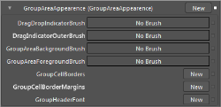

### Customizing Group Area Appearance through the GridDataControl

The following properties illustrate how to customize the appearance of the Group Area through the GridDataControl.

### Property

<table>
<tr>
<th>
Property</th><th>
Description</th></tr>
<tr>
<td>
GroupDropAreaHeight</td><td>
Specifies the height of Group Drop Area.</td></tr>
<tr>
<td>
GroupDropAreaText</td><td>
Specifies user-defined text to be displayed in the Group Drop Area.</td></tr>
<tr>
<td>
ShowGroupDropArea</td><td>
Shows or hides the Group Drop Area.</td></tr>
<tr>
<td>
DragIndicatorInnerBrush</td><td>
Gets or sets the inner background color for the Drag Indicator.</td></tr>
<tr>
<td>
DragIndicatorOuterBrush</td><td>
Gets or sets the outer border color for the Drag Indicator.</td></tr>
</table>

The following code example illustrates the properties defined in this group.



<syncfusion:GridDataControl x:Name="grid" ShowGroupDropArea="True"

GroupDropAreaHeight="50" GroupDropAreaText="Customized Group Area"

DragIndicatorInnerBrush="Gray" DragIndicatorOuterBrush="Brown"/>



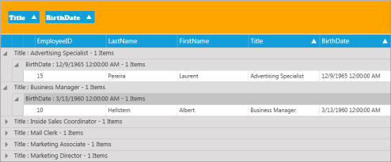

### Customizing the Header Appearance

The Header Appearance group properties are used to customize the header.

Customizing Header Appearance through the GridDataStyleManager

The following properties illustrate how to customize the Header appearance through the GridDataStyleManager.

### Property

<table>
<tr>
<th>
Property</th><th>
Description</th></tr>
<tr>
<td>
HeaderBackgroundBrush</td><td>
Gets or sets the background color for the Header cell.</td></tr>
<tr>
<td>
HeaderForegroundBrush</td><td>
Gets or sets the foreground color for the Header cell.</td></tr>
<tr>
<td>
HeaderHoverBackgroundBrush</td><td>
Gets or sets the background color to be displayed for the Header cell when the pointer is moved over it.</td></tr>
<tr>
<td>
HeaderHoverForegroundBrush</td><td>
Gets or sets the foreground color to be displayed for the Header cell when the pointer is moved over it.</td></tr>
<tr>
<td>
HeaderCellBorders</td><td>
Gets or sets the cell border information for the Header cell area.</td></tr>
<tr>
<td>
HeaderInnerBorder</td><td>
Gets the inner border color of the Header cell.</td></tr>
<tr>
<td>
HeaderInnerBorderThickness</td><td>
Gets the inner border thickness of the Header cell.</td></tr>
<tr>
<td>
HeaderFont</td><td>
Gets or sets the text font of the Header cell.</td></tr>
<tr>
<td>
HeaderTextMargins</td><td>
Gets or sets the text margin of the Header cell.</td></tr>
<tr>
<td>
SortWidgetBrush</td><td>
Gets or sets the color of the Sort icon.</td></tr>
<tr>
<td>
HeaderOptionsHoverBackground</td><td>
Gets or sets the background color for the Header cell options such as Sort icon, Filter icon and Column Options icon.</td></tr>
<tr>
<td>
HeaderOptionsBorderBrush</td><td>
Gets or sets the border color of the Header cell options such as Sort icon, Filter icon and Column Options icon.</td></tr>
<tr>
<td>
HeaderOptionsCheckedBackground</td><td>
Gets or sets the background color for Header cell options such as Sort icon, Filter icon and Column Options icon when it is checked.</td></tr>
<tr>
<td>
ColumnOptionsPopupBackground</td><td>
Gets or sets the background color for the Column Options pop up.</td></tr>
<tr>
<td>
ColumnOptionsPopupForeground</td><td>
Gets or sets the foreground color for the Column Options pop up.</td></tr>
<tr>
<td>
ColumnOptionsButtonBackground</td><td>
Gets or sets the background color for the Column Options icon.</td></tr>
<tr>
<td>
ColumnOptionsButtonBorderBrush</td><td>
Gets or sets the border color for the Column Options icon.</td></tr>
<tr>
<td>
FilterButtonInnerBrush</td><td>
Gets or sets the background color for the Filter icon.</td></tr>
<tr>
<td>
FilterButtonOuterBrush</td><td>
Gets or sets the border color for the Filter icon.</td></tr>
<tr>
<td>
FilterButtonHoverInnerBrush</td><td>
Gets or sets the background color to be displayed for the Filter icon when the pointer is moved over it.</td></tr>
<tr>
<td>
FilterButtonHoverOuterBrush</td><td>
Gets or sets the border color to be displayed for the Filter icon when the pointer is moved over it.</td></tr>
<tr>
<td>
FilterButtonAppliedBrush</td><td>
Gets or sets the background color to be displayed for the Filter icon when the filter is applied.</td></tr>
</table>
The following code example illustrates the properties defined in this group.



<syncfusion:GridDataStyleManager.HeaderAppearence>

<syncfusion:HeaderAppearence ColumnOptionsPopupBackground="#FFF2E2C4"

HeaderBackgroundBrush="#FFFFFFFF" HeaderForegroundBrush="#FF412641"

HeaderHoverBackgroundBrush="White" HeaderHoverForegroundBrush="Black"

HeaderInnerBorder="#FF674B67" HeaderInnerBorderThickness="0.18"

SortWidgetBrush="#FFF68909">

<syncfusion:HeaderAppearence.HeaderFont>

<syncfusion:GridFontInfo FontFamily="Segoe UI" FontSize="14.73" FontWeight="SemiBold" />

</syncfusion:HeaderAppearence.HeaderFont>

<syncfusion:HeaderAppearence.HeaderTextMargins>

<syncfusion:CellMarginsInfo Left="12" />

</syncfusion:HeaderAppearence.HeaderTextMargins>

<syncfusion:HeaderAppearence.HeaderCellBorders>

<syncfusion:CellBordersInfo

Bottom="{StaticResource ValueCellBorder}"

Left="{StaticResource ValueCellBorder}"

Right="{StaticResource ValueCellBorder}"

Top="{StaticResource ValueCellBorder}" />

</syncfusion:HeaderAppearence.HeaderCellBorders>

</syncfusion:HeaderAppearence>

</syncfusion:GridDataStyleManager.HeaderAppearence>



### Customizing Header Appearance through the GridDataControl

The following properties illustrate how to customize the Header appearance through the GridDataControl.

### Property

<table>
<tr>
<th>
Property</th><th>
Description</th></tr>
<tr>
<td>
HeaderCellTemplate</td><td>
Gets or sets the template for the Header cell.</td></tr>
<tr>
<td>
ShowFilters</td><td>
Shows or hides the filters in the Header cell.</td></tr>
<tr>
<td>
AllowSort</td><td>
Enables or disables sorting in the Header cell.</td></tr>
<tr>
<td>
DefaultHeaderRowHeight</td><td>
Gets or sets the row height of the Header cell.</td></tr>
<tr>
<td>
HeaderStyle</td><td>
Gets or sets the style for the Header cell.</td></tr>
</table>

The following code example illustrates the properties defined in this group.



<!—HeaderTemplate-->

<DataTemplate x:Name="HeaderTemplate">

<TextBox Height="30" Width="120"/>

</DataTemplate>

<syncfusion:GridDataControl x:Name="grid" ShowFilters="True" AllowSort="True"

DefaultHeaderRowHeight="50" HeaderCellTemplate="{StaticResource HeaderTemplate}"

HeaderStyle="{StaticResource GridDataHeaderCellControlStyle}"/>

<!— HeaderStyle in Visible Column  -->

<syncfusion:GridDataVisibleColumn MappingName="OrderId">

<syncfusion:GridDataVisibleColumn.HeaderStyle>

<syncfusion:GridDataColumnStyle Background="White"

Foreground="Black"/>

</syncfusion:GridDataVisibleColumn.HeaderStyle>

</syncfusion:GridDataVisibleColumn>



### Customizing the Row Appearance

The Row Appearance group properties enable to customize the appearance of rows in the GridDataControl.

Customizing Row Appearance through the GridDataStyleManager

The following properties illustrate how to customize row appearance through the GridDataStyleManager.

### Property

<table>
<tr>
<th>
Property</th><th>
Description</th></tr>
<tr>
<td>
SummaryCaptionBackground</td><td>
Gets or sets the background color for the summary caption row.</td></tr>
<tr>
<td>
SummaryCaptionForeground</td><td>
Gets or sets the foreground color for the summary caption row.</td></tr>
<tr>
<td>
SummaryCaptionFont</td><td>
Gets or sets the text font for the summary caption row.</td></tr>
<tr>
<td>
SummaryRowBackground</td><td>
Gets or sets the background color for the summary row.</td></tr>
<tr>
<td>
SummaryRowForeground</td><td>
Gets or sets the foreground color for the summary row.</td></tr>
<tr>
<td>
SummaryRowFont</td><td>
Gets or sets the text font for the summary row.</td></tr>
<tr>
<td>
GroupCaptionSelectionBackground</td><td>
Gets or sets the background color for the selected group caption row.</td></tr>
<tr>
<td>
GroupCaptionSelectionForeground</td><td>
Gets or sets the foreground color for the selected group caption row.</td></tr>
<tr>
<td>
CurrentCellSelectionForeground</td><td>
Gets or sets the foreground color for the selected cell in a row.</td></tr>
<tr>
<td>
CurrentCellSelectionBackground</td><td>
Gets or sets the background color for the selected cell in a row.</td></tr>
<tr>
<td>
RowHeaderIconPath</td><td>
Gets or sets the icon path for the row header.</td></tr>
</table>

The following code example illustrates the properties defined in this group.



<syncfusion:GridDataStyleManager.RowAppearence>

<syncfusion:RowAppearence CurrentCellSelectionBackground="#FFB31B20"

CurrentCellSelectionForeground="#FFFFFFFF"

GroupCaptionSelectionBackground="#FFB71B21"

GroupCaptionSelectionForeground="#FFFFFFFF"

HighlightSelectionBackground="#FFCDBEA3"

HighlightSelectionForeground="#FFB71B21" RowHeaderBackground="White”

RowHeaderForeground="#FFFFFFFF" SummaryCaptionBackground="#FFF2E2C4"

SummaryCaptionForeground="#FF730202" SummaryRowBackground="#FFCBB284"

SummaryRowForeground="#FFFFFFFF">

<syncfusion:RowAppearence.SummaryCaptionFont>

<syncfusion:GridFontInfo FontFamily="Rockwell" FontSize="13.333"

FontWeight="Normal" />

</syncfusion:RowAppearence.SummaryCaptionFont>

      <syncfusion:RowAppearence.SummaryRowFont>

<syncfusion:GridFontInfo FontFamily="Rockwell"

FontSize="13.333" />

</syncfusion:RowAppearence.SummaryRowFont>

</syncfusion:RowAppearence>

</syncfusion:GridDataStyleManager.RowAppearence>



###Customizing Row Appearance through the GridDataControl

The following properties illustrate how to customize row appearance through the GridDataControl.

### Properties

<table>
<tr>
<th>
Property</th><th>
Description</th></tr>
<tr>
<td>
ShowGroupSummaries</td><td>
Shows or hides group summaries in Grid.</td></tr>
<tr>
<td>
ShowGroupSummaryInCaption</td><td>
Shows or hides group summaries in Caption.</td></tr>
<tr>
<td>
ShowTableSummaries</td><td>
Shows or hides table summaries.</td></tr>
<tr>
<td>
TableSummaryPosition</td><td>
Gets or sets the position of table summary in Grid.</td></tr>
<tr>
<td>
GroupCaptionText</td><td>
Gets or sets the text in the Group Caption Area.</td></tr>
<tr>
<td>
RowBackground</td><td>
Gets or sets the background color of the row.</td></tr>
<tr>
<td>
RowForeground</td><td>
Gets or sets the foreground color of the row.</td></tr>
<tr>
<td>
ShowRowHeader </td><td>
Shows or hides the row header.</td></tr>
<tr>
<td>
ShowRowHeaderArrow</td><td>
Shows or hides the icon in the row header.</td></tr>
<tr>
<td>
RowStyle</td><td>
Gets or sets the styles for the row.</td></tr>
<tr>
<td>
AlternateRowStyle</td><td>
Gets or sets the styles for alternative rows.</td></tr>
<tr>
<td>
AlternatingRowBackground</td><td>
Gets or sets the background color for alternative rows.</td></tr>
<tr>
<td>
AlternatingRowForeground</td><td>
Gets or sets the foreground color for alternative rows.</td></tr>
<tr>
<td>
UnboundRowPosition</td><td>
Gets or sets the position of the unbound row in Grid.</td></tr>
<tr>
<td>
AddNewRowPosition</td><td>
Gets or sets the position of the new row to be added in Grid.</td></tr>
</table>

The following code example illustrates this.



<syncfusion:GridDataControl x:Name="grid" ShowGroupSummaries="True"

ShowGroupSummaryInCaption="True" ShowTableSummaries="True"

TableSummaryPosition="Bottom" GroupCaptionText="Customized Group Caption Text" RowBackground="White"

RowForeground="Black" ShowRowHeader="True" ShowRowHeaderArrow="True"

RowStyle="{StaticResource RowStle}" AlternateRowStyle="{StaticResource alternativeRowStyle}"

AlternatingRowBackground="White" AlternatingRowBackground="Wheat"

UnboundRowPosition="Bottom" AddNewRowPosition="Top"/>



### Customizing the Value Cell Appearance

The Value Cell group enables to customize cells by changing their margins, borders, and so on. 

Customizing the Value Cell Appearance through the GridDataStyleManager

The following properties illustrate how to customize the Value Cell appearance through the GridDataStyleManager.

### Properties

<table>
<tr>
<th>
Property</th><th>
Description</th></tr>
<tr>
<td>
ValueCellBorders</td><td>
Gets or sets the cell border information of a value cell.</td></tr>
<tr>
<td>
ValueFont</td><td>
Gets or sets the font information of a value cell.</td></tr>
<tr>
<td>
ValueTextMargins</td><td>
Gets or sets the text margin of a value cell.</td></tr>
<tr>
<td>
ValueBackgroundBrush</td><td>
Gets or sets the background color of a value cell.</td></tr>
<tr>
<td>
ValueForegroundBrush</td><td>
Gets or sets the foreground color of a value cell.</td></tr>
<tr>
<td>
CurrentCellBorderWidth</td><td>
Gets or sets the border thickness for the selected cell.</td></tr>
<tr>
<td>
CurrentCellBorderBrush</td><td>
Gets or sets the border color for the selected cell.</td></tr>
<tr>
<td>
HighlightSelectionBackground</td><td>
Gets or sets the background color for the selected row.</td></tr>
<tr>
<td>
HighlightSelectionForeground</td><td>
Gets or sets the foreground color for the selected row.</td></tr>
<tr>
<td>
HoveringRecordCellBackground</td><td>
Gets or sets the background color to be displayed for the row when the pointer is moved over it.</td></tr>
<tr>
<td>
HoveringRecordCellForeground</td><td>
Gets or sets the foreground color to be displayed for the row when the pointer is moved over it.</td></tr>
</table>

The following code example illustrates the properties defined in this group.



<syncfusion:GridDataStyleManager.ValueCellAppearance>

<syncfusion:ValueCellAppearance CurrentCellBorderBrush="#FFD6BE92"

     ValueBackgroundBrush="#FFFDFBFC" ValueForegroundBrush="#FF333333">

<syncfusion:ValueCellAppearance.ValueCellBorders>

      <syncfusion:CellBordersInfo 

            Bottom="{StaticResource ValueCellBorder}"

            Left="{StaticResource ValueCellBorder}"

            Right="{StaticResource ValueCellBorder}"

            Top="{StaticResource ValueCellBorder}" />

      </syncfusion:ValueCellAppearance.ValueCellBorders>

<syncfusion:ValueCellAppearance.ValueFont>

<syncfusion:GridFontInfo FontFamily="Rockwell" FontSize="10" FontWeight="Normal" />

</syncfusion:ValueCellAppearance.ValueFont>

<syncfusion:ValueCellAppearance.ValueTextMargins>

<syncfusion:CellMarginsInfo Bottom="2" Left="2" Right="2"  Top="2" />

</syncfusion:ValueCellAppearance.ValueTextMargins>

</syncfusion:ValueCellAppearance>

</syncfusion:GridDataStyleManager.ValueCellAppearance>



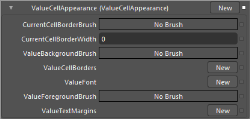

###Customizing the Value Cell Appearance through the GridDataControl

The following properties illustrate how to customize the Value Cell appearance through the GridDataControl.

### Properties

<table>
<tr>
<th>
Property</th><th>
Description</th></tr>
<tr>
<td>
ExcelLikeSelectionFrame</td><td>
Enables or disables excel-like selection frame in the cells.</td></tr>
<tr>
<td>
Allow Edit</td><td>
Enables or disables editing in the cells.</td></tr>
<tr>
<td>
HighlightSelectionAlphaBlend</td><td>
Gets or sets the background color of the selected row.GridDrawSelectionOptions must be set to AlphaBlend.</td></tr>
<tr>
<td>
HighlightSelectionBackground</td><td>
Gets or sets the background color of the selected row.GridDrawSelectionOptions must be set to ReplaceBackground.</td></tr>
<tr>
<td>
HighlightSelectionBorder</td><td>
Gets or sets the border color of the selected row.</td></tr>
<tr>
<td>
HighlightSelectionBorderWidth</td><td>
Gets or sets the border width of the selected row.</td></tr>
<tr>
<td>
HighlightSelectionForeground</td><td>
Gets or sets foreground color of the selected row.</td></tr>
</table>

The following code example illustrates this.



<syncfusion:GridDataControl x:Name="dataGrid1" ExcelLikeSelectionFrame="True"

AllowEdit="True" HighlightSelectionAlphaBlend="WhiteSmoke"

HighlightSelectionBackground="BlanchedAlmond" HighlightSelectionBorder="Azure" HighlightSelectionBorderWidth="0.5"

HighlightSelectionForeground="Black"/>



### Customizing the Nested Grid Appearance

The Nested Grid Group enables to customize the Nested cell borders by modifying the margin, borders, and so on.

N> For Nested grid, Style Manager can be set by the Child Model. By default, Child inherits the styles from Parent.

The following code example illustrates this.



void Table_RecordExpanded(object sender, GridDataValueEventArgs<GridDataRecord>e)

{

e.Value.ChildModels[0].TableProperties.StyleManager = new GridDataStyleManager();

} 



The following properties illustrate how to customize the Nested Grid appearance through the GridDataStyleManager.

### Properties

<table>
<tr>
<th>
Property</th><th>
Description</th></tr>
<tr>
<td>
TopLeftCellHeaderCellBorder</td><td>
Gets or sets the cell border information for the top-left header cell of the Nested grid.</td></tr>
<tr>
<td>
NestedHeaderCellBorder</td><td>
Gets or sets the cell border information for the header cells excluding the top-left header cell of the Nested grid.</td></tr>
<tr>
<td>
FirstHeaderColumnBorder</td><td>
Gets or sets the border information for the first header column of value cells of the Nested grid.</td></tr>
<tr>
<td>
LastHeaderColumnBorder</td><td>
Gets or sets the border information for the last header column of value cells of the Nested grid.</td></tr>
</table>

The following code example illustrates the properties defined in this group.



<Pen x:Key="ValueCellBorder" Brush="#FFD6BE92" Thickness="0.25" />

<syncfusion:GridDataStyleManager.NestedGridAppearance>

     <syncfusion:NestedGridAppearance>

         <syncfusion:NestedGridAppearance.FirstHeaderColumnBorder>

             <syncfusion:CellBordersInfo 

             Bottom="{StaticResource ValueCellBorder}" 

             Left="{StaticResource ValueCellBorder}" 

             Right="{StaticResource ValueCellBorder}" 

             Top="{StaticResource ValueCellBorder}" />

         </syncfusion:NestedGridAppearance.FirstHeaderColumnBorder>

         <syncfusion:NestedGridAppearance.LastHeaderColumnBorder>

             <syncfusion:CellBordersInfo 

             Bottom="{StaticResource ValueCellBorder}" 

             Left="{StaticResource ValueCellBorder}" 

             Right="{StaticResource ValueCellBorder}" 

             Top="{StaticResource ValueCellBorder}" />

         </syncfusion:NestedGridAppearance.LastHeaderColumnBorder>

     <syncfusion:NestedGridAppearance.NestedHeaderCellBorder>

         <syncfusion:CellBordersInfo 

         Bottom="{StaticResource ValueCellBorder}" 

         Left="{StaticResource ValueCellBorder}" 

         Right="{StaticResource ValueCellBorder}" 

         Top="{StaticResource ValueCellBorder}" />

         </syncfusion:NestedGridAppearance.NestedHeaderCellBorder>

         <syncfusion:NestedGridAppearance.TopLeftCellHeaderCellBorder>

               <syncfusion:CellBordersInfo 

               Bottom="{StaticResource ValueCellBorder}" 

               Left="{StaticResource ValueCellBorder}" 

               Right="{StaticResource ValueCellBorder}" 

               Top="{StaticResource ValueCellBorder}" />

         </syncfusion:NestedGridAppearance.TopLeftCellHeaderCellBorder>

      </syncfusion:NestedGridAppearance>

</syncfusion:GridDataStyleManager.NestedGridAppearance>



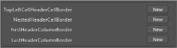

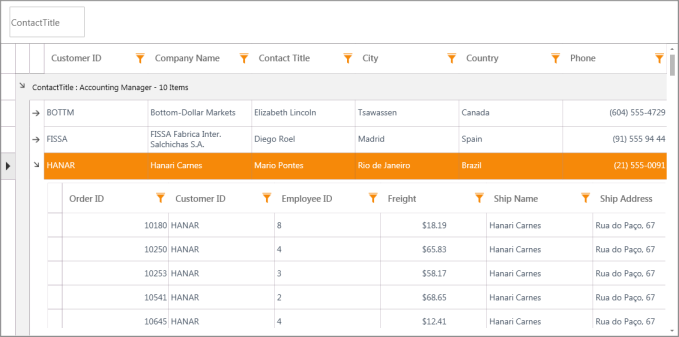

### Editing Additional Template and Styles

Apart from the properties mentioned above, template and style for ScrollViewer, ContextMenu, GridDataHeaderCellControl, GridDataColumnOptionPane can be customized using the following properties. 

### Properties

<table>
<tr>
<th>
Property</th><th>
TargetType</th></tr>
<tr>
<td>
ContextMenuStyle</td><td>
ContextMenu</td></tr>
<tr>
<td>
ScrollViewerStyle</td><td>
ScrollViewer</td></tr>
<tr>
<td>
ColumnOptionPaneStyle</td><td>
GridDataColumnOptionsPane</td></tr>
<tr>
<td>
HeaderStyle</td><td>
GridDataHeaderCellControl</td></tr>
<tr>
<td>
RowStyle</td><td>
GridDataRowControl</td></tr>
<tr>
<td>
AlternateRowStyle</td><td>
GridDataRowControl</td></tr>
</table>

Step by step instructions for Editing Templates

1. Open the application in Microsoft Expression Blend

2. Right-click on the GridDataControl and from Object menu, select Edit Additional Templates -> Edit $PartName$Style (e.g. HeaderStyle).  

   

3. Blend creates a copy of the Template and opens the XAML. All the “Parts” that make up the selected template can be edited to make the required styling changes.

### RowStyle and AlternateRowStyle

RowStyle and AlternateRowStyle are FrameworkElement Styles specifies the style for alternate rows in GridDataControl. These styles support all the basic properties of controls namely Background, Foreground, FontFamily, FontSize and FontFamily.

#### RowStyle

RowStyle can be set using XAML by overriding the style for GridDataRowControl class. This overrides the styles for each row. RowStyle supports all the basic control styles. The following code example explains the implementation of the RowStyle.



<!--Assigning the style resource to the GridDataControl-->

       RowStyle="{StaticResource RowStyle1}"



####  AlternateRowStyle

AlternateRowStyle defines the style for the GridDataRowControl element for alternate rows. If this is defined in XAML then the RowStyle and AlternateRowStyle applies for alternate elements. AlternateRowStyle supports all the basic control styles. The following code example explains the implementation of the AlternateRowStyle.



<!--Assigning the style resource to the GridDataControl-->

       AlternateRowStyle="{StaticResource AlternateRowStyle1}"



##  Enhancement of GridDataCommandManager

Command is an input mechanism that provides input handling at a more semantic level.  Commands in WPF are created by implementing the ICommand interface. ICommand exposes two methods, Execute, and CanExecute and an event CanExecuteChanged. 

* Execute performs the actions that are associated with the command
* CanExecute determines whether the command can execute on the current command target
* CanExecuteChanged is raised if the command manager that centralizes the commanding operations detects a change in the command source that might invalidate a command that has been raised but not yet executed by the command binding.

GridDataControl provides Commands for the following events. This helps write the application in pure MVVM model.

* QueryCellInfoCommand
* SortColumnChangingCommand

## QueryCellInfoCommand 

QueryCellInfoCommand is widely used to allow customization of each and every cell in the required format. QueryCellInfo accepts an argument of type GridQueryCellInfoEventArgs. The GridQueryCellInfoEventArgs contains the following customization properties. Now you can make use of this 

### Properties

<table>
<tr>
<th>
Property</th><th>
Description</th></tr>
<tr>
<td>
Cell</td><td>
Gives the cell co-ordinates</td></tr>
<tr>
<td>
Style</td><td>
Specifies the style for the cell represented by the above Cell property</td></tr>
</table>

## SortColumnChangingCommand

SortColumnChangingCommand allows customizing the sort columns at run time and this command get hooked before the column is sorted. SortColumnsChanging event accepts an argument of type GridDataSortColumnsChangingEventArgs. The GridDataSortColumnsChangingEventArgs contains the following customization properties. Now you can make use of this

### Properties

<table>
<tr>
<th>
Property</th><th>
Description</th></tr>
<tr>
<td>
AddedItems</td><td>
Gives the Collection of GridDataSortColumns that are newly added to the GridDataControl.</td></tr>
<tr>
<td>
RemovedItems</td><td>
Gives the Collection of GridDataSortColumns that are removed from the GridDataControl.</td></tr>
<tr>
<td>
NotifyCollectionChangedAction</td><td>
Gives the Action that are going to perform in the SortColumns Collection in GridDataControl.</td></tr>
</table>

### Properties

<table>
<tr>
<th>
Property </th><th>
Description </th><th>
Type </th><th>
Data Type </th></tr>
<tr>
<td>
QueryCellInfoCommand</td><td>
Gets or sets the command to invoke when QueryCellInfo event is triggered.</td><td>
Dependency Property</td><td>
ICommand</td></tr>
<tr>
<td>
SortColumnChangingCommand</td><td>
Gets or sets the command to invoke when SortColumnChanging event is triggered.</td><td>
Dependency Property</td><td>
ICommand</td></tr>
</table>

## GridDataControl Column Chooser

The GridData control’s column chooser allows you to add and remove columns dynamically from the current grid view via drag-and-drop operations. Dragging a column's header and dropping it onto the column chooser removes the column. To show the column, drag its header from the column chooser back to the view. 

### Features

* Add hidden columns in the Column Chooser window.
* Display a customized Column Chooser window.

Add Hidden Columns in the Column Chooser Window

By default, the column chooser doesn’t display headers of hidden columns. A column is hidden if its IsHidden property is set to false. If you want to display a hidden column within the column chooser, set the column chooser’s CanAddHiddenColumns property to true.

Display a Customized Column Chooser Window

The GridData control’s column chooser enables you to customize the column chooser from the application side. This can be done by passing the Action method as a parameter of the ShowColumnChooser() method.

### Use Case Scenarios

If an item source contains 15 columns and the user defines only three visible columns, activating the column chooser shows a window containing the header cells of the remaining columns and also enables the user to add and remove columns from the view by dragging and dropping them.

### Tables for Properties, Methods, Events, and Commands

### Properties

<table>
<tr>
<th>
Property </th><th>
Description </th><th>
Type </th><th>
Data Type </th></tr>
<tr>
<td>
CanAddHiddenColumns</td><td>
By setting this property to true, you can display the hidden GridDataVisibleColumns in the column chooser window.</td><td>
boolean</td><td>
boolean</td></tr>
</table>

### Methods

<table>
<tr>
<th>
Method </th><th>
Description </th><th>
Parameters </th><th>
Type </th><th>
Return Type </th></tr>
<tr>
<td>
ShowColumnChooser()</td><td>
By invoking this method, the GridData control’s ColumnChooser window pops up.</td><td>
Null</td><td>
------</td><td>
Void</td></tr>
<tr>
<td>
ShowColumnChooser(Action&lt;GridDataColumnChooserWindow&gt;)</td><td>
Passing tde Action metdod witd a customized window pops up tde customized GridDataColumnChooserWindow.</td><td>
Action&lt;GridDataColumnChooserWindow&gt;</td><td>
------</td><td>
Void</td></tr>
</table>

### Commands

<table>
<tr>
<th>
Command </th><th>
Description </th></tr>
<tr>
<td>
ColumnChooserCommand</td><td>
This command is used to display the column chooser window.</td></tr>
</table>

#### Sample Link

To view sample:

1. Select Start > Programs > Syncfusion > Essential Studio x.x.xx > Dashboard.
2. Click Run Samples for WPF in the User Interface Edition panel.
3. Select GridDataControl.
4. Expand the Export Features item in the Sample Browser.

Choose the Export to PDF sample to launch.

## Adding Column Chooser to an Application

1. Bind an ItemsSource to GridDataControl. Refer to the following link for more information about binding an ItemsSource to GridDataControl: 
[Data Binding](http://help.syncfusion.com/wpf/griddata/data-binding).



<syncfusion:GridDataControl x:Name="grid"                            

                            AutoPopulateColumns="False"

                            AutoPopulateRelations="False"

                            ColumnSizer="Star"

                            ItemsSource="{Binding OrdersDetail}"

                            ShowAddNewRow="False"

                            ShowGroupDropArea="True"                            

                            VisualStyle="Office14Blue">

    <syncfusion:GridDataControl.VisibleColumns>

        <!--  Set IsReadyOnly for columns  -->

        <syncfusion:GridDataVisibleColumn AllowSort="True"

                                            HeaderText="Order ID"

                                            MappingName="OrderID" />

        <syncfusion:GridDataVisibleColumn AllowSort="True"

                                            HeaderText="Customer ID"

                                            MappingName="CustomerID" />

        <syncfusion:GridDataDateTimeVisibleColumn AllowSort="True"

                                                    HeaderText="Order Date"

                                                    MappingName="OrderDate">

            <syncfusion:GridDataDateTimeVisibleColumn.ColumnStyle>

                <syncfusion:GridDataColumnStyle HorizontalAlignment="Right" />

            </syncfusion:GridDataDateTimeVisibleColumn.ColumnStyle>

        </syncfusion:GridDataDateTimeVisibleColumn>

    </syncfusion:GridDataControl.VisibleColumns>

</syncfusion:GridDataControl>



Bind a button command to the ColumnChooserCommand command

The following code shows how to show the Column Chooser window using the built-in command of the GridData control.





<Button Name="ColumnChooserBtn"

Command="{Binding ColumnChooserCommand,ElementName=gridDataControl}"

Content="Show Column Chooser" />



This shows the Column Chooser window whenever the user clicks the button.

Displaying Default Column Chooser by Invoking Method

The following code demonstrates how to show the Column Chooser window by hooking the button’s click event.



<Button Name="ColumnChooserBtn"

Content="Show Column Chooser"

Click="ColumnChooserBtn_Click"/>





private void ColumnChooserBtn_Click(object sender, RoutedEventArgs e)

{

  this.gridDataControl.ShowColumnChooser();

}





By using this, the user can get the default Column Chooser without any customization.

Customizing the Column Chooser by Invoking Parameterized Method

The following code shows how to customize the Column Chooser window from the application side. This is achieved by passing a method as a parameter for the ShowColumnChooser method.





<Button Name="ColumnChooserBtn"                        

Content="Show Column Chooser" 

Click="ColumnChooserBtn_Click"/>





private void ColumnChooserBtn_Click(object sender, RoutedEventArgs e)

{

 gridDatacontrol.ShowColumnChooser((Chooser) =>

  {

    Chooser.Title = "Customized Column Chooser";

    Chooser.CanAddHiddenColumns = 

    (gridDatacontrol.DataContext as ViewModel).CanAddHiddenColumns;

  });

}





In the result you can get the column chooser window in your application as shown below.

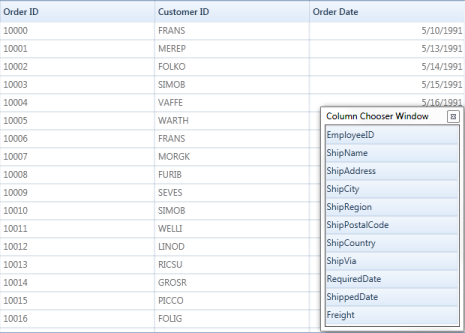
