# Exporting-and-Persistence in WPF GridDataControl (Classic)

This section covers the Exporting and persistence:

## Exporting GDC to Excel

The GridExcelConverter class provides support for exporting data from a GridDataControl to an Excel spreadsheet for verification and/or computation. This control automatically copies the GridDataControl's styles and formats to Excel. The GridExcelConverter control is derived from GridExcelConverterBase. The XlsIO libraries are used to support the conversion of the GridDataControl contents to Excel. The following dll files should be added, along with the default dll files in the reference folder: 

* Syncfusion.XlsIO.Base
*  Syncfusion.XlsIO.WPF  
* Syncfusion.GridConverter.Wpf

### Features

#### Entire Content

You can convert the entire content of a GridDataControl to an Excel Spreadsheet. You can also avail the option for specifying the version of the Excel file using the ExcelVersion enum. The version can be one of the following: 

* ExcelVersion.Excel97to2003  
* ExcelVersion.Excel2007

The following code illustrates the conversion of GridDataControl contents to an Excel Spreadsheet: 



gridDataControl.ExportToExcel("Sample.xlsx", ExcelVersion.Excel2007 );

(or)

gridDataControl.ExportToExcel("Sample.xls", ExcelVersion.Excel97to2003 );



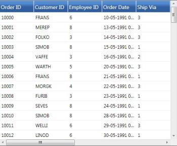

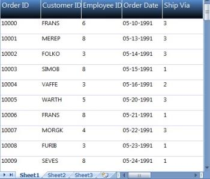

The above images shows how the entire content of the GridDataControl is exported to an Excel Spreadsheet.

#### Selected Rows

You can also avail the choice of converting the selected rows of GridDataControl to an Excel Spreadsheet.

The following code illustrates the conversion of selected rows of GridDataControl to an Excel Spreadsheet:



grid.ExportToExcel(grid.Model.SelectedRanges.ActiveRange,"sample.xlsx", ExcelVersion.Excel2007);



#### GridDataControl with Nested Child

You can convert the content of a GridDataControl, with Nested Child to an Excel Spreadsheet. Parent and visible child content are exported to Excel Spreadsheet.

The following code illustrates the conversion of GridDataControl with Nested Child to an Excel Spreadsheet:



gridDataControl.ExportToExcel("Sample.xlsx", ExcelVersion.Excel2007 );

(or)

gridDataControl.ExportToExcel("Sample.xls", ExcelVersion.Excel97to2003 );



N> Only the visible child's contents are exported.

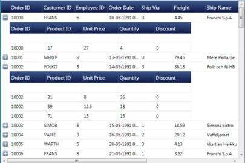

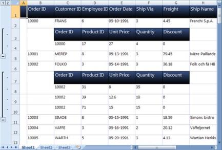

The above images shows how the GridControl, with Nested Child is exported to an Excel Spreadsheet.

#### GridDataControl with Grouping

You can convert the content of a GridDataControl, with Grouping to an Excel Spreadsheet. The following code illustrates this feature:



gridDataControl.ExportToExcel("Sample.xlsx", ExcelVersion.Excel2007 );

(or)

gridDataControl.ExportToExcel("Sample.xls", ExcelVersion.Excel97to2003 );



N> Only the visible grouping contents are exported.

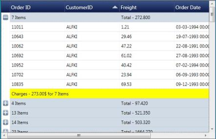

The above images shows how the GridControl, with Grouping is exported to an Excel Spreadsheet.

### GridDataControl Export to CSV

The ExportToCSV method of the GridModelExportExtensions class enables GridDataControl to easily be exported to CSV format.

To enable exporting, the following .dll files must be added along with the default .dll files in the reference folder:

* Syncfusion.XlsIO.Base
* Syncfusion.XlsIO.WPF 
* Syncfusion.GridConverter.Wpf

Converting GridDataControl to CSV format

You can convert the entire content of a grid control to a CSV file by using the following code:



this.gdc.Model.ExportToCSV("Sample.csv")





Me.gdc.Model.ExportToCSV("Sample.csv")



When the code runs, the following output displays.

When you are ready to export the entire grid, click Export to CSV; the grid content can then be converted to CSV format. 

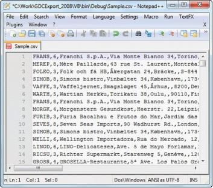

## Export to PDF

Essential GridData control enables you to export the content of the GridData control into a pdf file. This feature allows you to maintain the records as a pdf file. The pdf libraries are used to support the conversion of the GridData control’s content to pdf. The following dll files should be added along the default dll in the reference folder:

* Syncfusion.Pdf.Base.
* Syncfusion.GridConverter.Wpf

The pdf export can be performed in the following two ways:

* Export by PdfGrid
* Export by PdfLightTable

PdfGrid: In the PdfGrid, the formatting can be done to all levels of the PdfGrid. The features like row and column spanning are also supported by the PdfGrid. It offers, full control over the appearance of the PdfGrid table and is recommended to draw complex table structures. 

PdfLightTable: It allows you to perform simple formatting, using the events. The PdfLightTable allows minimal customization options. Rendering the table using PdfLightTable is faster than PdfGrid and drawing a simple table is recommended.

### Features

The export to pdf comprises the following features:

* Export entire content.
* Export selected range.
* Export GridData control with grouping.
* Export with styles and formatted cell value (This works by default). 

#### Export Entire Content

Essential GridData control allows you to export the GridData control’s entire content as a PDF file.

#### Use Case Scenario

A large data can be maintained as PDF file and the entire content of the GridData control can be exported iPDF a pdf file.

The following XAML code example shows, how the GridData control is defined in an application.



<syncfusion:GridDataContro” x:Name=”dataGrid"

                            AutoPopulat”Colum”s="False"

                            AutoPopulateR”latio”s="False"

                            Col”mnSi”er="Star"

                            Ite”sSource="{Binding Orde”Details}"

                            ShowA”dNewR”w="False"                         

                            Vis”alStyle="Syncfu”ionTheme">

    <!--  code for Visible Columns  yncfusionyncfusion:GridDataControl.VisibleColumns>

 yncfusionyncfusion:GridDataVisibleColumn He”derText=”Order ID" Map”ingName”"OrderID">

    yncfusionyncfusion:GridDataVisibleColumn.HeaderStyle>

        yncfusionyncfusion:GridDataColumnStyle HorizontalA”ignmen”="Center" />

     yncfusionyncfusion:GridDataVisibleColumn.HeaderStyle>

    yncfusionyncfusion:GridDataVisibleColumn.ColumnStyle>

        yncfusionyncfusion:GridDataColumnStyle HorizontalA”ignme”t="Right" />

     yncfusionyncfusion:GridDataVisibleColumn.ColumnStyle>

 yncfusionyncfusion:GridDataVisibleColumn>

yncfusionyncfusion:GridDataVisibleColumn A”lowSo”t="False"

                                            He”derText="Cu”tomer ID"

                                            Map”ingName="C”stomerID">

    yncfusionyncfusion:GridDataVisibleColumn.HeaderStyle>

        yncfusionyncfusion:GridDataColumnStyle HorizontalA”ignmen”="Center" />

     yncfusionyncfusion:GridDataVisibleColumn.HeaderStyle>

 yncfusionyncfusion:GridDataVisibleColumn>

yncfusionyncfusion:GridDataVisibleColumn He”derText="”hip Name" 

                                          Map”ingName=”ShipName">

    yncfusionyncfusion:GridDataVisibleColumn.HeaderStyle>

        yncfusionyncfusion:GridDataColumnStyle HorizontalA”ignmen”="Center" />

     yncfusionyncfusion:GridDataVisibleColumn.HeaderStyle>

 yncfusionyncfusion:GridDataVisibleColumn>

yncfusionyncfusion:GridDataVisibleColumn He”derText="Shi” Address" 

                                          Map”ingName="Sh”pAddress" />yncfusionyncfusion:GridDataControl.VisibleColuyncfusionyncfusion:GridDataControl>



#### Exporting to PdfGrid

The following code example illustrates how to export the entire content of the GridData control into a PdfGrid.



// Dialog to save the newly created pdf document.

SaveFileDialog sfd = new SaveFileDialog

{

  DefaultExt = ".pdf",

  Filter = "Adobe PDF Files(*.pdf)|*.pdf",

  FilterIndex = 1

};

// Newly created pdf document object.

PdfDocument document = new PdfDocument();

if (sfd.ShowDialog() == true)

{

    using (Stream stream = sfd.OpenFile())

    {                    

        //Method calling to export the grid content into pdf.

        document = grid.Model.ExportToPdfGridDocument(GridRangeInfo.Table());

        document.Save(stream);

        Process.Start(sfd.FileName);

    }

}



The following screenshot shows the exported pdf document:

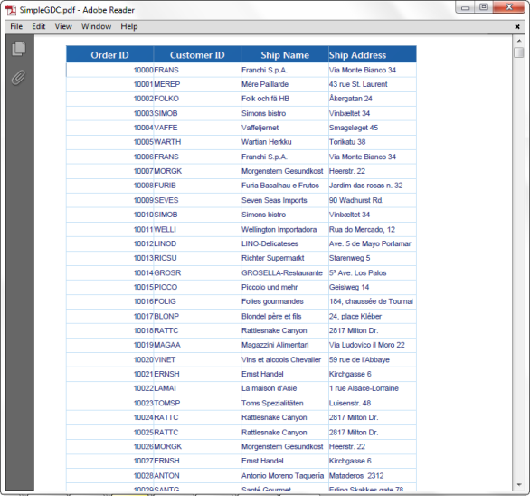

#### Exporting to PdfLightTable Document

The following code example illustrates how to export the entire content of the GridData control into a PdfLightTable document file.



// Dialog to save the newly created pdf document.

SaveFileDialog sfd = new SaveFileDialog

{

    DefaultExt = ".pdf",

    Filter = "Adobe PDF Files(*.pdf)|*.pdf",

    FilterIndex = 1

};

// Newly created pdf document object.

PdfDocument document = new PdfDocument();

if (sfd.ShowDialog() == true)

{

    using ( Stream stream = sfd.OpenFile())

    {

        //Method calling to export the grid content into pdf.

        document = grid.Model.ExportToPdfLightTableDocument(GridRangeInfo.Table());

        document.Save(stream);

        Process.Start(sfd.FileName);

    }
}



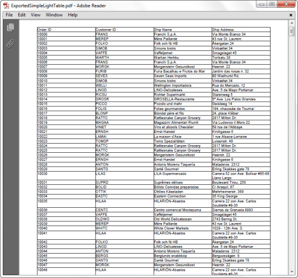

#### Export Selected Range

You can convert the selected range of the GridData control into a pdf file.

#### Exporting to PdfGrid

The following code illustrates the conversion of a selected range of the GridData control to a PdfGrid.



// Dialog to save the newly created pdf document.

SaveFileDialog sfd = new SaveFileDialog

{

	DefaultExt = ".pdf",

    Filter = "Adobe PDF Files(*.pdf)|*.pdf",

    FilterIndex = 1

};

// Newly created pdf document object.

PdfDocument document = new PdfDocument();

if (sfd.ShowDialog() == true)

{

    using (Stream stream = sfd.OpenFile())

    {                    

        //Method calling to export the grid content into pdf.

        document = grid.Model.ExportToPdfGridDocument(

        grid.Model.SelectedRanges.ActiveRange);

        document.Save(stream);

        Process.Start(sfd.FileName);

    }

}


The following screenshot shows the exported pdf document of a selected range of the GridData control:

#### Exporting to PdfLightTable Document

The following code illustrates the conversion of a selected range of the GridData control to a PdfLightTable document.



// Dialog to save the newly created pdf document.

SaveFileDialog sfd = new SaveFileDialog

{

DefaultExt = ".pdf",

Filter = "Adobe PDF Files(*.pdf)|*.pdf",

FilterIndex = 1

};

// Newly created pdf document object.

PdfDocument document = new PdfDocument();

if (sfd.ShowDialog() == true)

{

using ( Stream stream = sfd.OpenFile())

{

    //Method calling to export the grid content into pdf.

    document = grid.Model.ExportToPdfLightTableDocument(grid.Model.SelectedRanges.ActiveRange);

    document.Save(stream);

    Process.Start(sfd.FileName);

}

}



The following screenshot shows the exported PdfLightTable document of the selected range of the GridData control.

#### Export GridDataControl with Grouping

The GridData control converts the content of the GridData control to a pdf document with grouping.

The following screenshot illustrates how the GridData control appears as a pdf file after grouping the data.

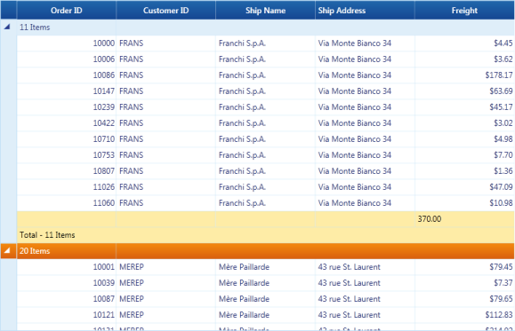

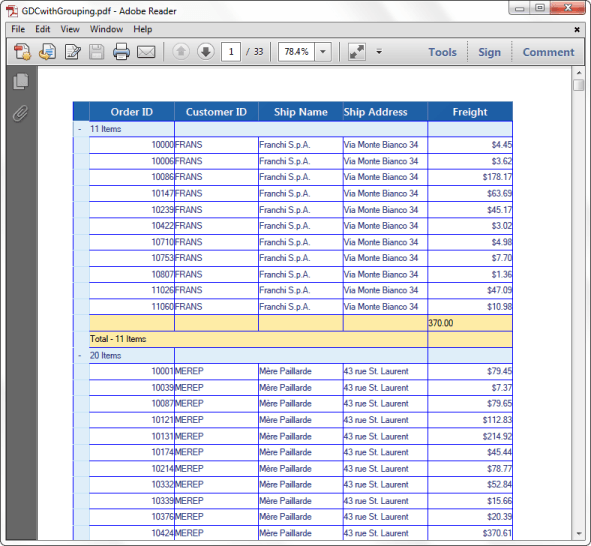

The following screenshot illustrates how the GridData control appears as a PdfLightTable document after grouping the data.

#### Exporting Customized GridData Control 

Use the following code to customize the GridData control with blend styling.



<syncfusion:GridDataControl x:Name="grid"

                                    Grid.Row="0"

                                    Margin="10"

                                    AllowEdit="False"

                                    AutoPopulateColumns="False"

                                    AutoPopulateRelations="False"

                                    ColumnSizer="Star"

                                    ContextMenuOptions="CustomWithDefault"

                                    ContextMenuStyle="{StaticResource RContextMenuStyle}"

                                    EnableBlendStyling="True"

                                    HeaderStyle="{StaticResource                                                                             

									GridDataHeaderCellControlStyle2}"

                                    HideColumnsWhenGrouped="True"

                                    IsGroupsExpanded="True"

                                    ItemsSource="{Binding Path=MovieDetails}"

                                    ListBoxSelectionMode="MultiExtended"

                                    PersistGroupsExpandState="True"

                                    ShowAddNewRow="False"

                                    ShowFilters="True"

                                    ShowGroupDropArea="True"

                                    ShowHoveringBackground="false"

                                    ShowTableSummaries="True"

                                    ShowTooltips="True"

                                    StyleManager="{StaticResource CustomGridDataStyleManager}">

            <!--  Table Summary rows created here  -->

            <syncfusion:GridDataControl.TableSummaryRows>

                <syncfusion:GridDataSummaryRow Title="Total : {CountSummary} Items"

                                               ShowSummaryInRow="True"

                                               TitleColumnCount="2">

                    <syncfusion:GridDataSummaryRow.SummaryColumns>

                        <syncfusion:GridDataSummaryColumn Name="CountSummary"

                                                          Format="'{Count:d}'"

                                                          MappingName="OrderId"

                                                SummaryType="CountAggregate" />

                    </syncfusion:GridDataSummaryRow.SummaryColumns>

                </syncfusion:GridDataSummaryRow>

            </syncfusion:GridDataControl.TableSummaryRows>

            <!--  Grouped Column Created here  -->

            <syncfusion:GridDataControl.GroupedColumns>

                <syncfusion:GridDataGroupColumn ColumnName="Movie" />

            </syncfusion:GridDataControl.GroupedColumns>

            <!--  Visible Column Created here  -->

            <syncfusion:GridDataControl.VisibleColumns>

                <syncfusion:GridDataVisibleColumn MappingName="Movie">

                    <syncfusion:GridDataVisibleColumn.FilterPane>

                        <syncfusion:GridDataTextFilteringPane Foreground="Black"

                                                              IsThemed="False"

                                                              PredicateType="And" />

                    </syncfusion:GridDataVisibleColumn.FilterPane>

                </syncfusion:GridDataVisibleColumn>

  <syncfusion:GridDataVisibleColumn ColumnStyle="{StaticResource GridDataColumnStyle}"                                                                 MappingName="OrderId">

                    <syncfusion:GridDataVisibleColumn.FilterPane>

                        <syncfusion:GridDataTextFilteringPane Foreground="Black"

                                                              IsThemed="False"

                                                              PredicateType="And" />

                    </syncfusion:GridDataVisibleColumn.FilterPane>

                </syncfusion:GridDataVisibleColumn>

  <syncfusion:GridDataVisibleColumn ColumnStyle="{StaticResource GridDataColumnStyle}"                                                                   MappingName="Name">

                    <syncfusion:GridDataVisibleColumn.FilterPane>

                        <syncfusion:GridDataTextFilteringPane Foreground="Black"

                                                              IsThemed="False"

                                                              PredicateType="And" />

                    </syncfusion:GridDataVisibleColumn.FilterPane>

                </syncfusion:GridDataVisibleColumn>

  <syncfusion:GridDataVisibleColumn ColumnStyle="{StaticResource GridDataColumnStyle}"                                                                 MappingName="SeatNo">

                    <syncfusion:GridDataVisibleColumn.FilterPane>

                        <syncfusion:GridDataTextFilteringPane Foreground="Black"

                                                              IsThemed="False"

                                                              PredicateType="And" />

                    </syncfusion:GridDataVisibleColumn.FilterPane>

                </syncfusion:GridDataVisibleColumn>

   <syncfusion:GridDataVisibleColumn ColumnStyle="{StaticResource GridDataColumnStyle}"                                                                  MappingName="City">

                    <syncfusion:GridDataVisibleColumn.FilterPane>

                        <syncfusion:GridDataTextFilteringPane Foreground="Black"

                                                              IsThemed="False"

                                                              PredicateType="And" />

                    </syncfusion:GridDataVisibleColumn.FilterPane>

                </syncfusion:GridDataVisibleColumn>

   <syncfusion:GridDataVisibleColumn ColumnStyle="{StaticResource GridDataColumnStyle}"                                                               MappingName="Theatre" />

            </syncfusion:GridDataControl.VisibleColumns>

        </syncfusion:GridDataControl>



Use the following code to export a customized GridData control:

#### Button Code to Export:



<Button Name="Exportbtn" Content="Export To Pdf"  Click="Exportbtn_Click"/>



Button Click Event Code:



private void Exportbtn_Click(object sender, RoutedEventArgs e)

{

// Dialog to save the exported document.

SaveFileDialog sfd = new SaveFileDialog

{

  DefaultExt = ".pdf",

  Filter = "Adobe PDF Files(*.pdf)|*.pdf",

  FilterIndex = 1

 };

// Pdf document object to save the data as a pdf file.

 PdfDocument document = new PdfDocument();

 if (sfd.ShowDialog() == true)

{

  using (Stream stream = sfd.OpenFile())

  {

   document = dataGrid.Model.ExportToPdfGridDocument(GridRangeInfo.Table());

   document.Save(stream);

   Process.Start(sfd.FileName);

  }

  }

}



#### GridDataControl with Blend Styling

The below screenshot shows the customized blend styling of the GridData control.

#### Exported PDF Document

The screenshot below shows a PDF document of the blend styling GridData control.

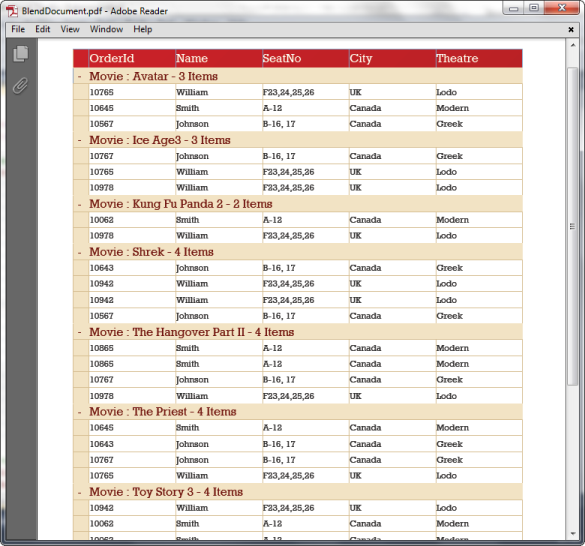

## Serialization in GridDataControl

GridDataControl state can be serialized in XML format. 

All the properties that are exposed in GridDataTableProperties can be serialized. 

### Serializing 

There are two methods to serialize forms:

* XML string
* XML file

### API Usage

### Serializing as XML String

The following code illustrates how to serialize as an XML string. 



string result = this.dataGrid.Model.SerializeAsString();



### Serializing as an XML File

The following code illustrates how to serialize as an XML file. 



this.dataGrid.Model.Serialize("sample.xml");



### De-serializing 

There are two methods to serialize forms:

* XML string
* XML file

### API Usage

### De-serialize from XML String

The following code illustrates how to de-serialize from an XML string_._ 



this.dataGrid.Model.DeserializeFromString(content); 

// the content should be an XML string saved during the serialization process.



### De-serialize from XML File

The following code illustrates how to de-serialize from an XML file.



this.dataGrid.Model.Deserialize("sample.xml"); 

// sample.xml file should be the XML file saved during the serialization process.

