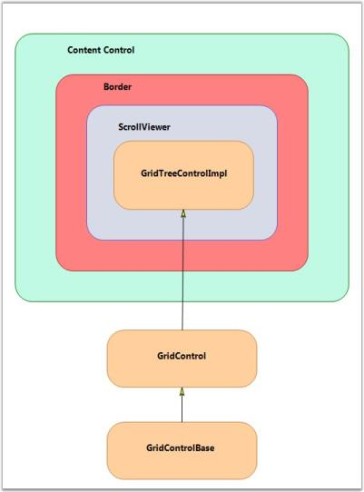

# Architecture in WPF GridTreeControl (Classic)

The GridTree control derives from the WPF ContentControl, which allows it to support a ControlTemplate to define its content. By default, its content includes a Border object, which contains a ScrollViewer object that contains a GridControlImpl object. GridControlImpl is a GridControlBase derived class that provides the ‘multi-column grid’ functionality to the GridTree control.

For each node in the tree, there is a GridTreeNode object that holds the information of the node such as the underlying data item, whether the node is expanded, etc. The GridTreeNodes collection can be accessed by the GridTreeControl.InternalGrid.Nodes collection. InternalGrid is the GridTreeControlImpl object associated with the GridTree control.

The following screen shot illustrates the GridTree control architecture.

## Accessing the Underlying Grid control

The GridTree control is a ContentControl derived class. To get its grid-like behavior, the GridTree control has a Grid control derived property named InternalGrid. InternalGrid is a GridTreeControlImpl class, which is derived from the Grid control. The GridTreeControlImpl is a virtual Grid control, which uses the virtual events to bind to the GridTreeControl.Nodes collection. So, to access the underlying Grid control associated with the GridTree control, you can use the GridTreeControl.InternalGrid property. 

All the properties exposed in GridTree control (with the exception of Internal Grid) are mirrored in GridTreeControlImpl. There are methods and properties exposed on the Internal Grid that are not exposed on the GridTree control itself. In particular, to control the look of the Expand cell, you need to use the Internal Grid as discussed below. The Internal Grid has many protected methods that provide access to the tree-like functionality. So, deriving GridTreeControlImpl gives you access to this functionality if you need to use it for any reason.

