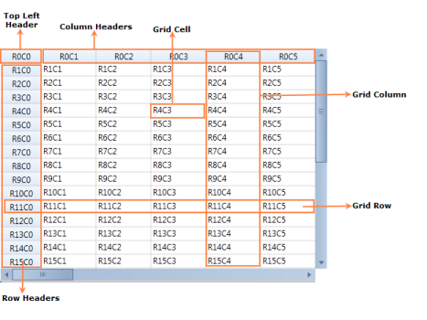

# Getting Started	

This section is designed to help you understand and quickly get started using Essential Grid in your WPF application. Control appearance and structure are defined and the Essential Grid’s relevant classes are depicted.

The following sections comprise the Getting Started section:

## Appearance and Structure of the Grid

EssentialGrid for WPF is a package of powerful grid controls that provides cell-oriented features and acts as an efficient display engine for tabular data that can be customized down to the cell level. It also offers excellent performance characteristics, such as a virtual mode and high-frequency updates, which makes the grid suitable for real-time applications.

The EssentialGrid package is comprised of following three types of grid controls:

* Grid Control
* GridData Control
* GridTree Control

Now, take closer look at the characteristics of each of these controls. 

### Grid Control

This is a general-purpose grid that can be used in any form, either holding its own data or virtually bound to an external data source. It acts as a base grid for the other two types of grids (the GridData and GridTree controls). Most features are shared among the three grid types. 

In the Grid control, each cell acts as a single entity, which is suitable for applications such as Excel simulator, where the data in the grid cells are not interrelated and need to be maintained in the specific cells themselves. You can also operate this control in virtual mode, where data is not stored in the grid’s internal data structure but comes from an external source like a data table, for example. In virtual mode, data will be dynamically loaded into the grid on demand or when users need to view the data.

### GridData Control

The GridData control is designed to be bound with a data source. In the GridData control, each column behaves as a single entity. This grid is more column-centric and can be used to display interrelated tabular data. Unlike the base grid, this grid does not store data values in its data structures; instead, it is connected to an external data source.

For more detailed information about data source connections, refer to the Data Binding section. 

### GridTree Control

The GridTree control serves as a multicolumn tree control that is optimized to display thousands of items. This control uses a load-on-demand architecture to quickly generate a tree view. You can toggle the view of the underlying nodes by clicking the plus-minus glyphs of a root node. This control provides complete customization options such as custom level styles, glyphs, node images, and more.

## Class Diagram 

The following illustration depicts the Class Diagram for Essential Grid for WPF.

### Control Hierarchy

### Model Hierarchy

## Adding Essential Grid to an Application

This section serves as a guide on how to deploy EssentialGrid in an application.

## Adding the GridTree Control to a WPF Application

This section demonstrates how to add a GridTree control to a WPF application and how to load the grid with a data source. The GridTree control can be added to an application through programmatically.

### Programmatically Adding GridTree Control

1. Create a new WPF application.
2. Add the following Syncfusion assemblies to the project.
   * Syncfusion.Core.dll
   * Syncfusion.Grid.Wpf.dll
   * Syncfusion.GridCommon.Wpf.dll
   * Syncfusion.Shared.Wpf.dll
   
   

3. Name the root grid as layoutRoot in the application’s XAML page.		

   ~~~xaml

      <Grid Name="layoutRoot"/> 

   ~~~
  

4. Create a new GridTreeControl in code and add it as a child of layoutRoot (Grid). Now GridTreeControl will be added to the view.

   ~~~csharp

		//GridTreeControl defined here

		GridTreeControl treeGrid = new GridTreeControl();

		//To bring the GridTreeControl to the view, GridTreeControl should be added to the children of layoutRoot.

		layoutRoot.Children.Add(treeGrid);

   ~~~

### Data Population in the GridTree Control

The previous section explained how to add the GridTree control to an application. This section explains how to populate data in the GridTree control. There are three approaches to populating data:

* With the RequestTreeItems event.
* By self-relational collection binding.
* Using data-view binding.

### The RequestTreeItems Event

The GridTree control can populate data on demand by handling the RequestTreeItems event. GridTreeControl will receive the source of root and child nodes through this event handler. This event is triggered when initially loading and expanding nodes.

To populate data using this event, follow these steps:

1. Create a collection of objects to bind with the GridTree control. In this example, a collection of objects containing employee information has been created.

   ~~~csharp

		public class EmployeesCollection:List<Employee>

		    {

		        public EmployeesCollection()

		        {          

		            this.Add(new Employee() { Title = "Management", ReportsTo = -1, ID = 2 });

		            this.Add(new Employee() { Title = "Accounts", ReportsTo = -1, ID = 3 });

		            this.Add(new Employee() { Title = "Sales", ReportsTo = -1, ID = 4 });            

		            //Management

		            this.Add(new Employee() { FirstName = "Andrew", LastName = "Fuller",Department = "Management", EmpID = 1001, ID = 9, Salary = 1200000, ReportsTo = 2, Title = "Vice President" });

		            this.Add(new Employee() { FirstName = "Janet", LastName = "Leverling", Department = "Management", EmpID = 1002, ID = 10, Salary = 1000000, ReportsTo = 2, Title = "GM" });           

		            //Accounts

		            this.Add(new Employee() { FirstName = "Nancy", LastName = "Davolio",Department = "Accounts", EmpID = 1004, ID = 12,  Salary = 850000, ReportsTo = 3, Title = "Accounts Manager" });

		            this.Add(new Employee() { FirstName = "Margaret", LastName = "Peacock", Department = "Accounts", EmpID = 1008, ID = 13, Salary = 700000, ReportsTo = 3, Title = "Accountant" });

		            //Sales

		            this.Add(new Employee() { FirstName = "Laura", LastName = "Callahan", Department = "Sales", EmpID = 1005, ID = 16, Salary = 900000, ReportsTo = 4, Title = "Sales Manager" });

		            this.Add(new Employee() { FirstName = "Anne", LastName = "Dodsworth",  Department = "Sales", EmpID = 1011, ID = 17, Salary = 800000, ReportsTo = 4, Title = "Sales Representative" });                  

		        }

		    }

		    public class Employee

		    {

		        int id;       

		        public int ID

		        {

		            get { return id; }

		            set { id = value; }

		        }

		        int? empId;

		        public int? EmpID

		        {

		            get { return empId; }

		            set { empId = value; }

		        }

		        string firstName;

		        public string FirstName

		        {

		            get { return firstName; }

		            set { firstName = value; }

		        }

		        string lastName;

		        public string LastName

		        {

		            get { return lastName; }

		            set { lastName = value; }

		        }

		        string department;

		        public string Department

		        {

		            get { return department; }

		            set { department = value; }

		        }

		        private string title;

		        public string Title

		        {

		            get { return title; }

		            set { title = value; }

		        }

		        double? salary;

		        public double? Salary

		        {

		            get { return salary; }

		            set { salary = value; }

		        }

		        int reportsTo;        

		        public int ReportsTo

		        {

		            get { return reportsTo; }

		            set { reportsTo = value; }

		        }       

		    }

   ~~~
   

2. The RequestTreeItems event can hook in either XAML or code.

     Hooking RequestTreeItems Event in XAML

   ~~~xaml  

		<syncfusion:GridTreeControl Name="treeGrid" 

		   RequestTreeItems="treeGrid_RequestTreeItems" 

		   EnableNodeSelection="False"  

		   AutoPopulateColumns="True"  

		   PercentSizingBehavior="SizeUntouchedColumns" >  

   ~~~
 
   ~~~csharp 
   
       this.treeGrid.RequestTreeItems+=new GridTreeRequestTreeItemsHandler(treeGrid_RequestTreeItems);
    
   ~~~

3. Handle the RequestTreeItems event to pass the source to the root and child nodes dynamically.

   ~~~csharp

			EmployeesCollection employees;

			public MainWindow()

			{

			  InitializeComponent();         

			  this.gridTreeControl1.RequestTreeItems += new Syncfusion.Windows.Controls.Grid.GridTreeRequestTreeItemsHandler(treeGrid_RequestTreeItems);

			  employees = new EmployeesCollection();          

			}

			private void treeGrid_RequestTreeItems(object sender, GridTreeRequestTreeItemsEventArgs args)

			{

			    //When ParentItem is null, you need to set args.ChildList to be the root items

			    if (args.ParentItem == null)

			    {

			        //Get the root list-get all employees who have no boss 

			        //Get all employees whose boss' id is -1 (no boss)

			        args.ChildList = employees.Where(x => x.ReportsTo == -1);

			    }

			    else //If ParentItem not null, then set args.ChildList to the child items for the given ParentItem.

			    {   //Get the children of the parent object

			        Employee emp = args.ParentItem as Employee;

			        if (emp != null)

			        {

			            //Get all employees that report to the parent employee

			            args.ChildList = employees.Where(x => x.ReportsTo == emp.ID);

			        }

			    }

			} 

   ~~~
   

     When the application runs, the following output will be generated.

     

### Samples

### To view samples: 

1. Select Start > Programs > Syncfusion > Essential Studio x.x.xx > Dashboard.
2. Click Run Samples for WPF under the User Interface Edition panel.
3. Select GridTreeControl.
4. Expand the Data Population Features item in the Sample Browser.
5. Select On-Demand Loading Demo to launch the sample.

Binding a Self-Relational Collection to the GridTree Control

A self-relational collection is a collection of objects in which each object has a hierarchy within. Each object will act as a parent and hold its children in an attribute. Each child acts as the next-level parent and holds children in an attribute, and so on. In this example, both child and parent will be of the same type (data type/object type). Specifying the child attribute name in ChildPropertyName of GridTreeControl will automatically fetch the hierarchy and populate it.

1. Create a self-relational collection of objects to bind with the GridTree control. In this example, we have created a collection of objects containing employee information.

   ~~~csharp

	 //This code is used to create a list collection of hierarchical data

	 public class EmployeeDetails : List<Employee>

	    {

	        public EmployeeDetails()

	        {        

	            //Management

	//The child list is the ChildCollection of the node

	            List<Employee> childList = new List<Employee>();

	            childList.Add(new Employee() { FirstName = "Andrew", LastName = "Fuller", Department = "Management", EmpID = 1001, ID = 9, Salary = 1200000, ReportsTo = 2, Title = "Vice President" });

	            childList.Add(new Employee() { FirstName = "Janet", LastName = "Leverling", Department = "Management", EmpID = 1002, ID = 10, Salary = 1000000, ReportsTo = 2, Title = "GM" });

	            childList.Add(new Employee() { FirstName = "Steven", LastName = "Buchanan", Department = "Management", EmpID = 1003, ID = 11, Salary = 900000, ReportsTo = 2, Title = "Manager" });

	            this.Add(new Employee() { Title = "Management", ReportsTo = 1, ID = 2, Child = childList });

	            //Accounts

	            childList = new List<Employee>();

	            childList.Add(new Employee() { FirstName = "Nancy", LastName = "Davolio", Department = "Accounts", EmpID = 1004, ID = 12, Salary = 850000, ReportsTo = 3, Title = "Accounts Manager" });

	            childList.Add(new Employee() { FirstName = "Margaret", LastName = "Peacock", Department = "Accounts", EmpID = 1008, ID = 13, Salary = 700000, ReportsTo = 3, Title = "Accountant" });

	            childList.Add(new Employee() { FirstName = "Michael", LastName = "Suyama", Department = "Accounts", EmpID = 1009, ID = 14, Salary = 700000, ReportsTo = 3, Title = "Accountant" });

	            childList.Add(new Employee() { FirstName = "Robert", LastName = "King", Department = "Accounts", EmpID = 1010, ID = 15, Salary = 650000, ReportsTo = 3, Title = "Accountant" });

	            this.Add(new Employee() { Title = "Accounts", ReportsTo = 1, ID = 3, Child=childList });

	        }

	    }

	    public class Employee

	    {

	        int id;

	        public int ID

	        {

	            get { return id; }

	            set { id = value; }

	        }

	        int? empId;

	        public int? EmpID

	        {

	            get { return empId; }

	            set { empId = value; }

	        }

	        string firstName;

	        public string FirstName

	        {

	            get { return firstName; }

	            set { firstName = value; }

	        }

	        string lastName;

	        public string LastName

	        {

	            get { return lastName; }

	            set { lastName = value; }

	        }

	        string department;

	        public string Department

	        {

	            get { return department; }

	            set { department = value; }

	        }

	        private string title;

	        public string Title

	        {

	            get { return title; }

	            set { title = value; }

	        }

	        double? salary;

	        public double? Salary

	        {

	            get { return salary; }

	            set { salary = value; }

	        }

	        int reportsTo;

	        public int ReportsTo

	        {

	            get { return reportsTo; }

	            set { reportsTo = value; }

	        }

	        public List<Employee> Child

	        {

	            get;

	            set;

	        } 

	    }

   ~~~
   

2. Bind ItemsSource of GridTreeControl and assign ChildPropertyName—these can be set in either XAML or code.

   Binding in XAML

   ~~~xaml

		<syncfusion:GridTreeControl 

		Name="treeGrid" 

		AutoPopulateColumns="True" 

		ExpandStateAtStartUp="AllNodesExpanded" 

		ChildPropertyName="Child" 

		ItemsSource="{Binding GTCSource}"/>

   ~~~
   

   ~~~csharp

			public MainWindow()

			{

			   InitializeComponent();   

			   this.DataContext = this;

			   _gtcSource = new EmployeeDetails();

			}

			 //This property is set as ItemsSource of GridTreeControl

			private EmployeeDetails _gtcSource;

			public EmployeeDetails GTCSource

			{

			   get

			   {

			       return _gtcSource;

			   }

			   set

			   {

					_gtcSource = value;

			   }

			}

   ~~~

   Assigning Items’ Source Code 

   
   

   ~~~csharp

		public MainWindow()

		{

		    InitializeComponent();    

		//ItemsSource set to GridTreeControl

		    this.treeGrid.ItemsSource = new EmployeeDetails();

		}

   ~~~
   

   When the application runs, the following output will be generated.

   

### Samples

### To view samples: 

1. Select Start > Programs > Syncfusion > Essential Studio x.x.xx > Dashboard.
2. Click Run Samples for WPF under User Interface Edition panel.
3. Select GridTreeControl.
4. Expand the Data Population Features item in the Sample Browser.
5. Select Self-Relational Data Binding Demo to launch the sample.

### Binding a Data View to the GridTree Control

The following steps explain how to bind a data view from a database to the GridTree control.

1. Connect a database to the current application. The database can be connected several ways, such as ADO.NET, LINQ to SQL, classes, and so on. In this example, a connection has been directly established to a simple northwind.sdf database.
2. Once the connection is established, fetch the required data table from the database. In this example, the data table has been fetched from the northwind.sdf by using SQL DataAdapter.

     N> Before using this procedure, check that System.data.SqlServerCe.dll has been added to your project.

  
   ~~~csharp
   
		// Connect to a data table

		public DataTable GetDataTable()

		{

		   DataSet ds = new DataSet();            

		   if (!LayoutControl.IsInDesignMode)

		   {

		     using (SqlCeConnection con = new SqlCeConnection(connectionString))

		    {

		        con.Open();

		        SqlCeDataAdapter sda = new SqlCeDataAdapter("SELECT * FROM Employees", con);    

		         sda.Fill(ds, "Employee");

		     }  

		//The following line is used to create the hierarchical relations

		     ds.Relations.Add(new DataRelation("Employee_Relation", ds.Tables["Employee"].Columns["Employee ID"], ds.Tables["Employee"].Columns["Reports To"],false));

		   }

		   if (ds.Tables.Count > 0)

		     return ds.Tables[0];

		   else

		     return null;

		}
   
   ~~~

3. Now bind the data table as an ItemsSource of GridTreeControl in either XAML or code.

     Binding in XAML

   ~~~xaml

		<syncfusion:GridTreeControl Name="treeGrid" 

		AutoPopulateColumns="True"

		                            ItemsSource="{Binding GTCSource}" 

		ExpandStateAtStartUp="AllNodesExpanded" 

		ChildPropertyName="Employee_Relation" />

   ~~~
   

   ~~~csharp

		public MainWindow()

		{

		   InitializeComponent();           

		   this.DataContext = this;

		  dataTable = GetDataTable();

		}

		DataTable dataTable;

		public DataView GTCSource

		{

		   get

		   {

		     if (dataTable == null)

		       return null;

		    DataView dataView = new DataView(dataTable);

		//RowFilter is applied to form the hierarchy

		     dataView.RowFilter = "[Reports To] Is NULL";

		     return dataView;            

		   }

		}

   ~~~
   

   Assigning the Items’ Source in Code 

   ~~~csharp

		public MainWindow()

		{

		    InitializeComponent();

		//Relation name set as ChildPropertyName

		this.treeGrid.ChildPropertyName = "Employee_Relation";

		dataTable = GetDataTable();    

		//ItemsSource set to GridTreeControl

		    this.treeGrid.ItemsSource = GTCSource;

		}

		DataTable dataTable;

		public DataView GTCSource

		{

		   get

		   {

		     if (dataTable == null)

		       return null;

		    DataView dataView = new DataView(dataTable);

		     dataView.RowFilter = "[Reports To] Is NULL";

		     return dataView;

		     }

		}

   ~~~
   

   When the application runs, the following output will be generated.

   
	 

### Sample

To view samples

1. Select Start > Programs > Syncfusion > Essential Studio x.x.xx > Dashboard.
2. Click Run Samples for WPF under User Interface Edition panel.
3. Select GridTreeControl.
4. Expand the Data Population Features item in the Sample Browser.
5. Select Data View Binding Demo to launch the sample.

