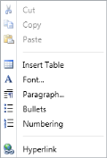

# Context-Menu-Support in WPF RichTextBoxAdv (Classic)

RichTextBoxAdv supports a context menu similar to Microsoft Word. It supports the following list of features in its context menu:

1. Cut
2. Copy
3. Paste
4. Insert Table
5. Font
6. Paragraph
7. Bullets
8. Numbering
9. Hyperlink

