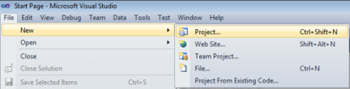
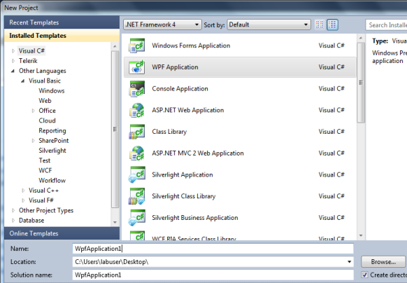
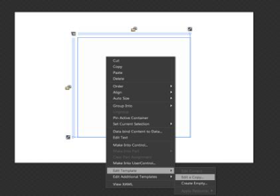

# Getting Started with WPF RichTextBoxAdv (Classic)

## Adding RichTextBoxAdv to an Application 

The RichTextBoxAdv control can be added to an application by using the following applications:

1. Microsoft Visual Studio
2. Microsoft Expression Blend

N> Starting with v16.2.0.41 (2018 Vol 2), if you reference Syncfusion assemblies from trial setup or from the NuGet feed, you also have to add "Syncfusion.Licensing" assembly reference and include a license key in your projects. Please refer to this [link](https://help.syncfusion.com/common/essential-studio/licensing/license-key) to know about registering Syncfusion license key in your WPF application to use our components.

## Creating the RichTextBoxAdv Control in Visual Studio

To create a RichTextBoxAdv instance in Visual Studio:

1. Open Visual Studio.      
2. On the File menu, select New, and then select Project. The New Project dialog box is displayed.           

            

3. In the New Project dialog box, select WPF Application.                         
4. In the Name field, type the name of the project.                              
5. Click OK.                    

   

6. Drag the RichTextBoxAdv control from the Toolbox window to the Design View. An instance of the RichTextBoxAdv control is created in Design view.     

   

## Creating the RichTextBoxAdv Control in Expression Blend

To create a RichTextBoxAdv instance in Expression Blend:

1. Open Expression Blend.    
2. On the File menu, select New Project. The New Project dialog box opens.         

    

3. In the Project types pane, select WPF, and then select WPF Application.         
4. In the Name field, type the name of the project, and then click OK.             

       

5. On the Window menu, select Assets. The Assets Library dialog box opens.                       
6. In the Search box, type RichTextBoxAdv. The search results are displayed.                     
7. Drag the RichTextBoxAdv control to the Design view. An instance of the RichTextBoxAdv control is created.                   

   

## Appearance

You can customize the appearance of the RichTextBoxAdv control by editing the style of the control in ExpressionBlend or by using the properties exposed by the RichTextBoxAdv control.

### Blendability

You can edit the style of the RichTextBoxAdv control by using Expression Blend. To edit the RichTextBoxAdv control’s style in Expression Blend:

1.Drag the RichTextBoxAdv control to the Design view. The RichTextBoxAdv control will appear as shown in the screen shot displayed below.                 
2.Right-click the RichTextBoxAdv control, select Edit Template, and then select Edit a Copy.          

