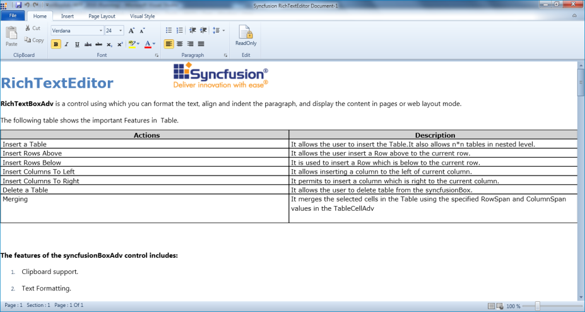

# Layout-Modes in WPF RichTextBoxAdv (Classic)

The layout mode feature allows choosing several layouts in the document. They are:

1. PageLayout—A single document in the edited content can be separated into n number of pages depending upon the capacity of the content. We can customize the page margin and size using the properties which are available in SectionAdv.

   

2. ContinuousLayout—This layout mode looks like the Web Layout mode in Microsoft Word. Instead of having pages of content, it will have a single page that displays all of the content.

   

