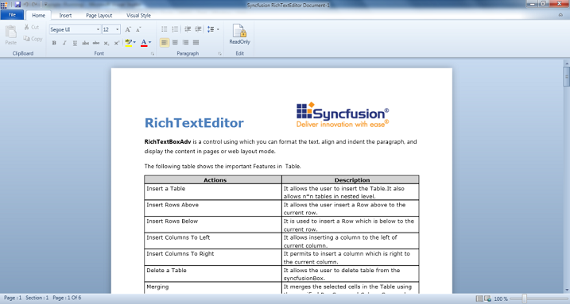

# WPF RichTextBoxAdv (Classic) Overview

RichTextBoxAdv is a control for formatting text, such as aligning and indenting paragraphs, and displaying the content in pages or in a Web layout mode.

## The features of the RichTextBoxAdv control include:

1. Clipboard support
2. Text formatting
3. Paragraph alignment and indentation features like text alignment, line spacing, left indent, right indent, before spacing, and after spacing
4. Command support
5. Insert an image or UIElement into RichTextBoxAdv
6. Page layout
7. Import and export feature for .doc, .docx, .html, .xaml, and .txt file formats
8. Printing and zooming
9. Keyboard shortcuts
10. Undo and redo support
11. Disable editing using the IsReadOnly property

## Use Case Scenarios

This control helps users with rich text formatting such as bold, italic, highlighting, aligning, indenting paragraphs, and so on. It can also be used in forums, blogs, and so on.

1. It can be used like Microsoft Word in rich content applications.
2. It can be used as an HTML editor control as it has the HTML export feature.
3. The built-in commands help to create customized toolbar applications.

## Sample Link

### The access the samples:

* Select Start > Programs > Syncfusion > Essential Studio xx.x.x.xx > Dashboard.
* Select Run Locally Installed Samples.
* Now expand the RichTextBoxAdv item in the sample browser.
* Choose the OfficeUI Demo.

