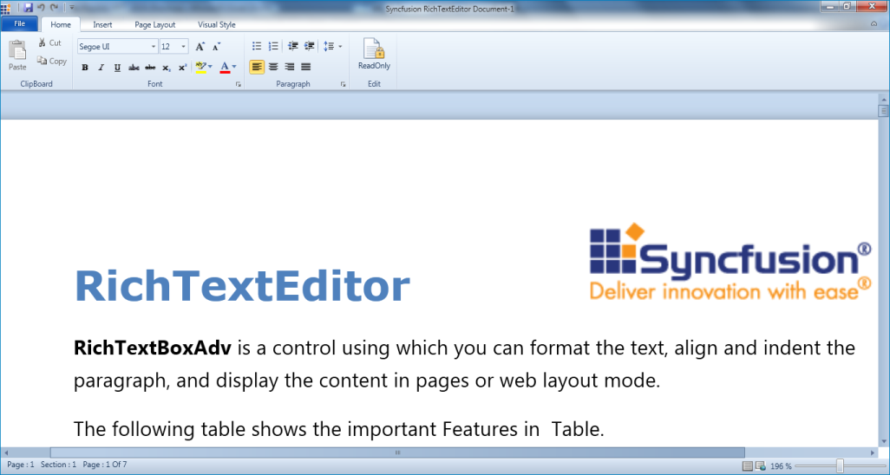

# Zooming-and-Printing in WPF RichTextBoxAdv (Classic)

RichTextBoxAdv allows you to zoom in and out on the content of the document. CTRL + mouse wheel will zoom in and zoom out the content of the RichTextBoxAdv control.

The printing feature permits users to print the content of the document using PrintDocument().

We can also use the Print command which will execute the PrintDocument method whenever it is hooked to the command property.



__RichTextBox.PrintDocument();



### Properties

<table>
<tr>
<th>
Property</th><th>
Description</th><th>
Type</th><th>
Data Type</th></tr>
<tr>
<td>
IsZoomEnabled</td><td>
Decides whether the content of the RichTextBoxAdv can be zoomed or not.</td><td>
Dependency Property</td><td>
Boolean</td></tr>
<tr>
<td>
ZoomFactor</td><td>
Factor to show the zoomed value. It ranges from 0.1 to 1.</td><td>
Dependency Property</td><td>
Double</td></tr>
</table>

### Methods

<table>
<tr>
<th>
Method</th><th>
Description</th><th>
Parameters</th><th>
Type</th><th>
Return Type</th></tr>
<tr>
<td>
ResetZooming()</td><td>
Resets the zoom.</td><td>
NA</td><td>
NA</td><td>
Void</td></tr>
<tr>
<td>
PrintDocument()</td><td>
Prints the content of the RichTextBoxAdv.</td><td>
NA</td><td>
NA</td><td>
Void</td></tr>
</table>

