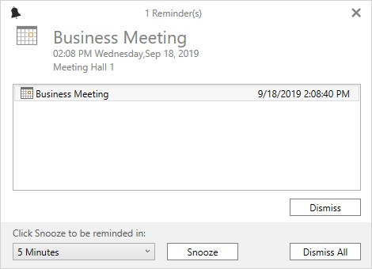

# Reminder Of WPF SFSchedule

Schedule alerts you for particular appointment with reminder window when enable the [EnableReminderTimer](https://help.syncfusion.com/cr/wpf/Syncfusion.UI.Xaml.Schedule.SfSchedule.html#Syncfusion_UI_Xaml_Schedule_SfSchedule_EnableReminderTimer) property. Reminder window supports to `Dismiss` or `DismissAll` or set the `SnoozeTime` for reminder appointments.

## Setting reminder for an Appointment
Reminder can be set by setting the [EnableReminderTimer](https://help.syncfusion.com/cr/wpf/Syncfusion.UI.Xaml.Schedule.SfSchedule.html#Syncfusion_UI_Xaml_Schedule_SfSchedule_EnableReminderTimer) property is `true`.The remainder time can be set using the [ReminderTime](https://help.syncfusion.com/cr/wpf/Syncfusion.UI.Xaml.Schedule.ScheduleAppointment.html#Syncfusion_UI_Xaml_Schedule_ScheduleAppointment_ReminderTime) property of ScheduleAppointment.



<Grid>
    <syncfusion:SfSchedule x:Name="schedule" ScheduleType="Month" EnableReminderTimer="True"/>
</Grid>



schedule.Appointments.Add(new ScheduleAppointment
{
    StartTime = DateTime.Now.Date.AddHours(9),
    EndTime   = DateTime.Now.Date.AddHours(12),
    AppointmentBackground = new SolidColorBrush(Color.FromArgb(0xFf, 0xA2, 0xC1, 0x39)),
    Subject = "Business Meeting",
    ReminderTime = ReminderTimeType.TenHours
});

schedule.Appointments.Add(new ScheduleAppointment
{
    StartTime = currentDate.Date.AddDays(1).AddHours(10),
    EndTime = currentDate.Date.AddDays(1).AddHours(16),
    AppointmentBackground = new SolidColorBrush(Color.FromArgb(0xFf, 0xD8, 0x00, 0x73)),
    Subject = "Auditing",
    ReminderTime = ReminderTimeType.TwoDays
});

schedule.Appointments.Add(new ScheduleAppointment
{
    StartTime = DateTime.Now.Date.AddDays(7).AddHours(10),
    EndTime = DateTime.Now.Date.AddDays(7).AddHours(13),
    AppointmentBackground = new SolidColorBrush(Color.FromArgb(0xFf, 0xF0, 0x96, 0x09)),
    Subject = "Conference",
    ReminderTime = ReminderTimeType.TwoWeeks
});




Download demo from [GitHub](https://github.com/syncfusion/wpf-demos/tree/master/Schedule/ReminderAlert)

## Configuring Reminder Duration
Scheduler supports to set the reminder duration time to remind the appointments by using the [ReminderTime](https://help.syncfusion.com/cr/wpf/Syncfusion.UI.Xaml.Schedule.ScheduleAppointment.html#Syncfusion_UI_Xaml_Schedule_ScheduleAppointment_ReminderTime) property of [ScheduleAppointment](https://help.syncfusion.com/cr/wpf/Syncfusion.UI.Xaml.Schedule.ScheduleAppointment.html).



schedule.Appointments[0].ReminderTime = ReminderTimeType.FifteenMin;



## Create a custom binding for ReminderTime
[ReminderTime](https://help.syncfusion.com/cr/wpf/Syncfusion.UI.Xaml.Schedule.ScheduleAppointment.html#Syncfusion_UI_Xaml_Schedule_ScheduleAppointment_ReminderTime) supports to map your custom object with `ScheduleAppointment.ReminderTime`.



/// 

/// Represents custom data properties.
/// 

public class Meeting
{
    public String Subject { get; set; }
    public DateTime StartTime { get; set; }
    public DateTime EndTime { get; set; }
    public Brush AppointmentColor { get; set; }
    public ReminderTimeType ReminderTime { get; set; }
}



N>You can inherit this class from `INotifyPropertyChanged` for dynamic changes in custom data.

You can map those properties of `Meeting` class with our [SfSchedule](https://help.syncfusion.com/cr/wpf/Syncfusion.UI.Xaml.Schedule.SfSchedule.html) control by using [AppointmentMapping](https://help.syncfusion.com/cr/wpf/Syncfusion.UI.Xaml.Schedule.SfSchedule.html#Syncfusion_UI_Xaml_Schedule_SfSchedule_AppointmentMapping) and [ScheduleAppointmentMapping](https://help.syncfusion.com/cr/wpf/Syncfusion.UI.Xaml.Schedule.ScheduleAppointmentMapping.html).



<syncfusion:SfSchedule x:Name="schedule" ScheduleType="Month" DataSource="{Binding Meetings}">
    <syncfusion:SfSchedule.AppointmentMapping>
        <syncfusion:ScheduleAppointmentMapping
            SubjectMapping="Subject"
            AppointmentBackgroundMapping="AppointmentColor"
            StartTimeMapping="StartTime"
            EndTimeMapping="EndTime"
            ReminderTimeMapping="ReminderTime">
        </syncfusion:ScheduleAppointmentMapping>
    </syncfusion:SfSchedule.AppointmentMapping>
</syncfusion:SfSchedule>


// Schedule data mapping for custom appointments
ScheduleAppointmentMapping dataMapping = new ScheduleAppointmentMapping();
dataMapping.SubjectMapping = "Subject";
dataMapping.StartTimeMapping = "StartTime";
dataMapping.EndTimeMapping = "EndTime";
dataMapping.AppointmentBackgroundMapping = "AppointmentColor";
dataMapping.ReminderTimeMapping = "ReminderTime";
schedule.AppointmentMapping = dataMapping;



Download demo from [GitHub](https://github.com/SyncfusionExamples/SfSchedule_Reminder_Demo/tree/master/ReminderDemo)

## Handling Reminder events

### ReminderOpening event

[ReminderOpening](https://help.syncfusion.com/cr/wpf/Syncfusion.UI.Xaml.Schedule.SfSchedule.html) – occurs when appearing the reminder window.

[ReminderControlOpeningEventArgs](https://help.syncfusion.com/cr/wpf/Syncfusion.UI.Xaml.Schedule.ReminderControlOpeningEventArgs.html) has following property.

[RemindAppCollection](https://help.syncfusion.com/cr/wpf/Syncfusion.UI.Xaml.Schedule.ReminderControlOpeningEventArgs.html#Syncfusion_UI_Xaml_Schedule_ReminderControlOpeningEventArgs_RemindAppCollection) – Gets list of reminder appointments.

You can prevent the reminder window opening through [ReminderControlOpeningEventArgs.Cancel](https://docs.microsoft.com/en-us/dotnet/api/system.componentmodel.canceleventargs.cancel) property of [ReminderOpening](https://help.syncfusion.com/cr/wpf/Syncfusion.UI.Xaml.Schedule.SfSchedule.html) event.



this.Schedule.ReminderOpening += Schedule_ReminderOpening;
private void Schedule_ReminderOpening(object sender, ReminderControlOpeningEventArgs e)
{
    e.Cancel = true;
}




### ReminderClosed event

[ReminderClosed](https://help.syncfusion.com/cr/wpf/Syncfusion.UI.Xaml.Schedule.SfSchedule.html) – occurs when closing the reminder window.
[ReminderControlClosedEventArgs](https://help.syncfusion.com/cr/wpf/Syncfusion.UI.Xaml.Schedule.ReminderControlClosedEventArgs.html) provides information for [ReminderClosed](https://help.syncfusion.com/cr/wpf/Syncfusion.UI.Xaml.Schedule.SfSchedule.html) event.

### ReminderFormActionChanged event

[ReminderFormActionChanged](https://help.syncfusion.com/cr/wpf/Syncfusion.UI.Xaml.Schedule.SfSchedule.html) – occurs when change the reminder window action for the appointment.

[ReminderFormActionChangedEventArgs](https://help.syncfusion.com/cr/wpf/Syncfusion.UI.Xaml.Schedule.ReminderFormActionChangedEventArgs.html) has following properties which provides information for [ReminderFormActionChanged](https://help.syncfusion.com/cr/wpf/Syncfusion.UI.Xaml.Schedule.SfSchedule.html) event.

[Action](https://help.syncfusion.com/cr/wpf/Syncfusion.UI.Xaml.Schedule.ReminderFormActionChangedEventArgs.html#Syncfusion_UI_Xaml_Schedule_ReminderFormActionChangedEventArgs_Action) - Gets the action of schedule appointments.

[Appointments](https://help.syncfusion.com/cr/wpf/Syncfusion.UI.Xaml.Schedule.ReminderFormActionChangedEventArgs.html#Syncfusion_UI_Xaml_Schedule_ReminderFormActionChangedEventArgs_Appointments) – Gets list of appointments that are changed.

[SnoozeTime](https://help.syncfusion.com/cr/wpf/Syncfusion.UI.Xaml.Schedule.ReminderFormActionChangedEventArgs.html#Syncfusion_UI_Xaml_Schedule_ReminderFormActionChangedEventArgs_SnoozeTime) – Gets the snooze time of action changed appointments.

Download demo from [GitHub](https://github.com/SyncfusionExamples/SfSchedule_Reminder_Events/tree/master/ReminderEvents)
