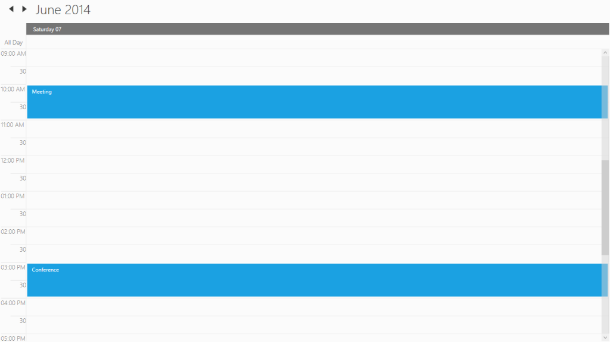
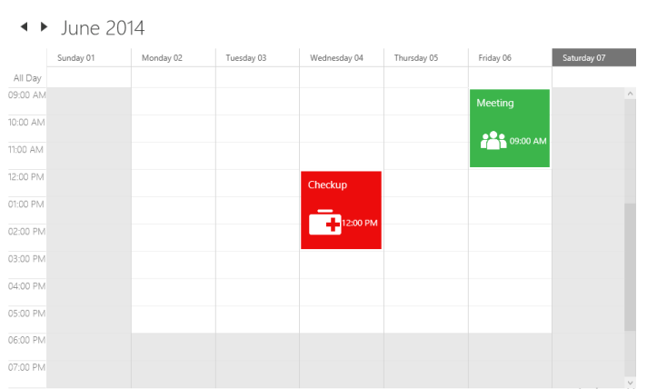
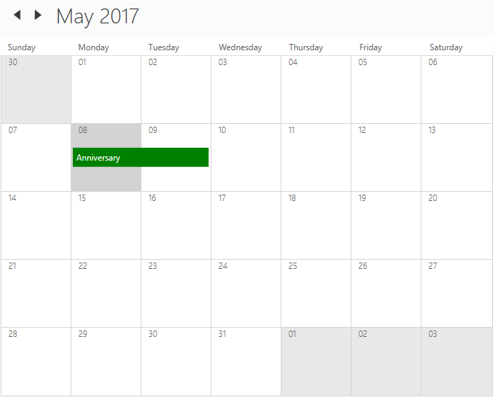
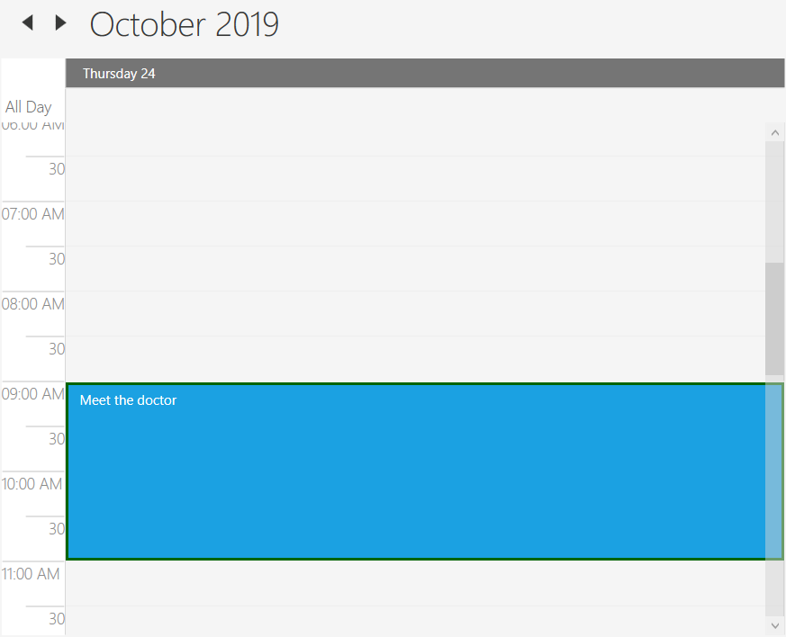

# Appointments in WPF Schedule (Classic)

Scheduler control displays appointments based on details such as `StartTime`, `EndTime`, `Subject` and etc in `ScheduleAppointment` class. Also, it support to bind any collection and allows to render appointments based on data object in collection using mapping concept which explained under data binding section. 

## Adding appointment

Scheduler support to add the `ScheduleAppointment` by using [Appointments](https://help.syncfusion.com/cr/wpf/Syncfusion.UI.Xaml.Schedule.SfSchedule.html#Syncfusion_UI_Xaml_Schedule_SfSchedule_Appointments) property. Schedule supports to render all day appointments, spanned appointment and recurring appointments. 



<syncfusion:SfSchedule.Appointments>
    <syncfusion:ScheduleAppointment StartTime="05/08/2017 10:0:0" EndTime="05/08/2017 11:0:0" Subject="Meeting" Location="Hutchison road"/>
</syncfusion:SfSchedule.Appointments>


// Creating an instance for schedule appointment collection
ScheduleAppointmentCollection scheduleAppointmentCollection = new ScheduleAppointmentCollection();
//Adding schedule appointment in schedule appointment collection 
scheduleAppointmentCollection.Add(new ScheduleAppointment()
{
    StartTime = new DateTime(2017, 05, 08, 10, 0, 0),
    EndTime = new DateTime(2017, 05, 08, 11, 0, 0),
    Subject = "Meeting",
    Location = "Hutchison road",
});

//Adding schedule appointment collection to Appointments of SfSchedule
this.Schedule.Appointments = scheduleAppointmentCollection;



## AppointmentCollectionChanged
Scheduler notifies changes of `Appointments` collection by [AppointmentCollectionChanged](https://help.syncfusion.com/cr/wpf/Syncfusion.UI.Xaml.Schedule.SfSchedule.html) event.
This event triggers with default [NotifyCollectionChangedEventArgs](https://docs.microsoft.com/en-us/dotnet/api/system.collections.specialized.notifycollectionchangedeventargs).



this.schedule.AppointmentCollectionChanged += Schedule_AppointmentCollectionChanged;
private void Schedule_AppointmentCollectionChanged(object sender, System.Collections.Specialized.NotifyCollectionChangedEventArgs e)
{
    //To notify whenever make the changes in Appointments collection.
}



## Data Binding

Scheduler supports to bind any collection that implements the `IEnumerable` interface to populate appointments. You can map properties in data object to `ScheduleAppointment` by configuring the [AppointmentMapping](https://help.syncfusion.com/cr/wpf/Syncfusion.UI.Xaml.Schedule.SfSchedule.html#Syncfusion_UI_Xaml_Schedule_SfSchedule_AppointmentMapping) property. Below table which property shows mapping property details to `ScheduleAppointment`. 

<table>
<tr><th>Property Name</th><th>Description</th></tr>
<tr><td><a href="https://help.syncfusion.com/cr/wpf/Syncfusion.UI.Xaml.Schedule.ScheduleAppointmentMapping.html#Syncfusion_UI_Xaml_Schedule_ScheduleAppointmentMapping_StartTimeMapping">StartTimeMapping</a></td><td>This property is intended to map the custom class property name that is identical to ScheduleAppointment's <a href="https://help.syncfusion.com/cr/wpf/Syncfusion.UI.Xaml.Schedule.ScheduleAppointment.html#Syncfusion_UI_Xaml_Schedule_ScheduleAppointment_StartTime">StartTime</a>.</td></tr>
<tr><td><a href="https://help.syncfusion.com/cr/wpf/Syncfusion.UI.Xaml.Schedule.ScheduleAppointmentMapping.html#Syncfusion_UI_Xaml_Schedule_ScheduleAppointmentMapping_StartTimeZoneMapping">StartTimeZoneMapping</a></td><td>This property is intended to map the custom class property name that is identical to ScheduleAppointment's <a href="https://help.syncfusion.com/cr/wpf/Syncfusion.UI.Xaml.Schedule.ScheduleAppointment.html#Syncfusion_UI_Xaml_Schedule_ScheduleAppointment_StartTimeZone">StartTimeZone</a>.</td></tr>
<tr><td><a href="https://help.syncfusion.com/cr/wpf/Syncfusion.SfSchedule.WPF~Syncfusion.UI.Xaml.Schedule.ScheduleAppointmentMapping~EndTimeMapping.html">EndTimeMapping</a></td><td>This property is intended to map the custom class property name that is identical to ScheduleAppointment's <a href="https://help.syncfusion.com/cr/wpf/Syncfusion.UI.Xaml.Schedule.ScheduleAppointment.html#Syncfusion_UI_Xaml_Schedule_ScheduleAppointment_EndTime">EndTime</a>.</td></tr>
<tr><td><a href="https://help.syncfusion.com/cr/wpf/Syncfusion.SfSchedule.WPF~Syncfusion.UI.Xaml.Schedule.ScheduleAppointmentMapping~EndTimeZoneMapping.html">EndTimeZoneMapping</a></td><td>This property is intended to map the custom class property name that is identical to ScheduleAppointment's <a href="https://help.syncfusion.com/cr/wpf/Syncfusion.UI.Xaml.Schedule.ScheduleAppointment.html#Syncfusion_UI_Xaml_Schedule_ScheduleAppointment_EndTimeZone">EndTimeZone</a>.</td></tr>
<tr><td><a href="https://help.syncfusion.com/cr/wpf/Syncfusion.UI.Xaml.Schedule.ScheduleAppointmentMapping.html#Syncfusion_UI_Xaml_Schedule_ScheduleAppointmentMapping_SubjectMapping">SubjectMapping</a></td><td>This property is intended to map the custom class property name that is identical to ScheduleAppointment's <a href="https://help.syncfusion.com/cr/wpf/Syncfusion.UI.Xaml.Schedule.ScheduleAppointment.html#Syncfusion_UI_Xaml_Schedule_ScheduleAppointment_Subject">Subject</a>.</td></tr>
<tr><td><a href="https://help.syncfusion.com/cr/wpf/Syncfusion.SfSchedule.WPF~Syncfusion.UI.Xaml.Schedule.ScheduleAppointmentMapping~AppointmentBackgroundMapping.html">AppointmentBackgroundMapping</a></td><td>This property is intended to map the custom class property name that is identical to ScheduleAppointment's <a href="https://help.syncfusion.com/cr/wpf/Syncfusion.UI.Xaml.Schedule.ScheduleAppointment.html#Syncfusion_UI_Xaml_Schedule_ScheduleAppointment_AppointmentBackground">AppointmentBackground</a>.</td></tr>
<tr><td><a href="https://help.syncfusion.com/cr/wpf/Syncfusion.SfSchedule.WPF~Syncfusion.UI.Xaml.Schedule.ScheduleAppointmentMapping~AllDayMapping.html">AllDayMapping</a></td><td>This property is intended to map the custom class property name that is identical to ScheduleAppointment's <a href="https://help.syncfusion.com/cr/wpf/Syncfusion.UI.Xaml.Schedule.ScheduleAppointment.html#Syncfusion_UI_Xaml_Schedule_ScheduleAppointment_AllDay">AllDay</a>. Refer the following <a href="#all-day-appointments">link</a> to know more about the AllDay</td></tr>
<tr><td><a href="https://help.syncfusion.com/cr/wpf/Syncfusion.UI.Xaml.Schedule.ScheduleAppointmentMapping.html#Syncfusion_UI_Xaml_Schedule_ScheduleAppointmentMapping_RecurrenceRuleMapping">RecurrenceRuleMapping</a></td><td>This property is intended to map the custom class property name that is identical to ScheduleAppointment's <a href="https://help.syncfusion.com/cr/wpf/Syncfusion.UI.Xaml.Schedule.ScheduleAppointment.html#Syncfusion_UI_Xaml_Schedule_ScheduleAppointment_RecurrenceRule">RecurrenceRule</a>. Refer the following <a href="https://help.syncfusion.com/wpf/scheduler/recurrence#recurrence-rule">link</a> to know more about the RecurrenceRule</td></tr>
<tr><td><a href="https://help.syncfusion.com/cr/wpf/Syncfusion.UI.Xaml.Schedule.ScheduleAppointmentMapping.html#Syncfusion_UI_Xaml_Schedule_ScheduleAppointmentMapping_RecurrenceTypeMapping">RecurrenceTypeMapping</a></td><td>This property is intended to map the custom class property name that is identical to ScheduleAppointment's <a href="https://help.syncfusion.com/cr/wpf/Syncfusion.UI.Xaml.Schedule.RecurrenceProperties.html#Syncfusion_UI_Xaml_Schedule_RecurrenceProperties_RecurrenceType">RecurrenceType</a>.</td></tr>
<tr><td><a href="https://help.syncfusion.com/cr/wpf/Syncfusion.UI.Xaml.Schedule.ScheduleAppointmentMapping.html#Syncfusion_UI_Xaml_Schedule_ScheduleAppointmentMapping_RecurrenceProperitesMapping">RecurrenceProperitesMapping</a></td><td>This property is intended to map the custom class property name that is identical to ScheduleAppointment's <a href="https://help.syncfusion.com/cr/wpf/Syncfusion.UI.Xaml.Schedule.ScheduleAppointment.html#Syncfusion_UI_Xaml_Schedule_ScheduleAppointment_RecurrenceProperites">RecurrenceProperites</a>.</td></tr>
<tr><td><a href="https://help.syncfusion.com/cr/wpf/Syncfusion.UI.Xaml.Schedule.ScheduleAppointmentMapping.html#Syncfusion_UI_Xaml_Schedule_ScheduleAppointmentMapping_RecursiveExceptionDatesMapping">RecursiveExceptionDatesMapping</a></td><td>This property is intended to map the custom class property name that is identical to ScheduleAppointment's <a href="https://help.syncfusion.com/cr/wpf/Syncfusion.UI.Xaml.Schedule.ScheduleAppointment.html#Syncfusion_UI_Xaml_Schedule_ScheduleAppointment_RecursiveExceptionDates">RecursiveExceptionDates</a>. Refer the following <a href="https://help.syncfusion.com/wpf/scheduler/recurrence#recursiveexceptiondates">link</a> to know more about the RecursiveExceptionDates</td></tr>
<tr><td><a href="https://help.syncfusion.com/cr/wpf/Syncfusion.UI.Xaml.Schedule.ScheduleAppointmentMapping.html#Syncfusion_UI_Xaml_Schedule_ScheduleAppointmentMapping_ReminderTimeMapping">ReminderTimeMapping</a></td><td>This property is intended to map the custom class property name that is identical to ScheduleAppointment's<a href="https://help.syncfusion.com/cr/wpf/Syncfusion.UI.Xaml.Schedule.ScheduleAppointment.html#Syncfusion_UI_Xaml_Schedule_ScheduleAppointment_ReminderTime"> ReminderTime</a>. Refer the following <a href="https://help.syncfusion.com/wpf/scheduler/reminder">link</a> to know more about the ReminderTime</td></tr>
<tr><td><a href="https://help.syncfusion.com/cr/wpf/Syncfusion.UI.Xaml.Schedule.ScheduleAppointmentMapping.html#Syncfusion_UI_Xaml_Schedule_ScheduleAppointmentMapping_IsRecursiveMapping">IsRecursiveMapping</a></td><td>This property is intended to map the custom class property name that is identical to ScheduleAppointment's <a href="https://help.syncfusion.com/cr/wpf/Syncfusion.UI.Xaml.Schedule.ScheduleAppointment.html#Syncfusion_UI_Xaml_Schedule_ScheduleAppointment_IsRecursive">IsRecursive</a>.</td></tr>
<tr><td><a href="https://help.syncfusion.com/cr/wpf/Syncfusion.UI.Xaml.Schedule.ScheduleAppointmentMapping.html#Syncfusion_UI_Xaml_Schedule_ScheduleAppointmentMapping_NotesMapping">NotesMapping</a></td><td>This property is intended to map the custom class property name that is identical to ScheduleAppointment's <a href="https://help.syncfusion.com/cr/wpf/Syncfusion.UI.Xaml.Schedule.ScheduleAppointment.html#Syncfusion_UI_Xaml_Schedule_ScheduleAppointment_Notes">Notes</a>.</td></tr>
<tr><td><a href="https://help.syncfusion.com/cr/wpf/Syncfusion.UI.Xaml.Schedule.ScheduleAppointmentMapping.html#Syncfusion_UI_Xaml_Schedule_ScheduleAppointmentMapping_LocationMapping">LocationMapping</a></td><td>This property is intended to map the custom class property name that is identical to ScheduleAppointment's <a href="https://help.syncfusion.com/cr/wpf/Syncfusion.UI.Xaml.Schedule.ScheduleAppointment.html#Syncfusion_UI_Xaml_Schedule_ScheduleAppointment_Location">Location</a>.</td></tr>
<tr><td><a href="https://help.syncfusion.com/cr/wpf/Syncfusion.UI.Xaml.Schedule.ScheduleAppointmentMapping.html#Syncfusion_UI_Xaml_Schedule_ScheduleAppointmentMapping_StatusMapping">StatusMapping</a></td><td>This property is intended to map the custom class property name that is identical to ScheduleAppointment's <a href="https://help.syncfusion.com/cr/wpf/Syncfusion.UI.Xaml.Schedule.ScheduleAppointment.html#Syncfusion_UI_Xaml_Schedule_ScheduleAppointment_Status">Status</a>.</td></tr>
<tr><td><a href="https://help.syncfusion.com/cr/wpf/Syncfusion.UI.Xaml.Schedule.ScheduleAppointmentMapping.html#Syncfusion_UI_Xaml_Schedule_ScheduleAppointmentMapping_ResourceCollectionMapping">ResourceCollectionMapping</a></td><td>This property is intended to map the custom class property name that is identical to ScheduleAppointment's <a href="https://help.syncfusion.com/cr/wpf/Syncfusion.UI.Xaml.Schedule.ScheduleAppointment.html#Syncfusion_UI_Xaml_Schedule_ScheduleAppointment_ResourceCollection">ResourceCollection</a>.</td></tr>
<tr><td><a href="https://help.syncfusion.com/cr/wpf/Syncfusion.UI.Xaml.Schedule.ScheduleAppointmentMapping.html#Syncfusion_UI_Xaml_Schedule_ScheduleAppointmentMapping_ResourceNameMapping">ResourceNameMapping</a></td><td>This property is intended to map the custom class property name that is identical to ScheduleAppointment's <a href="https://help.syncfusion.com/cr/wpf/Syncfusion.UI.Xaml.Schedule.Resource.html#Syncfusion_UI_Xaml_Schedule_Resource_ResourceName">ResourceName</a>.</td></tr>
<tr><td><a href="https://help.syncfusion.com/cr/wpf/Syncfusion.SfSchedule.WPF~Syncfusion.UI.Xaml.Schedule.ScheduleAppointmentMapping~DisplayNameMapping.html">DisplayNameMapping</a></td><td>This property is intended to map the custom class property name that is identical to ScheduleAppointment's <a href="https://help.syncfusion.com/cr/wpf/Syncfusion.UI.Xaml.Schedule.Resource.html#Syncfusion_UI_Xaml_Schedule_Resource_DisplayName">DisplayName</a>.</td></tr>
<tr><td><a href="https://help.syncfusion.com/cr/wpf/Syncfusion.UI.Xaml.Schedule.ScheduleAppointmentMapping.html#Syncfusion_UI_Xaml_Schedule_ScheduleAppointmentMapping_TypeNameMapping">TypeNameMapping</a></td><td>This property is intended to map the custom class property name that is identical to ScheduleAppointment's <a href="https://help.syncfusion.com/cr/wpf/Syncfusion.UI.Xaml.Schedule.Resource.html#Syncfusion_UI_Xaml_Schedule_Resource_TypeName">TypeName</a>.</td></tr>
<tr><td><a href="https://help.syncfusion.com/cr/wpf/Syncfusion.UI.Xaml.Schedule.ScheduleAppointmentMapping.html#Syncfusion_UI_Xaml_Schedule_ScheduleAppointmentMapping_ReadOnlyMapping">ReadOnlyMapping</a></td><td>This property is intended to map the custom class property name that is identical to ScheduleAppointment's <a href="https://help.syncfusion.com/cr/wpf/Syncfusion.UI.Xaml.Schedule.ScheduleAppointment.html#Syncfusion_UI_Xaml_Schedule_ScheduleAppointment_ReadOnly">ReadOnly</a>.</td></tr>
</table>

N> Custom appointment class should contain two DateTime fields and a string field as mandatory.

### Creating data object
Scheduler supports to create an appointment by using custom object. Appointments can be generated by creating a custom class `Event` with mandatory fields `From`, `To` and `EventName`.



/// 
   
/// Represents custom data properties.   
/// 
 
public class Event
{
    public string EventName { get; set; }
    public DateTime From { get; set; }
    public DateTime To { get; set; }
}



N> You can inherit this class from `INotifyPropertyChanged` for dynamic changes in custom data.

You can map those properties of `Event` class with our Scheduler control by using [AppointmentMapping](https://help.syncfusion.com/cr/wpf/Syncfusion.UI.Xaml.Schedule.SfSchedule.html#Syncfusion_UI_Xaml_Schedule_SfSchedule_AppointmentMapping) and bind the mapping collection with scheduler control using [ItemSource](https://help.syncfusion.com/cr/wpf/Syncfusion.UI.Xaml.Schedule.SfSchedule.html#Syncfusion_UI_Xaml_Schedule_SfSchedule_ItemsSource) property.

 

<Window x:Class="SfSch eduleWpf.MainWindow"
    xmlns="http://schemas.microsoft.com/winfx/2006/xaml/presentation"
    xmlns:x="http://schemas.microsoft.com/winfx/2006/xaml"
    xmlns:schedule="http://schemas.syncfusion.com/wpf"
    Title="MainWindow" Height="350" Width="525"
    WindowState="Maximized">

    <Grid Name="grid">
    <Schedule:SfSchedule Name="schedule" ScheduleType="Day" ItemsSource="{Binding Events}">
    <Schedule:SfSchedule.AppointmentMapping>
    <Schedule:ScheduleAppointmentMapping
    SubjectMapping="EventName"
    StartTimeMapping="From"
    EndTimeMapping="To"/>
    </Schedule:SfSchedule.AppointmentMapping>
    </Schedule:SfSchedule>
    </Grid>
</Window>


public partial class MainWindow : Window
{
    public ObservableCollection<Event> Events { get; set; }
    public MainWindow()
    {
        InitializeComponent();
        Events = new ObservableCollection<Event>
        {
            new Event{EventName = "Meeting", From = DateTime.Now.Date.AddHours(10), To = DateTime.Now.Date.AddHours(11)},
            new Event{EventName = "Conference", From = DateTime.Now.Date.AddHours(15), To = DateTime.Now.Date.AddHours(16)},
        };
        this.DataContext = this;
    }
}




### ItemSourceChanged event
Scheduler notifies changes to the `ItemSource` by [ItemSourceChanged](https://help.syncfusion.com/cr/wpf/Syncfusion.UI.Xaml.Schedule.SfSchedule.html) event in custom binding. 



this.schedule.ItemsSourceChanged += Schedule_ItemsSourceChanged;
private void Schedule_ItemsSourceChanged(object sender, EventArgs e)
{
    //To notify when changing the ItemSource.
}



## Add new appointment
Scheduler supports to add the new appointment by using the `Appointment Editor` window. It will appear when you double click or select the `AddNew` option from the `ContextMenu` on the time when you want the appointment occur.

Add new appointment using ContextMenu

Appointment editor window

## Appointment template customization
Scheduler supports to customize the appointment appearance  by using the [AppointmentTemplate](https://help.syncfusion.com/cr/wpf/Syncfusion.UI.Xaml.Schedule.SfSchedule.html#Syncfusion_UI_Xaml_Schedule_SfSchedule_AppointmentTemplate) property. The `AppointmentTemplate` is a `ControlTemplate` type, used to customize or override the default template of the appointments.



<Schedule:SfSchedule>
    <Schedule:SfSchedule.AppointmentTemplate>
        <ControlTemplate>
            <Grid>
            <Rectangle Fill="{Binding AppointmentBackground}"/>
                <Grid>
                    <Grid.RowDefinitions>
                        <RowDefinition Height="0.25*"/>
                        <RowDefinition Height="0.75*"/>
                    </Grid.RowDefinitions>
                    <Grid.ColumnDefinitions>
                        <ColumnDefinition/>
                        <ColumnDefinition/>
                    </Grid.ColumnDefinitions>
                    <TextBlock Margin="10,2,0,0" Text="{Binding Subject}" Grid.Row="0" Grid.Column="0" Grid.ColumnSpan="2" HorizontalAlignment="Left" VerticalAlignment="Center" FontSize="20" Foreground="White" FontWeight="Light" FontFamily="Segoe UI"/>
                    <Image Source="../Assets/Team.png" Grid.Row="1" HorizontalAlignment="Left" VerticalAlignment="Center" Stretch="Fill" />
                    <TextBlock Text="{Binding StartTime}" Grid.Row="1" Grid.Column="1" HorizontalAlignment="Left" VerticalAlignment="Center" FontSize="20" Foreground="White" FontWeight="Light" FontFamily="Segoe UI" TextWrapping="NoWrap"/>
                </Grid>
            </Grid>
        </ControlTemplate>
    </Schedule:SfSchedule.AppointmentTemplate>
</Schedule:SfSchedule>


schedule.Appointments.Add(new ScheduleAppointment()
{
    StartTime = DateTime.Now.Date.AddHours(9),
    EndTime = DateTime.Now.Date.AddHours(11),
    Subject = "Meet the doctor",
    Location = "Hutchison road",
});



## Types of appointments

### Spanned appointment
Spanned Appointment is an appointment which will generate the appointment when `StartTime` and `EndTime` day difference is more than 1.



ObservableCollection<Meeting> Meetings = new ObservableCollection<Meeting>();
// Creating instance for custom appointment class
Meeting meeting = new Meeting();
// Setting start time of an event
meeting.From = new DateTime(2017, 05, 08, 10, 0, 0);
// Setting end time of an event
meeting.To = meeting.From.AddDays(1).AddHours(1);
// Setting start time for an event
meeting.EventName = "Anniversary";
// Setting color for an event
meeting.Color = Brushes.Green;
// Adding a custom appointment in CustomAppointmentCollection
Meetings.Add(meeting);

this.schedule.ItemsSource = Meetings;



### Recurrence Appointment
This section has briefly explained in following [link](https://help.syncfusion.com/wpf/scheduler/recurrence)

### All day appointments
Appointments can be scheduled for an entire day by using [AllDay](https://help.syncfusion.com/cr/wpf/Syncfusion.UI.Xaml.Schedule.ScheduleAppointment.html#Syncfusion_UI_Xaml_Schedule_ScheduleAppointment_AllDay) property in `ScheduleAppointment`.



<syncfusion:SfSchedule.Appointments>
    <syncfusion:ScheduleAppointment StartTime="05/08/2017 10:0:0" EndTime="05/08/2017 11:0:0" Subject="Meeting" AllDay="True" Location="Hutchison road"/>
</syncfusion:SfSchedule.Appointments>


// Creating an instance for schedule appointment collection
ScheduleAppointmentCollection scheduleAppointmentCollection = new ScheduleAppointmentCollection();
//Adding schedule appointment in schedule appointment collection 
scheduleAppointmentCollection.Add(new ScheduleAppointment()
{
    StartTime = new DateTime(2017, 05, 08, 10, 0, 0),
    EndTime = new DateTime(2017, 05, 08, 11, 0, 0),
    Subject = "Meeting",
    AllDay = true,
    Location = "Hutchison road",
});

//Adding schedule appointment collection to Appointments of Scheduler
this.Schedule.Appointments = scheduleAppointmentCollection;



N> Appointment which lasts through an entire day (exact 24 hours) will be considered as all day appointment without setting `AllDay` property. For example 06/09/2018 12:00AM to 06/10/2018 12:00AM.

## Appointment generating behavior
Scheduler supports to change the all day appointment creation behavior by using [AppointmentBehavior](https://help.syncfusion.com/cr/wpf/Syncfusion.UI.Xaml.Schedule.SfSchedule.html#Syncfusion_UI_Xaml_Schedule_SfSchedule_AppointmentBehavior) property.

`Default` - Appointments will be generated based on `StartTime` and `EndTime`. If `AllDay` property is enabled appointment will be generated in all day panel.
`ExChangeBehavior` - Appointments will be generated when appointment has scheduled for full day.



<schedule:SfSchedule x:Name="Schedule" AppointmentBehavior="ExchangeBehavior">
<syncfusion:SfSchedule.Appointments>
    <syncfusion:ScheduleAppointment StartTime="10/09/2019 10:0:0" EndTime="10/11/2019 11:0:0" Subject="Meeting"  Location="Hutchison road"/>
</syncfusion:SfSchedule.Appointments>
</schedule:SfSchedule>


// Creating an instance for schedule appointment collection
ScheduleAppointmentCollection scheduleAppointmentCollection = new ScheduleAppointmentCollection();
//Adding schedule appointment in schedule appointment collection 
scheduleAppointmentCollection.Add(new ScheduleAppointment()
{
    StartTime = new DateTime(2019, 10, 09, 10, 0, 0),
    EndTime = new DateTime(2019, 10, 11, 11, 0, 0),
    Subject = "Meeting",
    Location = "Hutchison road",
});
this.Schedule.AppointmentBehavior = AppointmentBehavior.ExchangeBehavior;
//Adding schedule appointment collection to Appointments of Scheduler
this.Schedule.Appointments = scheduleAppointmentCollection;



Default

ExchangeBehavior

## All day appointment panel
All-day appointment and Spanned appointment doesn’t block out entire time slot in Scheduler, rather it will render in separate layout exclusively for all-day appointment. It can be disabled by setting [ShowAllDay](https://help.syncfusion.com/cr/wpf/Syncfusion.UI.Xaml.Schedule.SfSchedule.html#Syncfusion_UI_Xaml_Schedule_SfSchedule_ShowAllDay) property.



<Schedule:SfSchedule x:Name="schedule" ShowAllDay="False"/>


this.Schedule.ShowAllDay = false;



## Appointment tooltip
Scheduler supports to show the tooltip for appointment with the details of appointment. The appointment tooltip will be displayed by using the [AppointmentTooltipVisibility](https://help.syncfusion.com/cr/wpf/Syncfusion.UI.Xaml.Schedule.SfSchedule.html#Syncfusion_UI_Xaml_Schedule_SfSchedule_AppointmentTooltipVisibility) property.



<Schedule:SfSchedule x:Name="schedule" AppointmentTooltipVisibility="Visible" ScheduleType="Day"/>


this.Schedule.AppointmentTooltipVisibility = Visibility.Visible;



### Appointment tooltip template customization
Scheduler supports to customize the tooltip by using [AppointmentToolTipTemplate](https://help.syncfusion.com/cr/wpf/Syncfusion.UI.Xaml.Schedule.SfSchedule.html#Syncfusion_UI_Xaml_Schedule_SfSchedule_AppointmentToolTipTemplate) property.



<schedule:SfSchedule x:Name="schedule" ScheduleType="WorkWeek" AppointmentTooltipVisibility="Visible" Background="WhiteSmoke" >
    <schedule:SfSchedule.AppointmentToolTipTemplate>
        <ControlTemplate>
            <Border BorderBrush="Black" BorderThickness="1">
                <Grid Background="WhiteSmoke"  Height="90" Width="210">
                <Grid.RowDefinitions>
                    <RowDefinition/>
                    <RowDefinition Height="10"/>
                    <RowDefinition/>
                    <RowDefinition />
                </Grid.RowDefinitions>
                <Border Grid.Row="0">
                    <TextBlock Margin="1,1,0,0" Background="{Binding AppointmentBackground}"  FontSize="16" Text="{Binding Subject}" Grid.Row="0"/>
                </Border>
                <TextBlock FontSize="16" FontWeight="Bold" FontStyle="Italic" Margin="20,0,0,0" Text="Location: " Grid.Row="2"/>
                <TextBlock FontSize="16" Margin="20,0,0,0" Text="{Binding Location}" Grid.Row="3"/>
                </Grid>
            </Border>
        </ControlTemplate>
    </schedule:SfSchedule.AppointmentToolTipTemplate>
</schedule:SfSchedule>


schedule.Appointments.Add(new ScheduleAppointment()
{
    StartTime = DateTime.Now.Date.AddHours(9),
    EndTime = DateTime.Now.Date.AddHours(11),
    Subject = "Meet the doctor",
    Location = "Hutchison Road"
});



## Change the appointment selection color
Scheduler supports to change the appointment selection background by using [AppointmentSelectionBrush](https://help.syncfusion.com/cr/wpf/Syncfusion.UI.Xaml.Schedule.SfSchedule.html#Syncfusion_UI_Xaml_Schedule_SfSchedule_AppointmentSelectionBrush) property.



<Schedule:SfSchedule x:Name="schedule" AppointmentSelectionBrush ="DarkGreen"/>


this.schedule.AppointmentSelectionBrush = Brushes.DarkGreen;



## Customize the appointment status collection
Scheduler supports to customize the appointment status collection by using [AppointmentStatusCollection](https://help.syncfusion.com/cr/wpf/Syncfusion.UI.Xaml.Schedule.SfSchedule.html#Syncfusion_UI_Xaml_Schedule_SfSchedule_AppointmentStatusCollection) property.



<schedule:SfSchedule x:Name="schedule">
    <schedule:SfSchedule.AppointmentStatusCollection>
        <schedule:ScheduleAppointmentStatus Status="Idle" Brush="Pink"/>
        <schedule:ScheduleAppointmentStatus Status="Busy" Brush="Red"/>
    </schedule:SfSchedule.AppointmentStatusCollection>
</schedule:SfSchedule>


schedule.AppointmentStatusCollection = new ScheduleAppointmentStatusCollection()
{
    new ScheduleAppointmentStatus { Status = "Idle", Brush = new SolidColorBrush(Colors.Pink) },
    new ScheduleAppointmentStatus { Status = "Busy", Brush = new SolidColorBrush(Colors.Red) }
};



