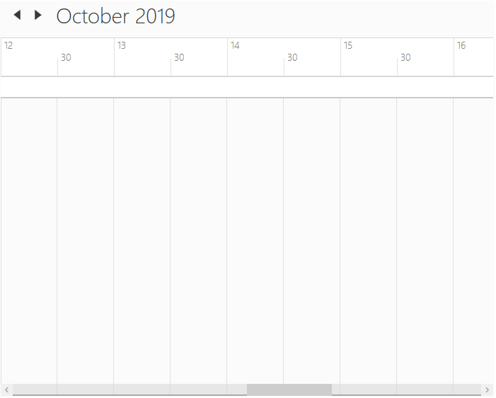
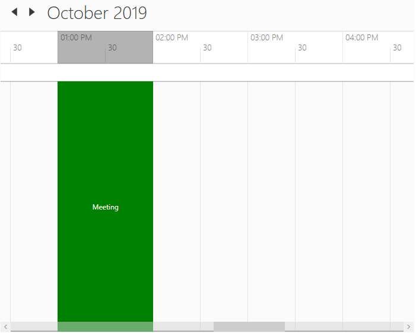
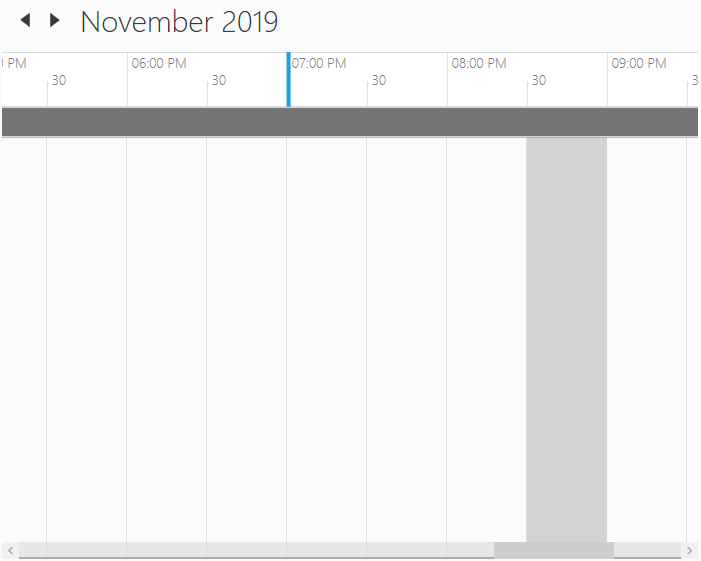
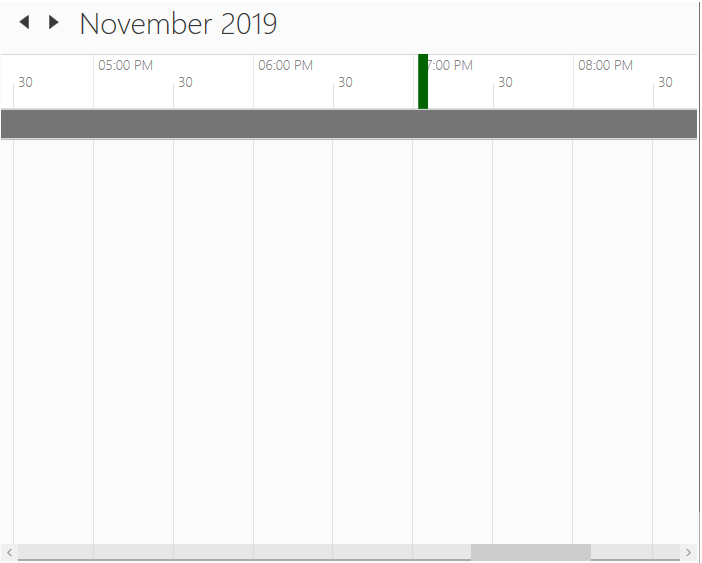
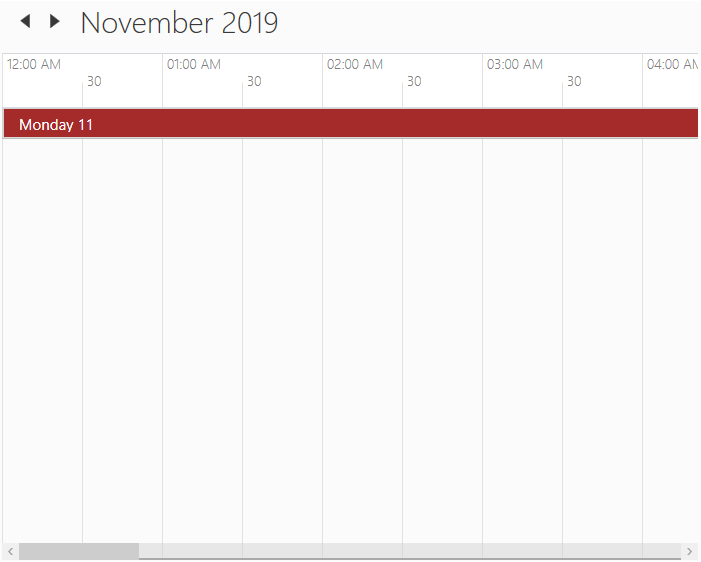

# Timeline View in WPF Schedule (Classic)
`Timeline` view displays the dates with the appropriate day count in the horizontal time axis. When moving right or left, you can see the past or future events. With an intuitive drag-and-drop feature, each view shows events accurately through time slots.



<schedule:SfSchedule x:Name="schedule" ScheduleType="TimeLine"/>


this.schedule.ScheduleType= ScheduleType.TimeLine;



## Header date format
Scheduler supports to customize the header date format of the day, week, workweek and timeline view using [HeaderDateFormat](https://help.syncfusion.com/cr/wpf/Syncfusion.UI.Xaml.Schedule.SfSchedule.html#Syncfusion_UI_Xaml_Schedule_SfSchedule_HeaderDateFormat) property.



<Schedule:SfSchedule HeaderDateFormat="dd-MMMM-yyyy"/>


this.schedule.HeaderDateFormat = "dd-MMMM-yyyy";




## Time formatting
Scheduler supports to customize time format for day, week, workweek and timeline views using [MajorTickTimeFormat](https://help.syncfusion.com/cr/wpf/Syncfusion.UI.Xaml.Schedule.SfSchedule.html#Syncfusion_UI_Xaml_Schedule_SfSchedule_MajorTickTimeFormat) and [MinorTickTimeFormat](https://help.syncfusion.com/cr/wpf/Syncfusion.UI.Xaml.Schedule.SfSchedule.html#Syncfusion_UI_Xaml_Schedule_SfSchedule_MinorTickTimeFormat) property.



<syncfusion:SfSchedule MajorTickTimeFormat="hh mm ss" MinorTickTimeFormat="mm ss"/>


this.schedule.MajorTickTimeFormat = "hh mm ss";
this.schedule.MinorTickTimeFormat = "hh mm ss";



## Change time interval
Scheduler supports to change the time interval using [TimeInterval](https://help.syncfusion.com/cr/wpf/Syncfusion.UI.Xaml.Schedule.SfSchedule.html#Syncfusion_UI_Xaml_Schedule_SfSchedule_TimeInterval) property.



<Schedule:SfSchedule TimeInterval = "OneHour" />


this.schedule.TimeInterval = TimeInterval.OneHour;



## Change time interval height
Scheduler supports to change the time interval height using [IntervalHeight](https://help.syncfusion.com/cr/wpf/Syncfusion.UI.Xaml.Schedule.SfSchedule.html#Syncfusion_UI_Xaml_Schedule_SfSchedule_IntervalHeight) property.



<Schedule:SfSchedule IntervalHeight = 100 />


this.schedule.IntervalHeight = 100;



## Change between 12-hour and 24-hour format
Scheduler supports to change the time format from 12hours to 24 hours using [TimeMode](https://help.syncfusion.com/cr/wpf/Syncfusion.UI.Xaml.Schedule.SfSchedule.html#Syncfusion_UI_Xaml_Schedule_SfSchedule_TimeMode) property.



<Grid Background="White" Name="grid">
    <Schedule:SfSchedule ScheduleType="TimeLine" TimeMode="TwentyFourHours" >     
    </Schedule:SfSchedule>
</Grid>


schedule.ScheduleType = ScheduleType.TimeLine;
schedule.TimeMode = TimeModes.TwentyFourHours;



## Non-accessible timeslots
Scheduler supports to mark certain timeslots as non-accessible timeslots using [NonAccessibleBlocks](https://help.syncfusion.com/cr/wpf/Syncfusion.UI.Xaml.Schedule.SfSchedule.html#Syncfusion_UI_Xaml_Schedule_SfSchedule_NonAccessibleBlocks) property. User can’t interact over the timeslot marked as non-accessible timeslots. 



<Schedule:SfSchedule>
    <Schedule:SfSchedule.NonAccessibleBlocks>
        <Schedule:NonAccessibleBlock Background="Black" StartHour="13" EndHour="14" Label="Lunch">
        </Schedule:NonAccessibleBlock> 
    </Schedule:SfSchedule.NonAccessibleBlocks>
</Schedule:SfSchedule>


this.schedule.NonAccessibleBlocks.Add(new NonAccessibleBlock() { Background = new SolidColorBrush(Colors.Black), StartHour = 13, EndHour = 14, Label = "Lunch" });



### Customize non-accessible timeslots using template
Scheduler supports to customize the non-accessible timeslots using [NonAccessibleBlockTemplate](https://help.syncfusion.com/cr/wpf/Syncfusion.UI.Xaml.Schedule.SfSchedule.html#Syncfusion_UI_Xaml_Schedule_SfSchedule_NonAccessibleBlockTemplate) property.



<syncfusion:SfSchedule.NonAccessibleBlockTemplate>
    <DataTemplate>
        <Border Background="{Binding Color}">
            <TextBlock Text="{Binding EventName}" Foreground="White" HorizontalAlignment="Center" VerticalAlignment="Center"/>
        </Border>
    </DataTemplate>
</syncfusion:SfSchedule.NonAccessibleBlockTemplate>



## Collapsed hours
Scheduler supports to hide the selected hours by using [CollapsedHours](https://help.syncfusion.com/cr/wpf/Syncfusion.UI.Xaml.Schedule.SfSchedule.html#Syncfusion_UI_Xaml_Schedule_SfSchedule_CollapsedHours) property. [ScheduleCollapsedHours](https://help.syncfusion.com/cr/wpf/Syncfusion.UI.Xaml.Schedule.ScheduleCollapsedHour.html) does have the following properties.

[StartHour](https://help.syncfusion.com/cr/wpf/Syncfusion.UI.Xaml.Schedule.ScheduleCollapsedHour.html#Syncfusion_UI_Xaml_Schedule_ScheduleCollapsedHour_StartHour) - To set start time of collapsed hour.
[EndHour](https://help.syncfusion.com/cr/wpf/Syncfusion.UI.Xaml.Schedule.ScheduleCollapsedHour.html#Syncfusion_UI_Xaml_Schedule_ScheduleCollapsedHour_EndHour) - To set end time of collapsed hour.
[Background](https://help.syncfusion.com/cr/wpf/Syncfusion.UI.Xaml.Schedule.ScheduleCollapsedHour.html#Syncfusion_UI_Xaml_Schedule_ScheduleCollapsedHour_Background) - To set the background of collapsed hours.



<schedule:SfSchedule Background="White" x:Name="schedule" ScheduleType="TimeLine">
    <schedule:SfSchedule.CollapsedHours>
        <schedule:ScheduleCollapsedHour StartHour="1" EndHour="5"  Background="Red"/>
    </schedule:SfSchedule.CollapsedHours>        
</schedule:SfSchedule>


this.schedule.CollapsedHours.Add(new ScheduleCollapsedHour() { StartHour = 1, EndHour = 5, Background = new SolidColorBrush(Colors.Red)});



## Change working hours
Working hours of Scheduler will be differentiated with non-working hours by separate color using [IsHighLightWorkingHours](https://help.syncfusion.com/cr/wpf/Syncfusion.UI.Xaml.Schedule.SfSchedule.html#Syncfusion_UI_Xaml_Schedule_SfSchedule_IsHighLightWorkingHours) property for day, week, workweek and timeline views. By default, working hours will be between 09 to 18. You can customize the working hours by setting [WorkStartHour](https://help.syncfusion.com/cr/wpf/Syncfusion.UI.Xaml.Schedule.SfSchedule.html#Syncfusion_UI_Xaml_Schedule_SfSchedule_WorkStartHour) and [WorkEndHour](https://help.syncfusion.com/cr/wpf/Syncfusion.UI.Xaml.Schedule.SfSchedule.html#Syncfusion_UI_Xaml_Schedule_SfSchedule_WorkEndHour) properties.



<schedule:SfSchedule x:Name="schedule" 
                     WorkStartHour="9"
                     WorkEndHour="12"
                     IsHighLightWorkingHours="True"/>


this.schedule.WorkStartHour = 9;
this.schedule.WorkEndHour = 12;
this.schedule.IsHighLightWorkingHours = true;



###  Display working hours only
Scheduler supports to display the working hours only by disabling the [ShowNonWorkingHours](https://help.syncfusion.com/cr/wpf/Syncfusion.UI.Xaml.Schedule.SfSchedule.html#Syncfusion_UI_Xaml_Schedule_SfSchedule_ShowNonWorkingHours) property.



<schedule:SfSchedule x:Name="schedule" 
                     WorkStartHour="9"
                     WorkEndHour="12"
                     ShowNonWorkingHours="False"/>


this.schedule.WorkStartHour = 9;
this.schedule.WorkEndHour = 12;
this.schedule.ShowNonWorkingHours = false;



### Change non-working hours background
Scheduler supports to change the background color for non-working hours using [NonWorkingHourBrush](https://help.syncfusion.com/cr/wpf/Syncfusion.UI.Xaml.Schedule.SfSchedule.html#Syncfusion_UI_Xaml_Schedule_SfSchedule_NonWorkingHourBrush) property.



<schedule:SfSchedule x:Name="schedule" 
                     WorkStartHour="9"
                     WorkEndHour="12"
                     NonWorkingHourBrush="LightSteelBlue"
                     IsHighLightWorkingHours="True"/>


this.schedule.WorkStartHour = 9;
this.schedule.WorkEndHour = 12;
this.schedule.NonWorkingHourBrush = Brushes.LightSteelBlue;
this.schedule.IsHighLightWorkingHours = true;



## Current time indicator
Scheduler supports to display the current time indicator using the [CurrentTimeIndicatorVisibility](https://help.syncfusion.com/cr/wpf/Syncfusion.UI.Xaml.Schedule.SfSchedule.html#Syncfusion_UI_Xaml_Schedule_SfSchedule_CurrentTimeIndicatorVisibility) property.



<syncfusion:SfSchedule ScheduleType="TimeLine" CurrentTimeIndicatorVisibility="Visible"/>


schedule.ScheduleType = ScheduleType.TimeLine;
this.schedule.CurrentTimeIndicatorVisibility = Visibility.Visible;



### Customize current time indicator
Scheduler supports to customize the current time indicator using [CurrentTimeIndicatorTemplate](https://help.syncfusion.com/cr/wpf/Syncfusion.UI.Xaml.Schedule.SfSchedule.html#Syncfusion_UI_Xaml_Schedule_SfSchedule_CurrentTimeIndicatorTemplate) property.



<Schedule:SfSchedule x:Name="schedule" ScheduleType="TimeLine" CurrentTimeIndicatorVisibility="Visible">
    <Schedule:SfSchedule.CurrentTimeIndicatorTemplate>
        <DataTemplate>
            <Border Background="DarkGreen" Height="10" Width="100"></Border>
        </DataTemplate>
    </Schedule:SfSchedule.CurrentTimeIndicatorTemplate>
</Schedule:SfSchedule>     


schedule.ScheduleType = ScheduleType.TimeLine;
schedule.CurrentTimeIndicatorVisibility = Visibility.Visible;
schedule.CurrentTimeIndicatorTemplate = (DataTemplate)this.Resources["CurrentTimeIndicatorTemplate"];



## Change hours or minutes time label visibility
Scheduler supports to visible/collapse the hours and minutes time label visiblity using [MajorTickVisibility](https://help.syncfusion.com/cr/wpf/Syncfusion.UI.Xaml.Schedule.SfSchedule.html#Syncfusion_UI_Xaml_Schedule_SfSchedule_MajorTickVisibility) and [MinorTickVisibility](https://help.syncfusion.com/cr/wpf/Syncfusion.UI.Xaml.Schedule.SfSchedule.html#Syncfusion_UI_Xaml_Schedule_SfSchedule_MinorTickVisibility) properties.



<Schedule:SfSchedule ScheduleType="TimeLine" MajorTickVisibility="Collapsed" MinorTickVisibility="Collapsed" />


this.schedule.ScheduleType = ScheduleType.TimeLine;
this.schedule.MajorTickVisibility = Visibility.Collapsed;
this.schedule.MinorTickVisibility = Visibility.Collapsed;



## Appearance

### Changing time label background

Scheduler supports to change the time slot label background using [HeaderBackground](https://help.syncfusion.com/cr/wpf/Syncfusion.UI.Xaml.Schedule.SfSchedule.html#Syncfusion_UI_Xaml_Schedule_SfSchedule_HeaderBackground) property.



<Schedule:SfSchedule HeaderBackground="LightSkyBlue" />


this.schedule.HeaderBackground = Brushes.LightSkyBlue;



### Stroke customization
In Scheduler control, major, minor horizontal and vertical lines drawn in the day, week, workweek and timeline views by using following properties,

####  Property Table

<table>
<tr>
<th>
API Name</th><th>
Data Type</th><th>
Description</th></tr>
<tr>
<td>
<a href="https://help.syncfusion.com/cr/wpf/Syncfusion.SfSchedule.WPF~Syncfusion.UI.Xaml.Schedule.SfSchedule~MajorTickStroke.html">MajorTickStroke</a></td><td>
Brush</td><td>
Used to customize the major line stroke of the day, week, workweek and timeline views.</td></tr>
<tr>
<td>
<a href="https://help.syncfusion.com/cr/wpf/Syncfusion.SfSchedule.WPF~Syncfusion.UI.Xaml.Schedule.SfSchedule~MinorTickStroke.html">MinorTickStroke</a></td><td>
Brush</td><td>
Used to customize the minor line stroke of the day, week, workweek and timeline views.</td></tr>
<tr>
<td>
<a href="https://help.syncfusion.com/cr/wpf/Syncfusion.SfSchedule.WPF~Syncfusion.UI.Xaml.Schedule.SfSchedule~MinorTickLabelStroke.html">MajorTickLabelStroke</a></td><td>
Brush</td><td>
Used to customize the major line label stroke in the day, week, workweek and timeline views.</td></tr>
<tr>
<td>
<a href="https://help.syncfusion.com/cr/wpf/Syncfusion.SfSchedule.WPF~Syncfusion.UI.Xaml.Schedule.SfSchedule~MajorTickLabelStroke.html">MinorTickLabelStroke</a></td><td>
Brush</td><td>
Used to customize the minor line label stroke of the day, week, workweek and timeline views.</td></tr>
<tr>
<td>
<a href="https://help.syncfusion.com/cr/wpf/Syncfusion.UI.Xaml.Schedule.SfSchedule.html#Syncfusion_UI_Xaml_Schedule_SfSchedule_MajorTickStrokeDashArray">MajorTickStrokeDashArray</a></td><td>
DoubleCollection</td><td>
Used to customize the major line stroke dash array of the day, week, workweek and timeline views.</td></tr>
<tr>
<td>
<a href="https://help.syncfusion.com/cr/wpf/Syncfusion.UI.Xaml.Schedule.SfSchedule.html#Syncfusion_UI_Xaml_Schedule_SfSchedule_MinorTickStrokeDashArray">MinorTickStrokeDashArray</a></td><td>
DoubleCollection</td><td>
Used to customize the minor line stroke dash array of the day, week, workweek and timeline views.</td></tr>
<tr>
<td>
<a href="https://help.syncfusion.com/cr/wpf/Syncfusion.SfSchedule.WPF~Syncfusion.UI.Xaml.Schedule.SfSchedule~DayViewVerticalLineStroke.html">DayViewVerticalLineStroke</a></td><td>
Brush</td><td>
Used to customize the vertical line stroke of the day, week and workweek view.</td></tr>
</table>



<syncfusion:SfSchedule MajorTickLabelStroke="DarkRed" 
                       MinorTickLabelStroke="Red"
                       MajorTickStroke="LawnGreen" 
                       MinorTickStroke="LightBlue"
                       MajorTickStrokeDashArray="5,10" 
                       MinorTickStrokeDashArray="5,5"
                       DayViewVerticalLineStroke="Brown"/>


this.schedule.MajorTickLabelStroke = Brushes.DarkRed;
this.schedule.MinorTickLabelStroke = Brushes.Red;
this.schedule.MajorTickStroke = Brushes.LawnGreen;
this.schedule.MinorTickStroke = Brushes.LightBlue;
this.schedule.MajorTickStrokeDashArray = new DoubleCollection(new Double[] { 5, 10 });
this.schedule.MinorTickStrokeDashArray = new DoubleCollection(new Double[] { 5, 5 });
this.schedule.DayViewVerticalLineStroke = Brushes.Brown;



### Current day highlighting
Scheduler supports to change current day background and foreground for all views using [CurrentDateBackground](https://help.syncfusion.com/cr/wpf/Syncfusion.UI.Xaml.Schedule.SfSchedule.html#Syncfusion_UI_Xaml_Schedule_SfSchedule_CurrentDateBackground) and [CurrentDateForeground](https://help.syncfusion.com/cr/wpf/Syncfusion.UI.Xaml.Schedule.SfSchedule.html#Syncfusion_UI_Xaml_Schedule_SfSchedule_CurrentDateForeground) property.



<syncfusion:SfSchedule CurrentDateBackground="Brown" CurrentDateForeground="White"/>


this.schedule.CurrentDateBackground = Brushes.Brown;
this.schedule.CurrentDateForeground = Brushes.White;



