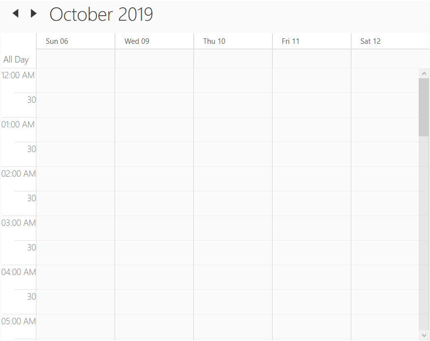
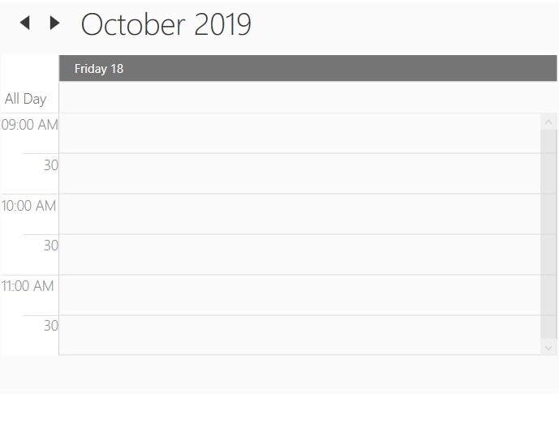
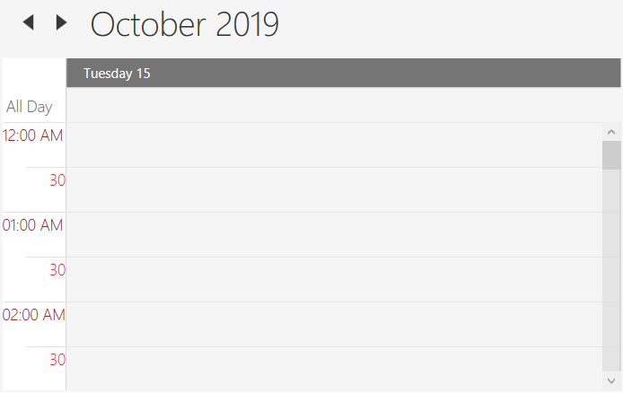
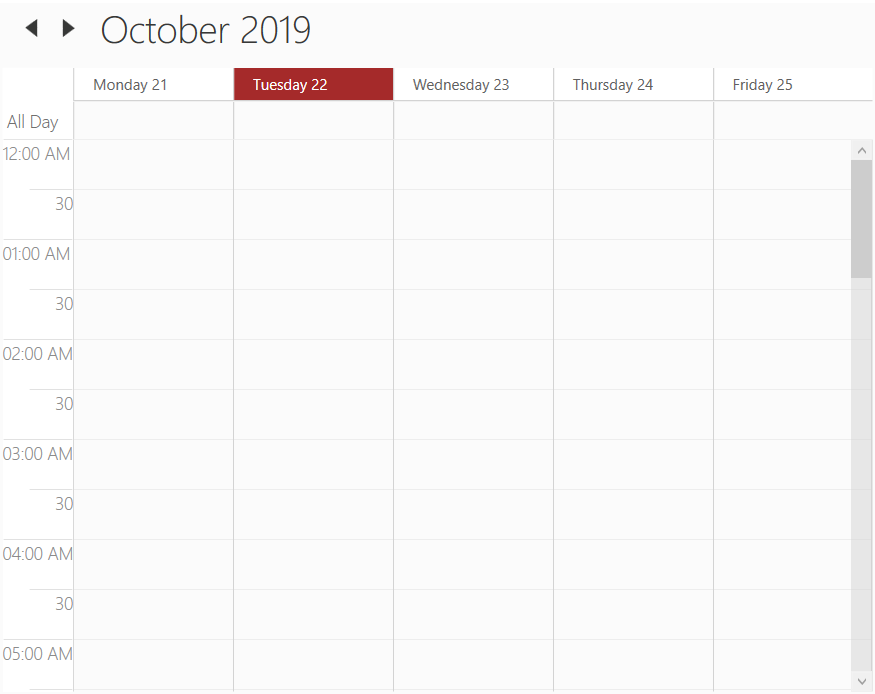

# Views (Day, Week and Work week Views)

Scheduler provides the following different types of views.

* Day view
* Week view
* WorkWeek view
* Timeline View - Refer [scheduler timeline view](https://help.syncfusion.com/wpf/sfschedule/getting-started#timeline-view) documentation for more customization details.
* Month View - Refer [scheduler month view](https://help.syncfusion.com/wpf/sfschedule/getting-started#month-view) documentation for more customization details.

This topic covers customization of day, week and workweek views of the scheduler which shares common properties.

N> This topic explains all customization using day view. But the same applies for week and workweek views also. if you want to make customization specific to views, then please refer [link](#change-the-settings-based-on-the-views-at-run-time)

## Header date format
Scheduler supports to customize the default header date format of the day, week, workweek and timeline view by using the [HeaderDateFormat](https://help.syncfusion.com/cr/wpf/Syncfusion.UI.Xaml.Schedule.SfSchedule.html#Syncfusion_UI_Xaml_Schedule_SfSchedule_HeaderDateFormat) property.



<Schedule:SfSchedule HeaderDateFormat="dd-MMMM-yyyy"/>


this.schedule.HeaderDateFormat = "dd-MMMM-yyyy";




## Time formatting
Scheduler supports to customize time format for day, week, workweek and timeline views by using [MajorTickTimeFormat](https://help.syncfusion.com/cr/wpf/Syncfusion.UI.Xaml.Schedule.SfSchedule.html#Syncfusion_UI_Xaml_Schedule_SfSchedule_MajorTickTimeFormat) and [MinorTickTimeFormat](https://help.syncfusion.com/cr/wpf/Syncfusion.UI.Xaml.Schedule.SfSchedule.html#Syncfusion_UI_Xaml_Schedule_SfSchedule_MinorTickTimeFormat) property.



<syncfusion:SfSchedule MajorTickTimeFormat="hh mm ss" MinorTickTimeFormat="mm ss"/>


this.schedule.MajorTickTimeFormat = "hh mm ss";
this.schedule.MinorTickTimeFormat = "hh mm ss";



## Enable auto formatting
When reducing the size of the schedule in week and month views, headers may be only partially shown. To avoid incompletely displayed headers, automatic formatting can be enabled by setting the [EnableAutoFormat](https://help.syncfusion.com/cr/wpf/Syncfusion.UI.Xaml.Schedule.SfSchedule.html#Syncfusion_UI_Xaml_Schedule_SfSchedule_EnableAutoFormat) property of the Scheduler control as `true`. If this property enabled, `HeaderDateFormat` settings will not apply.



<syncfusion:SfSchedule x:Name="schedule" Background="White"
                        Height="400" Width="500"
                        EnableAutoFormat="True"
                        ScheduleType="Week">
</syncfusion:SfSchedule>


schedule.Background = new SolidColorBrush(Colors.White);
schedule.Height = 400;
schedule.Width = 500;
schedule.EnableAutoFormat = true;
schedule.ScheduleType = ScheduleType.Week;



After changing the window size by resizing the window.

## Change time interval
Scheduler supports to change the time interval by using [TimeInterval](https://help.syncfusion.com/cr/wpf/Syncfusion.UI.Xaml.Schedule.SfSchedule.html#Syncfusion_UI_Xaml_Schedule_SfSchedule_TimeInterval) property.



<Schedule:SfSchedule TimeInterval = "OneHour" />


this.schedule.TimeInterval = TimeInterval.OneHour;



## Change time interval height
Scheduler supports to change the time interval height by using [IntervalHeight](https://help.syncfusion.com/cr/wpf/Syncfusion.UI.Xaml.Schedule.SfSchedule.html#Syncfusion_UI_Xaml_Schedule_SfSchedule_IntervalHeight) property.



<Schedule:SfSchedule IntervalHeight = 100 />


this.schedule.IntervalHeight = 100;



## Change between 12-hour and 24-hour format
Scheduler supports to change the time format from 12hours to 24 hours by using the [TimeMode](https://help.syncfusion.com/cr/wpf/Syncfusion.UI.Xaml.Schedule.SfSchedule.html#Syncfusion_UI_Xaml_Schedule_SfSchedule_TimeMode) property.



<Grid Background="White" Name="grid">
    <Schedule:SfSchedule ScheduleType="Day" TimeMode="TwelveHours" >     
    </Schedule:SfSchedule>
</Grid>


schedule.ScheduleType = ScheduleType.Day;
schedule.TimeMode = TimeModes.TwelveHours;



## Change first day of week
Scheduler supports to change the first day of week with any day by using [FirstDayOfWeek](https://help.syncfusion.com/cr/wpf/Syncfusion.UI.Xaml.Schedule.SfSchedule.html#Syncfusion_UI_Xaml_Schedule_SfSchedule_FirstDayOfWeek) property.

`Day` - `FirstDayOfWeek` of Scheduler is not applicable for day view as it displays only one day.

`Week`/`Month` - By default, scheduler control will be rendered with `Sunday` as the first day of the week.

`WorkWeek` - By default, scheduler control will be rendered with `Monday` as the first day. `Saturday` and `Sunday` has considered as a non working days. 

## Non-accessible timeslots
Scheduler supports to mark certain timeslots as non-accessible timeslots by using [NonAccessibleBlocks](https://help.syncfusion.com/cr/wpf/Syncfusion.UI.Xaml.Schedule.SfSchedule.html#Syncfusion_UI_Xaml_Schedule_SfSchedule_NonAccessibleBlocks) property. User can’t interact over the timeslot marked as non-accessible timeslots. 



<Schedule:SfSchedule>
    <Schedule:SfSchedule.NonAccessibleBlocks>
        <Schedule:NonAccessibleBlock Background="Black" StartHour="13" EndHour="14" Label="Lunch">
        </Schedule:NonAccessibleBlock> 
    </Schedule:SfSchedule.NonAccessibleBlocks>
</Schedule:SfSchedule>


this.schedule.NonAccessibleBlocks.Add(new NonAccessibleBlock() { Background = new SolidColorBrush(Colors.Black), StartHour = 13, EndHour = 14, Label = "Lunch" });



### Customize non-accessible timeslots using template
Scheduler supports to customize the non-accessible timeslots by using [NonAccessibleBlockTemplate](https://help.syncfusion.com/cr/wpf/Syncfusion.UI.Xaml.Schedule.SfSchedule.html#Syncfusion_UI_Xaml_Schedule_SfSchedule_NonAccessibleBlockTemplate) property.



<syncfusion:SfSchedule.NonAccessibleBlockTemplate>
    <DataTemplate>
        <Border Background="{Binding Color}">
            <TextBlock Text="{Binding EventName}" Foreground="White" HorizontalAlignment="Center" VerticalAlignment="Center"/>
        </Border>
    </DataTemplate>
</syncfusion:SfSchedule.NonAccessibleBlockTemplate>



## Change non-working days
By default Schedule considers `Saturday` and `Sunday` as a non working days. You can change the non-working days using [NonWorkingDays](https://help.syncfusion.com/cr/wpf/Syncfusion.UI.Xaml.Schedule.SfSchedule.html#Syncfusion_UI_Xaml_Schedule_SfSchedule_NonWorkingDays) property. 



<schedule:SfSchedule x:Name="schedule" ScheduleType="WorkWeek" NonWorkingDays="Monday,Tuesday"/>


this.schedule.ScheduleType = ScheduleType.WorkWeek;
this.schedule.NonWorkingDays = DayOfWeek.Monday.ToString() + "," + DayOfWeek.Tuesday.ToString();



## Collapsed hours
Scheduler supports to hide the selected hours by using [CollapsedHours](https://help.syncfusion.com/cr/wpf/Syncfusion.UI.Xaml.Schedule.SfSchedule.html#Syncfusion_UI_Xaml_Schedule_SfSchedule_CollapsedHours) property. [ScheduleCollapsedHours](https://help.syncfusion.com/cr/wpf/Syncfusion.UI.Xaml.Schedule.ScheduleCollapsedHour.html) does have the following properties.

[StartHour](https://help.syncfusion.com/cr/wpf/Syncfusion.UI.Xaml.Schedule.ScheduleCollapsedHour.html#Syncfusion_UI_Xaml_Schedule_ScheduleCollapsedHour_StartHour) - To set start time of collapsed hour.
[EndHour](https://help.syncfusion.com/cr/wpf/Syncfusion.UI.Xaml.Schedule.ScheduleCollapsedHour.html#Syncfusion_UI_Xaml_Schedule_ScheduleCollapsedHour_EndHour) - To set end time of collapsed hour.
[Background](https://help.syncfusion.com/cr/wpf/Syncfusion.UI.Xaml.Schedule.ScheduleCollapsedHour.html#Syncfusion_UI_Xaml_Schedule_ScheduleCollapsedHour_Background) - To set the background of collapsed hours.



<schedule:SfSchedule Background="White" x:Name="schedule" ScheduleType="Week">
    <schedule:SfSchedule.CollapsedHours>
        <schedule:ScheduleCollapsedHour StartHour="1" EndHour="5"  Background="Red"/>
    </schedule:SfSchedule.CollapsedHours>        
</schedule:SfSchedule>


this.schedule.CollapsedHours.Add(new ScheduleCollapsedHour() { StartHour = 1, EndHour = 5, Background = new SolidColorBrush(Colors.Red)});



## Change working hours
Working hours of Scheduler will be differentiated with non-working hours by separate color using [IsHighLightWorkingHours](https://help.syncfusion.com/cr/wpf/Syncfusion.UI.Xaml.Schedule.SfSchedule.html#Syncfusion_UI_Xaml_Schedule_SfSchedule_IsHighLightWorkingHours) property for day, week, workweek and timeline views. By default, working hours will be between 09 to 18. You can customize the working hours by setting [WorkStartHour](https://help.syncfusion.com/cr/wpf/Syncfusion.UI.Xaml.Schedule.SfSchedule.html#Syncfusion_UI_Xaml_Schedule_SfSchedule_WorkStartHour) and [WorkEndHour](https://help.syncfusion.com/cr/wpf/Syncfusion.UI.Xaml.Schedule.SfSchedule.html#Syncfusion_UI_Xaml_Schedule_SfSchedule_WorkEndHour) properties.



<schedule:SfSchedule x:Name="schedule" 
                     WorkStartHour="9"
                     WorkEndHour="12"
                     IsHighLightWorkingHours="True"/>


this.schedule.WorkStartHour = 9;
this.schedule.WorkEndHour = 12;
this.schedule.IsHighLightWorkingHours = true;



###  Display working hours only
Scheduler supports to display the working hours only by disabling the [ShowNonWorkingHours](https://help.syncfusion.com/cr/wpf/Syncfusion.UI.Xaml.Schedule.SfSchedule.html#Syncfusion_UI_Xaml_Schedule_SfSchedule_ShowNonWorkingHours) property.



<schedule:SfSchedule x:Name="schedule" 
                     WorkStartHour="9"
                     WorkEndHour="12"
                     ShowNonWorkingHours="False"/>


this.schedule.WorkStartHour = 9;
this.schedule.WorkEndHour = 12;
this.schedule.ShowNonWorkingHours = false;



### Change non-working hours background
Scheduler supports to change the background color for non-working hours by using [NonWorkingHourBrush](https://help.syncfusion.com/cr/wpf/Syncfusion.UI.Xaml.Schedule.SfSchedule.html#Syncfusion_UI_Xaml_Schedule_SfSchedule_NonWorkingHourBrush) property.



<schedule:SfSchedule x:Name="schedule" 
                     WorkStartHour="9"
                     WorkEndHour="12"
                     NonWorkingHourBrush="LightSteelBlue"
                     IsHighLightWorkingHours="True"/>


this.schedule.WorkStartHour = 9;
this.schedule.WorkEndHour = 12;
this.schedule.NonWorkingHourBrush = Brushes.LightSteelBlue;
this.schedule.IsHighLightWorkingHours = true;



## Current time indicator
Scheduler supports to display the current time indicator by using the [CurrentTimeIndicatorVisibility](https://help.syncfusion.com/cr/wpf/Syncfusion.UI.Xaml.Schedule.SfSchedule.html#Syncfusion_UI_Xaml_Schedule_SfSchedule_CurrentTimeIndicatorVisibility) property.



<syncfusion:SfSchedule ScheduleType="Day" CurrentTimeIndicatorVisibility="Visible"/>


schedule.ScheduleType = ScheduleType.Day;
this.schedule.CurrentTimeIndicatorVisibility = Visibility.Visible;



### Customize current time indicator
Scheduler supports to customize the current time indicator by using [CurrentTimeIndicatorTemplate](https://help.syncfusion.com/cr/wpf/Syncfusion.UI.Xaml.Schedule.SfSchedule.html#Syncfusion_UI_Xaml_Schedule_SfSchedule_CurrentTimeIndicatorTemplate) property.



<Schedule:SfSchedule x:Name="schedule" ScheduleType="Day" CurrentTimeIndicatorVisibility="Visible">
    <Schedule:SfSchedule.CurrentTimeIndicatorTemplate>
        <DataTemplate>
            <Border Background="DarkGreen" Height="10" Width="100"></Border>
        </DataTemplate>
    </Schedule:SfSchedule.CurrentTimeIndicatorTemplate>
</Schedule:SfSchedule>     


schedule.ScheduleType = ScheduleType.Day;
schedule.CurrentTimeIndicatorVisibility = Visibility.Visible;
schedule.CurrentTimeIndicatorTemplate = (DataTemplate)this.Resources["CurrentTimeIndicatorTemplate"];



## Change hours or minutes time label visibility
Scheduler supports to visible/collapse the hours and minutes time label visiblity by using [MajorTickVisibility](https://help.syncfusion.com/cr/wpf/Syncfusion.UI.Xaml.Schedule.SfSchedule.html#Syncfusion_UI_Xaml_Schedule_SfSchedule_MajorTickVisibility) and [MinorTickVisibility](https://help.syncfusion.com/cr/wpf/Syncfusion.UI.Xaml.Schedule.SfSchedule.html#Syncfusion_UI_Xaml_Schedule_SfSchedule_MinorTickVisibility) properties.



<Schedule:SfSchedule ScheduleType="Day" MajorTickVisibility="Collapsed" MinorTickVisibility="Collapsed" />


this.schedule.ScheduleType = ScheduleType.Day;
this.schedule.MajorTickVisibility = Visibility.Collapsed;
this.schedule.MinorTickVisibility = Visibility.Collapsed;



## Appearance

### Changing time label background

Scheduler supports to change the time slot label background by using [HeaderBackground](https://help.syncfusion.com/cr/wpf/Syncfusion.UI.Xaml.Schedule.SfSchedule.html#Syncfusion_UI_Xaml_Schedule_SfSchedule_HeaderBackground) property.



<Schedule:SfSchedule HeaderBackground="LightSkyBlue" />


this.schedule.HeaderBackground = Brushes.LightSkyBlue;



### Stroke customization
In Scheduler control, major, minor horizontal and vertical lines drawn in the day, week, workweek and timeline views by using following properties,

####  Property Table

<table>
<tr>
<th>
API Name</th><th>
Data Type</th><th>
Description</th></tr>
<tr>
<td>
<a href="https://help.syncfusion.com/cr/wpf/Syncfusion.UI.Xaml.Schedule.SfSchedule.html#Syncfusion_UI_Xaml_Schedule_SfSchedule_MajorTickStroke">MajorTickStroke</a></td><td>
Brush</td><td>
Used to customize the major line stroke of the day, week, workweek and timeline views.</td></tr>
<tr>
<td>
<a href="https://help.syncfusion.com/cr/wpf/Syncfusion.UI.Xaml.Schedule.SfSchedule.html#Syncfusion_UI_Xaml_Schedule_SfSchedule_MinorTickStroke">MinorTickStroke</a></td><td>
Brush</td><td>
Used to customize the minor line stroke of the day, week, workweek and timeline views.</td></tr>
<tr>
<td>
<a href="https://help.syncfusion.com/cr/wpf/Syncfusion.UI.Xaml.Schedule.SfSchedule.html#Syncfusion_UI_Xaml_Schedule_SfSchedule_MinorTickLabelStroke">MajorTickLabelStroke</a></td><td>
Brush</td><td>
Used to customize the major line label stroke in the day, week, workweek and timeline views.</td></tr>
<tr>
<td>
<a href="https://help.syncfusion.com/cr/wpf/Syncfusion.UI.Xaml.Schedule.SfSchedule.html#Syncfusion_UI_Xaml_Schedule_SfSchedule_MajorTickLabelStroke">MinorTickLabelStroke</a></td><td>
Brush</td><td>
Used to customize the minor line label stroke of the day, week, workweek and timeline views.</td></tr>
<tr>
<td>
<a href="https://help.syncfusion.com/cr/wpf/Syncfusion.UI.Xaml.Schedule.SfSchedule.html#Syncfusion_UI_Xaml_Schedule_SfSchedule_MajorTickStrokeDashArray">MajorTickStrokeDashArray</a></td><td>
DoubleCollection</td><td>
Used to customize the major line stroke dash array of the day, week, workweek and timeline views.</td></tr>
<tr>
<td>
<a href="https://help.syncfusion.com/cr/wpf/Syncfusion.UI.Xaml.Schedule.SfSchedule.html#Syncfusion_UI_Xaml_Schedule_SfSchedule_MinorTickStrokeDashArray">MinorTickStrokeDashArray</a></td><td>
DoubleCollection</td><td>
Used to customize the minor line stroke dash array of the day, week, workweek and timeline views.</td></tr>
<tr>
<td>
<a href="https://help.syncfusion.com/cr/wpf/Syncfusion.UI.Xaml.Schedule.SfSchedule.html#Syncfusion_UI_Xaml_Schedule_SfSchedule_DayViewVerticalLineStroke">DayViewVerticalLineStroke</a></td><td>
Brush</td><td>
Used to customize the vertical line stroke of the day, week and workweek view.</td></tr>
</table>

#### Changing time label foreground
Scheduler supports to change the time label foreground by using [MinorTickLabelStroke](https://help.syncfusion.com/cr/wpf/Syncfusion.UI.Xaml.Schedule.SfSchedule.html#Syncfusion_UI_Xaml_Schedule_SfSchedule_MinorTickLabelStroke) and [MajorTickLabelStroke](https://help.syncfusion.com/cr/wpf/Syncfusion.UI.Xaml.Schedule.SfSchedule.html#Syncfusion_UI_Xaml_Schedule_SfSchedule_MajorTickLabelStroke) property.



<syncfusion:SfSchedule MajorTickLabelStroke="DarkRed" MinorTickLabelStroke="Red"/>


this.schedule.MajorTickLabelStroke = Brushes.DarkRed;
this.schedule.MinorTickLabelStroke = Brushes.Red;



#### Changing timeslots line color
Scheduler supports to change the time slots line color by using [MajorTickStroke](https://help.syncfusion.com/cr/wpf/Syncfusion.UI.Xaml.Schedule.SfSchedule.html#Syncfusion_UI_Xaml_Schedule_SfSchedule_MajorTickStroke) and [MinorTickStroke](https://help.syncfusion.com/cr/wpf/Syncfusion.UI.Xaml.Schedule.SfSchedule.html#Syncfusion_UI_Xaml_Schedule_SfSchedule_MinorTickStroke) property. 



<syncfusion:SfSchedule MajorTickStroke="LawnGreen" MinorTickStroke="LightBlue"/>


this.schedule.MajorTickStroke = Brushes.LawnGreen;
this.schedule.MinorTickStroke = Brushes.LightBlue;



#### Changing timeslots line style
Scheduler supports to customize the major/minor line stroke style of the day, week, workweek and time line views.

 

<syncfusion:SfSchedule MajorTickStroke="Red" MajorTickStrokeDashArray="5,10" MinorTickStroke="Blue" MinorTickStrokeDashArray="5,5"/>


this.schedule.MajorTickStroke = Brushes.Red;
this.schedule.MajorTickStrokeDashArray="5,10";
this.schedule.MinorTickStroke = Brushes.Blue;
this.schedule.MinorTickStrokeDashArray="5,5";



#### Changing vertical line color
Scheduler supports to change the vertical line for day, week and workweek view by using [DayViewVerticalLineStroke](https://help.syncfusion.com/cr/wpf/Syncfusion.UI.Xaml.Schedule.SfSchedule.html#Syncfusion_UI_Xaml_Schedule_SfSchedule_DayViewVerticalLineStroke).



<syncfusion:SfSchedule ScheduleType="WorkWeek" DayViewVerticalLineStroke="Brown"/>


this.schedule.ScheduleType = ScheduleType.WorkWeek;
this.schedule.DayViewVerticalLineStroke = Brushes.Brown;



### Current day highlighting
Scheduler supports to change current day background and foreground for all views by using [CurrentDateBackground](https://help.syncfusion.com/cr/wpf/Syncfusion.UI.Xaml.Schedule.SfSchedule.html#Syncfusion_UI_Xaml_Schedule_SfSchedule_CurrentDateBackground) and [CurrentDateForeground](https://help.syncfusion.com/cr/wpf/Syncfusion.UI.Xaml.Schedule.SfSchedule.html#Syncfusion_UI_Xaml_Schedule_SfSchedule_CurrentDateForeground) property.



<syncfusion:SfSchedule CurrentDateBackground="Brown" CurrentDateForeground="White"/>


this.schedule.CurrentDateBackground = Brushes.Brown;
this.schedule.CurrentDateForeground = Brushes.White;



## Change schedule view settings based on the views at run time
Scheduler supports to notify before that changing the schedule view by using [ScheduleTypeChanging](https://help.syncfusion.com/cr/wpf/Syncfusion.UI.Xaml.Schedule.SfSchedule.html) event. By this event, the appearance can be adjusted depending on the view.

For example, if you want to change the header date format based on the schedule view, you can use this event. Please refer the following code example,



this.schedule.ScheduleTypeChanging += Schedule_ScheduleTypeChanging;
private void Schedule_ScheduleTypeChanging(object sender, ScheduleTypeChangingEventArgs e)
{      
    switch (e.NewValue)
    {
        case ScheduleType.Day:
            this.schedule.HeaderDateFormat = "dd-MMM-yyyy";
            break;
        case ScheduleType.Week:
            this.schedule.HeaderDateFormat = "dd-MMM";
            break;
        case ScheduleType.WorkWeek:
            this.schedule.HeaderDateFormat = "dd MMM";
            break;
    }
}



