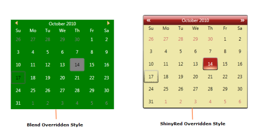

# Switch between Overridden Styles

Switching between the overridden styles should be done manually. The overridden styles should be merged into the Resource Dictionary. 

The following steps explain how to switch between the overridden styles.

1. Add the corresponding Resource Dictionaries in the sample.




<ResourceDictionary>
<ResourceDictionary.MergedDictionaries>
<ResourceDictionary Source="/Syncfusion.Shared.WPF;Component/Controls/Calendar/themes/ShinyRedStyle.xaml"/>
<ResourceDictionary Source="/Syncfusion.Shared.WPF;Component/Controls/Calendar/themes/BlendStyle.xaml"/>
</ResourceDictionary.MergedDictionaries>
</ResourceDictionary>




2. Define the new styles using the BasedOn property. 

   The following code snippet explains how to override the Syncfusion style for the Calendar Control.




<Grid Name="grid">
<Grid.Resources>

</Grid.Resources>
<Grid.ColumnDefinitions>
<ColumnDefinition Width="*"/>
<ColumnDefinition Width="*"/>
</Grid.ColumnDefinitions>
<ComboBox Name="themecombobox" Grid.Column="0" SelectionChanged="ComboBox_SelectionChanged">
<ComboBoxItem>ShinyRed</ComboBoxItem>
<ComboBoxItem>Blend</ComboBoxItem>
</ComboBox>
<syncfusion:CalendarEdit Name="calendar" Grid.Column="1"></syncfusion:CalendarEdit>        
</Grid>




3. On ComboBox SelectionChanged event, particular overridden style should be set to the control depending on the current visual style. 

   The following code snippet explains how to set the overridden styles to the controls.




Private void ComboBox_SelectionChanged(object sender, SelectionChangedEventArgs e)
{
	if (themecombobox.SelectedIndex == 0)
	{
    	SkinStorage.SetVisualStyle(this, "ShinyRed");
		System.Windows.Style style = grid.Resources["ShinyRedStyle"] as Style;
		calendar.Style = style;
	}
	else
	{
		SkinStorage.SetVisualStyle(this, "Blend");
		System.Windows.Style style = grid.Resources["BlendStyle"] as Style;
		calendar.Style = style;
	}
}




The output is displayed as shown below.

