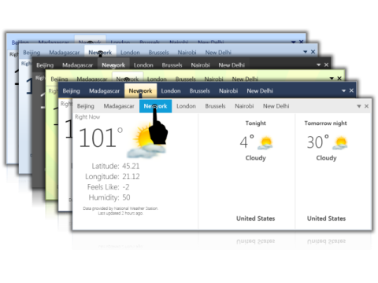

# Touch UI 

The touch support allows users to interact with some Syncfusion WPF controls with finger gestures on touchscreen devices.

The following controls have touch styles implemented:

* Editors
* ComboBox
* ListBox Controls
* TreeView
* TabControl
* Menu
* GroupBar
* RangeSlider

## How To apply touch styles

Touch styles can be applied to a control by setting the EnableTouch property defined in the SkinStorage class to True. This property can be set in either XAML or C#.

### Setting the EnableTouch property in XAML




<syncfusion:IntegerTextBox 
syncfusion:SkinStorage.EnableTouch="True" >
</syncfusion:IntegerTextBox >




##  Setting the EnableTouch Property in C#




SkinStorage.SetEnableTouch(this, true);




## Controls with touch UI

