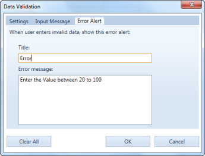
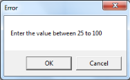
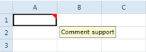
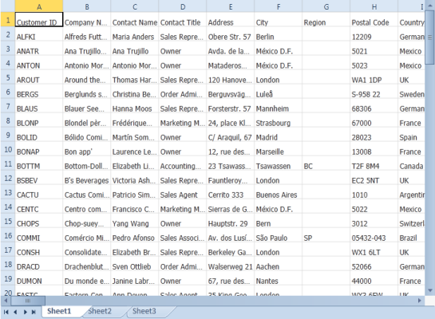
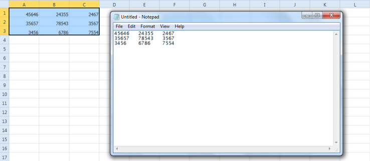
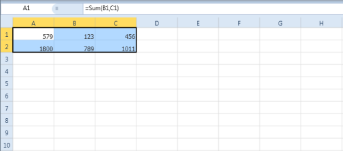
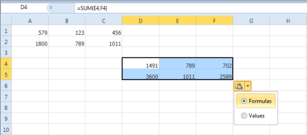

# Data Management in WPF SpreadsheetControl (Classic)

## Formulas

Formulas are entries in Excel document that have an equation, which calculates the value to display. A typical formula might contain cells, constants, and even functions.

Spreadsheet control supports various built-in functions that make large calculations in large sheets easier.

Spreadsheet control supports all the formulas that are supported by the Grid control. For more details about the 
supported formula refer to [Grid Control UG](http://help.syncfusion.com/wpf/grid).

## Data Validation

The Data Validation enables you to dynamically validate the data entered in a cell. You can specify the validation rules in the Data Validation dialog box. Spreadsheet control supports the various validation types for each data type. This also enables you to show the error message for invalid data.

###Data Validation in Spreadsheet control

Essential Spreadsheet control enables you to edit the existing data validation. You can also create new data validation. Spreadsheet control supports the following validation types:

* Text Length Validation
* Time Validation
* List Validation
* Number Validation
* Date Validation

### Events

<table>
<tr>
<th>
Event</th><th>
Description</th><th>
Arguments</th><th>
Type</th><th>
Reference links</th></tr>
<tr>
<td>
CurrentCellValidating  </td><td>
Will be triggered when the cell value is committed. This can be canceled. Error alert can be customized. </td><td>
void CurrentCellValidating(object sender, CurrentCellValidatingEventArgs e)</td><td>
Routed </td><td>
NA </td></tr>
</table>

### Defining Condition for Validating Cells

You can define the data validation to the Spreadsheet cells using the Data Validation dialog box. You have to specify the validation rule in the Settings tab, tooltip content in the Input Message tab and error message in Error Alert tab. You can open the data validation dialog using the DataValidationCommand. 

The input message will be displayed as tooltip, when the particular cell is in active state. 

The error message will be display only when you enter the value beyond the data validation limit.

When you click OK, the cell value will not be committed and when you click Cancel, it will revert the cell value.

The following code illustrates how to bind the DataValidationCommand to a button:



<Button Command="{Binding Path=DataValidationCommand}">

</Button>



## Comments 

Comments provide additional information about a cell such as, what the value represents. Spreadsheet control allows you to insert, edit and delete comments in the Excel document.

### Insert comment

You can insert comment to the Spreadsheet cells using the New Comment dialog box. You can open the New Comment dialog box using the InsertCommentCommand.

The following code illustrates how to bind the InsertCommentCommand__to a button: 



<Button Command="{Binding Path= InsertCommentCommand}">

</Button>



N> You can insert only one comment for a cell. The InsertCommentCommand will open the Edit comment dialog box if the specific cell already has a comment.

### Edit Comment

You can edit the existing comments using the Edit Comment dialog box. You can open the Edit comment dialog using the InsertCommentCommand.

The following code illustrates how to bind the InsertCommentCommand__to a button: 



<Button Command="{Binding Path= InsertCommentCommand}">

</Button>



### Delete Comment

You can delete the comment in the spreadsheet cells using the DeleteCommentCommand. When you execute this command it will delete the comment from the selected cells.

The following code illustrates how to bind the DeleteCommentCommand__to a button: 



<Button Command="{Binding Path= DeleteCommentCommand}">

</Button>



## Import and Export from Data Table

Spreadsheet offers some helper methods that enable you to import and export data form ADO.NET data sources very easily. The ImportDataTable and ExportDataTable methods allow you to use one line of code to import data from a DataTable to a SpreadSheet and export data from a SpreadSheet to a DataTable respectively.

#### Samples Link

The samples for Importing from data table are located at:

### Essential Studio Dashboard > Classic > Spreadsheet Control > Data Management > Import Data Table.

Refer to section 2.2 Samples and Location to access the samples location.

### Methods

<table>
<tr>
<th>
Method</th><th>
Description</th><th>
Parameters</th><th>
Type</th><th>
Return Type</th></tr>
<tr>
<td>
ImportFromDataTable </td><td>
This method imports data from the DataTable into the Spreadsheet.</td><td>
 ImportDataTable(DataTable dataTable)</td><td>
N/A</td><td>
void</td></tr>
<tr>
<td>
ImportFromDataTable</td><td>
This method imports data from a DataTable into a Spreadsheet with parameters Row and Column of the first cell, where DataTable should be imported.</td><td>
ImportFromDataTable(DataTable table, bool isFieldNameShow, int startRow, int startCol)</td><td>
N/A</td><td>
void</td></tr>
<tr>
<td>
ImportFromDataTable</td><td>
This method imports data from a DataTable into a Spreadsheet with parameters  Row index and column index of SpreadSheet, where DataTable should be imported and preserve types  (This Indicates whether Spreadsheet should try to preserve types in DataTable)</td><td>
ImportFromDataTable(DataTable table, bool isFieldNameShow, int startRow, int startCol, bool preserveTypes)</td><td>
N/A</td><td>
void</td></tr>
<tr>
<td>
ImportFromDataTable</td><td>
This method imports data from a DataTable into a Spreadsheet with parameters starting row index and column index and maximum number of rows and columns to import.</td><td>
ImportFromDataTable(DataTable table, bool isFieldNameShow, int startRow, int startCol, int maxRow, int maxCol)</td><td>
N/A</td><td>
void</td></tr>
<tr>
<td>
ImportFromDataTable</td><td>
This method imports data from a DataTable into a Spreadsheet with parameters starting row index and column index and maximum number of rows and columns to import and preserve types.</td><td>
ImportFromDataTable(DataTable table, bool isFieldNameShow, int startRow, int startCol, int maxRow, int maxCol, bool preserveTypes)</td><td>
N/A</td><td>
void</td></tr>
</table>

### Importing from a Data Table 

The following lines of code are used to import data from DataTable to Spreadsheet control.





this.spreadsheetControl.ImportFromDataTable(datatable);





Me.spreadsheetControl.ImportFromDataTable(datatable)





### Exporting to a Data Table

Similarly, you can to export the Spreadsheet data to a data table by using the ExportDataTable method of Worksheet. The following code demonstrates this:





IWorksheet sheet  = this.spreadsheetControl.ExcelProperties.WorkBook.Worksheets[0];

IRange range = sheet.Range["A1:K50"];

DataTable Dt = sheet.ExportDataTable(range, ExcelExportDataTableOptions.ColumnNames);





Dim sheet As IWorksheet = Me.spreadsheetControl.ExcelProperties.WorkBook.Worksheets(0)

Dim range As IRange = sheet.Range("A1:K50")

Dim Dt As DataTable = sheet.ExportDataTable(range, ExcelExportDataTableOptions.ColumnNames)





## Clipboard Support

The Spreadsheet control provides support for clipboard operations. When you copy and paste the cells within the Spreadsheet control, it will paste the cell data and cell style to the Spreadsheet cells and also Spreadsheet also having the support for pasting formula with relative reference. When you copy and paste the cells from Spreadsheet control to other application, it will only copy the cell text.

### Use Case Scenarios

1. It is easier and faster to copy the data than to rewrite it every time you need it.
2. Spreadsheet control support Excel-like relative reference copy and paste operations. It also allows you to do clipboard operations like those available in Excel.

### Copy and Paste Options

1. Normal copy paste
2. Relative reference copy and paste

#### Normal Copy and Paste

By default, the normal copy and paste option is enabled in the Spreadsheet control. When you copy the cells from Spreadsheet control, it will copy the cell text to the clipboard. Then you can paste the text in other applications. While copying the call text to clipboard spreadsheet will add the tab symbol (“/t”) as a delimiter.

## Relative reference Copy and paste

If you copy and paste cells within the Spreadsheet control, then the cell styles will be preserved, and also the formula references will be automatically updated in the pasted cells.

If you are pasting the date in the spreadsheet cells, it will show this small pop-up with two options: one for pasting the formula, and one for pasting the value. By default, when you paste the copied formula cell, it will paste the formula in that cell. By using this pop-up, you can change this formula to a value.

### How to Disable the Relative Reference Copy and Paste

By default, this feature is enabled in the Spreadsheet control. You can disable this copy paste feature by using the following code:



spreadsheetControl.GridProperties.ActiveSpreadsheetGrid.Model.GridCopyPaste = null;



### Events

The Spreadsheet control provides the following events for customizing the clipboard data.

* ClipboardCanCopy
* ClipboardCanCut
* ClipboardCanPaste
* ClipboardCopy
* ClipboardCut
* ClipboardPaste

You can get all grid control objects in the WorkBookLoaded event of the Spreadsheet control. By using these objects, you can handle the grid events.

### ClipboardCanCopy

This event is triggered when some grid data is about to be copied to the clipboard. Inside this event handler, you can check for the data and range of cells that are going to be copied, and cancel the operation if you don’t want to copy the data.

1. The grid cell data and range of cells that are going to be moved to the clipboard can be accessed by using the DataObject and RangeList properties.
2. If you don’t want to move the data to the clipboard, you can cancel the operation by setting e.Cancel to true.

### Properties

<table>
<tr>
<th>
Property</th><th>
Description</th></tr>
<tr>
<td>
DataObject</td><td>
Data to be copied.</td></tr>
<tr>
<td>
RangeList</td><td>
List of cell ranges that are selected for copying.</td></tr>
<tr>
<td>
Handled</td><td>
When true, indicates that the event has been handled and no further processing of the event should happen.</td></tr>
</table>

### ClipboardCanCut

This event is triggered when some grid data is about to be moved to the clipboard. Inside this event handler, you can check for the data and range of cells going to be moved and cancel the operation if you do not want to move the data. It receives an argument of type GridCutCopyPasteEventArgs containing data related to this event. The following are the event argument properties.

### Properties

<table>
<tr>
<th>
Property</th><th>
Description</th></tr>
<tr>
<td>
DataObject</td><td>
Data to be moved.</td></tr>
<tr>
<td>
RangeList</td><td>
List of cell ranges that are selected for moving.</td></tr>
<tr>
<td>
Handled</td><td>
When true, indicates that the event has been handled and no further processing of the event should happen.</td></tr>
</table>

### ClipboardCanPaste

This event is fired when some grid data is about to be pasted from the clipboard. Inside this event handler, you can check for the data and range of cells going to be pasted and cancel the operation if you don’t want to paste the data. It receives an argument of type GridCutCopyPasteEventArgs containing data related to this event. The following are the event argument properties.

### Properties

<table>
<tr>
<th>
Property</th><th>
Description</th></tr>
<tr>
<td>
DataObject</td><td>
Data to be pasted.</td></tr>
<tr>
<td>
RangeList</td><td>
List of cell ranges that are selected for pasting.</td></tr>
<tr>
<td>
Handled</td><td>
When true, indicates that the event has been handled and no further processing of the event should happen.</td></tr>
</table>

### ClipboardCopy

This event is fired when some grid data is being copied to the clipboard. Inside this event handler, you can check for the data and range of cells being copied and cancel the operation if you don’t want to copy the data. You can also provide custom formatted data for copying to clipboard. It receives an argument of type GridCutCopyPasteEventArgs containing data related to this event. The following are the event argument properties.

### Properties

<table>
<tr>
<th>
Property</th><th>
Description</th></tr>
<tr>
<td>
DataObject</td><td>
Data to be copied.</td></tr>
<tr>
<td>
RangeList</td><td>
List of cell ranges that are selected for copying.</td></tr>
<tr>
<td>
Handled</td><td>
When true, indicates that the event has been handled and no further processing of the event should happen.</td></tr>
</table>

### ClipboardCut

This event is fired when some grid data is being moved to the clipboard. Inside this event handler, you can check for the data and range of cells being moved and cancel the operation if you don’t want to move the data. You can also provide custom formatted data for moving to clipboard. It receives an argument of type GridCutCopyPasteEventArgs containing data related to this event. The following are the event argument properties.

### Properties

<table>
<tr>
<th>
Property</th><th>
Description</th></tr>
<tr>
<td>
DataObject</td><td>
Data to be moved.</td></tr>
<tr>
<td>
RangeList</td><td>
List of cell ranges that are selected for transfer.</td></tr>
<tr>
<td>
Handled</td><td>
When true, indicates that the event has been handled and no further processing of the event should happen.</td></tr>
</table>

### ClipboardPaste

This event is fired when some grid data is being pasted from the clipboard. Inside this event handler, you can check for the data and range of cells being pasted and cancel the operation if you don’t want to paste the data. You can also provide custom formatted data for saving into grid cells. It receives an argument of type GridCutCopyPasteEventArgs containing data related to this event. The following are the event argument properties.

### Properties

<table>
<tr>
<th>
Property</th><th>
Description</th></tr>
<tr>
<td>
DataObject</td><td>
Data to be pasted.</td></tr>
<tr>
<td>
RangeList</td><td>
List of cell ranges that are selected for pasting.</td></tr>
<tr>
<td>
Handled</td><td>
When true, indicates that the event has been handled and no further processing of the event should happen.</td></tr>
</table>

### How to Copy and Paste the Display Text

By default, when you copy and paste the formula cell, the Spreadsheet control will copy and paste the formula from the particular cell. To copy and paste the display text you have to handle the ClipboardCopy event of the underling grid control. You can get all the Grid controls in the WorkBookLoaded event of the spreadsheet control.

The following code used to copy and paste only the display text.



void spreadsheetControl_WorkBookLoaded(object sender, WorkbookLoadedEventArgs args)

{

    foreach (var grid in args.GridCollection)

    {

        grid.Model.GridCopyPaste = null;

        grid.Model.ClipboardCopy += new GridCutPasteEventHandler(Model_ClipboardCopy);

    }

}

void Model_ClipboardCopy(object sender, GridCutPasteEventArgs e)

{

    GridRangeInfoList rowRanges = e.RangeList.GetRowRanges(GridRangeInfoType.Cells | GridRangeInfoType.Rows);

    GridRangeInfoList colRanges = e.RangeList.GetColRanges(GridRangeInfoType.Cells | GridRangeInfoType.Cols);

    var sb = new StringBuilder();

    int nrowsdone = 0; int ncolsdone = 0;

    string tabDelim = "\t";

    for (int rowindex = 0; rowindex < rowRanges.Count; rowindex++)

    {

        for (int nrow = rowRanges[rowindex].Top; nrow <= rowRanges[rowindex].Bottom; nrow++)

        {

            if (nrowsdone > 0)

                sb.Append(Environment.NewLine);

            ncolsdone = 0;

            bool firstCol;

            firstCol = true;

            for (int colindex = 0; colindex < colRanges.Count; colindex++)

            {

                for (int ncol = colRanges[colindex].Left; ncol <= colRanges[colindex].Right; ncol++)

                {

                    if (!firstCol)

                        sb.Append(tabDelim);

                    string text = this.spreadsheetControl.GridProperties.CurrentExcelGridModel[nrow, ncol].FormattedText;

                    if (!e.RangeList.AnyRangeContains(GridRangeInfo.Cell(nrow, ncol)))

                    {

                        ncolsdone++;

                        continue;

                    }

                    text = new StringBuilder(text).ToString().Trim();

                    // Append the Cell value to buffer text

                    sb.Append(text);

                    firstCol = false;

                    ncolsdone++;

                }

            }

            nrowsdone++;

        }

    }

    Clipboard.SetText(sb.ToString());

    e.DataObject = null;

    e.Handled = true;

}


