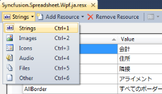
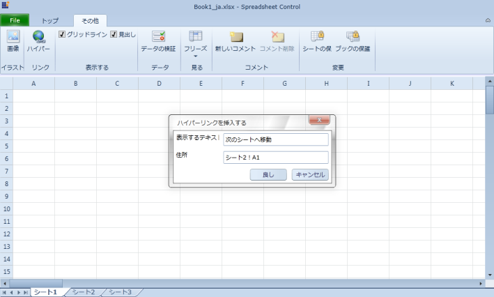

# Localization in WPF SpreadsheetControl (Classic)

Localization is the process of customizing the application to culture-specific. This involves configuring the application for the specific languages. Culture is the combination of Language and the Location (e.g. En-US is the Culture for English spoken at United States; En-GB is the Culture for English spoken at Great Britain). 

Syncfusion Spreadsheet allows you to set custom resource through Resx file. You can give the string values in resource file for a specific Culture and set the Culture in the application. The given string values will be set to the Grid which does not affect the Code Block of the Grid. 

### Adding Localization to an Application 

The following are steps to implementation Localization support to an application:

1. Create a WPF application and add spreadsheet control to it. 

2. Create a folder named Resources in the application. 

3. Create a resource file (Resx file) and name it as Syncfusion.Spreadsheet.WPF. <your culture info name>.resx 

   Example: Syncfusion.Spreadsheet.WPF.ja.resx.

   N> It is mandatory to use this naming convention.

   

4. Select the String option in the Resource file. 

   

5. Resource table will open.

6. Enter the UI name in the Name column and the equivalent term you want in the Value column. 

   

   localizing the application to the Japanese Culture
   {:.caption}

7. Assign the CultureInfo to the application before the InitializeComponent() method is being called. 

   The following code illustrates localizing the application to the Japanese CultureInfo.
   
   ~~~ csharp
       
	   public MainPage()
	   
	   { 	
	   
		   System.Threading.Thread.CurrentThread.CurrentUICulture = new System.Globalization.CultureInfo("ja-JP"); 
		   
		   InitializeComponent();
		   
	   }
	   
   ~~~
   ~~~ vbnet
    
	   Public Sub New()
	   
		   System.Threading.Thread.CurrentThread.CurrentUICulture = New System.Globalization.CultureInfo("ja-JP")
		   
		   InitializeComponent()
	   
	   End Sub
	   
   ~~~
  
8. Add Supported Cultures to the Application

The following are the steps to add Supported Cultures:

1. In the Solution Explorer, right-click application project and choose Unload Project from the Context Menu. The project will be unloaded. 

2. Right click the project again, and select the Edit <ProjectName>.csproj option. 

3. Example: LocalizationSample WPF.csproj

4. In the .csproj file, find the <SupportedCultures></SupportedCultures> tags. Default the tags will be empty. So, add the required cultures. Use semicolon to separate if you want to add multiple culture. 

5. Example: <SupportedCultures>en-GB;de;hi;es;it;Ja</SupportedCultures> 

6. Save the project.

7. Right click the <ProjectName>.csproj and choose Reload <ProjectName>.csproj. Project will be added with specific culture. 

   

#### Sample Link

A demo of localization is available at the following location:  

Essential Studio WPF Sample Browser - Spreadsheet - Localization - Localization Demo.