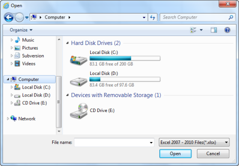

# Open and Save Excel Document in WPF SpreadsheetControl (Classic)

You can open and save the Excel document that is compatible with following Excel versions:

* Excel 97 (.xls)
* Excel 2000 (.xls)
* Excel 2002 (.xls)
* Excel 2003 (.xls)
* Excel 2007 (.xlsx)
* Excel 2010 (.xlsx)

## Open Excel Document

You can open the Excel document using the one of the following override methods:

The following code illustrates how to open Spreadsheet control with file stream:





spreadsheet.ImportFromExcel(stream);





 spreadsheet.ImportFromExcel(stream)
 




The following code illustrates how to open Spreadsheet control with file stream and ExcelOpenType:





spreadsheet.ImportFromExcel(stream, Syncfusion.XlsIO.ExcelOpenType.Automatic);





spreadsheet.ImportFromExcel(stream, Syncfusion.XlsIO.ExcelOpenType.Automatic)





The following code illustrates how to open Spreadsheet control with file stream and Excel Version:





spreadsheet.ImportFromExcel(stream, Syncfusion.XlsIO.ExcelVersion.Excel2010);





spreadsheet.ImportFromExcel(stream, Syncfusion.XlsIO.ExcelVersion.Excel2010)





The following code illustrates how to open Spreadsheet control with file stream, ExcelOpenType and Excel Version:





spreadsheet.ImportFromExcel(stream, Syncfusion.XlsIO.ExcelOpenType.Automatic, Syncfusion.XlsIO.ExcelVersion.Excel2010);





spreadsheet.ImportFromExcel(stream, Syncfusion.XlsIO.ExcelVersion.Excel2010)





### Using Command 

You can also open the Excel document by using the ImportFromExcelCommand. When you execute the ImportFromExcelCommand it will open the Open dialog box. Using that dialog you can open the Excel document. 

The following code illustrates how to bind the ImportFromExcelCommand__to a button: 



<Button Command="{Binding Path= ImportFromExcelCommand}"/>



## Save Excel Documents

To save the current Workbook, call the _SaveAs_ method as given in the following code:





spreadControl.SaveAs();





spreadControl.SaveAs()





Save As dialog box will open. Save the document at the required location.  

### Using Command

You can save the Excel document using the ExportToExcelCommand. When you execute the ExportToExcelCommand, it will open the SaveAs dialog box. Save the content of the Spreadsheet control as Excel document.

The following code illustrates how to bind the ExportToExcelCommand to a button: 



<Button Command="{Binding Path= ExportToExcelCommand}"/>


