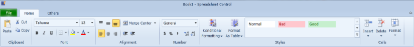

# SpreadsheetRibbon Support in WPF SpreadsheetControl (Classic)

Spreadsheet control provides SpreadsheetRibbon support to format the spreadsheet cell and so on. It gives Microsoft Excel like look and feel. You can add SpreadsheetRibbon by drag and drop the SpreadsheetRibbon from Toolbox.

The following XAML code will be automatically added to the XAML viewer. You can also add this manually to add the SpreadsheetRibbon:



<Syncfusion:SpreadsheetRibbon DataContext="{Binding ElementName=spreadControl}"/>



