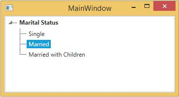

# Customizing Data Templates in WPF TreeViewAdv (Classic)

This section explains about customizing the TreeViewItemAdv using DataTemplate

## ItemTemplate

The user can customize the business object that has to be displayed as TreeViewItemAdv using the ItemTemplate of TreeViewAdv. Since TreeViewAdv displays the hierarchical data, the HierarchicalDataTemplate is used to define the ItemTemplate. In the following example, business object is displayed as CheckBox

We have generate Business object 

**Model class:**





public class Model : NotificationObject
{
    public Model()
    {
        Models = new ObservableCollection<Model>();
    }
    private string caption = string.Empty;
    public string Caption
    {
        Get
        {
            return caption;
        }
        Set
        {
            caption = value;
            this.RaisePropertyChanged(() => this.Caption);
        }
    }
    private bool isChecked = false;
    public bool IsChecked
    {
        Get
        {
            return isChecked;
        }
        Set
        {
            isChecked = value;
            this.RaisePropertyChanged(() => this.IsChecked);
        }
    }
    private bool isCheckable = false;
    public bool IsCheckable
    {    
        Get
        {
            return isCheckable;
        }
        Set
        {
            isCheckable = value;
            this.RaisePropertyChanged(() => this.IsCheckable);
        }
    }
    private ObservableCollection<Model> models = null;
    public ObservableCollection<Model> Models
    {
        Get
        {
            return models;.
        }
        Set
        {
            models = value;
            this.RaisePropertyChanged(() => this.Models);
        }
    }
}





Public Class Model
Inherits NotificationObject
Public Sub New()
Models = New ObservableCollection(Of Model)()
End Sub

'INSTANT VB NOTE: The variable caption was renamed since Visual Basic does not allow variables and other class members to have the same name:
Private caption_Renamed As String = String.Empty
Public ReadOnly Property Caption() As String
[Get]
If True Then
Return caption_Renamed
End If
[Set]
If True Then
caption_Renamed = value
Me.RaisePropertyChanged(Function() Me.Caption)
End If
End Property
Private isChecked As Boolean = False
Public ReadOnly Property IsChecked() As Boolean
[Get]
If True Then
Return isChecked
End If
[Set]
If True Then
isChecked = value
Me.RaisePropertyChanged(Function() Me.IsChecked)
End If
End Property
Private isCheckable As Boolean = False
Public ReadOnly Property IsCheckable() As Boolean
[Get]
If True Then
Return isCheckable
End If
[Set]
If True Then
isCheckable = value
Me.RaisePropertyChanged(Function() Me.IsCheckable)
End If
End Property
Public ReadOnly Property Models() As ObservableCollection(Of Model)
[Get]
If True Then
Return models_Renamed
.
End If
[Set]
If True Then
models_Renamed = value
Me.RaisePropertyChanged(Function() Me.Models)
End If
End Property
End Class





**ViewModel class:**





public class ViewModel : NotificationObject
{
    public ViewModel()
    {
        TreeItems = new ObservableCollection<Model>();
        Model model1 = new Model() { Caption = "WPF" };
        Model model2 = new Model() { Caption = "Silverlight" }; 
        Model model3 = new Model() { Caption = "ASP.Net" }; 
        Model model4 = new Model() { Caption = "ASP.Net MVC" }; 
        Model mainmodel1 = new Model() { Caption = "User Interface" };
        
        mainmodel1.Models.Add(model1);
        mainmodel1.Models.Add(model2);
        mainmodel1.Models.Add(model3);
        mainmodel1.Models.Add(model4);
        
        Model model5 = new Model() { Caption = "WPF",IsCheckable=true };
        Model model6 = new Model() { Caption = "Silverlight", IsCheckable = true };
        Model model7 = new Model() { Caption = "ASP.Net", IsCheckable = true };
        Model model8 = new Model() { Caption = "ASP.Net MVC", IsCheckable = true };
        Model mainmodel2 = new Model() { Caption = "Business Intelligence", IsCheckable = true };
        
        mainmodel2.Models.Add(model5);
        mainmodel2.Models.Add(model6);
        mainmodel2.Models.Add(model7);
        mainmodel2.Models.Add(model8);
        
        Model model9 = new Model() { Caption = "WPF" };
        Model mode20 = new Model() { Caption = "Silverlight" };
        Model mode21 = new Model() { Caption = "ASP.Net" };
        Model mainmodel3 = new Model() { Caption = "Reporting" };
        
        mainmodel3.Models.Add(model9);
        mainmodel3.Models.Add(mode20);
        mainmodel3.Models.Add(mode21);
        
        Model mod = new Model() { Caption = "Syncfusion Essential Studio" };
        mod.Models.Add(mainmodel1);
        mod.Models.Add(mainmodel2);
        mod.Models.Add(mainmodel3);
        TreeItems.Add(mod);
    }
    public ObservableCollection<Model> _treeitems;
    public ObservableCollection<Model> TreeItems
    {
    Get
    {
        return _treeitems;
    }
    Set
    {
        _treeitems = value;
    }
}
}





Public Class ViewModel
Inherits NotificationObject
Public Sub New()
TreeItems = New ObservableCollection(Of Model)()

Dim model1 As New Model() With {.Caption = "WPF"}
Dim model2 As New Model() With {.Caption = "Silverlight"}
Dim model3 As New Model() With {.Caption = "ASP.Net"}
Dim model4 As New Model() With {.Caption = "ASP.Net MVC"}
Dim mainmodel1 As New Model() With {.Caption = "User Interface"}

mainmodel1.Models.Add(model1)
mainmodel1.Models.Add(model2)
mainmodel1.Models.Add(model3)
mainmodel1.Models.Add(model4)

Dim model5 As New Model() With {
	.Caption = "WPF",
	.IsCheckable=True
}
Dim model6 As New Model() With {
	.Caption = "Silverlight",
	.IsCheckable = True
}
Dim model7 As New Model() With {
	.Caption = "ASP.Net",
	.IsCheckable = True
}
Dim model8 As New Model() With {
	.Caption = "ASP.Net MVC",
	.IsCheckable = True
}
Dim mainmodel2 As New Model() With {
	.Caption = "Business Intelligence",
	.IsCheckable = True
}
mainmodel2.Models.Add(model5)
mainmodel2.Models.Add(model6)
mainmodel2.Models.Add(model7)
mainmodel2.Models.Add(model8)

Dim model9 As New Model() With {.Caption = "WPF"}
Dim mode20 As New Model() With {.Caption = "Silverlight"}
Dim mode21 As New Model() With {.Caption = "ASP.Net"}
Dim mainmodel3 As New Model() With {.Caption = "Reporting"}

mainmodel3.Models.Add(model9)
mainmodel3.Models.Add(mode20)
mainmodel3.Models.Add(mode21)

Dim [mod] As New Model() With {.Caption = "Syncfusion Essential Studio"}
[mod].Models.Add(mainmodel1)
[mod].Models.Add(mainmodel2)
[mod].Models.Add(mainmodel3)
TreeItems.Add([mod])
End Sub
Public _treeitems As ObservableCollection(Of Model)
Public ReadOnly Property TreeItems() As ObservableCollection(Of Model)
[Get]
If True Then
Return _treeitems
End If
[Set]
If True Then
_treeitems = value
End If
End Property
End Class









<Window x:Class="ItemTemplateSample.MainWindow"
xmlns="http://schemas.microsoft.com/winfx/2006/xaml/presentation"
xmlns:x="http://schemas.microsoft.com/winfx/2006/xaml"
xmlns:syncfusion="http://schemas.syncfusion.com/wpf"
xmlns:local="clr-namespace:ItemTemplateSample" syncfusion:SkinStorage.VisualStyle="Metro"
Title="MainWindow" Height="350" Width="525">
<Window.DataContext>
<local:ViewModel />
</Window.DataContext>
<Grid>
<syncfusion:TreeViewAdv ItemsSource="{Binding TreeItems}" >
<syncfusion:TreeViewAdv.ItemTemplate>
<HierarchicalDataTemplate ItemsSource="{Binding Models}">
<CheckBox Content="{Binding Caption}" IsChecked="{Binding Path=IsChecked,Mode=TwoWay}"/>
</HierarchicalDataTemplate>
</syncfusion:TreeViewAdv.ItemTemplate>
</syncfusion:TreeViewAdv>
</Grid>
</Window>





## Item template selector

Different templates can be used for items based on specific constraints using the ItemTemplateSelector.

The following example illustrates this:

1.Create the template selector as shown in the following code snippet:





public class TreeViewAdvItemTemplateSelector : DataTemplateSelector
{
    public override DataTemplate SelectTemplate(object item, DependencyObject container)
    {
        Window window = Application.Current.MainWindow;
        if (((Model)item).IsCheckable)
        {
            return window.Resources["CheckableTemplate"] as DataTemplate;
        }
        else
        {
            return window.Resources["NormalTemplate"] as DataTemplate;
        }
    }
}





Public Class TreeViewAdvItemTemplateSelector
Inherits DataTemplateSelector
Public Overrides Function SelectTemplate(ByVal item As Object, ByVal container As DependencyObject) As DataTemplate
Dim window As Window = Application.Current.MainWindow
If DirectCast(item, Model).IsCheckable Then
Return TryCast(window.Resources("CheckableTemplate"), DataTemplate)
Else
Return TryCast(window.Resources("NormalTemplate"), DataTemplate)
End If
End Function
End Class





2.Define the Data templates in the Window’s resources as follows:




<HierarchicalDataTemplate ItemsSource="{Binding Models}" x:Key="CheckableTemplate">
<CheckBox Content="{Binding Caption}" />
</HierarchicalDataTemplate>
<HierarchicalDataTemplate ItemsSource="{Binding Models}" x:Key="NormalTemplate">
<TextBlock Text="{Binding Caption}" />
</HierarchicalDataTemplate>





3.Create the instance for the template selector in the Window’s resources as follows:





<local:TreeViewAdvItemTemplateSelector x:Key="treeViewItemTemplateSelector"/>





4.Use the template selector to choose the template for the TreeViewAdv as follows:





<syncfusion:TreeViewAdv ItemsSource="{Binding TreeItems}" ItemTemplateSelector="{StaticResource treeViewItemTemplateSelector}" >
</syncfusion:TreeViewAdv>





The TreeViewAdv generates as shown in the following screenshot:

## Edit template

The user can modify the template while editing the TreeViewItemAdv. The following example illustrates the process of changing the template:

1.Create the DataTemplate instance for the EditTemplate as follows:





<DataTemplate x:Key="EditTemplate">
<TextBox Text="{Binding Header}" FontStyle="Italic" FontWeight="Bold" />
</DataTemplate>





2.Set the EditedItemTemplate for the TreeViewAdv to the above template as follows:





<syncfusion:TreeViewAdv ItemsSource="{Binding TreeItems}" EditedItemTemplate="{StaticResource EditTemplate}" >
<syncfusion:TreeViewAdv.ItemTemplate>
<HierarchicalDataTemplate ItemsSource="{Binding Models}">
<TextBlock Text="{Binding Caption}" />
</HierarchicalDataTemplate>
</syncfusion:TreeViewAdv.ItemTemplate>
</syncfusion:TreeViewAdv>





While editing the TreeViewItemAdv appears as shown in the following screen shot:

## Edit template selector

The user can choose the template at runtime for editing the TreeViewAdv.

The following example explains how to choose the template at runtime:

1.Create the template selector as given in the following code snippet:





public class TreeViewAdvEditTemplateSelector : DataTemplateSelector
{
    public override DataTemplate SelectTemplate(object item, DependencyObject container)
    {
        Window window = Application.Current.MainWindow;
        if (((Model)item).IsCheckable)
        {
            return window.Resources["CheckableEditTemplate"] as DataTemplate;
        }
        Else
        {
            return window.Resources["NormalEditTemplate"] as DataTemplate;
        }
    }
}





Public Class TreeViewAdvEditTemplateSelector
Inherits DataTemplateSelector
Public Overrides Function SelectTemplate(ByVal item As Object, ByVal container As DependencyObject) As DataTemplate
Dim window As Window = Application.Current.MainWindow
If DirectCast(item, Model).IsCheckable Then
Return TryCast(window.Resources("CheckableEditTemplate"), DataTemplate)
End If
[Else]
If True Then
Return TryCast(window.Resources("NormalEditTemplate"), DataTemplate)
End If
End Function
End Class





2.Define the Data templates in the Window’s resources as follows:





<DataTemplate  x:Key="CheckableEditTemplate">
<TextBox Text="{Binding Header}" FontStyle="Italic" FontWeight="Bold" Foreground="Blue"/>
</DataTemplate>
<DataTemplate  x:Key="NormalEditTemplate">
<TextBox Text="{Binding Header}" FontStyle="Italic" FontWeight="Bold" Foreground="Green"/>
</DataTemplate>





3.Create the instance for the template selector in the Window’s resources as follows:





<local:TreeViewAdvEditTemplateSelector x:Key="TreeViewAdvEditTemplateSelector"/>





4.Use the template selector to choose the template for the TreeViewAdv as follows:





<syncfusion:TreeViewAdv ItemsSource="{Binding TreeItems}" EditedItemTemplateSelector="{StaticResource TreeViewAdvEditTemplateSelector}" >
<syncfusion:TreeViewAdv.ItemTemplate>
<HierarchicalDataTemplate ItemsSource="{Binding Models}">
<TextBlock Text="{Binding Caption}" />
</HierarchicalDataTemplate>
</syncfusion:TreeViewAdv.ItemTemplate>
</syncfusion:TreeViewAdv>





The TreeViewAdv generates as shown in the following screenshot:

## Header template

User can customize the header of the treeview item by using HeaderTemplate using the below code snippet.





<Window x:Class="ItemTemplateSample.MainWindow"
xmlns="http://schemas.microsoft.com/winfx/2006/xaml/presentation"
xmlns:x="http://schemas.microsoft.com/winfx/2006/xaml"
xmlns:syncfusion=[http://schemas.syncfusion.com/wpf](http://schemas.syncfusion.com/wpf# "")
syncfusion:SkinStorage.VisualStyle="Metro"
Title="MainWindow" Height="350" Width="525">
<Window.Resources>
<DataTemplate x:Key="HeaderTemplate">
<StackPanel Orientation="Horizontal">
<TextBlock FontWeight="Bold" Text="Marital Status" />
</StackPanel>
</DataTemplate>
</Window.Resources>
<Grid>
<!-- Adding TreeViewAdv with HeaderTemplate -->
<syncfusion:TreeViewAdv Name="treeViewAdv">
<!-- Adding TreeViewItemAdv -->
<syncfusion:TreeViewItemAdv Name="treeViewItemAdv1" HeaderTemplate="{StaticResource HeaderTemplate}">
<syncfusion:TreeViewItemAdv Header="Single"/>
<syncfusion:TreeViewItemAdv Header="Married"/>
<syncfusion:TreeViewItemAdv Header="Married with Children"/>
</syncfusion:TreeViewItemAdv>
</syncfusion:TreeViewAdv>
</Grid>
</Window>





## Cell template 

TreeViewAdv allow user to customize the items under a column header by defining a cell template for the TreeViewColumns. To create a cell template use the below code





<!-- Adding TreeViewAdv with Enabling multiple column -->
<syncfusion:TreeViewAdv Name="treeViewAdv" MultiColumnEnable="True">
<!-- Adding TreeViewItemAdv -->
<syncfusion:TreeViewItemAdv Name="treeViewItemAdv" Header="Marital Status">
<syncfusion:TreeViewItemAdv Header="Single"/>
<syncfusion:TreeViewItemAdv Header="Married"/>
<syncfusion:TreeViewItemAdv Header="Married with Children"/>
</syncfusion:TreeViewItemAdv>
<syncfusion:TreeViewItemAdv Header="Baby Vaccines">
<syncfusion:TreeViewItemAdv Header="Hepatitis B"/>
<syncfusion:TreeViewItemAdv Header="Tetanus"/>
<syncfusion:TreeViewItemAdv Header="Polio"/>
<syncfusion:TreeViewItemAdv Header="Measles"/>
</syncfusion:TreeViewItemAdv>
<syncfusion:TreeViewItemAdv Header="Country Information">
<syncfusion:TreeViewItemAdv Header="Canada"/>
<syncfusion:TreeViewItemAdv Header="France"/>
<syncfusion:TreeViewItemAdv Header="Germany"/>
<syncfusion:TreeViewItemAdv Header="UK"/>
<syncfusion:TreeViewItemAdv Header="USA"/>
</syncfusion:TreeViewItemAdv>
<!-- Adding header -->
<syncfusion:TreeViewAdv.Columns>
<syncfusion:TreeViewColumnCollection>
<syncfusion:TreeViewColumn Width="150" Header="Status"
DisplayMemberBinding="{Binding Path=Header, RelativeSource={RelativeSource AncestorType={x:Type syncfusion:TreeViewItemAdv}}}"/>
<syncfusion:TreeViewColumn Width="100" Header="Vaccines"
DisplayMemberBinding="{Binding Path=Header, RelativeSource={RelativeSource AncestorType={x:Type syncfusion:TreeViewItemAdv}}}"/>
<syncfusion:TreeViewColumn Width="50" Header="Country">
<!-- Cell Template -->
<syncfusion:TreeViewColumn.CellTemplate>
<DataTemplate>
<Border Margin="1" Width="150" BorderBrush="Red" BorderThickness="1">
<TextBlock Margin="2" Text="{Binding Path=Header, RelativeSource={RelativeSource AncestorType={x:Type syncfusion:TreeViewItemAdv}}}"/>
</Border>
</DataTemplate>
</syncfusion:TreeViewColumn.CellTemplate>
</syncfusion:TreeViewColumn>
</syncfusion:TreeViewColumnCollection>
</syncfusion:TreeViewAdv.Columns>
</syncfusion:TreeViewAdv>





