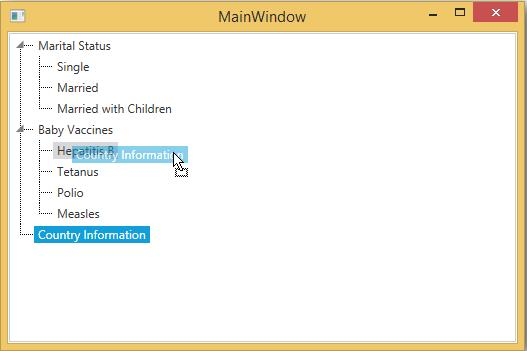

# Dragging TreeView Items

TreeViewAdv control enables to drag TreeView items from one location to another. This is done by enabling the AllowDragDrop property.

Use the following code to enable this property





<syncfusion:TreeViewAdv Name="treeViewAdv" AllowDragDrop="True" >
<syncfusion:TreeViewItemAdv Name="treeviewitem" Header="Marital Status" >
<syncfusion:TreeViewItemAdv Header="Single"/>
<syncfusion:TreeViewItemAdv Header="Married"/>
<syncfusion:TreeViewItemAdv Header="Married with Children"/>
</syncfusion:TreeViewItemAdv>
<syncfusion:TreeViewItemAdv Header="Baby Vaccines" Name="item2"  >
<syncfusion:TreeViewItemAdv Header="Hepatitis B"/>
<syncfusion:TreeViewItemAdv Header="Tetanus"/>
<syncfusion:TreeViewItemAdv Header="Polio"/>
<syncfusion:TreeViewItemAdv Header="Measles"/>
</syncfusion:TreeViewItemAdv>
<syncfusion:TreeViewItemAdv Header="Country Information" />
</syncfusion:TreeViewAdv>





//set allow drag and drop
treeViewAdv.AllowDragDrop = true;





'set allow drag and drop
treeViewAdv.AllowDragDrop = True



  

## Transparent dragging image

The TreeViewAdv control provides support to change the opacity of an element being dragged. By using the DraggingContainerOpacity property,we can change the opacity value of the dragged element. It is useful to be able to view the content behind the dragged element.





<syncfusion:TreeViewAdv Name="treeViewAdv" AllowDragDrop="True" DraggingContainerOpacity="0.4" >
<syncfusion:TreeViewItemAdv Name="treeviewitem" Header="Marital Status" >
<syncfusion:TreeViewItemAdv Header="Single"/>
<syncfusion:TreeViewItemAdv Header="Married"/>
<syncfusion:TreeViewItemAdv Header="Married with Children"/>
</syncfusion:TreeViewItemAdv>
<syncfusion:TreeViewItemAdv Header="Baby Vaccines" Name="item2"  >
<syncfusion:TreeViewItemAdv Header="Hepatitis B"/>
<syncfusion:TreeViewItemAdv Header="Tetanus"/>
<syncfusion:TreeViewItemAdv Header="Polio"/>
<syncfusion:TreeViewItemAdv Header="Measles"/>
</syncfusion:TreeViewItemAdv>
<syncfusion:TreeViewItemAdv Header="Country Information" />
</syncfusion:TreeViewAdv>





//set DraggingContainerOpacity
treeViewAdv.DraggingContainerOpacity = 0.4;





'set DraggingContainerOpacity
treeViewAdv.DraggingContainerOpacity = 0.4



  

## Fake drag indicator

Fake Drag Indicator to indicate where TreeViewItemAdv may be placed during drag and drop operations. This is achieved by enabling the “IsFakeDragIndicator” property.

The following code example can be used to set this property





<syncfusion:TreeViewAdv Name="treeViewAdv" IsFakeDragIndicator="True">
<syncfusion:TreeViewItemAdv Name="treeviewitem" Header="Marital Status" >
<syncfusion:TreeViewItemAdv Header="Single"/>
<syncfusion:TreeViewItemAdv Header="Married"/>
<syncfusion:TreeViewItemAdv Header="Married with Children"/>
</syncfusion:TreeViewItemAdv>
<syncfusion:TreeViewItemAdv Header="Baby Vaccines" Name="item2"  >
<syncfusion:TreeViewItemAdv Header="Hepatitis B"/>
<syncfusion:TreeViewItemAdv Header="Tetanus"/>
<syncfusion:TreeViewItemAdv Header="Polio"/>
<syncfusion:TreeViewItemAdv Header="Measles"/>
</syncfusion:TreeViewItemAdv>
<syncfusion:TreeViewItemAdv Header="Country Information" />
</syncfusion:TreeViewAdv>





//set FakeDragIndicator is true
treeViewAdv.IsFakeDragIndicator = true;





'set FakeDragIndicator is true
treeViewAdv.IsFakeDragIndicator = True



  

