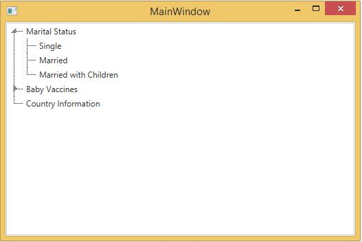
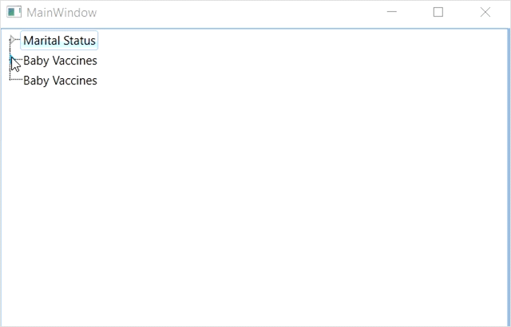

# Expand the item in WPF TreeViewAdv (Classic)

TreeViewAdv allows to expand or collapse each node by setting [IsExpanded](https://help.syncfusion.com/cr/wpf/Syncfusion.Windows.Tools.Controls.TreeViewItemAdv.html#Syncfusion_Windows_Tools_Controls_TreeViewItemAdv_IsExpanded) property. 





    <Grid x:Name="Grid">
        <syncfusion:TreeViewAdv Name="treeViewAdv">
            <syncfusion:TreeViewItemAdv Name="treeViewItemAdv" Header="Marital Status">
                <syncfusion:TreeViewItemAdv Header="Single"/>
                <syncfusion:TreeViewItemAdv Header="Married"/>
                <syncfusion:TreeViewItemAdv Header="Married with Children"/>
            </syncfusion:TreeViewItemAdv>
            <syncfusion:TreeViewItemAdv Header="Baby Vaccines">
                <syncfusion:TreeViewItemAdv Header="Hepatitis B"/>
                <syncfusion:TreeViewItemAdv Header="Tetanus"/>
                <syncfusion:TreeViewItemAdv Header="Polio"/>
                <syncfusion:TreeViewItemAdv Header="Measles"/>
            </syncfusion:TreeViewItemAdv>
            <syncfusion:TreeViewItemAdv Header="Country Information"/>
        </syncfusion:TreeViewAdv>
    </Grid>





public MainWindow()
{
    InitializeComponent();
    TreeViewAdv treeViewAdv = new TreeViewAdv();
    TreeViewItemAdv root1 = new TreeViewItemAdv() { Header = "Marital Status" };
    TreeViewItemAdv subitem11 = new TreeViewItemAdv() { Header = "Single" };
    TreeViewItemAdv subitem12 = new TreeViewItemAdv() { Header = "Married" };
    TreeViewItemAdv subitem13 = new TreeViewItemAdv() { Header = "Married with Children" };

    root1.Items.Add(subitem11);
    root1.Items.Add(subitem12);
    root1.Items.Add(subitem13);

    TreeViewItemAdv root2 = new TreeViewItemAdv() { Header = "Baby Vaccines" };
    TreeViewItemAdv subitem21 = new TreeViewItemAdv() { Header = "Hepatitis B" };
    TreeViewItemAdv subitem22 = new TreeViewItemAdv() { Header = "Tetanus" };
    TreeViewItemAdv subitem23 = new TreeViewItemAdv() { Header = "Polio" };
    TreeViewItemAdv subitem24 = new TreeViewItemAdv() { Header = "Measles" };

    root2.Items.Add(subitem21);
    root2.Items.Add(subitem22);
    root2.Items.Add(subitem23);
    root2.Items.Add(subitem24);

    TreeViewItemAdv root3 = new TreeViewItemAdv() { Header = "Baby Vaccines" };

    treeViewAdv.Items.Add(root1);
    treeViewAdv.Items.Add(root2);
    treeViewAdv.Items.Add(root3);
    Grid.Children.Add(treeViewAdv);

    root1.IsExpanded = true;
}





Public Sub New()
    InitializeComponent()
    Dim treeViewAdv As TreeViewAdv = New TreeViewAdv()
    Dim root1 As TreeViewItemAdv = New TreeViewItemAdv() With {.Header = "Marital Status"}
    Dim subitem11 As TreeViewItemAdv = New TreeViewItemAdv() With {.Header = "Single"}
    Dim subitem12 As TreeViewItemAdv = New TreeViewItemAdv() With {.Header = "Married"}
    Dim subitem13 As TreeViewItemAdv = New TreeViewItemAdv() With {.Header = "Married with Children"}
    root1.Items.Add(subitem11)
    root1.Items.Add(subitem12)
    root1.Items.Add(subitem13)
    Dim root2 As TreeViewItemAdv = New TreeViewItemAdv() With {.Header = "Baby Vaccines"}
    Dim subitem21 As TreeViewItemAdv = New TreeViewItemAdv() With {.Header = "Hepatitis B"}
    Dim subitem22 As TreeViewItemAdv = New TreeViewItemAdv() With {.Header = "Tetanus"}
    Dim subitem23 As TreeViewItemAdv = New TreeViewItemAdv() With {.Header = "Polio"}
    Dim subitem24 As TreeViewItemAdv = New TreeViewItemAdv() With {.Header = "Measles"}
    root2.Items.Add(subitem21)
    root2.Items.Add(subitem22)
    root2.Items.Add(subitem23)
    root2.Items.Add(subitem24)
    Dim root3 As TreeViewItemAdv = New TreeViewItemAdv() With {.Header = "Baby Vaccines"}
    treeViewAdv.Items.Add(root1)
    treeViewAdv.Items.Add(root2)
    treeViewAdv.Items.Add(root3)
    Grid.Children.Add(treeViewAdv)
    root1.IsExpanded = True
End Sub



  

N> [View the sample in GitHub](https://github.com/SyncfusionExamples/how-to-programmatically-expand-an-item-in-wpf-treeview-treeviewadv)

## Animation type

The type of animation that is generated while expanding or collapsing the TreeViewAdv is controlled by using the [AnimationType](https://help.syncfusion.com/cr/wpf/Syncfusion.Windows.Tools.Controls.TreeViewAdv.html#Syncfusion_Windows_Tools_Controls_TreeViewAdv_AnimationType) property. This property includes the following options.

* `Fade` — Fade animation applies when expand or collapse the nodes. 
* `None` — Expands or collapses the nodes without animation.
* `Slide` — Slide animation applies when expand or collapse node. 

The default value of this property is set to `Slide`.





    <Grid x:Name="Grid">
        <syncfusion:TreeViewAdv Name="treeViewAdv" AnimationType="Fade">
            <syncfusion:TreeViewItemAdv Name="treeViewItemAdv" Header="Marital Status">
                <syncfusion:TreeViewItemAdv Header="Single"/>
                <syncfusion:TreeViewItemAdv Header="Married"/>
                <syncfusion:TreeViewItemAdv Header="Married with Children"/>
            </syncfusion:TreeViewItemAdv>
            <syncfusion:TreeViewItemAdv Header="Baby Vaccines">
                <syncfusion:TreeViewItemAdv Header="Hepatitis B"/>
                <syncfusion:TreeViewItemAdv Header="Tetanus"/>
                <syncfusion:TreeViewItemAdv Header="Polio"/>
                <syncfusion:TreeViewItemAdv Header="Measles"/>
            </syncfusion:TreeViewItemAdv>
            <syncfusion:TreeViewItemAdv Header="Country Information"/>
        </syncfusion:TreeViewAdv>
    </Grid>



 





treeViewAdv.AnimationType = AnimationType.Fade;





treeViewAdv.AnimationType = AnimationType.Fade









treeViewAdv.AnimationType = AnimationType.Slide;





treeViewAdv.AnimationType = AnimationType.Slide





## Animation speed

The speed of animation that is generated while expanding or collapsing the TreeViewAdv is controlled by using the [AnimationSpeed](https://help.syncfusion.com/cr/wpf/Syncfusion.Windows.Tools.Controls.TreeViewAdv.html#Syncfusion_Windows_Tools_Controls_TreeViewAdv_AnimationSpeed) property. The default value of this property is set to `1`. 





    <Grid x:Name="Grid">
        <syncfusion:TreeViewAdv Name="treeViewAdv" AnimationSpeed="2">
            <syncfusion:TreeViewItemAdv Name="treeViewItemAdv" Header="Marital Status">
                <syncfusion:TreeViewItemAdv Header="Single"/>
                <syncfusion:TreeViewItemAdv Header="Married"/>
                <syncfusion:TreeViewItemAdv Header="Married with Children"/>
            </syncfusion:TreeViewItemAdv>
            <syncfusion:TreeViewItemAdv Header="Baby Vaccines">
                <syncfusion:TreeViewItemAdv Header="Hepatitis B"/>
                <syncfusion:TreeViewItemAdv Header="Tetanus"/>
                <syncfusion:TreeViewItemAdv Header="Polio"/>
                <syncfusion:TreeViewItemAdv Header="Measles"/>
            </syncfusion:TreeViewItemAdv>
            <syncfusion:TreeViewItemAdv Header="Country Information"/>
        </syncfusion:TreeViewAdv>
    </Grid>





treeViewAdv.AnimationSpeed = 2;





' Set animation speed
treeViewAdv.AnimationSpeed = 2



  

## Expand animation

The Expand or Collapse operation in a TreeViewItemAdv leads to an animated action. This animation is controlled by using the [ExpandAnimation](https://help.syncfusion.com/cr/wpf/Syncfusion.Windows.Tools.Controls.TreeViewItemAdv.html#Syncfusion_Windows_Tools_Controls_TreeViewItemAdv_ExpandAnimation) property of TreeViewItemAdv. The animation is also applied to the child items. The following code example illustrates how to set this property.





    <Window.Resources>
        <DoubleAnimation x:Key="ExpandAnimation" Duration="0:0:2"/>
    </Window.Resources>
    <Grid x:Name="Grid">
        <syncfusion:TreeViewAdv Name="treeViewAdv" AnimationSpeed="2">
            <syncfusion:TreeViewItemAdv Name="treeViewItemAdv" Header="Marital Status" ExpandAnimation="{StaticResource ExpandAnimation}">
                <syncfusion:TreeViewItemAdv Header="Single"/>
                <syncfusion:TreeViewItemAdv Header="Married"/>
                <syncfusion:TreeViewItemAdv Header="Married with Children"/>
            </syncfusion:TreeViewItemAdv>
            <syncfusion:TreeViewItemAdv Header="Baby Vaccines">
                <syncfusion:TreeViewItemAdv Header="Hepatitis B"/>
                <syncfusion:TreeViewItemAdv Header="Tetanus"/>
                <syncfusion:TreeViewItemAdv Header="Polio"/>
                <syncfusion:TreeViewItemAdv Header="Measles"/>
            </syncfusion:TreeViewItemAdv>
            <syncfusion:TreeViewItemAdv Header="Country Information"/>
        </syncfusion:TreeViewAdv>
    </Grid>





DoubleAnimation expandanimation=new DoubleAnimation(){Duration=new Duration(new TimeSpan(0,0,2))};
treeViewItemAdv.ExpandAnimation = expandanimation;





Dim expandanimation As New DoubleAnimation() With {.Duration = New Duration(New TimeSpan(0,0,2))}
treeViewItemAdv.ExpandAnimation = expandanimation



  

