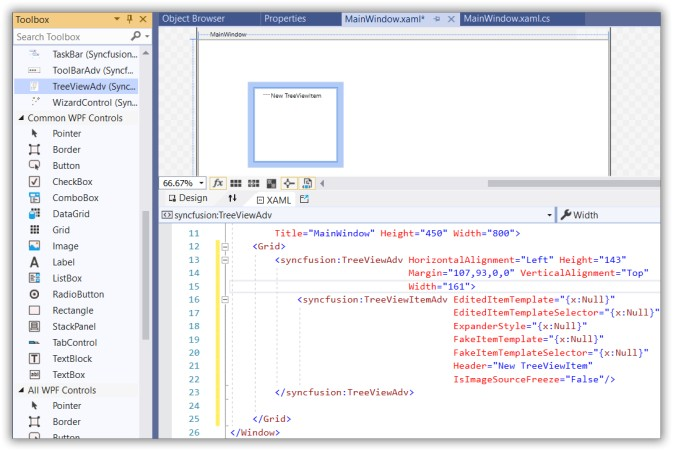
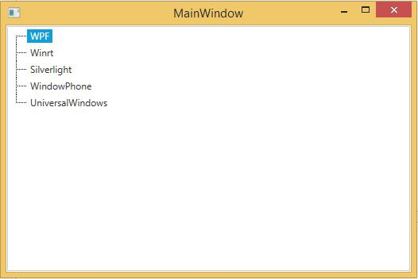
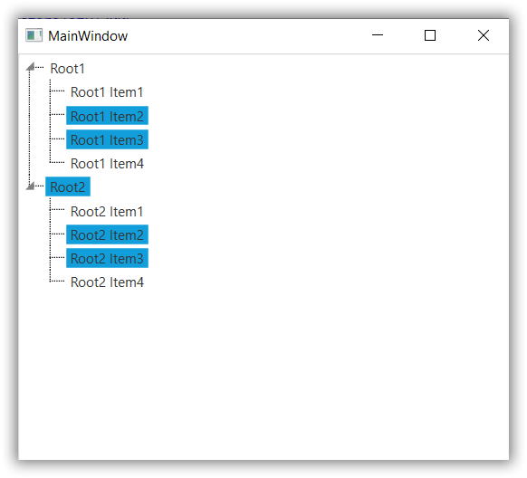
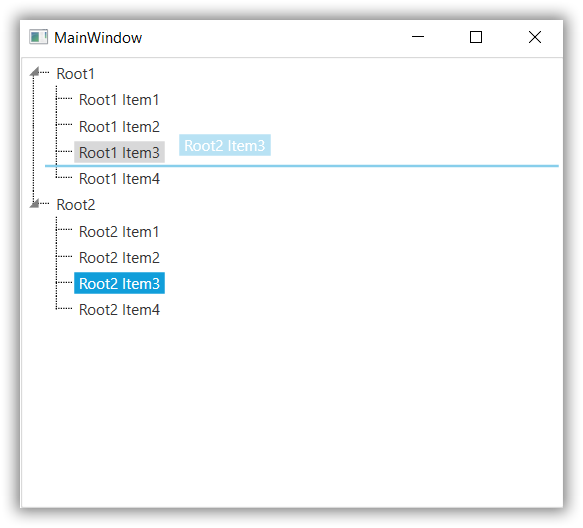

# Getting Started with WPF TreeView (TreeViewAdv)

This section explains how to create Tree layout using [TreeViewAdv](https://help.syncfusion.com/cr/wpf/Syncfusion.Windows.Tools.Controls.TreeViewAdv.html) control.

## Assembly deployment

Refer to the [Control Dependencies](https://help.syncfusion.com/wpf/control-dependencies#treeviewadv) section to get the list of assemblies or NuGet package that needs to be added as a reference to use the control in any application.

Refer to this [documentation](https://help.syncfusion.com/wpf/visual-studio-integration/nuget-packages) to find more details about installing nuget packages in a WPF application.

## Add TreeViewAdv to Project

The [TreeViewAdv](https://help.syncfusion.com/cr/wpf/Syncfusion.Windows.Tools.Controls.TreeViewAdv.html) control can be added to project by the following ways.

1. Adding TreeViewAdv by designer.
2. Adding TreeViewAdv by XAML.
3. Adding TreeViewAdv by C#.

## Adding WPF TreeViewAdv via designer

1) The [TreeViewAdv](https://help.syncfusion.com/cr/wpf/Syncfusion.Windows.Tools.Controls.TreeViewAdv.html) can be added to an application by dragging it from the toolbox to a designer view. The following dependent assemblies will be added automatically.

*  Syncfusion.Tools.Wpf

*  Syncfusion.Shared.Wpf

2) Set the properties for TreeViewAdv in design mode using the SmartTag feature.

## Adding WPF TreeViewAdv via XAML

To add the [TreeViewAdv](https://help.syncfusion.com/cr/wpf/Syncfusion.Windows.Tools.Controls.TreeViewAdv.html) manually in XAML, follow these steps:

1) Create a new WPF project in Visual Studio.

2) Add the following required assembly references to the project:

*  Syncfusion.Tools.Wpf

*  Syncfusion.Shared.Wpf

3) Import Syncfusion WPF schema **http://schemas.syncfusion.com/wpf**, and declare the TreeViewAdv in XAML page.





<Window x:Class="TreeViewAdv_sample.MainWindow"
        xmlns="http://schemas.microsoft.com/winfx/2006/xaml/presentation"
        xmlns:x="http://schemas.microsoft.com/winfx/2006/xaml"
        xmlns:d="http://schemas.microsoft.com/expression/blend/2008"
        xmlns:mc="http://schemas.openxmlformats.org/markup-compatibility/2006"
        xmlns:local="clr-namespace:TreeViewAdv_sample"
        xmlns:syncfusion="http://schemas.syncfusion.com/wpf"
        mc:Ignorable="d"
        Title="MainWindow" Height="450" Width="800">

<Grid>
<syncfusion:TreeViewAdv Height="160" Width="160" HorizontalAlignment="Center"
VerticalAlignment="Center" syncfusion:DockingManager.DockToFill="True" />
</Grid>
</Window>





## Adding WPF TreeViewAdv via C#

To add the [TreeViewAdv](https://help.syncfusion.com/cr/wpf/Syncfusion.Windows.Tools.Controls.TreeViewAdv.html) manually in C#, follow these steps:

1) Create a new WPF application via Visual Studio.

2) Add the following required assembly references to the project:

*  Syncfusion.Tools.Wpf

*  Syncfusion.Shared.Wpf

3) Include the required namespace.





using Syncfusion.Windows.Tools.Controls;





4) Create an instance of [TreeViewAdv](https://help.syncfusion.com/cr/wpf/Syncfusion.Windows.Tools.Controls.TreeViewAdv.html), and add it to the window.





            //Initializing TreeViewAdv 
            TreeViewAdv treeView = new TreeViewAdv();

            //Setting Height,Width and HorizontalAlignment
            treeView.Height = 150;
            treeView.Width = 150;
            treeView.HorizontalAlignment = HorizontalAlignment.Center;

            //Adding control in MainWindow
            this.Content = treeView;





## Adding TreeView item to TreeViewAdv control

The TreeviewItem is added to a [TreeViewAdv](https://help.syncfusion.com/cr/wpf/Syncfusion.Windows.Tools.Controls.TreeViewAdv.html) control either by using XAML or C# codes. The following code example lets you to create and add treeview items to the TreeViewAdv using [TreeViewItemAdv](https://help.syncfusion.com/cr/wpf/Syncfusion.Windows.Tools.Controls.TreeViewItemAdv.html).





<Window x:Class="WpfApplication1.MainWindow"
xmlns="http://schemas.microsoft.com/winfx/2006/xaml/presentation"
xmlns:x="http://schemas.microsoft.com/winfx/2006/xaml"
xmlns:syncfusion="http://schemas.syncfusion.com/wpf"
Title="MainWindow" Height="350" Width="525">
<Grid>
<syncfusion:TreeViewAdv x:Name="Tree">
<syncfusion:TreeViewItemAdv Header="WPF" />
<syncfusion:TreeViewItemAdv Header="Winrt" />
<syncfusion:TreeViewItemAdv Header="Silverlight" />
<syncfusion:TreeViewItemAdv Header="WindowPhone" />
<syncfusion:TreeViewItemAdv Header="UniversalWindows" />
</syncfusion:TreeViewAdv>
</Grid>
</Window>





    public partial class MainWindow : Window
    {
        public MainWindow()
        {
            InitializeComponent();

            TreeViewAdv treeView = new TreeViewAdv() { Name = "Tree" };
            treeView.Height = 150;
            treeView.Width = 150;
            treeView.HorizontalAlignment = HorizontalAlignment.Center;

            TreeViewItemAdv item1 = new TreeViewItemAdv();
            item1.Header = "WPF";

            TreeViewItemAdv item2 = new TreeViewItemAdv();
            item2.Header = "Winrt";

            TreeViewItemAdv item3 = new TreeViewItemAdv();
            item3.Header = "Silverlight";

            TreeViewItemAdv item4 = new TreeViewItemAdv();
            item4.Header = "WindowPhone";

            TreeViewItemAdv item5 = new TreeViewItemAdv();
            item5.Header = "UniversalWindows";

            treeView.Items.Add(item1);
            treeView.Items.Add(item2);
            treeView.Items.Add(item3);
            treeView.Items.Add(item4);
            treeView.Items.Add(item5);

            this.Content = treeView;

        }
    }




## Set VisualStyle

[TreeViewAdv](https://help.syncfusion.com/cr/wpf/Syncfusion.Windows.Tools.Controls.TreeViewAdv.html) supports various visual styles by using the SkinStorage. To apply Visual Studio style on the current layout, refer the below code to apply the value Metro to the VisualStyle property of the SkinStorage for the Window





<Window x:Class="WpfApplication1.MainWindow"
xmlns="http://schemas.microsoft.com/winfx/2006/xaml/presentation"
xmlns:x="http://schemas.microsoft.com/winfx/2006/xaml"
xmlns:syncfusion="http://schemas.syncfusion.com/wpf"
Title="MainWindow" Height="350" Width="525">
<Grid>
<syncfusion:TreeViewAdv syncfusion:SkinStorage.VisualStyle="Metro" x:Name="Tree">
<syncfusion:TreeViewItemAdv Header="WPF" />
<syncfusion:TreeViewItemAdv Header="Winrt" />
<syncfusion:TreeViewItemAdv Header="Silverlight" />
<syncfusion:TreeViewItemAdv Header="WindowPhone" />
<syncfusion:TreeViewItemAdv Header="UniversalWindows"/>
</syncfusion:TreeViewAdv>
</Grid>
</Window>





    TreeViewAdv treeView = new TreeViewAdv();
    SkinStorage.SetVisualStyle(treeView, "Metro");
    this.Content = treeView;





## Setting ItemsSource for TreeviewAdv

The following code snippet sets a collection used to generate the Items of the [TreeViewAdv](https://help.syncfusion.com/cr/wpf/Syncfusion.Windows.Tools.Controls.TreeViewAdv.html) control.





<Window x:Class="WpfApplication1.MainWindow"
xmlns="http://schemas.microsoft.com/winfx/2006/xaml/presentation"
xmlns:x="http://schemas.microsoft.com/winfx/2006/xaml"
xmlns:syncfusion="http://schemas.syncfusion.com/wpf"
syncfusion:SkinStorage.VisualStyle="Metro"
xmlns:local="clr-namespace:WpfApplication1"
Title="MainWindow" Height="350" Width="525">
<Window.Resources>
<local:TechnologyList x:Key="technologyList" />
</Window.Resources>
<Grid>
<syncfusion:TreeViewAdv x:Name="Tree" ItemsSource="{StaticResource technologyList}" >
</syncfusion:TreeViewAdv>
</Grid>
</Window>









public class TechnologyList : ObservableCollection<string>
{
    public TechnologyList()
    {
        this.Add("WPF");
        this.Add("Winrt");
        this.Add("Silverlight");
        this.Add("WindowPhone");
        this.Add("UniversalWindows");
    }
}





Public Class TechnologyList
Inherits ObservableCollection(Of String)
Public Sub New()
Me.Add("WPF")
Me.Add("Winrt")
Me.Add("Silverlight")
Me.Add("WindowPhone")
Me.Add("UniversalWindows")
End Sub
End Class



  

## Multiple Selection in TreeViewAdv

The [TreeViewAdv](https://help.syncfusion.com/cr/wpf/Syncfusion.Windows.Tools.Controls.TreeViewAdv.html) control supports selecting multiple items by using the CTRL or SHIFT keys. The selected items are dragged to any item or node within the same control or to another TreeViewAdv control. This is achieved by enabling the [AllowMultiSelect](https://help.syncfusion.com/cr/wpf/Syncfusion.Windows.Tools.Controls.TreeViewAdv.html#Syncfusion_Windows_Tools_Controls_TreeViewAdv_AllowMultiSelect) property. Click [here](https://help.syncfusion.com/wpf/treeview/selecting-node#enable-to-allow-multiple-selection-in-treeviewadv) to get detailed information on AllowMultiSelect function.

## Drag and Drop in TreeViewAdv

By enabling the [AllowDragDrop](https://help.syncfusion.com/cr/wpf/Syncfusion.Windows.Tools.Controls.TreeViewAdv.html#Syncfusion_Windows_Tools_Controls_TreeViewAdv_AllowDragDrop) property TreeViewAdv control allows us to drag TreeView items from one location to another. By using the [DraggingContainerOpacity](https://help.syncfusion.com/cr/wpf/Syncfusion.Windows.Tools.Controls.TreeViewAdv.html#Syncfusion_Windows_Tools_Controls_TreeViewAdv_DraggingContainerOpacity) property, we can change the opacity value of the dragged element. It is useful to be able to view the content behind the dragged element. Click [here](https://help.syncfusion.com/wpf/treeview/dragging-treeview-items) to get detailed information on drag and drop of TreeViewAdv items.

## MultiColumn TreeView in TreeViewAdv

TreeView control can be created with multiple columns by setting the [MultiColumnEnable](https://help.syncfusion.com/cr/wpf/Syncfusion.Windows.Tools.Controls.TreeViewAdv.html#Syncfusion_Windows_Tools_Controls_TreeViewAdv_MultiColumnEnable) property to true. Click [here](https://help.syncfusion.com/wpf/treeview/creating-a-multicolumn-treeview) to get detailed information on how to create MultiColumn TreeViewAdv.

## Theme

TreeViewAdv supports various built-in themes. Refer to the below links to apply themes for the TreeViewAdv,

  * [Apply theme using SfSkinManager](https://help.syncfusion.com/wpf/themes/skin-manager)
	
  * [Create a custom theme using ThemeStudio](https://help.syncfusion.com/wpf/themes/theme-studio#creating-custom-theme)

  
