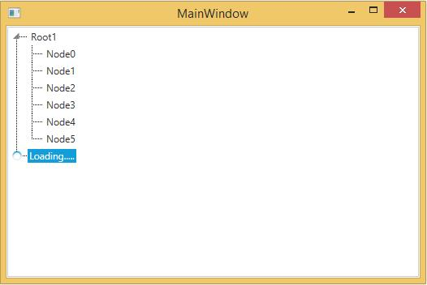

# Load On Demand in WPF TreeView (TreeViewAdv)

The LoadOnDemand feature enables users to load items dynamically when a particular TreeViewItem is expanded. Hence the items are loaded on demand and reduce the loading time.

1. To load items on demand: 
  * **LoadOnDemand** event is used to load the sub-items when a particular item is expanded.
  * **LoadingHeader** is used to display the text while sub-items are being loaded.
  * **IsLoadOnDemand** value has to be set to true if the item is to be loaded on demand.





<syncfusion:TreeViewAdv x:Name="treeViewAdv" LoadOnDemand="treeViewAdv_LoadOnDemand">
<syncfusion:TreeViewItemAdv Header="Root1" IsLoadOnDemand="True" LoadingHeader="Loading....." />
<syncfusion:TreeViewItemAdv Header="Root2" IsLoadOnDemand="True" LoadingHeader="Loading....." />
</syncfusion:TreeViewAdv>





public partial class MainWindow : Window
{
    public MainWindow()
    {
        InitializeComponent();
        timer = new DispatcherTimer();
        timer.Interval = new TimeSpan(0, 0, 0, 0, 800);
        timer.Tick += new EventHandler(timer_Tick);
    }
    private void timer_Tick(object sender, EventArgs e)
    {
        if(loadingitem!=null)
        {
            for (int i = 0; i <= 5; i++)
            {
                loadingitem.Items.Add(new TreeViewItemAdv() { Header = "Node" + i });
            }
            loadingitem.IsLoadOnDemand = false;
            timer.Stop();
        }
    }
    private DispatcherTimer timer;
    private TreeViewItemAdv loadingitem;
    private void treeViewAdv_LoadOnDemand(object sender, LoadonDemandEventArgs args)
    {
        loadingitem = args.TreeViewItem as TreeViewItemAdv;
        timer.Start();
    }
}





Partial Public Class MainWindow
Inherits Window
Public Sub New()
InitializeComponent()
timer = New DispatcherTimer()
timer.Interval = New TimeSpan(0, 0, 0, 0, 800)
AddHandler timer.Tick, AddressOf timer_Tick
End Sub
Private Sub timer_Tick(ByVal sender As Object, ByVal e As EventArgs)
If loadingitem IsNot Nothing Then
For i As Integer = 0 To 5
loadingitem.Items.Add(New TreeViewItemAdv() With {.Header = "Node" & i})
Next i
loadingitem.IsLoadOnDemand = False
timer.Stop()
End If
End Sub
Private timer As DispatcherTimer
Private loadingitem As TreeViewItemAdv
Private Sub treeViewAdv_LoadOnDemand(ByVal sender As Object, ByVal args As LoadonDemandEventArgs)
loadingitem = TryCast(args.TreeViewItem, TreeViewItemAdv)
timer.Start()
End Sub
End Class



  

