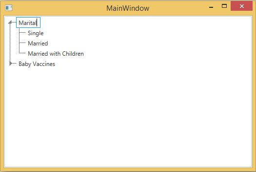

# Node editing in WPF TreeViewAdv (Classic)

TreeViewAdv allow user to edit/non-edit the tree node items at runtime, by enable/disable IsEditable property. Default value of this property is true. At runtime, you can edit a node, by simply clicking the node text

The following code example illustrates how to set this property.





<syncfusion:TreeViewAdv Name="treeViewAdv"  >
<!-- Able to edit this node becuase IsEditable is true-->
<syncfusion:TreeViewItemAdv Name="item1" Header="Marital Status">
<syncfusion:TreeViewItemAdv Header="Single"/>
<syncfusion:TreeViewItemAdv Header="Married"/>
<syncfusion:TreeViewItemAdv Header="Married with Children"/>
</syncfusion:TreeViewItemAdv>
<!-- Unable to edit this node becuase IsEditable is false-->
<syncfusion:TreeViewItemAdv Header="Baby Vaccines" Name="item2" IsEditable="False">
<syncfusion:TreeViewItemAdv Header="Hepatitis B"/>
<syncfusion:TreeViewItemAdv Header="Tetanus"/>
<syncfusion:TreeViewItemAdv Header="Polio"/>
<syncfusion:TreeViewItemAdv Header="Measles"/>
</syncfusion:TreeViewItemAdv>
</syncfusion:TreeViewAdv>





//Set IsEditable is false
item2.IsEditable = false;





'Set IsEditable is false
item2.IsEditable = False



  

## Setting node in EditMode

We can also set a node to be in edit mode when the tree view loads. This is done using the IsInEditMode property. When this property is set to __true__, the particular node will be in edit mode when it loads





<syncfusion:TreeViewAdv Name="treeViewAdv"  >
<syncfusion:TreeViewItemAdv Name="item1" Header="Marital Status" IsInEditMode="True">
<syncfusion:TreeViewItemAdv Header="Single"/>
<syncfusion:TreeViewItemAdv Header="Married"/>
<syncfusion:TreeViewItemAdv Header="Married with Children"/>
</syncfusion:TreeViewItemAdv>
<syncfusion:TreeViewItemAdv Header="Baby Vaccines" Name="item2"  >
<syncfusion:TreeViewItemAdv Header="Hepatitis B"/>
<syncfusion:TreeViewItemAdv Header="Tetanus"/>
<syncfusion:TreeViewItemAdv Header="Polio"/>
<syncfusion:TreeViewItemAdv Header="Measles"/>
</syncfusion:TreeViewItemAdv>
</syncfusion:TreeViewAdv>





//Set edit mode
item1.IsInEditMode = true;





'Set edit mode
item1.IsInEditMode = True



  

## Node editing event

The following events are handled when the tree node is in Edit Mode.

* BeforeItemEdit–Occurs when the IsInEditMode property changes. This event is handled before the TreeViewItemAdv enters the edit mode.
* AfterItemEdit–Occurs when the IsInEditMode property changes. This event is handled after the edit operations are completed.
* EditKeyUp–Occurs when a key is raised, when the item in edit mode. This event is handled when the item is in edit mode.
* EditKeyDown–Occurs when a key is raised, when the item is in edit mode. This event is handled when the item is in edit mode.





<syncfusion:TreeViewAdv Name="treeViewAdv"  >
<syncfusion:TreeViewItemAdv Name="treeviewitem" Header="Marital Status" BeforeItemEdit="treeviewitem_BeforeItemEdit" AfterItemEdit="treeviewitem_AfterItemEdit" EditKeyUp="treeviewitem_EditKeyUp" EditKeyDown="treeviewitem_EditKeyDown" >
<syncfusion:TreeViewItemAdv Header="Single"/>
<syncfusion:TreeViewItemAdv Header="Married"/>
<syncfusion:TreeViewItemAdv Header="Married with Children"/>
</syncfusion:TreeViewItemAdv>
<syncfusion:TreeViewItemAdv Header="Baby Vaccines" Name="item2"  >
<syncfusion:TreeViewItemAdv Header="Hepatitis B"/>
<syncfusion:TreeViewItemAdv Header="Tetanus"/>
<syncfusion:TreeViewItemAdv Header="Polio"/>
<syncfusion:TreeViewItemAdv Header="Measles"/>
</syncfusion:TreeViewItemAdv>
</syncfusion:TreeViewAdv>





private void treeviewitem_BeforeItemEdit(object sender, EditModeChangeEventArgs e)
{
    Debug.WriteLine("BeforeItemEdit: old( " + e.OldValue + "), new( " + e.NewValue + ")");
}
private void treeviewitem_AfterItemEdit(object sender, EditModeChangeEventArgs e)
{
    Debug.WriteLine("AfterItemEdit: old( " + e.OldValue + "), new( " + e.NewValue + ")");
}
private void treeviewitem_EditKeyUp(object sender, KeyEventArgs e)
{
    Debug.WriteLine("Up: " + e.Key);
}
private void treeviewitem_EditKeyDown(object sender, KeyEventArgs e)
{
    Debug.WriteLine("Down: " + e.Key);
}





Private Sub treeviewitem_BeforeItemEdit(ByVal sender As Object, ByVal e As EditModeChangeEventArgs)
Debug.WriteLine("BeforeItemEdit: old( " & e.OldValue & "), new( " & e.NewValue & ")")
End Sub
Private Sub treeviewitem_AfterItemEdit(ByVal sender As Object, ByVal e As EditModeChangeEventArgs)
Debug.WriteLine("AfterItemEdit: old( " & e.OldValue & "), new( " & e.NewValue & ")")
End Sub
Private Sub treeviewitem_EditKeyUp(ByVal sender As Object, ByVal e As KeyEventArgs)
Debug.WriteLine("Up: " & e.Key)
End Sub
Private Sub treeviewitem_EditKeyDown(ByVal sender As Object, ByVal e As KeyEventArgs)
Debug.WriteLine("Down: " & e.Key)
End Sub



  

