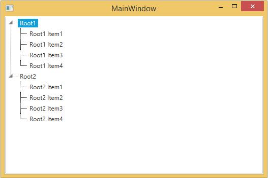

# Populating with Data in WPF TreeViewAdv (Classic)

This section explains about populating TreeViewAdv with TreeView items using several ways.

* Through XAML
* Through Programmatically
* Through DataBinding

## Through XAML

TreeViewAdv can be created in XAML as follows:





<syncfusion:TreeViewAdv>
<syncfusion:TreeViewItemAdv Header="Root1">
<syncfusion:TreeViewItemAdv Header="SubItem1"/>
<syncfusion:TreeViewItemAdv Header="SubItem2"/>
<syncfusion:TreeViewItemAdv Header="SubItem2"/>
<syncfusion:TreeViewItemAdv Header="SubItem2"/>
</syncfusion:TreeViewItemAdv>
<syncfusion:TreeViewItemAdv Header="Root2">
<syncfusion:TreeViewItemAdv Header="SubItem1"/>
<syncfusion:TreeViewItemAdv Header="SubItem2"/>
<syncfusion:TreeViewItemAdv Header="SubItem2"/>
<syncfusion:TreeViewItemAdv Header="SubItem2"/>
</syncfusion:TreeViewItemAdv>
</syncfusion:TreeViewAdv>





## Through programmatically

Include the following namespace to the using directives list to create TreeViewAdv in 





using Syncfusion.Windows.Tools.Controls;





Imports Syncfusion.Windows.Tools.Controls





You can create the TreeViewAdv as follows:





TreeViewAdv treeviewAdv = new TreeViewAdv();
TreeViewItemAdv root1 = new TreeViewItemAdv() { Header = "Root1" };
TreeViewItemAdv subitem11 = new TreeViewItemAdv() { Header = "SubItem1" };
TreeViewItemAdv subitem12 = new TreeViewItemAdv() { Header = "SubItem2" };
TreeViewItemAdv subitem13 = new TreeViewItemAdv() { Header = "SubItem3" };
TreeViewItemAdv subitem14 = new TreeViewItemAdv() { Header = "SubItem4" };

root1.Items.Add(subitem11);
root1.Items.Add(subitem12);
root1.Items.Add(subitem13);
root1.Items.Add(subitem14);

TreeViewItemAdv root2 = new TreeViewItemAdv() { Header = "Root1" };
TreeViewItemAdv subitem21 = new TreeViewItemAdv() { Header = "SubItem1" };
TreeViewItemAdv subitem22 = new TreeViewItemAdv() { Header = "SubItem2" };
TreeViewItemAdv subitem23 = new TreeViewItemAdv() { Header = "SubItem3" };
TreeViewItemAdv subitem24 = new TreeViewItemAdv() { Header = "SubItem4" };

root2.Items.Add(subitem21);
root2.Items.Add(subitem22);
root2.Items.Add(subitem23);
root2.Items.Add(subitem24);

treeviewAdv.Items.Add(root1);
treeviewAdv.Items.Add(root2);

//TreeViewAdv added the child of grid.

layout.Children.Add(treeviewAdv);





Dim treeviewAdv As New TreeViewAdv()
Dim root1 As New TreeViewItemAdv() With {.Header = "Root1"}

Dim subitem11 As New TreeViewItemAdv() With {.Header = "SubItem1"}
Dim subitem12 As New TreeViewItemAdv() With {.Header = "SubItem2"}
Dim subitem13 As New TreeViewItemAdv() With {.Header = "SubItem3"}
Dim subitem14 As New TreeViewItemAdv() With {.Header = "SubItem4"}

root1.Items.Add(subitem11)
root1.Items.Add(subitem12)
root1.Items.Add(subitem13)
root1.Items.Add(subitem14)

Dim root2 As New TreeViewItemAdv() With {.Header = "Root1"}
Dim subitem21 As New TreeViewItemAdv() With {.Header = "SubItem1"}
Dim subitem22 As New TreeViewItemAdv() With {.Header = "SubItem2"}
Dim subitem23 As New TreeViewItemAdv() With {.Header = "SubItem3"}
Dim subitem24 As New TreeViewItemAdv() With {.Header = "SubItem4"}

root2.Items.Add(subitem21)
root2.Items.Add(subitem22)
root2.Items.Add(subitem23)
root2.Items.Add(subitem24)

treeviewAdv.Items.Add(root1)
treeviewAdv.Items.Add(root2)

'TreeViewAdv added the child of grid.
layout.Children.Add(treeviewAdv)





## Through DataBinding

DataBinding is a powerful mechanism to auto-update data between the business model and the user interface.

### Binding to XML

XML file can also be used as ItemsSource for the TreeViewAdv. The following example illustrates this:

1. Create the XML file with the following details and name it as Data.xml:





<Products>
<Product Name="Tools" >

<Feature Name="Ribbon" >
<Feature Name="Office2010UI"/>
<Feature Name="Data Binding Support"/>
</Feature>

<Feature Name="Docking Manager">
<Feature Name="Maximization"/>
<Feature Name="State Persistence"/>
</Feature>

<Feature Name="TreeView">
<Feature Name="Editing"/>
<Feature Name="Sorting"/>
</Feature>

<Feature Name="Data Editors" >
<Feature Name="Watermark Text" />
<Feature Name="Extended Value Scrolling" />
</Feature>
</Product>
</Products>





2. Add the XmlDataProvider for the above XML document as follows:





<Window.Resources>
<XmlDataProvider Source="Data.xml" x:Key="xmlSource" XPath="Products"/>
</Window.Resources>





3. Set the ItemsSource property for the TreeViewAdv as follows:





<syncfusion:TreeViewAdv ItemsSource="{Binding Source={StaticResource xmlSource}, XPath=Product}" >
<syncfusion:TreeViewAdv.ItemTemplate>
<HierarchicalDataTemplate ItemsSource="{Binding XPath=Feature}">
<TextBlock Text="{Binding XPath=@Name}" />
</HierarchicalDataTemplate>
</syncfusion:TreeViewAdv.ItemTemplate>
</syncfusion:TreeViewAdv>





4. TreeViewAdv will be created as follows:

[View Sample in GitHub](https://github.com/SyncfusionExamples/Add-wpf-treeviewadv-items-by-databinding-in-XML)

### Binding to object

TreeViewAdv supports object binding. The following example illustrates data binding:

1. Create a class that acts as a model for TreeViewAdv as given in the following code snippet:





public class Model
{
    public Model()
    {
        SubItems = new ObservableCollection<Model>();
    }
    public string Header { get; set; }
    public bool IsCheckable { get; set; }
    public ObservableCollection<Model> SubItems { get; set; }
}





Public Class Model
Public Sub New()
SubItems = New ObservableCollection(Of Model)()
End Sub
Public Property Header() As String
Public Property IsCheckable() As Boolean
Public Property SubItems() As ObservableCollection(Of Model)
End Class





2. Create a ViewModel class and initialize the items as given in the following code snippet:





public class ViewModel
{
    public ViewModel()
    {
        TreeItems = new ObservableCollection<Model>();
        PopulateData();
    }
    public ObservableCollection<Model> TreeItems { get; set; }
    private void PopulateData()
    {
        Model Root1 = new Model() { Header = "Root1" };
        PopulateSubItems(Root1);
        TreeItems.Add(Root1);
        
        Model Root2 = new Model() { Header = "Root2" };
        PopulateSubItems(Root2);
        TreeItems.Add(Root2);
    }
    private void PopulateSubItems(Model Root)
    {
        Model SubItem1 = new Model() { Header = Root.Header + " Item1" };
        Model SubItem2 = new Model() { Header = Root.Header + " Item2" };
        Model SubItem3 = new Model() { Header = Root.Header + " Item3" };
        Model SubItem4 = new Model() { Header = Root.Header + " Item4" };
        
        Root.SubItems.Add(SubItem1);
        Root.SubItems.Add(SubItem2);
        Root.SubItems.Add(SubItem3);
        Root.SubItems.Add(SubItem4);
    }
}





Public Class ViewModel
Public Sub New()
TreeItems = New ObservableCollection(Of Model)()
PopulateData()
End Sub
Public Property TreeItems() As ObservableCollection(Of Model)
Private Sub PopulateData()

Dim Root1 As New Model() With {.Header = "Root1"}
PopulateSubItems(Root1)
TreeItems.Add(Root1)

Dim Root2 As New Model() With {.Header = "Root2"}
PopulateSubItems(Root2)
TreeItems.Add(Root2)
End Sub
Private Sub PopulateSubItems(ByVal Root As Model)

Dim SubItem1 As New Model() With {.Header = Root.Header & " Item1"}
Dim SubItem2 As New Model() With {.Header = Root.Header & " Item2"}
Dim SubItem3 As New Model() With {.Header = Root.Header & " Item3"}
Dim SubItem4 As New Model() With {.Header = Root.Header & " Item4"}

Root.SubItems.Add(SubItem1)
Root.SubItems.Add(SubItem2)
Root.SubItems.Add(SubItem3)
Root.SubItems.Add(SubItem4)
End Sub

End Class





3. Create a ViewModel instance and use it as DataContext for the Root Window as given in the following code snippet:





<Window.DataContext>
<local:ViewModel />
</Window.DataContext>





4. Configure the ItemsSource and ItemTemplate of the TreeViewAdv as given below:





<syncfusion:TreeViewAdv ItemsSource="{Binding TreeItems}">
<syncfusion:TreeViewAdv.ItemTemplate>
<HierarchicalDataTemplate ItemsSource="{Binding SubItems}">
<TextBlock Text="{Binding Header}" />
</HierarchicalDataTemplate>
</syncfusion:TreeViewAdv.ItemTemplate>
</syncfusion:TreeViewAdv>





5. The TreeViewAdv will be created as follows:

