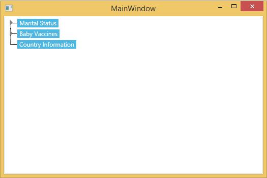

# Selecting a Node in WPF TreeView(TreeViewAdv)

TreeViewAdv allow user to select single or multiple node by setting AllowMultiSelect property.

* Selecting an item through programmatically
* Enable to allow Multiple Selection in TreeViewAdv
* Selecting an items through AddNodeToSelectedItems Collection

## Selecting an item through programmatically

You can show a node to be selected, at runtime, when the TreeViewAdv control is loaded, by setting the IsSelected property of a particular node to __true____.__ Here is the code snippet to enable this property.





<!-- Adding TreeViewAdv with selected -->
<syncfusion:TreeViewAdv Name="treeViewAdv">
<!-- Adding TreeViewItemAdv -->
<syncfusion:TreeViewItemAdv Name="treeViewItemAdv1" IsSelected="True" Header="Marital Status">
<syncfusion:TreeViewItemAdv Header="Single"/>
<syncfusion:TreeViewItemAdv Header="Married"/>
<syncfusion:TreeViewItemAdv Header="Married with Children"/>
</syncfusion:TreeViewItemAdv>
<syncfusion:TreeViewItemAdv Name="treeViewItemAdv2" Header="Baby Vaccines">
<syncfusion:TreeViewItemAdv Header="Hepatitis B"/>
<syncfusion:TreeViewItemAdv Header="Tetanus"/>
<syncfusion:TreeViewItemAdv Header="Polio"/>
<syncfusion:TreeViewItemAdv Header="Measles"/>
</syncfusion:TreeViewItemAdv>
<syncfusion:TreeViewItemAdv Header="Country Information">
<syncfusion:TreeViewItemAdv Header="Canada"/>
<syncfusion:TreeViewItemAdv Header="France"/>
<syncfusion:TreeViewItemAdv Header="Germany"/>
<syncfusion:TreeViewItemAdv Header="UK"/>
<syncfusion:TreeViewItemAdv Header="USA"/>
</syncfusion:TreeViewItemAdv>
</syncfusion:TreeViewAdv>




//Set selection
treeViewItemAdv1.IsSelected = true;





'Set selection
treeViewItemAdv1.IsSelected = True



  

## Enable to allow multiple selection in TreeViewAdv

The TreeViewAdv control supports selecting multiple items by using the CTRL or SHIFT keys. The selected items are dragged to any item or node within the same control or to another TreeViewAdv control. This is achieved by enabling the AllowMultiSelect property.

The following code example can be used to set this property.





<!-- Adding TreeViewAdv with multiselection of items  -->
<syncfusion:TreeViewAdv AllowMultiSelect="True" Name="treeViewAdv">
<!-- Adding TreeViewItemAdv -->
<syncfusion:TreeViewItemAdv Header="Marital Status">
<syncfusion:TreeViewItemAdv Header="Single"/>
<syncfusion:TreeViewItemAdv Header="Married"/>
<syncfusion:TreeViewItemAdv Header="Married with Children"/>
</syncfusion:TreeViewItemAdv>
<syncfusion:TreeViewItemAdv Header="Baby Vaccines">
<syncfusion:TreeViewItemAdv Header="Hepatitis B"/>
<syncfusion:TreeViewItemAdv Header="Tetanus"/>
<syncfusion:TreeViewItemAdv Header="Polio"/>
<syncfusion:TreeViewItemAdv Header="Measles"/>
</syncfusion:TreeViewItemAdv>
<syncfusion:TreeViewItemAdv Header="Country Information"/>
</syncfusion:TreeViewAdv>




// Enable multi select of items
treeViewAdv.AllowMultiSelect = true;





' Enable multi select of items
treeViewAdv.AllowMultiSelect = True



  

## Selecting an item through AddNodeToSelectedItems collection

TreeViewAdv control provides support to select multiple treeview items programmatically. This is achieved by using the AddNodeToSelectedItems method which is used to select multiple items by iterating through each and every item in the TreeViewAdv control.

Here are the code snippets to select multiple items in the TreeViewAdv control using C# code.





foreach (TreeViewItemAdv items in this.treeView.Items)
{
    treeView.AddNodeToSelectedItems(items);
}





For Each items As TreeViewItemAdv In Me.treeView.Items
treeView.AddNodeToSelectedItems(items)
Next items



  

