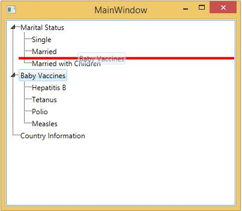
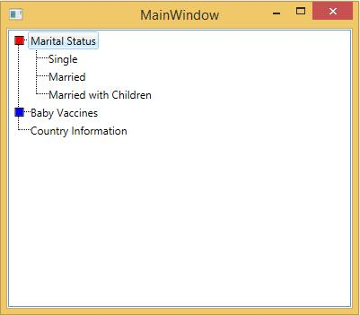

# Styles in WPF TreeViewAdv (Classic)

This section deals with the following Styles supported by TreeViewAdv control

## Setting drag indicator style

TreeViewAdv allow user to customize the style of the Drag Indicator which is used to indicate the drag-and-drop operation in progress by using the DragIndicatorStyle property. The following code example illustrates how to set this property.





<Window x:Class="ItemTemplateSample.MainWindow"
xmlns="http://schemas.microsoft.com/winfx/2006/xaml/presentation"
xmlns:x="http://schemas.microsoft.com/winfx/2006/xaml"
xmlns:syncfusion="http://schemas.syncfusion.com/wpf"
Title="MainWindow" Height="350" Width="400">
<Window.Resources>
<!-- Creating the style for DragIndicator -->

</Window.Resources>
<Grid>
<!-- Adding TreeViewAdv with DragIndicatorStyle -->
<syncfusion:TreeViewAdv DragIndicatorStyle="{StaticResource Drag_Marker}"  Name="treeViewAdv">
<!-- Adding TreeViewItemAdv -->
<syncfusion:TreeViewItemAdv Header="Marital Status">
<syncfusion:TreeViewItemAdv Header="Single"/>
<syncfusion:TreeViewItemAdv Header="Married"/>
<syncfusion:TreeViewItemAdv Header="Married with Children"/>
</syncfusion:TreeViewItemAdv>
<syncfusion:TreeViewItemAdv Header="Baby Vaccines">
<syncfusion:TreeViewItemAdv Header="Hepatitis B"/>
<syncfusion:TreeViewItemAdv Header="Tetanus"/>
<syncfusion:TreeViewItemAdv Header="Polio"/>
<syncfusion:TreeViewItemAdv Header="Measles"/>
</syncfusion:TreeViewItemAdv>
<syncfusion:TreeViewItemAdv Header="Country Information"/>
</syncfusion:TreeViewAdv>
</Grid>
</Window>





## Setting expand style   	

The ExpanderStyle property enables to customize the appearance and style of expansion of the TreeViewAdv during the Expand or Collapse operation. The following code example illustrates how to set this property.





<Window x:Class="ItemTemplateSample.MainWindow"
xmlns="http://schemas.microsoft.com/winfx/2006/xaml/presentation"
xmlns:x="http://schemas.microsoft.com/winfx/2006/xaml"
xmlns:syncfusion="http://schemas.syncfusion.com/wpf"
xmlns:local="clr-namespace:ItemTemplateSample"
Title="MainWindow" Height="350" Width="400">
<Window.Resources>
<!-- Template for TreeViewAdvExpander -->
<ControlTemplate x:Key="MyExpanderTemplateKey" TargetType="{x:Type Expander}">
<ToggleButton Name="Expander" ClickMode="Press" IsChecked="{Binding Path=IsExpanded, RelativeSource={RelativeSource TemplatedParent}}">
<ToggleButton.Style>

</ToggleButton.Style>
</ToggleButton>
</ControlTemplate>
<!-- Style for TreeViewAdvExpander -->

</Window.Resources>
<Grid>
<!-- Adding TreeViewAdv with expand animation -->
<syncfusion:TreeViewAdv Name="treeViewAdv" ExpanderStyle="{DynamicResource MyexpanderStyle}">
<!-- Adding TreeViewItemAdv -->
<syncfusion:TreeViewItemAdv Name="treeViewItemAdv" Header="Marital Status">
<syncfusion:TreeViewItemAdv Header="Single"/>
<syncfusion:TreeViewItemAdv Header="Married"/>
<syncfusion:TreeViewItemAdv Header="Married with Children"/>
</syncfusion:TreeViewItemAdv>
<syncfusion:TreeViewItemAdv Header="Baby Vaccines">
<syncfusion:TreeViewItemAdv Header="Hepatitis B"/>
<syncfusion:TreeViewItemAdv Header="Tetanus"/>
<syncfusion:TreeViewItemAdv Header="Polio"/>
<syncfusion:TreeViewItemAdv Header="Measles"/>
</syncfusion:TreeViewItemAdv>
<syncfusion:TreeViewItemAdv Header="Country Information"/>
</syncfusion:TreeViewAdv>
</Grid>
</Window>





##  Setting item container style

To set the style for the item container, use ItemContainerStyle property. This dependency property can be applied to TreeViewAdv, as well as TreeViewItemAdv.

The following example can be used to set this property.





<Window.Resources>

</Window.Resources>
<Grid >
<!-- Adding TreeViewAdv with selected -->
<syncfusion:TreeViewAdv Name="treeViewAdv" ItemContainerStyle="{StaticResource TreeViewItemStyle}">
<!-- Adding TreeViewItemAdv -->
<syncfusion:TreeViewItemAdv Name="treeViewItemAdv1" IsSelected="True" Header="Marital Status">
<syncfusion:TreeViewItemAdv Header="Single"/>
<syncfusion:TreeViewItemAdv Header="Married"/>
<syncfusion:TreeViewItemAdv Header="Married with Children"/>
</syncfusion:TreeViewItemAdv>
<syncfusion:TreeViewItemAdv Name="treeViewItemAdv2" Header="Baby Vaccines">
<syncfusion:TreeViewItemAdv Header="Hepatitis B"/>
<syncfusion:TreeViewItemAdv Header="Tetanus"/>
<syncfusion:TreeViewItemAdv Header="Polio"/>
<syncfusion:TreeViewItemAdv Header="Measles"/>
</syncfusion:TreeViewItemAdv>
<syncfusion:TreeViewItemAdv Header="Country Information">
<syncfusion:TreeViewItemAdv Header="Canada"/>
<syncfusion:TreeViewItemAdv Header="France"/>
<syncfusion:TreeViewItemAdv Header="Germany"/>
<syncfusion:TreeViewItemAdv Header="UK"/>
<syncfusion:TreeViewItemAdv Header="USA"/>
</syncfusion:TreeViewItemAdv>
</syncfusion:TreeViewAdv>
</Grid>
</Window>





