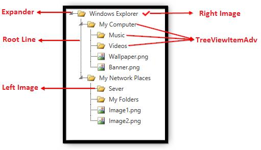

# Visual Structure in WPF TreeView(TreeViewAdv). 

TreeViewAdv control displays hierarchical data in a tree structure, and has items that can be expanded and collapsed

The elements of the control are described below:

* **TreeViewItemAdv** Contents
* **Expander** – Used to Expand/Collapse the TreeViewItem
* **Root** **Line** - This line is used to enhance the visual of the connection between TreeViewItems and its parent.
* **LeftImage** - Displays the image in front of the TreeViewItem.
* **RightImage** – Displays the image to the right of the TreeViewItemAdv

