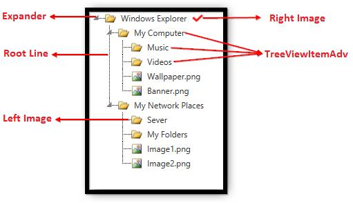

---
layout: post
title: Visual Structure in WPF TreeViewAdv (Classic) | Syncfusion®
description: Understand the visual elements of TreeViewAdv (Classic) including nodes, expanders, root lines, and item images.
platform: wpf
control: TreeViewAdv
documentation: ug
---
# Visual Structure in WPF TreeViewAdv (Classic)

TreeViewAdv control displays hierarchical data in a tree structure, and has items that can be expanded and collapsed

The elements of the control are described below:

* **TreeViewItemAdv** Contents
* **Expander** – Used to Expand/Collapse the TreeViewItem
* **Root** **Line** - This line is used to enhance the visual of the connection between TreeViewItems and its parent.
* **LeftImage** - Displays the image in front of the TreeViewItem.
* **RightImage** – Displays the image to the right of the TreeViewItemAdv

