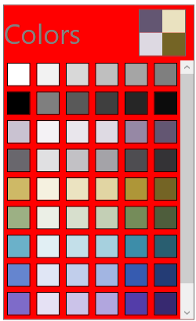
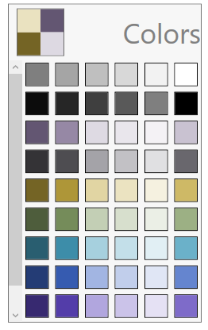

# Appearance in WPF Color Palette (SfColorPalette)

This section explains different UI customization options available in [ColorPalette](https://help.syncfusion.com/cr/wpf/Syncfusion.Windows.Controls.Media.SfColorPalette.html) control.

## Setting the Foreground

You can change the foreground color for `ColorPalette` by setting the `Foreground` property. The default color value of `Foreground` property is `Gray`.




<syncfusion:SfColorPalette Foreground="Red"
                           Name="sfColorPalette"/>




SfColorPalette sfColorPalette = new SfColorPalette();
sfColorPalette.Foreground = Brushes.Red;




N> View [Sample](https://github.com/SyncfusionExamples/syncfusion-wpf-sfcolorpalette-examples/tree/master/Samples/Appearance) in GitHub

## Setting the Background

You can change the background color for `ColorPalette` by setting the `Background` property. The default color value of `Background` property is `Snow`.




<syncfusion:SfColorPalette Background="Red"
                           Name="sfColorPalette"/>




SfColorPalette sfColorPalette = new SfColorPalette();
sfColorPalette.Background = Brushes.Red;




N> View [Sample](https://github.com/SyncfusionExamples/syncfusion-wpf-sfcolorpalette-examples/tree/master/Samples/Appearance) in GitHub

## Change flow direction

You can change the flow direction of the `ColorPalette` layout from right to left by setting the `FlowDirection` property value as `RightToLeft`. The Default value of `FlowDirection` property is `LeftToRight`.




<syncfusion:SfColorPalette FlowDirection="RightToLeft"
                           Name="sfColorPalette"/>




SfColorPalette sfColorPalette = new SfColorPalette();
sfColorPalette.FlowDirection = FlowDirection.RightToLeft;




N> View [Sample](https://github.com/SyncfusionExamples/syncfusion-wpf-sfcolorpalette-examples/tree/master/Samples/Appearance) in GitHub

## Theme

ColorPalette supports various built-in themes. Refer to the below links to apply themes for the ColorPalette,

  * [Apply theme using SfSkinManager](https://help.syncfusion.com/wpf/themes/skin-manager)
	
  * [Create a custom theme using ThemeStudio](https://help.syncfusion.com/wpf/themes/theme-studio#creating-custom-theme)

  
