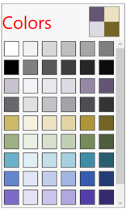
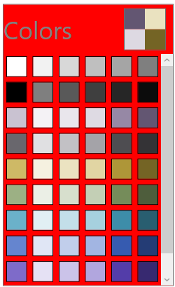
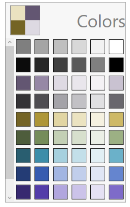

# Appearance in WPF Color Palette

This section explains different UI customization options available in [WPF Color Palette](https://help.syncfusion.com/cr/wpf/Syncfusion.Windows.Controls.Media.SfColorPalette.html) control.

## Setting the Foreground

You can change the foreground color of the `WPF Color Palette` by setting the `Foreground` property. The default value of the `Foreground` property is `Gray`.

> The C# sample below requires the `using System.Windows.Media;` namespace for `Brushes`.




<syncfusion:SfColorPalette Foreground="Red"
                           Name="sfColorPalette"/>




SfColorPalette sfColorPalette = new SfColorPalette();
sfColorPalette.Foreground = Brushes.Red;




N> View [Sample](https://github.com/SyncfusionExamples/syncfusion-wpf-sfcolorpalette-examples/tree/master/Samples/Appearance) in GitHub

## Setting the Background

You can change the background color of the `WPF Color Palette` by setting the `Background` property. The default value of the `Background` property is `Snow`.

> The C# sample below requires the `using System.Windows.Media;` namespace for `Brushes`.




<syncfusion:SfColorPalette Background="Red"
                           Name="sfColorPalette"/>




SfColorPalette sfColorPalette = new SfColorPalette();
sfColorPalette.Background = Brushes.Red;




N> View [Sample](https://github.com/SyncfusionExamples/syncfusion-wpf-sfcolorpalette-examples/tree/master/Samples/Appearance) in GitHub

## Changing the Flow Direction

You can change the flow direction of the `WPF Color Palette` layout to right-to-left by setting the `FlowDirection` property value to `RightToLeft`. The default value of the `FlowDirection` property is `LeftToRight`.

> The C# sample below requires the `using System.Windows;` namespace for `FlowDirection`.




<syncfusion:SfColorPalette FlowDirection="RightToLeft"
                           Name="sfColorPalette"/>




SfColorPalette sfColorPalette = new SfColorPalette();
sfColorPalette.FlowDirection = FlowDirection.RightToLeft;




N> View [Sample](https://github.com/SyncfusionExamples/syncfusion-wpf-sfcolorpalette-examples/tree/master/Samples/Appearance) in GitHub

## Theme

The WPF Color Palette supports various built-in themes. Refer to the links below to apply themes:

  * [Apply theme using SfSkinManager](https://help.syncfusion.com/wpf/themes/skin-manager)
	
  * [Create a custom theme using ThemeStudio](https://help.syncfusion.com/wpf/themes/theme-studio#creating-custom-theme)

  
