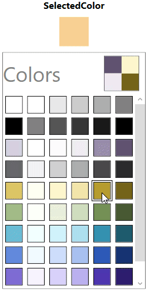
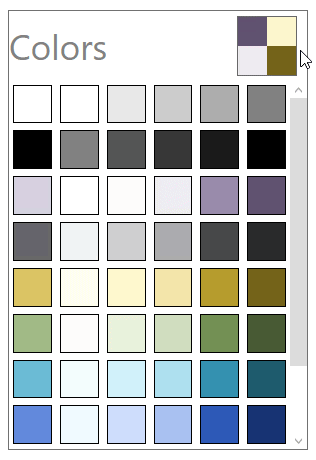

# Getting Started with WPF ColorPalette (SfColorPalette)

This section explains how to create a WPF [SfColorPalette](https://help.syncfusion.com/cr/wpf/Syncfusion.Windows.Controls.Media.SfColorPalette.html) and explains about its structure and features.

## Assembly deployment

Refer to the [Control Dependencies](https://help.syncfusion.com/wpf/control-dependencies#sfcolorpalette) section to get the list of assemblies or `NuGet` package that needs to be added as a reference to use the control in any application.

Refer to this [documentation](https://help.syncfusion.com/wpf/visual-studio-integration/nuget-packages) to find more details about installing nuget packages in a WPF application.

## Creating Application with SfColorPalette control

In this walk through, user will create a WPF application that contains [SfColorPalette](https://help.syncfusion.com/cr/wpf/Syncfusion.Windows.Controls.Media.SfColorPalette.html) control.

 1. Creating project
 2. Adding  control via designer.
 3. Adding  control manually in XAML.
 4. Adding  control manually in C#.

### Creating project

Below section provides detailed information to create new project in Visual Studio to display [SfColorPalette](https://help.syncfusion.com/cr/wpf/Syncfusion.Windows.Controls.Media.SfColorPalette.html).

### Adding control via designer

The [SfColorPalette](https://help.syncfusion.com/cr/wpf/Syncfusion.Windows.Controls.Media.SfColorPalette.html) control can be added to the application by dragging it from Toolbox and dropping it in designer. The required assembly will be added automatically.

* Syncfusion.SfColorPalette.WPF
* Syncfusion.SfShared.WPF

### Adding control manually in XAML

In order to add [SfColorPalette](https://help.syncfusion.com/cr/wpf/Syncfusion.Windows.Controls.Media.SfColorPalette.html) control manually in XAML, do the below steps,

1. Add the below required assembly references to the project,

	  * Syncfusion.SfColorPalette.Wpf

    * Syncfusion.SfShared.Wpf

2. Import Syncfusion WPF schema **http://schemas.syncfusion.com/wpf** or SfColorPalette namespace [**Syncfusion.Windows.Controls.Media**](https://help.syncfusion.com/cr/wpf/Syncfusion.Windows.Controls.Media.html) in XAML page.

3. Declare [SfColorPalette](https://help.syncfusion.com/cr/wpf/Syncfusion.Windows.Controls.Media.SfColorPalette.html) control in XAML page.





<Window
        xmlns="http://schemas.microsoft.com/winfx/2006/xaml/presentation"
        xmlns:x="http://schemas.microsoft.com/winfx/2006/xaml"
        xmlns:d="http://schemas.microsoft.com/expression/blend/2008"
        xmlns:mc="http://schemas.openxmlformats.org/markup-compatibility/2006"
        xmlns:local="clr-namespace:Check_UG"
        xmlns:syncfusion="http://schemas.syncfusion.com/wpf" x:Class="Check_UG.MainWindow"
        mc:Ignorable="d"
        Title="MainWindow" Height="450" Width="800">
<Grid>
<syncfusion:SfColorPalette HorizontalAlignment="Left" Margin="90,50,0,0" VerticalAlignment="Top" Height="206" Width="239"/>

</Grid>
</Window>





### Adding control manually in C#

In order to add [SfColorPalette](https://help.syncfusion.com/cr/wpf/Syncfusion.Windows.Controls.Media.SfColorPalette.html) control manually in C#, do the below steps,

1. Add the below required assembly references to the project,

	  * Syncfusion.SfColorPalette.Wpf

    * Syncfusion.SfShared.Wpf

2. Import SfColorPalette namespace **Syncfusion.Windows.Controls.Media** .





using Syncfusion.Windows.Controls.Media;





3. Create [sfColorPalette](https://help.syncfusion.com/cr/wpf/Syncfusion.Windows.Controls.Media.SfColorPalette.html) control instance and add it to the Page.





    public partial class MainWindow : Window
    {
        public MainWindow()
        {
            InitializeComponent();

            SfColorPalette colorPalette = new SfColorPalette();
            colorPalette.Height = 300;
            colorPalette.Width = 200;

            this.Content = colorPalette;
        }
    }





N> [View Sample in GitHub](https://github.com/SyncfusionExamples/syncfusion-wpf-sfcolorpalette-examples/tree/master/Samples/DataBinding)

## Select a Color

You can select any color by clicking the respective color item in the [SfColorPalette](https://help.syncfusion.com/cr/wpf/Syncfusion.Windows.Controls.Media.SfColorPalette.html) You can get selected color from the [SelectedColor](https://help.syncfusion.com/cr/wpf/Syncfusion.Windows.Controls.Media.SfColorPalette.html#Syncfusion_Windows_Controls_Media_SfColorPalette_SelectedColor) property. If you selecting any color, then the selected color will be displayed as tooltip.

N> [View Sample in GitHub](https://github.com/SyncfusionExamples/syncfusion-wpf-sfcolorpalette-examples/tree/master/Samples/DataBinding)

## Binding a selected color

You can bind the selected color of [SfColorPalette](https://help.syncfusion.com/cr/wpf/Syncfusion.Windows.Controls.Media.SfColorPalette.html) to any objects by using the [SelectedColor](https://help.syncfusion.com/cr/wpf/Syncfusion.Windows.Controls.Media.SfColorPalette.html#Syncfusion_Windows_Controls_Media_SfColorPalette_SelectedColor) property.

Here, the `SelectedColor` of the `SfColorPalette` bind with the `Rectangle.Fill` property with color to brush converter.




//ColorToBrushConverter.cs
public class ColorToSolidColorBrushValueConverter : IValueConverter {
    public object Convert(object value, Type targetType, object parameter, CultureInfo culture) {
        if (null == value)
            return null;
        Color color = (Color)value;
        return new SolidColorBrush(color);
    }
    public object ConvertBack(object value, Type targetType, object parameter, CultureInfo culture) {
        return true;
    }
}







<Grid>
    <Grid.Resources>

    <!--Color to brush converter-->
        <local:ColorToSolidColorBrushValueConverter  x:Key="ColorToSolidColorBrush_ValueConverter"/>
    </Grid.Resources>
    <StackPanel>
        <TextBlock Text="SelectedColor"/>
        <Rectangle Fill="{Binding ElementName=SfColorPalette ,
                                  Path= SelectedColor, 
                                  Converter={StaticResource ColorToSolidColorBrush_ValueConverter}}"/>
        <syncfusion:SfColorPalette x:Name="SfColorPalette" />
    </StackPanel>
</Grid>




N>  [View Sample in GitHub](https://github.com/SyncfusionExamples/syncfusion-wpf-sfcolorpalette-examples/tree/master/Samples/DataBinding)

## Navigate to the list of swatches

You can navigate and select a different colors from the different swatches by clicking the Swatches button which is placed on the right top corner of the [SfColorPalette](https://help.syncfusion.com/cr/wpf/Syncfusion.Windows.Controls.Media.SfColorPalette.html) control.

### List of swatches

N> [View Sample in GitHub](https://github.com/SyncfusionExamples/syncfusion-wpf-sfcolorpalette-examples/tree/master/Samples/DataBinding).

## Theme

ColorPalette supports various built-in themes. Refer to the below links to apply themes for the ColorPalette,

  * [Apply theme using SfSkinManager](https://help.syncfusion.com/wpf/themes/skin-manager)
	
  * [Create a custom theme using ThemeStudio](https://help.syncfusion.com/wpf/themes/theme-studio#creating-custom-theme)

  
