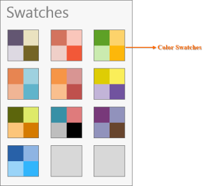

# Getting Started

Namespace : Syncfusion.Windows.Controls.Media.

Assembly  : Syncfusion.SfColorPalette.Wpf (in Syncfusion.SfColorPalette.WPF.dll)

The following code example shows how to create SfColorPalette from XAML and code behind respectively.





<Page xmlns:Media="clr-namespace:Syncfusion.Windows.Controls.Media;assembly=Syncfusion.SfColorPalette.Wpf">

     <Grid>

         <Media:SfColorPalette/>

     </Grid>	

</Page>





SfColorPalette colorPalette = new SfColorPalette();





## Visual structure

