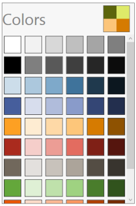
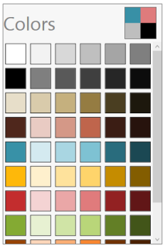

# Interaction

## Swatches button

ColorPalette having the Swatches button on the right top corner of the control, on clicking the button will navigates to the list of swatches.

## Swatches

Swatches page has the list of swatches, each swatches will have the list of colors.

### Apex

### Hardcover

### Metro

### Module

### Office

### Paper

### Pushpin

### Solstice

### Urban

### Waveform

