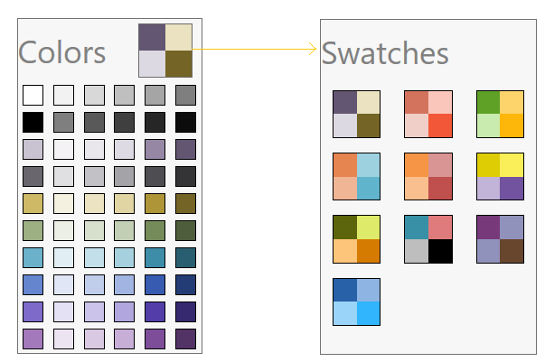

# Overview of WPF ColorPalette (SfColorPalette)

The various elements of the [sfColorPalette](https://help.syncfusion.com/cr/wpf/Syncfusion.Windows.Controls.Media.SfColorPalette.html) are illustrated in the following screenshot.

  * The [Swatch button](https://help.syncfusion.com/cr/wpf/Syncfusion.Windows.Controls.Media.ColorPaletteButton.html) is used to switch between available color packages.

  * In Swatch button different [Color Swatches](https://help.syncfusion.com/cr/wpf/Syncfusion.Windows.Controls.Media.ColorSwatches.html) are available to allow the user to select colors.

  * The [Color item](https://help.syncfusion.com/cr/wpf/Syncfusion.Windows.Controls.Media.ColorItem.html) displays the various color items available in current swatch.

  * Color ToolTip shows  preview of the hovered color item. 

## Key features

Color Swatches – You can choose different color items from the different swatches colors.

SelectedColor – Returns the currently selected color.

Binding support – Selected color can be bound with any object.