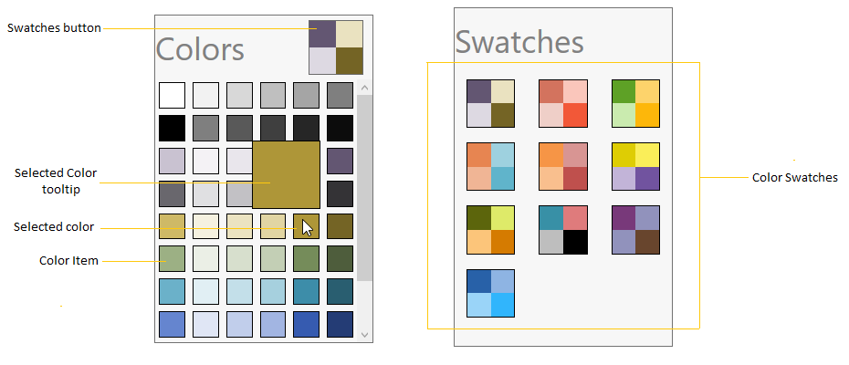

# About Syncfusion® WPF Color Palette Control

The various elements of the [WPF Color Palette](https://help.syncfusion.com/cr/wpf/Syncfusion.Windows.Controls.Media.SfColorPalette.html) are illustrated in the following screenshot.

  * The [Swatch button](https://help.syncfusion.com/cr/wpf/Syncfusion.Windows.Controls.Media.ColorPaletteButton.html) switches between available color palettes.

  * In the Swatch button, different [Color Swatches](https://help.syncfusion.com/cr/wpf/Syncfusion.Windows.Controls.Media.ColorSwatches.html) are available to allow the user to select a palette.

  * The [Color item](https://help.syncfusion.com/cr/wpf/Syncfusion.Windows.Controls.Media.ColorItem.html) displays the individual color items available in the current swatch.

  * The Color ToolTip shows a preview of the hovered color item.

## Key features

* **Color Swatches** - Choose a color item from any of the predefined color swatches (for example, Standard, Office, and Modern).
* **SelectedColor** - `SelectedColor` is a `Color` property that returns the currently selected color. The default value is `null` (no color selected).
* **Binding support** - The selected color can be bound to any UI element.