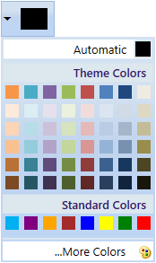
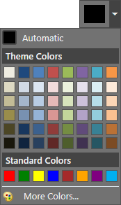

# Appearance in WPF ColorPickerPalette

This section explains different UI customization, styling, theming options available in [ColorPickerPalette](https://help.syncfusion.com/cr/wpf/Syncfusion.Windows.Tools.Controls.ColorPickerPalette.html) control.

## Change flow direction

We can change the flow direction of the `ColorPickerPalette` layout from right to left by setting the `FlowDirection` property value as `RightToLeft`. The Default value of `FlowDirection` property is `LeftToRight`.




<syncfusion:ColorPickerPalette FlowDirection="RightToLeft"
                               Name="colorPickerPalette" 
                               Width="60"
                               Height="40">
</syncfusion:ColorPickerPalette>




ColorPickerPalette colorPickerPalette = new ColorPickerPalette();
colorPickerPalette.FlowDirection = FlowDirection.RightToLeft;
colorPickerPalette.Width = 60;
colorPickerPalette.Height = 40;




## Theme

ColorPickerPalette supports various built-in themes. Refer to the below links to apply themes for the ColorPickerPalette,

  * [Apply theme using SfSkinManager](https://help.syncfusion.com/wpf/themes/skin-manager)
	
  * [Create a custom theme using ThemeStudio](https://help.syncfusion.com/wpf/themes/theme-studio#creating-custom-theme)

