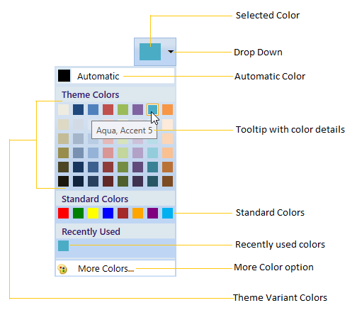
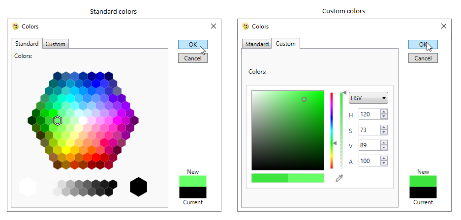
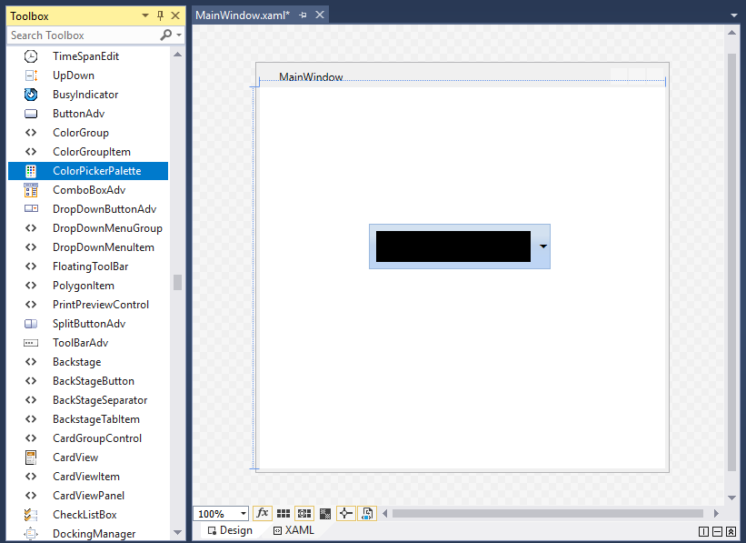
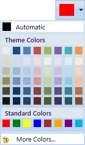
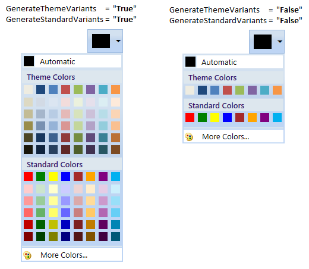
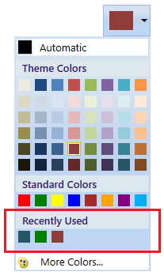
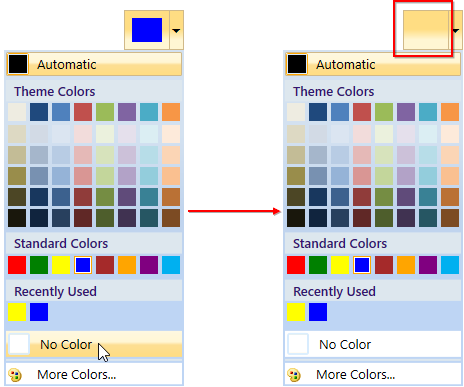

# Getting started with WPF ColorPickerPalette

This section explains how to create a WPF [ColorPickerPalette](https://help.syncfusion.com/cr/wpf/Syncfusion.Windows.Tools.Controls.ColorPickerPalette.html) and explains about its structure and features.

## Control Structure

* The Selected Color represents the color that you select.
* The Drop-Down represents a button, `ColorPickerPalette` window will open when you click on it.
* The Automatic Color represents the Color, which can be set by you as default color.
* The ToolTip with Color Details represents the ToolTip, when the mouse hovers on the Color.
* The Standard Colors stores the standard colors like Red, Green, Blue and so on.
* The Recently User Colors stores the Colors that are recently selected.
* The More Colors Option provides wide range of color in addition to colors in the palette.
* The Theme Variant Colors represents the Theme colors with variant.

### More Color Window

## Assembly deployment

Refer to the [control dependencies](https://help.syncfusion.com/wpf/control-dependencies#colorpickerpalette) section to get the list of assemblies or NuGet package that needs to be added as reference to use the control in any application.

You can find more details about installing the NuGet package in a WPF application in the following link: 

[How to install nuget packages](https://help.syncfusion.com/wpf/nuget-packages)

## Adding WPF ColorPickerPalette via designer

You can add the `ColorPickerPalette` control to an application by dragging it from the toolbox to a view of the designer. The following dependent assembly will be added automatically.

* Syncfusion.Shared.WPF

 
## Adding WPF ColorPickerPalette via XAML

To add the `ColorPickerPalette` control manually in XAML, follow these steps:
1. Create a new WPF project in Visual Studio.

2. Add the  following assembly references to the project,
   * Syncfusion.Shared.WPF
 
3. Import Syncfusion WPF schema **http://schemas.syncfusion.com/wpf** and declare the `ColorPickerPalette` control in XAML page.

4.	Declare the `ColorPickerPalette` control in XAML page.




<Window xmlns="http://schemas.microsoft.com/winfx/2006/xaml/presentation"
        xmlns:x="http://schemas.microsoft.com/winfx/2006/xaml"
        xmlns:syncfusion="http://schemas.syncfusion.com/wpf" 
        x:Class="ColorPickerPaletteSample.MainWindow"
        Title="ColorPickerPalette Sample" Height="350" Width="525">
    <Grid>
        <!--Adding ColorPickerPalette control -->
        <syncfusion:ColorPickerPalette x:Name="colorPickerPalette" 
                                       Width="60" 
                                       Height="40" />
    </Grid>
</Window>



## Adding WPF ColorPickerPalette via C\#

To add the `ColorPickerPalette` control manually in C#, follow these steps:

1. Create a new WPF application via Visual Studio.

2. Add the  following assembly references to the project,
    * Syncfusion.Shared.WPF

3. Include the required namespace and create an instance of `ColorPickerPalette` and add it to the window.

4.	Declare the `ColorPickerPalette` control using C#.




using Syncfusion.Windows.Tools.Controls;

public partial class MainWindow : Window {
    public MainWindow() {
        InitializeComponent();

        //Creating an instance of ColorPickerPalette control
        ColorPickerPalette colorPickerPalette = new ColorPickerPalette();
        colorPickerPalette.Width = 60;
        colorPickerPalette.Height = 40;        

        //Adding ColorPickerPalette as window content
        this.Content = colorPickerPalette;
    }
}




## Accessing a Color programmatically

We can set or change the selected color of the `ColorPickerPalette` programmatically by setting the value for [Color](https://help.syncfusion.com/cr/wpf/Syncfusion.Windows.Tools.Controls.ColorPickerPalette.html#Syncfusion_Windows_Tools_Controls_ColorPickerPalette_Color) property. If we want know the selected color name, use the [ColorName](https://help.syncfusion.com/cr/wpf/Syncfusion.Windows.Tools.Controls.ColorPickerPalette.html#Syncfusion_Windows_Tools_Controls_ColorPickerPalette_ColorName) property that holds the name of the selected color item. The default value of `Color` and `ColorName` property is `Black` and `Color`.

N> You can also set or changes the selected color brush by using the [SelectedBrush](https://help.syncfusion.com/cr/wpf/Syncfusion.Windows.Tools.Controls.ColorPickerPalette.html#Syncfusion_Windows_Tools_Controls_ColorPickerPalette_SelectedBrush) property.




<syncfusion:ColorPickerPalette Color="Red"
                               Name="colorPickerPalette" 
                               Width="60"
                               Height="40">
</syncfusion:ColorPickerPalette>




ColorPickerPalette colorPickerPalette = new ColorPickerPalette();
colorPickerPalette.Color = Colors.Red;
colorPickerPalette.Width = 60;
colorPickerPalette.Height = 40;




Here, `Red` color is selected color in the `ColorPickerPalette`.

## Select color from color palette

We can select a different colors from Theme Color and Standard Color panels. we can show or hide the variant colors of the base Theme Colors and Standard Colors by using the [GenerateThemeVariants](https://help.syncfusion.com/cr/wpf/Syncfusion.Windows.Tools.Controls.ColorPickerPalette.html#Syncfusion_Windows_Tools_Controls_ColorPickerPalette_GenerateThemeVariants) and [GenerateStandardVariants](https://help.syncfusion.com/cr/wpf/Syncfusion.Windows.Tools.Controls.ColorPickerPalette.html#Syncfusion_Windows_Tools_Controls_ColorPickerPalette_GenerateStandardVariants) properties value as `true` or `false`.




<syncfusion:ColorPickerPalette GenerateThemeVariants="True"
                               GenerateStandardVariants="True"
                               Name="colorPickerPalette" 
                               Width="60"
                               Height="40">
</syncfusion:ColorPickerPalette>




ColorPickerPalette colorPickerPalette = new ColorPickerPalette();
colorPickerPalette.GenerateThemeVariants = true;
colorPickerPalette.GenerateStandardVariants = true;
colorPickerPalette.Width = 60;
colorPickerPalette.Height = 40;




## Add your own color in the palette

If we want to allow the user to select a color from own colors, add that color with its name using [CustomColor.ColorName](https://help.syncfusion.com/cr/wpf/Syncfusion.Windows.Tools.Controls.CustomColor.html#Syncfusion_Windows_Tools_Controls_CustomColor_ColorName) and [CustomColor.Color](https://help.syncfusion.com/cr/wpf/Syncfusion.Windows.Tools.Controls.CustomColor.html#Syncfusion_Windows_Tools_Controls_CustomColor_Color) into the [CustomColorsCollection](https://help.syncfusion.com/cr/wpf/Syncfusion.Windows.Tools.Controls.ColorPickerPalette.html#Syncfusion_Windows_Tools_Controls_ColorPickerPalette_CustomColorsCollection) and set the [SetCustomColors](https://help.syncfusion.com/cr/wpf/Syncfusion.Windows.Tools.Controls.ColorPickerPalette.html#Syncfusion_Windows_Tools_Controls_ColorPickerPalette_SetCustomColors) property value as `true`. The provided `CustomColor.ColorName` is shown in the tooltip while mouse hovering on the color item. We can change the custom color panel header text and its visibility by using the [CustomHeaderText](https://help.syncfusion.com/cr/wpf/Syncfusion.Windows.Tools.Controls.ColorPickerPalette.html#Syncfusion_Windows_Tools_Controls_ColorPickerPalette_CustomHeaderText) and [CustomHeaderVisibility](https://help.syncfusion.com/cr/wpf/Syncfusion.Windows.Tools.Controls.ColorPickerPalette.html#Syncfusion_Windows_Tools_Controls_ColorPickerPalette_CustomHeaderVisibility) properties. The default value of `CustomHeaderText` is `CustomColors` and  default value of `CustomHeaderVisibility` is `Visible`.




public class ViewModel : NotificationObject {
    private ObservableCollection<CustomColor> newColorCollection;
    public ObservableCollection<CustomColor> NewColorCollection {
        get {
            return newColorCollection;
        }
        set {
            newColorCollection = value;
            this.RaisePropertyChanged("NewColorCollection");
        }
    }
    public ViewModel() {
        NewColorCollection = new ObservableCollection<CustomColor>();
    }
}







<Window.Resources>
    <local:ViewModel x:Key="viewModel">
        <local:ViewModel.NewColorCollection>

            <!-- Defining the color details -->
            <syncfusion:CustomColor Color="#FF11EBF8" ColorName="Aqua" />
            <syncfusion:CustomColor Color="#FFF80FA6" ColorName="Deep Pink" />
            <syncfusion:CustomColor Color="#FF8BA7C2" ColorName="Dark Gray" />
            <syncfusion:CustomColor Color="#F53CDF07" ColorName="Lime Green" />
            <syncfusion:CustomColor Color="#C2929545" ColorName="Olive Drab" />
            <syncfusion:CustomColor Color="#2E956145" ColorName="Sienna" />
            <syncfusion:CustomColor Color="#78458E95" ColorName="Steel Blue" />
            <syncfusion:CustomColor Color="#8B8220E4" ColorName="Blue Violet" />
        </local:ViewModel.NewColorCollection>
    </local:ViewModel>
</Window.Resources>

<syncfusion:ColorPickerPalette CustomColorsCollection="{Binding NewColorCollection}"  
                               CustomHeaderText="New Colors"
                               CustomHeaderVisibility="Visible"
                               SetCustomColors="True"
                               DataContext="{StaticResource viewModel}"
                               Name="colorPickerPalette" 
                               Width="60"
                               Height="40">
</syncfusion:ColorPickerPalette>




Click [here](https://github.com/SyncfusionExamples/syncfusion-color-picker-palette-wpf-examples/tree/master/Samples/CustomColors) to download the sample that showcases how to add your own color items into the palette. 

##  Recently used color items

The recently selected color items are displayed in the RecentlyUsedPanel. If we want to choose a color which are previously selected, use the RecentlyUsedPanel.




<syncfusion:ColorPickerPalette RecentlyUsedPanelVisibility="Visible"
                               Name="colorPickerPalette" 
                               Width="60"
                               Height="40">
</syncfusion:ColorPickerPalette>




ColorPickerPalette colorPickerPalette = new ColorPickerPalette();
colorPickerPalette.RecentlyUsedPanelVisibility = Visibility.Visible;
colorPickerPalette.Width = 60;
colorPickerPalette.Height = 40;




## Choosing a color from MoreColor window

If we wants more standard and custom colors to select, click the more color option and select the color from standard color tab or custom color tab and click the `Ok` button. 




<syncfusion:ColorPickerPalette MoreColorOptionVisibility="Visible"
                               Name="colorPickerPalette" 
                               Width="60"
                               Height="40">
</syncfusion:ColorPickerPalette>




ColorPickerPalette colorPickerPalette = new ColorPickerPalette();
colorPickerPalette.MoreColorOptionVisibility = Visibility.Visible;
colorPickerPalette.Width = 60;
colorPickerPalette.Height = 40;




N> We can show or hide all color panels. Refer the [Dealing with ColorPickerPalette](https://help.syncfusion.com/wpf/color-picker-palette/dealing-with-colorpickerpalette) page that explains the panel visibility support.

## Reset selected color

If you want to reset the selected color as `Transparent` color, click the `No Color` button. You will be display the `No color` button only by setting the [NoColorVisibility](https://help.syncfusion.com/cr/wpf/Syncfusion.Windows.Tools.Controls.ColorPickerPalette.html#Syncfusion_Windows_Tools_Controls_ColorPickerPalette_NoColorVisibility) property value as `Visible`. The default value of `NoColorVisibility` property is `Collapsed`.




<syncfusion:ColorPickerPalette NoColorVisibility="Visible"
                               Name="colorPickerPalette"/>




colorPickerPalette.NoColorVisibility = Visibility.Visible;




N> [View Sample  in GitHub](https://github.com/SyncfusionExamples/syncfusion-color-picker-palette-wpf-examples/tree/master/Samples/Getting-Started)

## Selected brush or color changed notification

The selected brush or color changed in `ColorPickerPalette` can be examined using `SelectedBrushChanged` event. The `SelectedBrushChangedEventArgs` contains the old and newly selected brush and its color values in the `OldBrush`,`NewBrush` and `OldColor`, `NewColor` properties.




<syncfusion:ColorPickerPalette SelectedBrushChanged="ColorPickerPalette_SelectedBrushChanged"
                               Name="ColorPickerPalette" 
                               Width="60"
                               Height="40">
</syncfusion:ColorPickerPalette>




ColorPickerPalette colorPickerPalette = new ColorPickerPalette();
colorPickerPalette.SelectedBrushChanged += ColorPickerPalette_SelectedBrushChanged;
colorPickerPalette.Width = 60;
colorPickerPalette.Height = 40;







//Invoked when the selected color or brush is changed
private void ColorPickerPalette_SelectedBrushChanged(object sender, SelectedBrushChangedEventArgs e) {
    //Old and newly selected brushes
    var OldBrush = e.OldBrush ;
    var newBrush = e.NewBrush;

    //Old and newly selected colors
    var oldColor = e.OldColor;
    var newColor = e.NewColor;            
}


 

Click [here](https://github.com/SyncfusionExamples/syncfusion-color-picker-palette-wpf-examples/tree/master/Samples/Getting-Started) to download the sample that showcases different type of color items with its panel visibility customization.

## Localization support

Localization is the process of translating the application resources into different language for the specific cultures. You can localize the `ColorPickerPalette` control by adding resource file for each language.

N> Refer [Localization](https://help.syncfusion.com/wpf/localization) page to know more about how to provide a localization support for the `ColorPickerPalette`.

## Theme

ColorPickerPalette supports various built-in themes. Refer to the below links to apply themes for the ColorPickerPalette,

  * [Apply theme using SfSkinManager](https://help.syncfusion.com/wpf/themes/skin-manager)
	
  * [Create a custom theme using ThemeStudio](https://help.syncfusion.com/wpf/themes/theme-studio#creating-custom-theme)