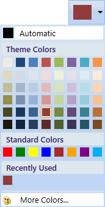

# WPF Color Picker Palette Overview

The [ColorPickerPalette](https://help.syncfusion.com/cr/wpf/Syncfusion.Windows.Tools.Controls.ColorPickerPalette.html) control provides a rich visual interface for color selection. The structure of the control represents a palette which is displayed as a Drop-down with selected color highlighted at the top. Its provides standard colors and the various theme colors to choose.  The control also has a ToolTip support which bears the name of the color. More color options are embedded with the control that provides you with a wide range of color options.

