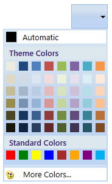
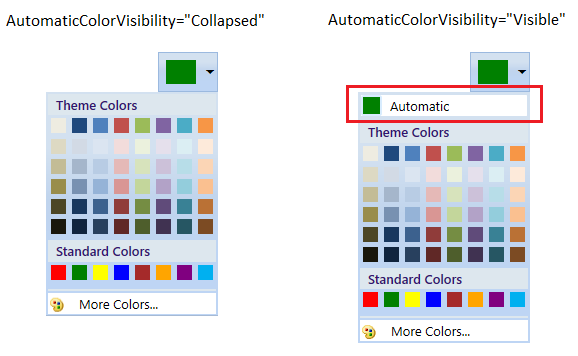
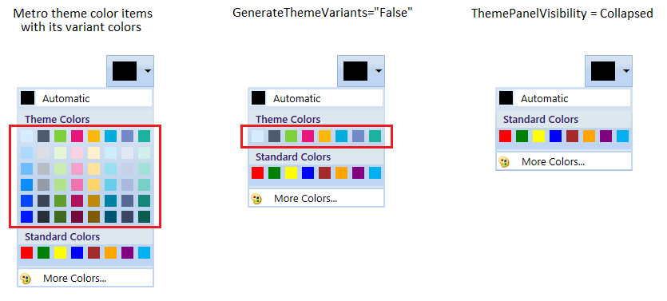
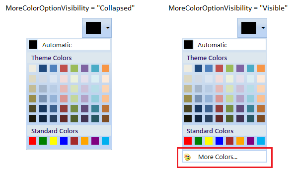
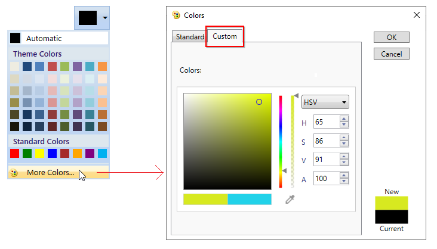
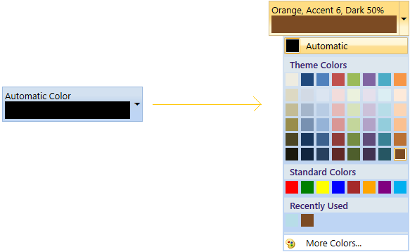
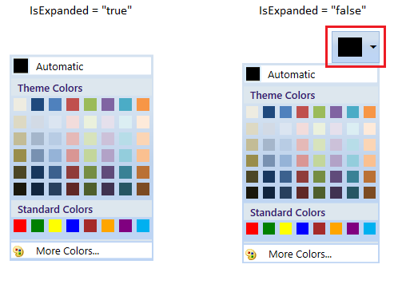
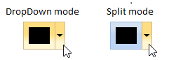
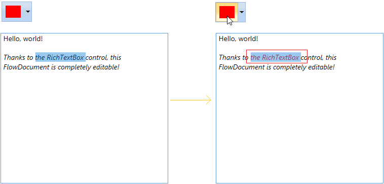
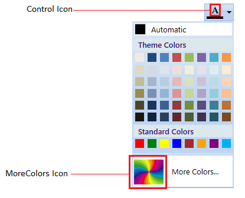

# Working with WPF ColorPickerPalette

This section explains the different types of colors available in the [ColorPickerPalette](https://help.syncfusion.com/cr/wpf/Syncfusion.Windows.Tools.Controls.ColorPickerPalette.html) and  how to choose the colors and its panel customizations.

## Accessing a Color programmatically

We can get or change the selected color of the `ColorPickerPalette` programmatically by setting the value to the [Color](https://help.syncfusion.com/cr/wpf/Syncfusion.Windows.Tools.Controls.ColorPickerPalette.html#Syncfusion_Windows_Tools_Controls_ColorPickerPalette_Color) property. If we want know the selected color name, use the [ColorName](https://help.syncfusion.com/cr/wpf/Syncfusion.Windows.Tools.Controls.ColorPickerPalette.html#Syncfusion_Windows_Tools_Controls_ColorPickerPalette_ColorName) property that holds the name of the selected color item. The default value of `Color` and `ColorName` property is `Black` and `Color`.




<syncfusion:ColorPickerPalette Color="Red"
                               Name="colorPickerPalette" 
                               Width="60"
                               Height="40">
</syncfusion:ColorPickerPalette>




ColorPickerPalette colorPickerPalette = new ColorPickerPalette();
colorPickerPalette.Color = Colors.Red;
colorPickerPalette.Width = 60;
colorPickerPalette.Height = 40;




Here, `Red` color is selected color in the `ColorPickerPalette`.

## Setting null value / No color

You can set a null color value for the selected color by setting the color code `#00000000` or `Colors.Transparent` for `Color` property to indicate the null value.




<syncfusion:ColorPickerPalette Color="Transparent"
                               Name="colorPickerPalette"/>




ColorPickerPalette colorPickerPalette = new ColorPickerPalette();
colorPickerPalette.Color = Colors.Transparent;




## Setting automatic color

If we want to change the default selected color on application launching, set the value for [AutomaticColor](https://help.syncfusion.com/cr/wpf/Syncfusion.Windows.Tools.Controls.ColorPickerPalette.html#Syncfusion_Windows_Tools_Controls_ColorPickerPalette_AutomaticColor) property. If we changed the selected color, then we can easily make the default color as selected color by clicking the automatic color panel. We can hide the automatic color visibility by setting the [AutomaticColorVisibility](https://help.syncfusion.com/cr/wpf/Syncfusion.Windows.Tools.Controls.ColorPickerPalette.html#Syncfusion_Windows_Tools_Controls_ColorPickerPalette_AutomaticColorVisibility) property value as `Collapsed`. The default value of `AutomaticColor` property is `Black` and the default value of `AutomaticColorVisibility` property is `Visible`.




<syncfusion:ColorPickerPalette AutomaticColor="Green"
                               AutomaticColorVisibility="Visible"
                               Name="colorPickerPalette" 
                               Width="60"
                               Height="40">
</syncfusion:ColorPickerPalette>




ColorPickerPalette colorPickerPalette = new ColorPickerPalette();
colorPickerPalette.AutomaticColor = Colors.Green;
colorPickerPalette.AutomaticColorVisibility= Visibility.Visible;
colorPickerPalette.Width = 60;
colorPickerPalette.Height = 40;




## Select a predefined colors

We can select a color from either various theme color items or standard color items. We can show or hide the color items panel visibilities.

### Select a color from theme color items

We can select a various theme colors by setting the value for [Themes](https://help.syncfusion.com/cr/wpf/Syncfusion.Windows.Tools.Controls.ColorPickerPalette.html#Syncfusion_Windows_Tools_Controls_ColorPickerPalette_Themes) property. Based on the `Themes` value, the respective base color items are displayed with its variants. If we want allow the user to select only base theme colors without its variants color, use the [GenerateThemeVariants](https://help.syncfusion.com/cr/wpf/Syncfusion.Windows.Tools.Controls.ColorPickerPalette.html#Syncfusion_Windows_Tools_Controls_ColorPickerPalette_GenerateThemeVariants) property as `false`.  We can hide the theme color panel by setting the [ThemePanelVisibility](https://help.syncfusion.com/cr/wpf/Syncfusion.Windows.Tools.Controls.ColorPickerPalette.html#Syncfusion_Windows_Tools_Controls_ColorPickerPalette_ThemePanelVisibility) property value as `Collapsed`.  The default value of `Themes` property is `Office` and default value of  `ThemePanelVisibility` property is `Visible`.




<syncfusion:ColorPickerPalette Themes="Metro"
                               GenerateThemeVariants="True" 
                               ThemePanelVisibility="Visible"
                               Name="colorPickerPalette" 
                               Width="60"
                               Height="40">
</syncfusion:ColorPickerPalette>




ColorPickerPalette colorPickerPalette = new ColorPickerPalette();
colorPickerPalette.Themes = PaletteTheme.Metro;
colorPickerPalette.GenerateThemeVariants = true;
colorPickerPalette.ThemePanelVisibility = Visibility.Visible;
colorPickerPalette.Width = 60;
colorPickerPalette.Height = 40;




### Select a color from standard color items

We can select a standard colors from the standard color panel. If we want allow the user to select standard colors with its variant colors, use the [GenerateStandardVariants](https://help.syncfusion.com/cr/wpf/Syncfusion.Windows.Tools.Controls.ColorPickerPalette.html#Syncfusion_Windows_Tools_Controls_ColorPickerPalette_GenerateStandardVariants) property as `true`.  We can hide the standard color panel by setting the [StandardPanelVisibility](https://help.syncfusion.com/cr/wpf/Syncfusion.Windows.Tools.Controls.ColorPickerPalette.html#Syncfusion_Windows_Tools_Controls_ColorPickerPalette_StandardPanelVisibility) property value as `Collapsed`.  The default value of `GenerateStandardVariants` property is `false` and default value of  `StandardPanelVisibility` property is `Visible`.




<syncfusion:ColorPickerPalette GenerateStandardVariants="True" 
                               StandardPanelVisibility="Visible"
                               Name="colorPickerPalette" 
                               Width="60"
                               Height="40">
</syncfusion:ColorPickerPalette>




ColorPickerPalette colorPickerPalette = new ColorPickerPalette();
colorPickerPalette.GenerateStandardVariants = true;
colorPickerPalette.StandardPanelVisibility = Visibility.Visible;
colorPickerPalette.Width = 60;
colorPickerPalette.Height = 40;




## Show white and black color variants

If we want to allow the user to select the theme color from white or black or both color variants, use the [BlackWhiteVisibility](https://help.syncfusion.com/cr/wpf/Syncfusion.Windows.Tools.Controls.ColorPickerPalette.html#Syncfusion_Windows_Tools_Controls_ColorPickerPalette_BlackWhiteVisibility) property as `White` or `Black` or `Both`. The default value of `BlackWhiteVisibility` property is `None`.




<syncfusion:ColorPickerPalette BlackWhiteVisibility="Both"
                               Name="colorPickerPalette" 
                               Width="60"
                               Height="40">
</syncfusion:ColorPickerPalette>




ColorPickerPalette colorPickerPalette = new ColorPickerPalette();
colorPickerPalette.BlackWhiteVisibility = BlackWhiteVisible.Both;
colorPickerPalette.Width = 60;
colorPickerPalette.Height = 40;




## Add your own colors in the palette

If we want to allow the user to select a color from own colors, add that color with its name using [CustomColor.ColorName](https://help.syncfusion.com/cr/wpf/Syncfusion.Windows.Tools.Controls.CustomColor.html#Syncfusion_Windows_Tools_Controls_CustomColor_ColorName) and [CustomColor.Color](https://help.syncfusion.com/cr/wpf/Syncfusion.Windows.Tools.Controls.CustomColor.html#Syncfusion_Windows_Tools_Controls_CustomColor_Color) into the [CustomColorsCollection](https://help.syncfusion.com/cr/wpf/Syncfusion.Windows.Tools.Controls.ColorPickerPalette.html#Syncfusion_Windows_Tools_Controls_ColorPickerPalette_CustomColorsCollection) and set the [SetCustomColors](https://help.syncfusion.com/cr/wpf/Syncfusion.Windows.Tools.Controls.ColorPickerPalette.html#Syncfusion_Windows_Tools_Controls_ColorPickerPalette_SetCustomColors) property value as `true`. The provided `CustomColor.ColorName` is shown in the tooltip while mouse hovering on the color item. We can change the custom color panel header text and its visibility by using the [CustomHeaderText](https://help.syncfusion.com/cr/wpf/Syncfusion.Windows.Tools.Controls.ColorPickerPalette.html#Syncfusion_Windows_Tools_Controls_ColorPickerPalette_CustomHeaderText) and [CustomHeaderVisibility](https://help.syncfusion.com/cr/wpf/Syncfusion.Windows.Tools.Controls.ColorPickerPalette.html#Syncfusion_Windows_Tools_Controls_ColorPickerPalette_CustomHeaderVisibility) properties. The default value of `CustomHeaderText` is `CustomColors` and  default value of `CustomHeaderVisibility` is `Visible`.




public class ViewModel : NotificationObject {
    private ObservableCollection<CustomColor> newColorCollection;
    public ObservableCollection<CustomColor> NewColorCollection {
        get {
            return newColorCollection;
        }
        set {
            newColorCollection = value;
            this.RaisePropertyChanged("NewColorCollection");
        }
    }
    public ViewModel() {
        NewColorCollection = new ObservableCollection<CustomColor>();
    }
}







<Window.Resources>
    <local:ViewModel x:Key="viewModel">
        <local:ViewModel.NewColorCollection>

            <!-- Defining the color details -->
            <syncfusion:CustomColor Color="#FF11EBF8" ColorName="Aqua" />
            <syncfusion:CustomColor Color="#FFF80FA6" ColorName="Deep Pink" />
            <syncfusion:CustomColor Color="#FF8BA7C2" ColorName="Dark Gray" />
            <syncfusion:CustomColor Color="#F53CDF07" ColorName="Lime Green" />
            <syncfusion:CustomColor Color="#C2929545" ColorName="Olive Drab" />
            <syncfusion:CustomColor Color="#2E956145" ColorName="Sienna" />
            <syncfusion:CustomColor Color="#78458E95" ColorName="Steel Blue" />
            <syncfusion:CustomColor Color="#8B8220E4" ColorName="Blue Violet" />
        </local:ViewModel.NewColorCollection>
    </local:ViewModel>
</Window.Resources>

<syncfusion:ColorPickerPalette CustomColorsCollection="{Binding NewColorCollection}" 
                               CustomHeaderText="New Colors" 
                               CustomHeaderVisibility="Visible"
                               SetCustomColors="True"
                               DataContext="{StaticResource viewModel}"
                               Name="colorPickerPalette" 
                               Width="60"
                               Height="40">
</syncfusion:ColorPickerPalette>




Click [here](https://github.com/SyncfusionExamples/syncfusion-color-picker-palette-wpf-examples/tree/master/Samples/CustomColors) to download the sample that showcases how to add your own color items into the palette.

##  Recently used color items

The recently selected color items are displayed in the RecentlyUsedPanel. If we want to choose a color which are previously selected, use the RecentlyUsedPanel. We can hide the RecentlyUsedPanel by using the [RecentlyUsedPanelVisibility](https://help.syncfusion.com/cr/wpf/Syncfusion.Windows.Tools.Controls.ColorPickerPalette.html#Syncfusion_Windows_Tools_Controls_ColorPickerPalette_RecentlyUsedPanelVisibility) property value as `Collapsed`. The default value of `RecentlyUsedPanelVisibility` property is `Visible`.




<syncfusion:ColorPickerPalette RecentlyUsedPanelVisibility="Visible"
                               Name="colorPickerPalette" 
                               Width="60"
                               Height="40">
</syncfusion:ColorPickerPalette>




ColorPickerPalette colorPickerPalette = new ColorPickerPalette();
colorPickerPalette.RecentlyUsedPanelVisibility = Visibility.Visible;
colorPickerPalette.Width = 60;
colorPickerPalette.Height = 40;




## Choosing a color from MoreColor window

In addition to colors in Theme colors and Standard colors, MoreColor feature allows you to select wide range of color options. MoreColor feature includes two categories namely Standard Colors and Custom Colors. We can hide the visibility of the MoreColor Option by using the [MoreColorOptionVisibility](https://help.syncfusion.com/cr/wpf/Syncfusion.Windows.Tools.Controls.ColorPickerPalette.html#Syncfusion_Windows_Tools_Controls_ColorPickerPalette_MoreColorOptionVisibility) property value as `Collapsed`.

### Selecting more standard colors

We can select color from 140 standard colors clustered in the shape of a Hexagon. If we want to hide the Standard color tab, use the [IsStandardTabVisible](https://help.syncfusion.com/cr/wpf/Syncfusion.Windows.Tools.Controls.ColorPickerPalette.html#Syncfusion_Windows_Tools_Controls_ColorPickerPalette_IsStandardTabVisible) property value as `Collapsed`. The color chosen from this cluster will also be added in the RecentlyUsedPanel.




<syncfusion:ColorPickerPalette IsStandardTabVisible="Visible"
                               Name="colorPickerPalette" 
                               Width="60"
                               Height="40">
</syncfusion:ColorPickerPalette>




ColorPickerPalette colorPickerPalette = new ColorPickerPalette();
colorPickerPalette.IsStandardTabVisible = Visibility.Visible;
colorPickerPalette.Width = 60;
colorPickerPalette.Height = 40;




### Selecting more custom colors

We can select any color and adjusting its saturation level by using the custom tab color picker . If we want to hide the custom color tab, use the [IsCustomTabVisible](https://help.syncfusion.com/cr/wpf/Syncfusion.Windows.Tools.Controls.ColorPickerPalette.html#Syncfusion_Windows_Tools_Controls_ColorPickerPalette_IsCustomTabVisible) property value as `Collapsed`. The color chosen from custom color picker will also be added in the RecentlyUsedPanel.




<syncfusion:ColorPickerPalette IsCustomTabVisible="Visible"
                               Name="colorPickerPalette" 
                               Width="60"
                               Height="40">
</syncfusion:ColorPickerPalette>




ColorPickerPalette colorPickerPalette = new ColorPickerPalette();
colorPickerPalette.IsCustomTabVisible = Visibility.Visible;
colorPickerPalette.Width = 60;
colorPickerPalette.Height = 40;




N> If we set `IsCustomTabVisible` and `IsStandardTabVisible` property value as `false`, then MoreColor option automatically hides.

## Selected brush or color changed notification

The selected brush or color changed in `ColorPickerPalette` can be examined using `SelectedBrushChanged` event. The `SelectedBrushChangedEventArgs` contains the old and newly selected brush and its color values in the `OldBrush`,`NewBrush` and `OldColor`, `NewColor` properties. You can also get the selected brush and color changed notification by using the [SelectedCommand](https://help.syncfusion.com/cr/wpf/Syncfusion.Windows.Tools.Controls.ColorPickerPalette.html#Syncfusion_Windows_Tools_Controls_ColorPickerPalette_SelectedCommand) property.




<syncfusion:ColorPickerPalette SelectedBrushChanged="ColorPickerPalette_SelectedBrushChanged"
                               Name="ColorPickerPalette" 
                               Width="60"
                               Height="40">
</syncfusion:ColorPickerPalette>




ColorPickerPalette colorPickerPalette = new ColorPickerPalette();
colorPickerPalette.SelectedBrushChanged += ColorPickerPalette_SelectedBrushChanged;
colorPickerPalette.Width = 60;
colorPickerPalette.Height = 40;







//Invoked when the selected color or brush is changed
private void ColorPickerPalette_SelectedBrushChanged(object sender, SelectedBrushChangedEventArgs e) {
    //Old and newly selected brushes
    var OldBrush = e.OldBrush ;
    var newBrush = e.NewBrush;

    //Old and newly selected colors
    var oldColor = e.OldColor;
    var newColor = e.NewColor;            
}


 

## Customize the header

You can customize the appearance of the  `ColorPickerPalette` header and can display the selected color name in the header by using the [HeaderTemplate](https://help.syncfusion.com/cr/wpf/Syncfusion.Windows.Tools.Controls.ColorPickerPalette.html#Syncfusion_Windows_Tools_Controls_ColorPickerPalette_HeaderTemplate) property.

N> The `DataContext` of `HeaderTemplate` is `ColorPickerPalette`



<Window.Resources>
    <DataTemplate x:Key="Custom_HeaderTemplate">
        <Grid>
            <Grid.ColumnDefinitions>
                <ColumnDefinition Width="auto"/>
                <ColumnDefinition Width="auto"/>
            </Grid.ColumnDefinitions>
            <Grid  x:Name="IconGrid" 
                   Margin="2">
                <Grid.RowDefinitions>
                    <RowDefinition Height="Auto"/>
                    <RowDefinition Height="*"/>
                </Grid.RowDefinitions>
                <Image x:Name="image" 
                       Source="/images/fill.png"
                       Height="12" 
                       Width="12"/>
                <Border Name="color_border" 
                        Grid.Row="1" 
                        Height="3">
                    <Border.Background>
                        <SolidColorBrush Color="{Binding Color, 
                            RelativeSource={RelativeSource FindAncestor, 
                                AncestorLevel=1,
                                AncestorType={x:Type syncfusion:ColorPickerPalette}}, 
                                UpdateSourceTrigger=PropertyChanged}"/>
                    </Border.Background>
                </Border>
            </Grid>
            <TextBlock Padding="1" 
                       HorizontalAlignment="Left"
                       VerticalAlignment="Center"
                       TextAlignment="Center" Grid.Column="1" 
                       Text="Shape Fill" FontSize="11"
                       Width="auto"/>
        </Grid>
    </DataTemplate>
</Window.Resources>
<Grid>
    <syncfusion:ColorPickerPalette HeaderTemplate="{DynamicResource Custom_HeaderTemplate}"
                                   Name="ColorPickerPallete2"                                  
                                   Margin="10"
                                   Mode="Split"/>
</Grid>




N> View [Sample](https://github.com/SyncfusionExamples/syncfusion-color-picker-palette-wpf-examples/tree/master/Samples/HeaderTemplate) in GitHub

## Tooltip support

Tooltip is used to show the information about the segment, when you mouse over on the segment. We can show information about the name of the color item using tooltip when hovering the mouse on the specific color item.

## Expanded mode

If you want to directly use the palette without drop down button, set the `Mode` property value as `Palette`. 




<syncfusion:ColorPickerPalette Mode="Palette"
                               Name="colorPickerPalette"/>




ColorPickerPalette colorPickerPalette = new ColorPickerPalette();
colorPickerPalette.Mode = PickerMode.Palette;




N> View [Sample](https://github.com/SyncfusionExamples/syncfusion-color-picker-palette-wpf-examples/tree/master/Samples/Getting-Started) in GitHub

## ColorPickerPalette as a command button

By default, ColorPickerPalette acts like a dropdown. It opening a color palette when clicking anywhere on the header. By setting the [Mode](https://help.syncfusion.com/cr/wpf/Syncfusion.Windows.Tools.Controls.ColorPickerPalette.html#Syncfusion_Windows_Tools_Controls_ColorPickerPalette_Mode) property to `Split`, it acts like a button and dropdown as explained below.
1. When clicking on the dropdown arrow button, It acts like a dropdown.
2. When you click on the header area, it acts like a button and [SelectedCommand](https://help.syncfusion.com/cr/wpf/Syncfusion.Windows.Tools.Controls.ColorPickerPalette.html#Syncfusion_Windows_Tools_Controls_ColorPickerPalette_SelectedCommand) will be triggered. Using this command, you can do some action like applying the selected color as background of selected text.

For example, if you want to apply a last selected color as a foreground to a TextEditor's selected text. You can direct click the button instead of opening the dropdown and selecting an already selected color again.




//ViewModel.cs
public class ViewModel : NotificationObject
{  
    private ICommand selectionChangedCommand;
    private ICommand loadedChangedCommand;
    private RichTextBox TextBox;
   
    public ICommand SelectionChangedCommand {
        get {
            return selectionChangedCommand;
        }
    }

    public ICommand LoadedChangedCommand {
        get {
            return loadedChangedCommand;
        }
    }

    public void Loadedmethod(object param) {
        TextBox = param as RichTextBox;
    }
    public void PropertyChangedHandler(object param) {
        if (param != null && TextBox != null) {
            ColorSelectedCommandArgs groupItem = param as ColorSelectedCommandArgs;
            TextRange range = new TextRange(TextBox.Selection.Start, TextBox.Selection.End);
            range.ApplyPropertyValue(FlowDocument.ForegroundProperty, groupItem.Brush);
        }
    }
    public ViewModel() {
        selectionChangedCommand = new DelegateCommand<object>(PropertyChangedHandler);
        loadedChangedCommand = new DelegateCommand<object>(Loadedmethod);
    }
}







<syncfusion:ColorPickerPalette  Name="colorpickerpalette" 
                                Mode="Split"
                                SelectedCommand="{Binding SelectionChangedCommand}"
                                Width="60" 
                                Height="40">
  
 </syncfusion:ColorPickerPalette>

 <RichTextBox Name="richTextBox"
              Height="297" 
              Width="331">
     <i:Interaction.Triggers>
         <i:EventTrigger EventName="Loaded">
             <i:InvokeCommandAction Command="{Binding LoadedChangedCommand}"
                                    CommandParameter="{Binding ElementName=richTextBox}"/>
         </i:EventTrigger>
     </i:Interaction.Triggers>
     <FlowDocument>
         <Paragraph FontSize="14">Hello, world!</Paragraph>
         <Paragraph FontStyle="Italic" 
                    TextAlignment="Left"
                    FontSize="14">Thanks to the RichTextBox control, 
                                  this FlowDocument is completely editable!</Paragraph>
     </FlowDocument>
 </RichTextBox>




colorPickerPalette.Mode = PickerMode.Split;




N> View [Sample](https://github.com/SyncfusionExamples/syncfusion-color-picker-palette-wpf-examples/tree/master/Samples/TextColorSelection) in GitHub

## Change color item size

We can change each color item size by using the [BorderWidth](https://help.syncfusion.com/cr/wpf/Syncfusion.Windows.Tools.Controls.ColorPickerPalette.html#Syncfusion_Windows_Tools_Controls_ColorPickerPalette_BorderWidth) and [BorderHeight](https://help.syncfusion.com/cr/wpf/Syncfusion.Windows.Tools.Controls.ColorPickerPalette.html#Syncfusion_Windows_Tools_Controls_ColorPickerPalette_BorderHeight) properties.  Based on the color items size, the color palette is resized. The default value of `BorderWidth` and `BorderHeight` properties is `17`.




<syncfusion:ColorPickerPalette BorderWidth="30" 
                               BorderHeight="30"
                               Name="colorPickerPalette" 
                               Width="60"
                               Height="40">
</syncfusion:ColorPickerPalette>




ColorPickerPalette colorPickerPalette = new ColorPickerPalette();
colorPickerPalette.BorderWidth = 30;
colorPickerPalette.BorderHeight = 30;
colorPickerPalette.Width = 60;
colorPickerPalette.Height = 40;




## Change color palette size

We can change the color palette pop size by using the [PopupWidth](https://help.syncfusion.com/cr/wpf/Syncfusion.Windows.Tools.Controls.ColorPickerPalette.html#Syncfusion_Windows_Tools_Controls_ColorPickerPalette_PopupWidth) and [PopupHeight](https://help.syncfusion.com/cr/wpf/Syncfusion.Windows.Tools.Controls.ColorPickerPalette.html#Syncfusion_Windows_Tools_Controls_ColorPickerPalette_PopupHeight) properties. Based on the popup color palette size, the color items are resized. The default value of `PopupWidth` and `PopupHeight` properties is `175` and `200`.




<syncfusion:ColorPickerPalette PopupWidth="120" 
                               PopupHeight="100"
                               Name="colorPickerPalette" 
                               Width="60"
                               Height="40">
</syncfusion:ColorPickerPalette>




ColorPickerPalette colorPickerPalette = new ColorPickerPalette();
colorPickerPalette.PopupWidth = 120;
colorPickerPalette.PopupHeight = 100;
colorPickerPalette.Width = 60;
colorPickerPalette.Height = 40;




N> If we use both `PopupWidth` & `PopupHeight` and `BorderWidth` & `BorderHeight`, then `BorderWidth` & `BorderHeight` properties have higher priority.

## Change header and more color icons

We can set the icons for control header which is placed left to the DropDown button and more color panel header by using the [Icon](https://help.syncfusion.com/cr/wpf/Syncfusion.Windows.Tools.Controls.ColorPickerPalette.html#Syncfusion_Windows_Tools_Controls_ColorPickerPalette_Icon) and [MoreColorsIcon](https://help.syncfusion.com/cr/wpf/Syncfusion.Windows.Tools.Controls.ColorPickerPalette.html#Syncfusion_Windows_Tools_Controls_ColorPickerPalette_MoreColorsIcon) properties. We can change the icon size for the control icon and more color icon by using the [IconSize](https://help.syncfusion.com/cr/wpf/Syncfusion.Windows.Tools.Controls.ColorPickerPalette.html#Syncfusion_Windows_Tools_Controls_ColorPickerPalette_IconSize) and [MoreColorsIconSize](https://help.syncfusion.com/cr/wpf/Syncfusion.Windows.Tools.Controls.ColorPickerPalette.html#Syncfusion_Windows_Tools_Controls_ColorPickerPalette_MoreColorsIconSize) properties.




<syncfusion:ColorPickerPalette Icon="/Label.png"
                               IconSize="18,18"
                               MoreColorsIcon="/MoreColor.png"
                               MoreColorsIconSize="50,50"
                               Name="colorPickerPalette" 
                               Width="60"
                               Height="40">
</syncfusion:ColorPickerPalette>




Click [here](https://github.com/SyncfusionExamples/syncfusion-color-picker-palette-wpf-examples/tree/master/Samples/Getting-Started) to download the sample that showcases features and  different type color items with its panel visibility customization.

## Hide the drop down button

You can hide the dropdown button in the `ColorPickerPalette` by setting the dropdown button visibility as `Collapsed`. You can open a popup color palette by clicking the header of the `ColorPickerPalette`.




<syncfusion:ColorPickerPalette Loaded="ColorPickerPalette_Loaded"
                               Name="colorPickerPalette"/>




ColorPickerPalette colorPickerPalette = new ColorPickerPalette();
colorPickerPalette.Loaded += ColorPickerPalette_Loaded;







private void ColorPickerPalette_Loaded(object sender, RoutedEventArgs e) {
    var dropDown = (Border)(sender as ColorPickerPalette).Template.FindName("UpDownBorder", colorPickerPalette);
    if (dropDown != null) {
        dropDown.Visibility = Visibility.Collapsed;
    }
}




