# Color Selection in WPF ColorPickerPalette

This section explains the different types of colors available in the [ColorPickerPalette](https://help.syncfusion.com/cr/wpf/Syncfusion.Windows.Tools.Controls.ColorPickerPalette.html) and how to choose the colors and customize the panels.

## Accessing a Color programmatically

You can get or change the selected color of the `ColorPickerPalette` programmatically by setting the [Color](https://help.syncfusion.com/cr/wpf/Syncfusion.Windows.Tools.Controls.ColorPickerPalette.html#Syncfusion_Windows_Tools_Controls_ColorPickerPalette_Color) property. To get the selected color's name, use the [ColorName](https://help.syncfusion.com/cr/wpf/Syncfusion.Windows.Tools.Controls.ColorPickerPalette.html#Syncfusion_Windows_Tools_Controls_ColorPickerPalette_ColorName) property, which holds the name of the selected color item. The default value of `Color` is `Black`, and the default value of `ColorName` is the string `"Color"`.




<syncfusion:ColorPickerPalette Color="Red"
                               Name="colorPickerPalette"
                               Width="60"
                               Height="40">
</syncfusion:ColorPickerPalette>




ColorPickerPalette colorPickerPalette = new ColorPickerPalette();
colorPickerPalette.Color = Colors.Red;
colorPickerPalette.Width = 60;
colorPickerPalette.Height = 40;




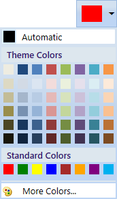

Here, `Red` is the selected color in the `ColorPickerPalette`.

N> [View Sample in GitHub](https://github.com/SyncfusionExamples/syncfusion-color-picker-palette-wpf-examples/tree/master/Samples/Getting-Started)

## Accessing a color brush programmatically

You can get or change the selected brush of the `ColorPickerPalette` programmatically by setting the [SelectedBrush](https://help.syncfusion.com/cr/wpf/Syncfusion.Windows.Tools.Controls.ColorPickerPalette.html#Syncfusion_Windows_Tools_Controls_ColorPickerPalette_SelectedBrush) property. The default value of `SelectedBrush` is `Black`.




<syncfusion:ColorPickerPalette SelectedBrush="Yellow"
                               Name="colorPickerPalette"/>




colorPickerPalette.SelectedBrush = Brushes.Yellow;




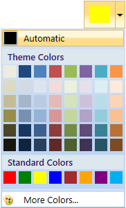

Here, the `Yellow` color brush is selected in the `ColorPickerPalette`.

N> [View Sample in GitHub](https://github.com/SyncfusionExamples/syncfusion-color-picker-palette-wpf-examples/tree/master/Samples/Getting-Started)

## Setting automatic color

To change the default selected color when the application launches, set the [AutomaticColor](https://help.syncfusion.com/cr/wpf/Syncfusion.Windows.Tools.Controls.ColorPickerPalette.html#Syncfusion_Windows_Tools_Controls_ColorPickerPalette_AutomaticColor) property. If you have changed the selected color, you can return to the default color by clicking the automatic-color panel. You can hide the automatic color by setting the [AutomaticColorVisibility](https://help.syncfusion.com/cr/wpf/Syncfusion.Windows.Tools.Controls.ColorPickerPalette.html#Syncfusion_Windows_Tools_Controls_ColorPickerPalette_AutomaticColorVisibility) property to `Collapsed`. The default value of `AutomaticColor` is `Black`, and the default value of `AutomaticColorVisibility` is `Visible`.




<syncfusion:ColorPickerPalette AutomaticColor="Green"
                               AutomaticColorVisibility="Visible"
                               Name="colorPickerPalette"
                               Width="60"
                               Height="40">
</syncfusion:ColorPickerPalette>




ColorPickerPalette colorPickerPalette = new ColorPickerPalette();
colorPickerPalette.AutomaticColor = Colors.Green;
colorPickerPalette.AutomaticColorVisibility = Visibility.Visible;
colorPickerPalette.Width = 60;
colorPickerPalette.Height = 40;




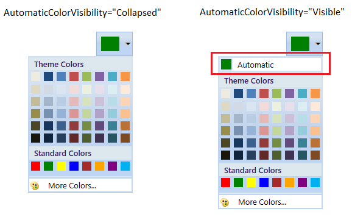

N> [View Sample in GitHub](https://github.com/SyncfusionExamples/syncfusion-color-picker-palette-wpf-examples/tree/master/Samples/Getting-Started)

## Select transparent color programmatically

You can set the selected color to transparent programmatically by setting the color code `#00000000` or `Colors.Transparent` for the `Color` property.




<syncfusion:ColorPickerPalette Color="Transparent"
                               Name="colorPickerPalette"/>




ColorPickerPalette colorPickerPalette = new ColorPickerPalette();
colorPickerPalette.Color = Colors.Transparent;




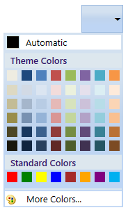

## Select a predefined color

You can select a color from either the theme color items or the standard color items. You can show or hide each panel individually.

### Select a color from theme color items

You can select various theme colors by setting the [Themes](https://help.syncfusion.com/cr/wpf/Syncfusion.Windows.Tools.Controls.ColorPickerPalette.html#Syncfusion_Windows_Tools_Controls_ColorPickerPalette_Themes) property. Based on the `Themes` value, the corresponding base color items are displayed with their variants. To allow the user to select only base theme colors without their variants, set the [GenerateThemeVariants](https://help.syncfusion.com/cr/wpf/Syncfusion.Windows.Tools.Controls.ColorPickerPalette.html#Syncfusion_Windows_Tools_Controls_ColorPickerPalette_GenerateThemeVariants) property to `false`. You can hide the theme-color panel by setting the [ThemePanelVisibility](https://help.syncfusion.com/cr/wpf/Syncfusion.Windows.Tools.Controls.ColorPickerPalette.html#Syncfusion_Windows_Tools_Controls_ColorPickerPalette_ThemePanelVisibility) property to `Collapsed`. The default value of `Themes` is `Office`, and the default value of `ThemePanelVisibility` is `Visible`.

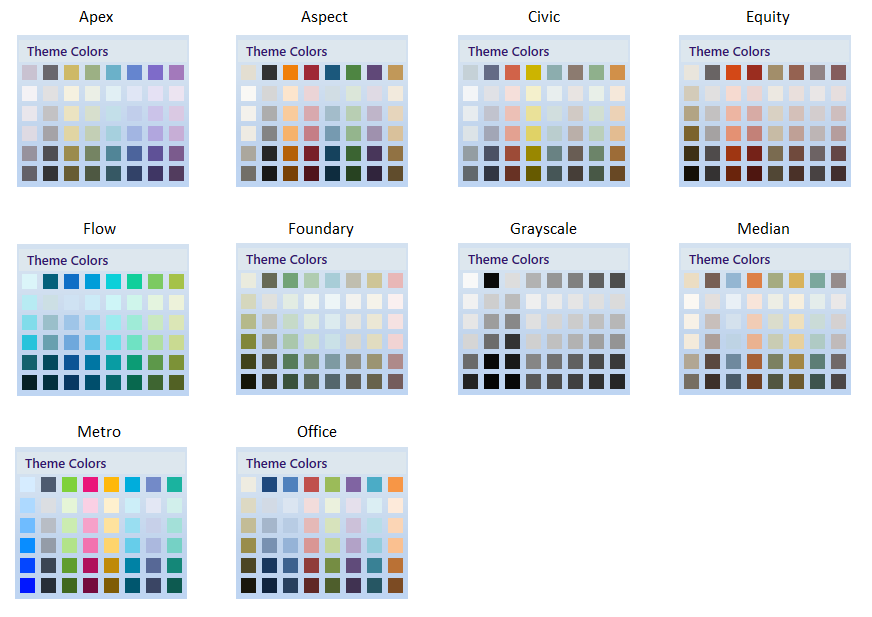




<syncfusion:ColorPickerPalette Themes="Metro"
                               GenerateThemeVariants="True"
                               ThemePanelVisibility="Visible"
                               Name="colorPickerPalette"
                               Width="60"
                               Height="40">
</syncfusion:ColorPickerPalette>




ColorPickerPalette colorPickerPalette = new ColorPickerPalette();
colorPickerPalette.Themes = PaletteTheme.Metro;
colorPickerPalette.GenerateThemeVariants = true;
colorPickerPalette.ThemePanelVisibility = Visibility.Visible;
colorPickerPalette.Width = 60;
colorPickerPalette.Height = 40;




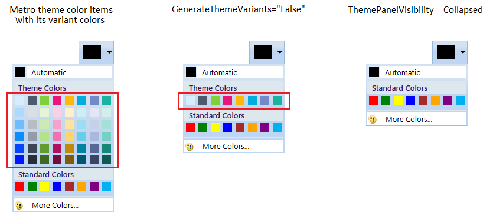

### Select a color from standard color items

You can select standard colors from the standard-color panel. To allow the user to select standard colors along with their variants, set the [GenerateStandardVariants](https://help.syncfusion.com/cr/wpf/Syncfusion.Windows.Tools.Controls.ColorPickerPalette.html#Syncfusion_Windows_Tools_Controls_ColorPickerPalette_GenerateStandardVariants) property to `true`. You can hide the standard-color panel by setting the [StandardPanelVisibility](https://help.syncfusion.com/cr/wpf/Syncfusion.Windows.Tools.Controls.ColorPickerPalette.html#Syncfusion_Windows_Tools_Controls_ColorPickerPalette_StandardPanelVisibility) property to `Collapsed`. The default value of `GenerateStandardVariants` is `false`, and the default value of `StandardPanelVisibility` is `Visible`.




<syncfusion:ColorPickerPalette GenerateStandardVariants="True"
                               StandardPanelVisibility="Visible"
                               Name="colorPickerPalette"
                               Width="60"
                               Height="40">
</syncfusion:ColorPickerPalette>




ColorPickerPalette colorPickerPalette = new ColorPickerPalette();
colorPickerPalette.GenerateStandardVariants = true;
colorPickerPalette.StandardPanelVisibility = Visibility.Visible;
colorPickerPalette.Width = 60;
colorPickerPalette.Height = 40;




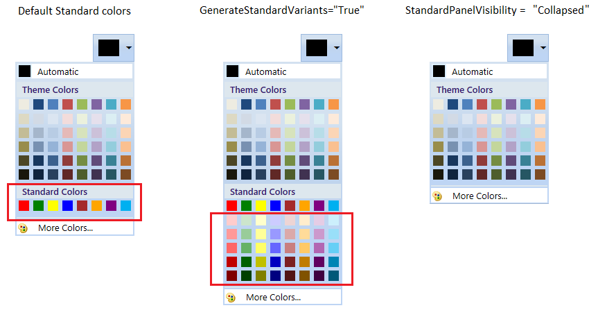

## Show white and black color variants

To allow the user to select the theme color from white, black, or both variants, set the [BlackWhiteVisibility](https://help.syncfusion.com/cr/wpf/Syncfusion.Windows.Tools.Controls.ColorPickerPalette.html#Syncfusion_Windows_Tools_Controls_ColorPickerPalette_BlackWhiteVisibility) property to `White`, `Black`, or `Both`. The default value of `BlackWhiteVisibility` is `None`.




<syncfusion:ColorPickerPalette BlackWhiteVisibility="Both"
                               Name="colorPickerPalette"
                               Width="60"
                               Height="40">
</syncfusion:ColorPickerPalette>




ColorPickerPalette colorPickerPalette = new ColorPickerPalette();
colorPickerPalette.BlackWhiteVisibility = BlackWhiteVisible.Both;
colorPickerPalette.Width = 60;
colorPickerPalette.Height = 40;




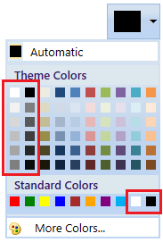

## Add your own colors in the palette

To allow the user to select from your own colors, add the color and its name using [CustomColor.ColorName](https://help.syncfusion.com/cr/wpf/Syncfusion.Windows.Tools.Controls.CustomColor.html#Syncfusion_Windows_Tools_Controls_CustomColor_ColorName) and [CustomColor.Color](https://help.syncfusion.com/cr/wpf/Syncfusion.Windows.Tools.Controls.CustomColor.html#Syncfusion_Windows_Tools_Controls_CustomColor_Color) to the [CustomColorsCollection](https://help.syncfusion.com/cr/wpf/Syncfusion.Windows.Tools.Controls.ColorPickerPalette.html#Syncfusion_Windows_Tools_Controls_ColorPickerPalette_CustomColorsCollection), and set the [SetCustomColors](https://help.syncfusion.com/cr/wpf/Syncfusion.Windows.Tools.Controls.ColorPickerPalette.html#Syncfusion_Windows_Tools_Controls_ColorPickerPalette_SetCustomColors) property to `true`. The `CustomColor.ColorName` is shown in the tooltip when the mouse hovers over the color item. You can change the custom-color panel header text and its visibility by using the [CustomHeaderText](https://help.syncfusion.com/cr/wpf/Syncfusion.Windows.Tools.Controls.ColorPickerPalette.html#Syncfusion_Windows_Tools_Controls_ColorPickerPalette_CustomHeaderText) and [CustomHeaderVisibility](https://help.syncfusion.com/cr/wpf/Syncfusion.Windows.Tools.Controls.ColorPickerPalette.html#Syncfusion_Windows_Tools_Controls_ColorPickerPalette_CustomHeaderVisibility) properties. The default value of `CustomHeaderText` is `CustomColors`, and the default value of `CustomHeaderVisibility` is `Visible`.




// Required usings:
// using System.Collections.ObjectModel;
// using Syncfusion.Windows.Shared;  // for NotificationObject

public class ViewModel : NotificationObject {
    private ObservableCollection<CustomColor> newColorCollection;
    public ObservableCollection<CustomColor> NewColorCollection {
        get {
            return newColorCollection;
        }
        set {
            newColorCollection = value;
            this.RaisePropertyChanged("NewColorCollection");
        }
    }
    public ViewModel() {
        NewColorCollection = new ObservableCollection<CustomColor>();
    }
}







<Window.Resources>
    <local:ViewModel x:Key="viewModel">
        <local:ViewModel.NewColorCollection>

            <!-- Defining the color details -->
            <syncfusion:CustomColor Color="#FF11EBF8" ColorName="Aqua" />
            <syncfusion:CustomColor Color="#FFF80FA6" ColorName="Deep Pink" />
            <syncfusion:CustomColor Color="#FF8BA7C2" ColorName="Dark Gray" />
            <syncfusion:CustomColor Color="#F53CDF07" ColorName="Lime Green" />
            <syncfusion:CustomColor Color="#C2929545" ColorName="Olive Drab" />
            <syncfusion:CustomColor Color="#2E956145" ColorName="Sienna" />
            <syncfusion:CustomColor Color="#78458E95" ColorName="Steel Blue" />
            <syncfusion:CustomColor Color="#8B8220E4" ColorName="Blue Violet" />
        </local:ViewModel.NewColorCollection>
    </local:ViewModel>
</Window.Resources>

<syncfusion:ColorPickerPalette CustomColorsCollection="{Binding NewColorCollection}"
                               CustomHeaderText="New Colors"
                               CustomHeaderVisibility="Visible"
                               SetCustomColors="True"
                               DataContext="{StaticResource viewModel}"
                               Name="colorPickerPalette"
                               Width="60"
                               Height="40">
</syncfusion:ColorPickerPalette>




N> The `local:` xmlns used above refers to the namespace of your `ViewModel` class. Add `xmlns:local="clr-namespace:YourNamespace"` to the root element of your XAML.

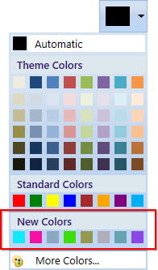

Click [here](https://github.com/SyncfusionExamples/syncfusion-color-picker-palette-wpf-examples/tree/master/Samples/CustomColors) to download the sample that showcases how to add your own color items into the palette.

## Recently used color items

The recently selected colors are displayed in the `RecentlyUsedPanel`. To choose a color that was previously selected, use the `RecentlyUsedPanel`. You can hide the `RecentlyUsedPanel` by setting the [RecentlyUsedPanelVisibility](https://help.syncfusion.com/cr/wpf/Syncfusion.Windows.Tools.Controls.ColorPickerPalette.html#Syncfusion_Windows_Tools_Controls_ColorPickerPalette_RecentlyUsedPanelVisibility) property to `Collapsed`. The default value of `RecentlyUsedPanelVisibility` is `Visible`.




<syncfusion:ColorPickerPalette RecentlyUsedPanelVisibility="Visible"
                               Name="colorPickerPalette"
                               Width="60"
                               Height="40">
</syncfusion:ColorPickerPalette>




ColorPickerPalette colorPickerPalette = new ColorPickerPalette();
colorPickerPalette.RecentlyUsedPanelVisibility = Visibility.Visible;
colorPickerPalette.Width = 60;
colorPickerPalette.Height = 40;




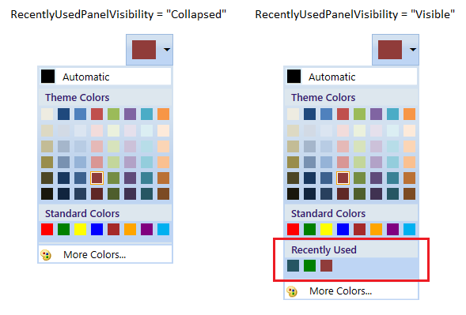

## Choosing a color from MoreColor window

In addition to the Theme Colors and Standard Colors, the MoreColor feature allows you to select a wide range of color options. The MoreColor feature includes two categories: Standard Colors and Custom Colors. You can hide the MoreColor option by setting the [MoreColorOptionVisibility](https://help.syncfusion.com/cr/wpf/Syncfusion.Windows.Tools.Controls.ColorPickerPalette.html#Syncfusion_Windows_Tools_Controls_ColorPickerPalette_MoreColorOptionVisibility) property to `Collapsed`.

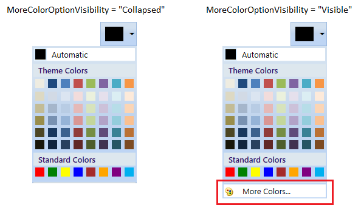

### Selecting more standard colors

You can select from 140 standard colors clustered in the shape of a hexagon. To hide the Standard Colors tab, set the [IsStandardTabVisible](https://help.syncfusion.com/cr/wpf/Syncfusion.Windows.Tools.Controls.ColorPickerPalette.html#Syncfusion_Windows_Tools_Controls_ColorPickerPalette_IsStandardTabVisible) property to `Collapsed`. The color chosen from this cluster is also added to the `RecentlyUsedPanel`.




<syncfusion:ColorPickerPalette IsStandardTabVisible="Visible"
                               Name="colorPickerPalette"
                               Width="60"
                               Height="40">
</syncfusion:ColorPickerPalette>




ColorPickerPalette colorPickerPalette = new ColorPickerPalette();
colorPickerPalette.IsStandardTabVisible = Visibility.Visible;
colorPickerPalette.Width = 60;
colorPickerPalette.Height = 40;




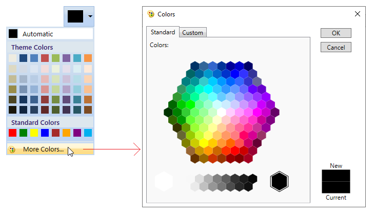

### Selecting more custom colors

You can select any color and adjust its saturation level using the custom-color tab picker. To hide the Custom Colors tab, set the [IsCustomTabVisible](https://help.syncfusion.com/cr/wpf/Syncfusion.Windows.Tools.Controls.ColorPickerPalette.html#Syncfusion_Windows_Tools_Controls_ColorPickerPalette_IsCustomTabVisible) property to `Collapsed`. The color chosen from the custom-color picker is also added to the `RecentlyUsedPanel`.




<syncfusion:ColorPickerPalette IsCustomTabVisible="Visible"
                               Name="colorPickerPalette"
                               Width="60"
                               Height="40">
</syncfusion:ColorPickerPalette>




ColorPickerPalette colorPickerPalette = new ColorPickerPalette();
colorPickerPalette.IsCustomTabVisible = Visibility.Visible;
colorPickerPalette.Width = 60;
colorPickerPalette.Height = 40;




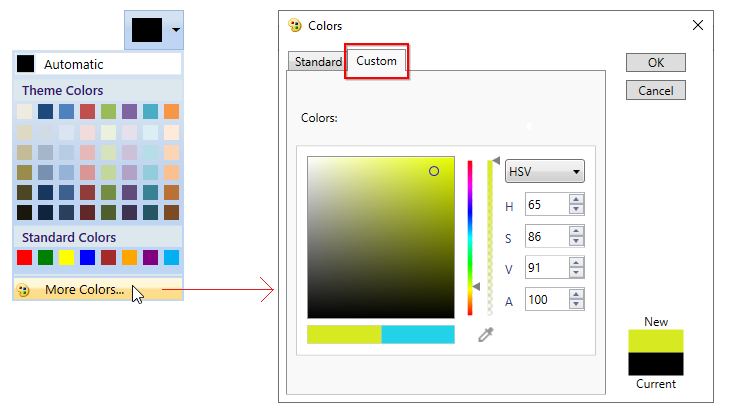

N> If you set both `IsCustomTabVisible` and `IsStandardTabVisible` to `false`, the MoreColor option is hidden automatically.

## Clear the colour you picked with a transparent colour

To clear the selected color (set it to `Transparent`), click the **No Color** button. The **No Color** button is displayed only when the [NoColorVisibility](https://help.syncfusion.com/cr/wpf/Syncfusion.Windows.Tools.Controls.ColorPickerPalette.html#Syncfusion_Windows_Tools_Controls_ColorPickerPalette_NoColorVisibility) property is set to `Visible`. The default value of `NoColorVisibility` is `Collapsed`.




<syncfusion:ColorPickerPalette NoColorVisibility="Visible"
                               Name="colorPickerPalette"/>




colorPickerPalette.NoColorVisibility = Visibility.Visible;




N> [View Sample in GitHub](https://github.com/SyncfusionExamples/syncfusion-color-picker-palette-wpf-examples/tree/master/Samples/Getting-Started)

## Selected brush or color changed notification

The selected brush or color in `ColorPickerPalette` can be observed using the [SelectedBrushChanged](https://help.syncfusion.com/cr/wpf/Syncfusion.Windows.Tools.Controls.ColorPickerPalette.html) event. The `SelectedBrushChangedEventArgs` contains the old and newly selected brush and its color values in the `OldBrush`, `NewBrush`, `OldColor`, and `NewColor` properties. You can also receive a notification when the selected brush or color changes by using the [SelectedCommand](https://help.syncfusion.com/cr/wpf/Syncfusion.Windows.Tools.Controls.ColorPickerPalette.html#Syncfusion_Windows_Tools_Controls_ColorPickerPalette_SelectedCommand) property.




<syncfusion:ColorPickerPalette SelectedBrushChanged="ColorPickerPalette_SelectedBrushChanged"
                               Name="ColorPickerPalette"
                               Width="60"
                               Height="40">
</syncfusion:ColorPickerPalette>




ColorPickerPalette colorPickerPalette = new ColorPickerPalette();
colorPickerPalette.SelectedBrushChanged += ColorPickerPalette_SelectedBrushChanged;
colorPickerPalette.Width = 60;
colorPickerPalette.Height = 40;







//Invoked when the selected color or brush is changed
private void ColorPickerPalette_SelectedBrushChanged(object sender, SelectedBrushChangedEventArgs e) {
    //Old and newly selected brushes
    var oldBrush = e.OldBrush;
    var newBrush = e.NewBrush;

    //Old and newly selected colors
    var oldColor = e.OldColor;
    var newColor = e.NewColor;
}




## Customize the header

You can customize the appearance of the `ColorPickerPalette` header and display the selected color name in it by using the [HeaderTemplate](https://help.syncfusion.com/cr/wpf/Syncfusion.Windows.Tools.Controls.ColorPickerPalette.html#Syncfusion_Windows_Tools_Controls_ColorPickerPalette_HeaderTemplate) property.

N> The `DataContext` of `HeaderTemplate` is the `ColorPickerPalette` instance.




<Window.Resources>
    <DataTemplate x:Key="Custom_HeaderTemplate">
        <Grid>
            <Grid.ColumnDefinitions>
                <ColumnDefinition Width="auto"/>
                <ColumnDefinition Width="auto"/>
            </Grid.ColumnDefinitions>
            <Grid x:Name="IconGrid"
                  Margin="2">
                <Grid.RowDefinitions>
                    <RowDefinition Height="Auto"/>
                    <RowDefinition Height="*"/>
                </Grid.RowDefinitions>
                <Image x:Name="image"
                       Source="/images/fill.png"
                       Height="12"
                       Width="12"/>
                <Border Name="color_border"
                        Grid.Row="1"
                        Height="3">
                    <Border.Background>
                        <SolidColorBrush Color="{Binding Color,
                            RelativeSource={RelativeSource FindAncestor,
                                AncestorLevel=1,
                                AncestorType={x:Type syncfusion:ColorPickerPalette}},
                                UpdateSourceTrigger=PropertyChanged}"/>
                    </Border.Background>
                </Border>
            </Grid>
            <TextBlock Padding="1"
                       HorizontalAlignment="Left"
                       VerticalAlignment="Center"
                       TextAlignment="Center" Grid.Column="1"
                       Text="Shape Fill" FontSize="11"
                       Width="auto"/>
        </Grid>
    </DataTemplate>
</Window.Resources>
<Grid>
    <syncfusion:ColorPickerPalette HeaderTemplate="{DynamicResource Custom_HeaderTemplate}"
                                   Name="ColorPickerPallete2"
                                   Margin="10"
                                   Mode="Split"/>
</Grid>




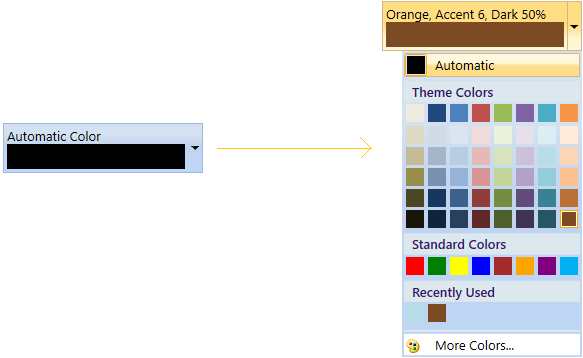

N> View [Sample](https://github.com/SyncfusionExamples/syncfusion-color-picker-palette-wpf-examples/tree/master/Samples/HeaderTemplate) in GitHub

## Tooltip support

A tooltip is used to show information about a color item when the mouse hovers over it. The `ColorPickerPalette` displays the name of each color in the tooltip by default. No additional configuration is required.

## Expanded mode

By default, `ColorPickerPalette` is shown as a drop-down button. To use the palette directly without a drop-down button, set the `Mode` property to `Palette`. To use the palette as both a button and a drop-down, set the `Mode` property to `Split`.




<syncfusion:ColorPickerPalette Mode="Palette"
                               Name="colorPickerPalette"/>




ColorPickerPalette colorPickerPalette = new ColorPickerPalette();
colorPickerPalette.Mode = PickerMode.Palette;




N> View [Sample](https://github.com/SyncfusionExamples/syncfusion-color-picker-palette-wpf-examples/tree/master/Samples/Getting-Started) in GitHub

## ColorPickerPalette as a command button

By default, `ColorPickerPalette` acts like a drop-down. It opens a color palette when you click anywhere on the header. By setting the [Mode](https://help.syncfusion.com/cr/wpf/Syncfusion.Windows.Tools.Controls.ColorPickerPalette.html#Syncfusion_Windows_Tools_Controls_ColorPickerPalette_Mode) property to `Split`, it acts as both a button and a drop-down as explained below:

1. When you click the drop-down arrow button, it acts like a drop-down.
2. When you click the header area, it acts like a button and the [SelectedCommand](https://help.syncfusion.com/cr/wpf/Syncfusion.Windows.Tools.Controls.ColorPickerPalette.html#Syncfusion_Windows_Tools_Controls_ColorPickerPalette_SelectedCommand) is triggered. Using this command, you can perform an action such as applying the selected color to the selected text.

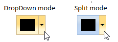

For example, if you want to apply the last selected color as a foreground to a `TextEditor`'s selected text, you can click the button directly instead of opening the drop-down and selecting an already selected color again.




//ViewModel.cs
// Required usings:
// using System.Windows.Documents;
// using System.Windows.Input;
// using Syncfusion.Windows.Shared;  // for NotificationObject, DelegateCommand
// using Syncfusion.Windows.Tools.Controls;  // for ColorSelectedCommandArgs

public class ViewModel : NotificationObject
{
    private ICommand selectionChangedCommand;
    private ICommand loadedChangedCommand;
    private RichTextBox TextBox;

    public ICommand SelectionChangedCommand {
        get {
            return selectionChangedCommand;
        }
    }

    public ICommand LoadedChangedCommand {
        get {
            return loadedChangedCommand;
        }
    }

    public void Loadedmethod(object param) {
        TextBox = param as RichTextBox;
    }
    public void PropertyChangedHandler(object param) {
        if (param != null && TextBox != null) {
            ColorSelectedCommandArgs groupItem = param as ColorSelectedCommandArgs;
            TextRange range = new TextRange(TextBox.Selection.Start, TextBox.Selection.End);
            range.ApplyPropertyValue(FlowDocument.ForegroundProperty, groupItem.Brush);
        }
    }
    public ViewModel() {
        selectionChangedCommand = new DelegateCommand<object>(PropertyChangedHandler);
        loadedChangedCommand = new DelegateCommand<object>(Loadedmethod);
    }
}







<syncfusion:ColorPickerPalette Name="colorpickerpalette"
                                Mode="Split"
                                SelectedCommand="{Binding SelectionChangedCommand}"
                                Width="60"
                                Height="40">
</syncfusion:ColorPickerPalette>

<RichTextBox Name="richTextBox"
             Height="297"
             Width="331">
    <i:Interaction.Triggers>
        <i:EventTrigger EventName="Loaded">
            <i:InvokeCommandAction Command="{Binding LoadedChangedCommand}"
                                   CommandParameter="{Binding ElementName=richTextBox}"/>
        </i:EventTrigger>
    </i:Interaction.Triggers>
    <FlowDocument>
        <Paragraph FontSize="14">Hello, world!</Paragraph>
        <Paragraph FontStyle="Italic"
                   TextAlignment="Left"
                   FontSize="14">Thanks to the RichTextBox control,
                                  this FlowDocument is completely editable!</Paragraph>
    </FlowDocument>
</RichTextBox>




colorPickerPalette.Mode = PickerMode.Split;




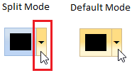

N> View [Sample](https://github.com/SyncfusionExamples/syncfusion-color-picker-palette-wpf-examples/tree/master/Samples/TextColorSelection) in GitHub

## Change color item size

You can change each color item's size by using the [BorderWidth](https://help.syncfusion.com/cr/wpf/Syncfusion.Windows.Tools.Controls.ColorPickerPalette.html#Syncfusion_Windows_Tools_Controls_ColorPickerPalette_BorderWidth) and [BorderHeight](https://help.syncfusion.com/cr/wpf/Syncfusion.Windows.Tools.Controls.ColorPickerPalette.html#Syncfusion_Windows_Tools_Controls_ColorPickerPalette_BorderHeight) properties. The palette is resized based on the color item size. The default value of both `BorderWidth` and `BorderHeight` is `17`.




<syncfusion:ColorPickerPalette BorderWidth="30"
                               BorderHeight="30"
                               Name="colorPickerPalette"
                               Width="60"
                               Height="40">
</syncfusion:ColorPickerPalette>




ColorPickerPalette colorPickerPalette = new ColorPickerPalette();
colorPickerPalette.BorderWidth = 30;
colorPickerPalette.BorderHeight = 30;
colorPickerPalette.Width = 60;
colorPickerPalette.Height = 40;




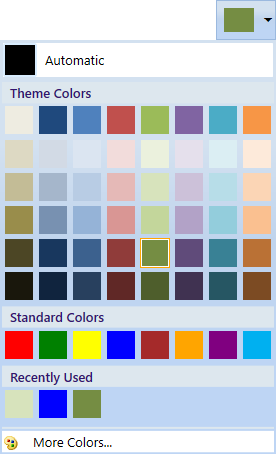

## Change color palette size

You can change the pop-up size by using the [PopupWidth](https://help.syncfusion.com/cr/wpf/Syncfusion.Windows.Tools.Controls.ColorPickerPalette.html#Syncfusion_Windows_Tools_Controls_ColorPickerPalette_PopupWidth) and [PopupHeight](https://help.syncfusion.com/cr/wpf/Syncfusion.Windows.Tools.Controls.ColorPickerPalette.html#Syncfusion_Windows_Tools_Controls_ColorPickerPalette_PopupHeight) properties. The color items are resized based on the pop-up size. The default value of `PopupWidth` is `175`, and the default value of `PopupHeight` is `200`.




<syncfusion:ColorPickerPalette PopupWidth="120"
                               PopupHeight="100"
                               Name="colorPickerPalette"
                               Width="60"
                               Height="40">
</syncfusion:ColorPickerPalette>




ColorPickerPalette colorPickerPalette = new ColorPickerPalette();
colorPickerPalette.PopupWidth = 120;
colorPickerPalette.PopupHeight = 100;
colorPickerPalette.Width = 60;
colorPickerPalette.Height = 40;




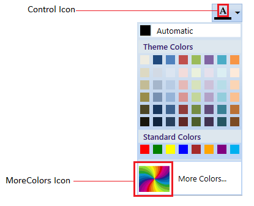

N> If you use both `PopupWidth`/`PopupHeight` and `BorderWidth`/`BorderHeight`, the `BorderWidth`/`BorderHeight` properties have higher priority.

## Change header and more color icons

You can set the icons for the control header, which is placed to the left of the drop-down button, and for the more-color panel header by using the [Icon](https://help.syncfusion.com/cr/wpf/Syncfusion.Windows.Tools.Controls.ColorPickerPalette.html#Syncfusion_Windows_Tools_Controls_ColorPickerPalette_Icon) and [MoreColorsIcon](https://help.syncfusion.com/cr/wpf/Syncfusion.Windows.Tools.Controls.ColorPickerPalette.html#Syncfusion_Windows_Tools_Controls_ColorPickerPalette_MoreColorsIcon) properties. You can change the icon size for the control icon and the more-color icon by using the [IconSize](https://help.syncfusion.com/cr/wpf/Syncfusion.Windows.Tools.Controls.ColorPickerPalette.html#Syncfusion_Windows_Tools_Controls_ColorPickerPalette_IconSize) and [MoreColorsIconSize](https://help.syncfusion.com/cr/wpf/Syncfusion.Windows.Tools.Controls.ColorPickerPalette.html#Syncfusion_Windows_Tools_Controls_ColorPickerPalette_MoreColorsIconSize) properties. The `IconSize` and `MoreColorsIconSize` properties accept two comma-separated `double` values: width and height.

N> The image paths shown below assume the images are added to the project with a `Resource` build action. Add the images to your project, then reference them using a `pack://` URI such as `pack://application:,,,/Resources/Label.png`.




<syncfusion:ColorPickerPalette Icon="pack://application:,,,/Resources/Label.png"
                               IconSize="18,18"
                               MoreColorsIcon="pack://application:,,,/Resources/MoreColor.png"
                               MoreColorsIconSize="50,50"
                               Name="colorPickerPalette"
                               Width="60"
                               Height="40">
</syncfusion:ColorPickerPalette>




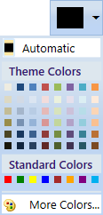

Click [here](https://github.com/SyncfusionExamples/syncfusion-color-picker-palette-wpf-examples/tree/master/Samples/Getting-Started) to download the sample that showcases features and  different type color items with its panel visibility customization.

## Hide the drop-down button

You can hide the drop-down button in the `ColorPickerPalette` by setting its visibility to `Collapsed`. You can then open the pop-up palette by clicking the header area.

N> The example below uses the `UpDownBorder` template part. Template-part names are subject to change between versions; if the part name does not match, inspect the default template using a tool such as XAML Spy or Snoop.




<syncfusion:ColorPickerPalette Loaded="ColorPickerPalette_Loaded"
                               Name="colorPickerPalette"/>




ColorPickerPalette colorPickerPalette = new ColorPickerPalette();
colorPickerPalette.Loaded += ColorPickerPalette_Loaded;







private void ColorPickerPalette_Loaded(object sender, RoutedEventArgs e) {
    var dropDown = (Border)(sender as ColorPickerPalette).Template.FindName("UpDownBorder", colorPickerPalette);
    if (dropDown != null) {
        dropDown.Visibility = Visibility.Collapsed;
    }
}




