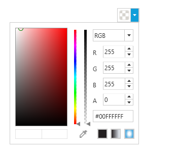
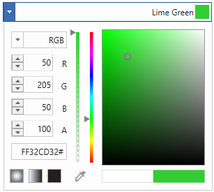
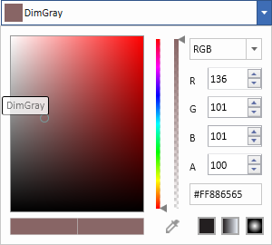
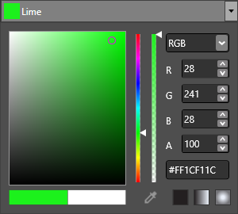

# Appearance in WPF ColorPicker

This section explains different UI customization, styling, theming options available in [ColoPicker](https://www.syncfusion.com/wpf-ui-controls/colorpicker) control.

## Change Header Template

We can customize the header of the `ColorPicker` by using the [HeaderTemplate](https://help.syncfusion.com/cr/wpf/Syncfusion.Windows.Shared.ColorPicker.html#Syncfusion_Windows_Shared_ColorPicker_HeaderTemplate) property.




<DataTemplate x:Key="CustomHeaderTemplate" 
              DataType="syncfusion:ColorPicker">
    <StackPanel Orientation="Horizontal">
        <Ellipse Fill="{Binding Brush,
            RelativeSource={RelativeSource FindAncestor,
            AncestorType={x:Type syncfusion:ColorPicker}}}"
                 Name="selectedColorEllipse" 
                 HorizontalAlignment="Left"
                 Width="20" Height="20"
                 Margin="2" />
    </StackPanel>
</DataTemplate>

<syncfusion:ColorPicker  HeaderTemplate="{StaticResource CustomHeaderTemplate}"
                         Name="colorPicker" 
                         Width ="50" Height="30"/>




N> [View Sample in GitHub](https://github.com/SyncfusionExamples/wpf-colorpicker-examples/tree/master/Samples/Appearance)

## Change flow direction

We can change the flow direction of the `ColorPicker` layout from right to left by setting the `FlowDirection` property value as `RightToLeft`. The Default value of `FlowDirection` property is `LeftToRight`.




<syncfusion:ColorPicker FlowDirection="RightToLeft" Name="colorPicker"/>




ColorPicker colorPicker= new ColorPicker();
colorPicker.FlowDirection = FlowDirection.RightToLeft;




N> [View Sample in GitHub](https://github.com/SyncfusionExamples/wpf-colorpicker-examples/tree/master/Samples/Appearance)

## Setting ToolTip

ToolTip is used to show the information about the segment, when you mouse over on the segment. We can show information about the selected color name using tooltip when click and dragging the mouse on the color palette. Tooltip is enabled by default, you can disable it by setting [EnableToolTip](https://help.syncfusion.com/cr/wpf/Syncfusion.Windows.Shared.ColorPicker.html#Syncfusion_Windows_Shared_ColorPicker_EnableToolTip) to `false`.




<syncfusion:ColorPicker EnableToolTip="True"  Name="colorPicker"/>




ColorPicker colorPicker = new ColorPicker();
colorPicker.EnableToolTip = true;




N> [View Sample in GitHub](https://github.com/SyncfusionExamples/wpf-colorpicker-examples/tree/master/Samples/Appearance)

## Theme

ColorPicker supports various built-in themes. Refer to the below links to apply themes for the ColorPicker,

  * [Apply theme using SfSkinManager](https://help.syncfusion.com/wpf/themes/skin-manager)
	
  * [Create a custom theme using ThemeStudio](https://help.syncfusion.com/wpf/themes/theme-studio#creating-custom-theme)

